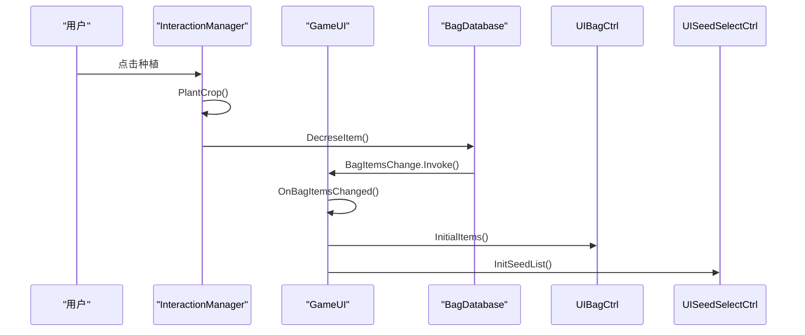
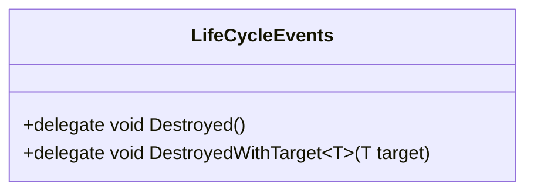
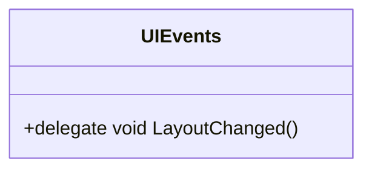
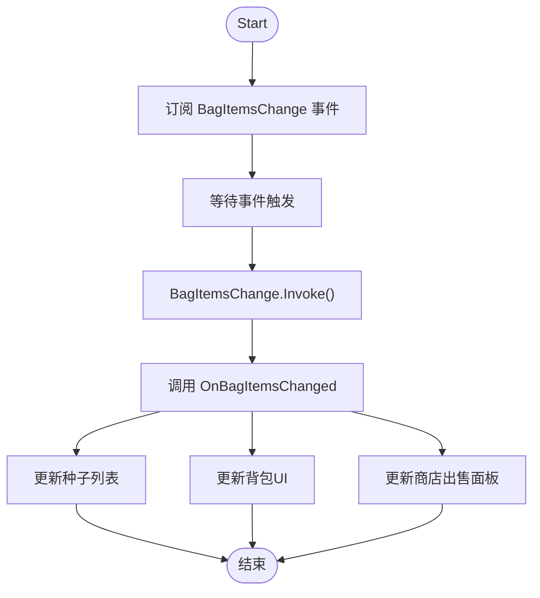
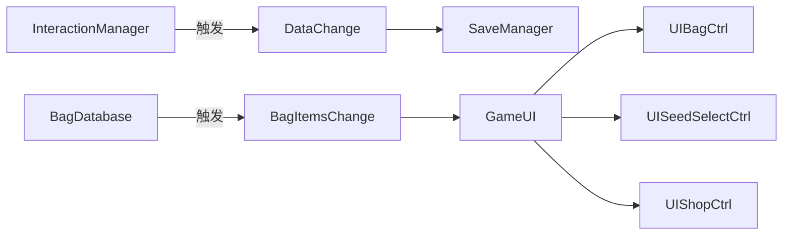

# 事件系统

<cite>
**本文档中引用的文件**  
- [LifeCycleEvents.cs](file://Common\Events\LifeCycleEvents.cs)
- [UIEvents.cs](file://Common\Events\UIEvents.cs)
- [GameUI.cs](file://UI\GameUI.cs)
- [InteractionManager.cs](file://GameSystem\InteractionManager.cs)
</cite>

## 目录
1. [简介](#简介)
2. [项目结构](#项目结构)
3. [核心组件](#核心组件)
4. [架构概述](#架构概述)
5. [详细组件分析](#详细组件分析)
6. [依赖分析](#依赖分析)
7. [性能考虑](#性能考虑)
8. [故障排除指南](#故障排除指南)
9. [结论](#结论)

## 简介
本文档详细说明了Unity项目中的事件系统设计与实现，重点分析了`LifeCycleEvents`和`UIEvents`两个静态事件类如何通过UnityEvent机制实现模块间的松耦合通信。文档将解释这些事件如何被声明、发布与订阅，并展示GameUI与InteractionManager等系统如何利用事件进行交互。同时，文档还将讨论事件系统的优点、潜在风险以及最佳实践。

## 项目结构
该项目采用功能模块化组织方式，主要分为Common（通用组件）、Data（数据模型）、GameSystem（游戏逻辑）和UI（用户界面）四大模块。事件系统位于Common/Events目录下，作为跨模块通信的核心基础设施，被其他模块广泛引用。

```mermaid
graph TB
subgraph "Common"
Events[Events]
end
subgraph "Data"
DataModels["数据模型 (BagObjectData, CropData等)"]
end
subgraph "GameSystem"
InteractionMgr[InteractionManager]
SaveMgr[SaveManager]
GameTime[GameTimeManager]
end
subgraph "UI"
GameUI[GameUI]
UIBag[UIBagCtrl]
UIShop[UIShopCtrl]
end
Events --> GameUI : "订阅"
Events --> InteractionMgr : "触发"
InteractionMgr --> GameUI : "通过事件通信"
GameUI --> UIBag : "控制"
GameUI --> UIShop : "控制"
```

**图示来源**  
- [LifeCycleEvents.cs](file://Common\Events\LifeCycleEvents.cs)
- [UIEvents.cs](file://Common\Events\UIEvents.cs)
- [GameUI.cs](file://UI\GameUI.cs)
- [InteractionManager.cs](file://GameSystem\InteractionManager.cs)

**本节来源**  
- [LifeCycleEvents.cs](file://Common\Events\LifeCycleEvents.cs)
- [UIEvents.cs](file://Common\Events\UIEvents.cs)

## 核心组件
本项目的核心事件系统由两个静态类构成：`LifeCycleEvents`和`UIEvents`。它们定义了游戏生命周期和用户界面相关的委托类型，为系统间通信提供类型安全的事件契约。此外，`InteractionManager`通过`UnityEvent`字段直接触发事件，而`GameUI`则作为关键的事件订阅者，响应系统变化更新界面。

**本节来源**  
- [LifeCycleEvents.cs](file://Common\Events\LifeCycleEvents.cs#L6-L12)
- [UIEvents.cs](file://Common\Events\UIEvents.cs#L5-L10)
- [InteractionManager.cs](file://GameSystem\InteractionManager.cs#L39)
- [GameUI.cs](file://UI\GameUI.cs#L37)

## 架构概述
事件系统采用发布-订阅模式，实现了游戏逻辑与用户界面的完全解耦。`InteractionManager`作为事件发布者，在用户交互导致数据变化时触发`DataChange`事件。`GameUI`作为事件订阅者，监听`BagDatabase`的`BagItemsChange`事件以更新UI。这种设计使得各模块可以独立开发和测试，仅通过事件契约进行通信。



**图示来源**  
- [InteractionManager.cs](file://GameSystem\InteractionManager.cs#L100)
- [GameUI.cs](file://UI\GameUI.cs#L37)
- [GameUI.cs](file://UI\GameUI.cs#L64)

## 详细组件分析

### LifeCycleEvents 分析
`LifeCycleEvents`是一个静态类，定义了与对象生命周期相关的委托类型。它提供了`Destroyed`和泛型`DestroyedWithTarget<T>`委托，可用于通知订阅者某个对象已被销毁。这种设计允许系统在对象销毁时进行资源清理或状态重置，是实现安全事件取消订阅的基础。



**图示来源**  
- [LifeCycleEvents.cs](file://Common\Events\LifeCycleEvents.cs#L6-L12)

**本节来源**  
- [LifeCycleEvents.cs](file://Common\Events\LifeCycleEvents.cs#L6-L12)

### UIEvents 分析
`UIEvents`是一个静态类，定义了与用户界面布局变化相关的委托。当前仅定义了`LayoutChanged`委托，用于通知父级UI组件其子组件的布局已更改，需要重新计算和刷新。这种模式可用于实现动态UI更新，确保界面的一致性。



**图示来源**  
- [UIEvents.cs](file://Common\Events\UIEvents.cs#L5-L10)

**本节来源**  
- [UIEvents.cs](file://Common\Events\UIEvents.cs#L5-L10)

### GameUI 事件订阅分析
`GameUI`类在`Start`方法中订阅`BagDatabase.Instance.BagItemsChange`事件，在`OnDestroy`方法中正确地取消订阅，防止了内存泄漏。当背包物品变化时，`OnBagItemsChanged`回调函数会被触发，进而更新种子选择、背包和商店等多个UI组件，实现了数据变化到界面更新的自动同步。



**图示来源**  
- [GameUI.cs](file://UI\GameUI.cs#L37)
- [GameUI.cs](file://UI\GameUI.cs#L64)

**本节来源**  
- [GameUI.cs](file://UI\GameUI.cs#L34-L75)

### InteractionManager 事件触发分析
`InteractionManager`类包含一个名为`DataChange`的`UnityEvent`字段，该字段在多种用户交互操作（如种植、收获、浇水、铲除）完成后被触发。这为自动存档或其他数据持久化操作提供了统一的触发点。通过在Inspector中连接`SaveManager`的存档方法，可以实现无代码的数据变化监听。

```mermaid
flowchart TD
A[用户交互] --> B{交互类型}
B --> |种植| C[PlantCrop]
B --> |收获| D[Harvest]
B --> |浇水| E[Watering]
B --> |铲除| F[UpRoot]
C --> G[DataChange.Invoke()]
D --> G
E --> G
F --> G
G --> H[触发存档等操作]
```

**图示来源**  
- [InteractionManager.cs](file://GameSystem\InteractionManager.cs#L39)
- [InteractionManager.cs](file://GameSystem\InteractionManager.cs#L100)

**本节来源**  
- [InteractionManager.cs](file://GameSystem\InteractionManager.cs#L49-L206)

## 依赖分析
事件系统有效地降低了模块间的直接依赖。`GameUI`不直接依赖`InteractionManager`，而是通过`BagDatabase`的事件间接响应游戏状态变化。`InteractionManager`也不直接依赖`SaveManager`，而是通过`DataChange`事件发布变化，由`SaveManager`在Inspector中订阅。这种设计使得模块可以独立编译和测试。



**图示来源**  
- [InteractionManager.cs](file://GameSystem\InteractionManager.cs#L39)
- [GameUI.cs](file://UI\GameUI.cs#L37)

**本节来源**  
- [InteractionManager.cs](file://GameSystem\InteractionManager.cs)
- [GameUI.cs](file://UI\GameUI.cs)

## 性能考虑
事件系统的主要性能开销在于委托调用和内存管理。频繁触发的事件（如每帧更新）可能导致性能下降。本项目中，`DataChange`事件仅在用户交互时触发，频率较低，性能影响可忽略。然而，必须确保在`OnDestroy`中取消订阅，否则会导致事件持有对已销毁对象的引用，引发内存泄漏和空引用异常。

## 故障排除指南
常见问题包括事件未触发和内存泄漏。若事件未触发，请检查发布者是否正确调用了`Invoke()`，以及订阅者是否在对象销毁前未被取消订阅。内存泄漏通常由未取消订阅引起，表现为已销毁对象仍能接收到事件。调试时可使用`Debug.Log`在事件回调中输出信息，或使用Unity Profiler检查对象引用。

**本节来源**  
- [GameUI.cs](file://UI\GameUI.cs#L44-L48)
- [InteractionManager.cs](file://GameSystem\InteractionManager.cs#L100)

## 结论
本项目的事件系统通过`LifeCycleEvents`和`UIEvents`静态类定义事件契约，并利用`UnityEvent`字段实现灵活的发布-订阅机制，成功实现了游戏逻辑与用户界面的松耦合。最佳实践包括：使用有意义的事件命名、在`OnDestroy`中取消订阅、避免在事件回调中执行耗时操作。该设计提高了代码的可维护性和可扩展性，是Unity项目中推荐的通信模式。