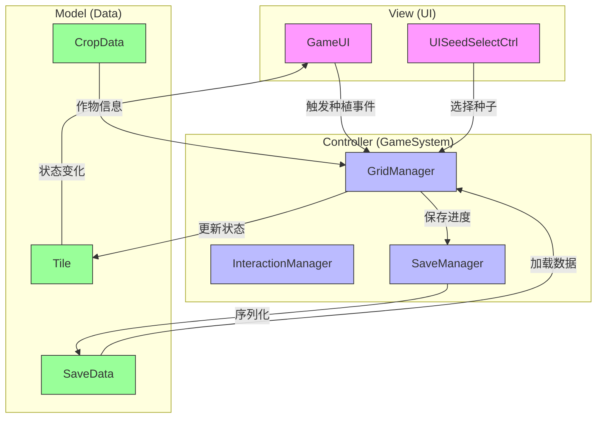

# MVC架构概述

<cite>
**本文档引用的文件**
- [GameUI.cs](file://UI\GameUI.cs)
- [GridManager.cs](file://GameSystem\GridManager.cs)
- [Tile.cs](file://Data\Tile.cs)
- [SaveManager.cs](file://GameSystem\SaveManager.cs)
- [UIEvents.cs](file://Common\Events\UIEvents.cs)
</cite>

## 目录
1. [简介](#简介)
2. [项目结构](#项目结构)
3. [MVC架构设计](#mvc架构设计)
4. [视图层（View）](#视图层view)
5. [控制器层（Controller）](#控制器层controller)
6. [模型层（Model）](#模型层model)
7. [系统上下文图](#系统上下文图)
8. [交互流程分析](#交互流程分析)
9. [架构优势](#架构优势)
10. [结论](#结论)

## 简介
本文档详细阐述了本Unity种田游戏项目的MVC（Model-View-Controller）架构设计。该架构将代码划分为三个主要层次：视图层（UI）、控制器层（GameSystem）和模型层（Data），以实现关注点分离、提升代码可维护性并降低模块间的耦合度。

## 项目结构
项目按照功能模块划分为四个主要目录：
- **Common**：存放通用事件系统和基础工具
- **Data**：包含所有数据模型类，构成MVC中的Model层
- **GameSystem**：实现核心游戏逻辑的管理器，构成MVC中的Controller层
- **UI**：负责用户界面的显示与交互，构成MVC中的View层

这种清晰的目录划分直接反映了MVC架构的设计理念。

**Section sources**
- 

## MVC架构设计
本项目采用经典的MVC模式进行架构设计，各层职责明确：
- **Model（模型层）**：位于Data目录，负责数据的定义、状态管理和持久化
- **View（视图层）**：位于UI目录，负责用户界面的渲染和用户输入的捕获
- **Controller（控制器层）**：位于GameSystem目录，负责处理业务逻辑、协调View与Model之间的交互

三层之间通过明确定义的接口和事件系统进行通信，确保了松耦合的设计。

## 视图层（View）
视图层由UI目录下的类组成，主要职责包括：
- 显示游戏界面元素
- 响应用户输入事件
- 向控制器层发送操作请求
- 订阅数据变化事件以更新界面

例如，GameUI类作为主游戏界面，通过按钮点击等用户交互触发相应的游戏操作。

**Section sources**
- [GameUI.cs](file://UI\GameUI.cs)
- [UISeedSelectCtrl.cs](file://UI\UISeedSelectCtrl.cs)

## 控制器层（Controller）
控制器层由GameSystem目录下的管理器类构成，是游戏逻辑的核心处理单元。其主要职责包括：
- 接收来自视图层的操作请求
- 处理复杂的业务逻辑
- 修改模型层的数据状态
- 协调多个系统之间的交互

GridManager作为核心控制器之一，负责管理游戏网格、处理种植逻辑和协调地块状态变化。

**Section sources**
- [GridManager.cs](file://GameSystem\GridManager.cs)
- [InteractionManager.cs](file://GameSystem\InteractionManager.cs)

## 模型层（Model）
模型层由Data目录下的数据类构成，负责数据的定义和状态管理。关键组件包括：
- **Tile**：表示游戏中的单个地块，包含种植状态、作物类型等属性
- **SaveData**：游戏存档数据结构，用于持久化存储
- **CropData**：作物数据定义

模型层通过SaveManager实现数据的序列化和持久化存储，确保游戏进度可以被保存和加载。

**Section sources**
- [Tile.cs](file://Data\Tile.cs)
- [SaveData.cs](file://Data\SaveData.cs)
- [SaveManager.cs](file://GameSystem\SaveManager.cs)

## 系统上下文图
以下Mermaid图展示了MVC各层之间的调用关系：

**Diagram sources**
- [GameUI.cs](file://UI\GameUI.cs)
- [GridManager.cs](file://GameSystem\GridManager.cs)
- [Tile.cs](file://Data\Tile.cs)
- [SaveManager.cs](file://GameSystem\SaveManager.cs)

## 交互流程分析
以用户种植作物为例，完整的MVC交互流程如下：

1. 用户在GameUI界面点击种植按钮
2. GameUI触发种植事件或直接调用GridManager
3. GridManager处理种植业务逻辑，验证条件
4. GridManager更新对应Tile的种植状态
5. Tile状态变化通知GameUI更新界面显示
6. GridManager通过SaveManager将变更持久化到SaveData

此流程体现了MVC架构中清晰的职责划分和单向数据流。

**Section sources**
- [GameUI.cs](file://UI\GameUI.cs)
- [GridManager.cs](file://GameSystem\GridManager.cs)
- [Tile.cs](file://Data\Tile.cs)

## 架构优势
本项目的MVC架构设计带来了以下优势：
- **高内聚低耦合**：各层职责单一，模块间依赖关系清晰
- **可维护性**：代码结构清晰，便于定位和修改特定功能
- **可扩展性**：新增功能时可以独立开发对应层的组件
- **可测试性**：业务逻辑集中在Controller层，便于单元测试
- **团队协作**：不同开发者可以并行开发UI、逻辑和数据模块

通过事件系统和明确的接口定义，各层之间的通信既灵活又可靠。

## 结论
本项目的MVC架构设计有效地分离了关注点，通过View、Controller和Model三层的清晰划分，实现了代码的模块化和解耦。GameUI作为视图层与GridManager控制器交互，后者处理业务逻辑并更新Tile数据模型，最终通过SaveManager实现持久化。这种架构不仅提升了代码质量，也为未来的功能扩展和维护提供了坚实的基础。