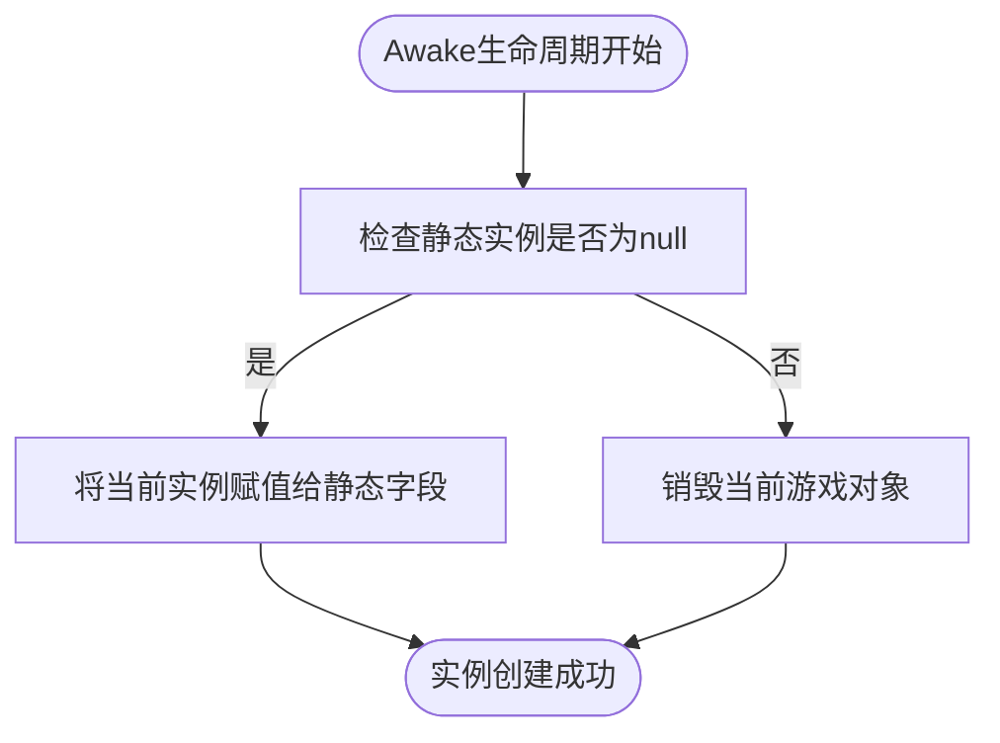
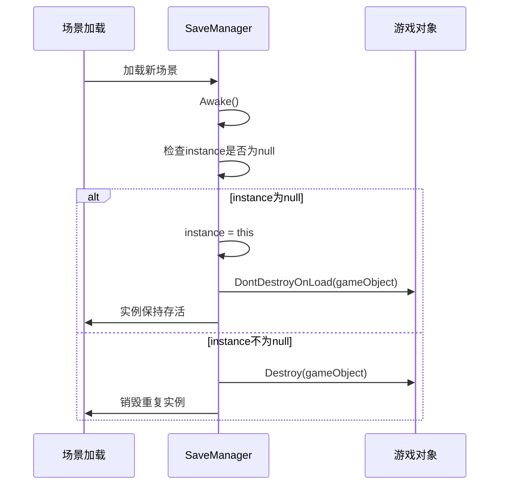
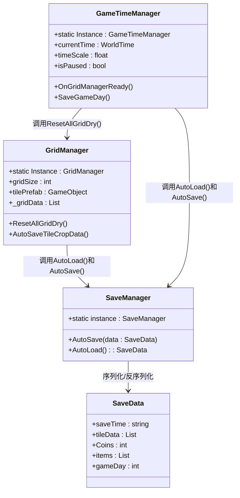

# 单例模式实现

<cite>
**本文档引用的文件**
- [GameTimeManager.cs](file://GameSystem\GameTimeManager.cs)
- [GridManager.cs](file://GameSystem\GridManager.cs)
- [SaveManager.cs](file://GameSystem\SaveManager.cs)
- [SaveData.cs](file://Data\SaveData.cs)
- [Tile.cs](file://Data\Tile.cs)
- [GameUI.cs](file://UI\GameUI.cs)
</cite>

## 目录
1. [引言](#引言)
2. [单例模式实现机制](#单例模式实现机制)
3. [Awake生命周期中的实例管理](#awake生命周期中的实例管理)
4. [DontDestroyOnLoad在跨场景持久化中的应用](#dontdestroyonload在跨场景持久化中的应用)
5. [单例访问方式与全局唯一性保障](#单例访问方式与全局唯一性保障)
6. [单例模式的优势与潜在风险](#单例模式的优势与潜在风险)
7. [最佳实践建议](#最佳实践建议)
8. [结论](#结论)

## 引言
在Unity游戏开发中，单例模式是一种常用的架构设计模式，用于确保特定管理器类在整个应用程序生命周期中仅存在一个实例。本文深入分析`GameTimeManager`、`GridManager`和`SaveManager`三个核心管理器中单例模式的实现机制，探讨其在游戏架构中的作用、生命周期管理、跨场景持久化策略以及潜在的设计风险。

## 单例模式实现机制

### GameTimeManager中的单例实现
`GameTimeManager`类通过静态字段`Instance`实现单例模式，负责管理游戏内的时间系统，包括游戏日计算、时间流逝和昼夜循环。该管理器在Awake生命周期中检查并确保全局唯一性。

### GridManager中的单例实现
`GridManager`类通过静态字段`Instance`实现单例模式，负责管理游戏中的地块网格系统，包括地块生成、状态更新和视觉渲染。它与`GameTimeManager`存在紧密的依赖关系。

### SaveManager中的单例实现
`SaveManager`类通过静态字段`instance`（小写）实现单例模式，提供自动存档和读档功能。与其他管理器不同，`SaveManager`还使用`DontDestroyOnLoad`确保其在场景切换时保持存活。

**Section sources**
- [GameTimeManager.cs](file://GameSystem\GameTimeManager.cs#L7)
- [GridManager.cs](file://GameSystem\GridManager.cs#L8)
- [SaveManager.cs](file://GameSystem\SaveManager.cs#L7)

## Awake生命周期中的实例管理

### 实例赋值逻辑
在Awake生命周期方法中，所有三个管理器都实现了相同的单例检查逻辑：首先检查静态实例字段是否为null，如果为null则将当前实例赋值给该字段，否则销毁当前游戏对象。

**Diagram sources**
- [GameTimeManager.cs](file://GameSystem\GameTimeManager.cs#L44-L48)
- [GridManager.cs](file://GameSystem\GridManager.cs#L26-L31)
- [SaveManager.cs](file://GameSystem\SaveManager.cs#L12-L18)

### 重复实例销毁机制
当场景中存在多个相同管理器的实例时，后加载的实例会在Awake方法中被检测到并销毁。这种机制确保了全局唯一性，避免了多个时间管理器或存档管理器同时运行导致的数据冲突。

### 执行顺序控制
`GameTimeManager`和`GridManager`都使用了`[DefaultExecutionOrder(-10)]`和`[DefaultExecutionOrder(-20)]`属性，确保它们在其他游戏对象之前初始化，从而保证单例实例在游戏早期就已建立。

**Section sources**
- [GameTimeManager.cs](file://GameSystem\GameTimeManager.cs#L5-L6)
- [GridManager.cs](file://GameSystem\GridManager.cs#L6)
- [SaveManager.cs](file://GameSystem\SaveManager.cs#L12-L18)

## DontDestroyOnLoad在跨场景持久化中的应用

### SaveManager的跨场景持久化
`SaveManager`是唯一使用`DontDestroyOnLoad(gameObject)`方法的管理器。当检测到`instance`为null时，不仅将当前实例赋值给静态字段，还会调用`DontDestroyOnLoad`，确保该实例在场景切换时不会被销毁。

**Diagram sources**
- [SaveManager.cs](file://GameSystem\SaveManager.cs#L12-L18)

### 持久化必要性分析
`SaveManager`需要跨场景持久化，因为它负责管理游戏的存档数据。如果在场景切换时被销毁，将导致存档功能中断，玩家数据无法正确保存和读取。而`GameTimeManager`和`GridManager`通常与特定场景绑定，不需要跨场景持久化。

### 潜在问题与注意事项
使用`DontDestroyOnLoad`可能导致内存泄漏，特别是当管理器持有大量引用或订阅了大量事件时。开发者需要确保在适当的时候清理资源和取消订阅。

**Section sources**
- [SaveManager.cs](file://GameSystem\SaveManager.cs#L15)
- [SaveManager.cs](file://GameSystem\SaveManager.cs#L29-L54)

## 单例访问方式与全局唯一性保障

### 单例访问语法
在代码中，单例实例通过静态字段进行访问，例如：
- `SaveManager.instance.AutoLoad()`
- `GameTimeManager.Instance.CurrentGameDay`
- `GridManager.Instance.ResetAllGridDry()`

### 全局唯一性优势
单例模式确保了全局唯一性，使得任何游戏对象都可以通过静态字段直接访问管理器，无需在场景中查找或传递引用。这种设计简化了组件间的通信。

### 空引用检查
代码中在访问单例实例前通常会进行空引用检查，例如`GridManager.Instance?.ResetAllGridDry()`，以防止在实例未初始化时发生空引用异常。

**Diagram sources**
- [GameTimeManager.cs](file://GameSystem\GameTimeManager.cs#L7)
- [GridManager.cs](file://GameSystem\GridManager.cs#L8)
- [SaveManager.cs](file://GameSystem\SaveManager.cs#L7)
- [SaveData.cs](file://Data\SaveData.cs#L12)

**Section sources**
- [GameTimeManager.cs](file://GameSystem\GameTimeManager.cs#L149)
- [GridManager.cs](file://GameSystem\GridManager.cs#L137)
- [SaveManager.cs](file://GameSystem\SaveManager.cs#L52)

## 单例模式的优势与潜在风险

### 优势分析
| 优势 | 说明 |
|------|------|
| 全局可访问性 | 任何脚本都可以通过静态字段直接访问管理器 |
| 简化依赖管理 | 无需在场景中手动连接引用或使用依赖注入 |
| 状态一致性 | 确保全局状态由单一实例管理，避免数据冲突 |
| 生命周期控制 | 可以精确控制管理器的初始化和销毁时机 |

### 潜在风险
| 风险 | 说明 |
|------|------|
| 内存泄漏 | `DontDestroyOnLoad`可能导致实例无法被垃圾回收 |
| 测试困难 | 单例的全局状态使得单元测试变得复杂 |
| 紧耦合 | 组件间通过静态字段直接引用，增加了耦合度 |
| 初始化顺序问题 | 不同单例之间的依赖关系可能导致初始化顺序问题 |

### 具体风险案例
根据项目中的"这是一个备忘录.txt"文件，存在一个已知问题：`GridManager.ResetAllGridDry`方法由`TimeManager`调用，并且在读取Tile的存档之前执行。这可能导致在存档数据加载前就修改了地块状态，造成数据不一致。

**Section sources**
- [这是一个备忘录.txt](file://这是一个备忘录.txt#L16)
- [GameTimeManager.cs](file://GameSystem\GameTimeManager.cs#L251)
- [GridManager.cs](file://GameSystem\GridManager.cs#L57)

## 最佳实践建议

### 避免过度使用单例
单例模式应仅用于真正需要全局唯一性的管理器，如时间管理、音频管理、存档管理等。对于普通的游戏对象或组件，应使用其他设计模式。

### 合理管理生命周期
对于使用`DontDestroyOnLoad`的单例，应实现适当的资源清理机制，例如在`OnDestroy`方法中取消事件订阅和释放引用。

### 处理初始化顺序
当单例之间存在依赖关系时（如`GameTimeManager`依赖`GridManager`），应使用明确的初始化协议，如`GameTimeManager`中的`OnGridManagerReady()`方法。

### 提供替代方案
对于测试目的，可以考虑提供单例的替代实现或使用依赖注入框架，以降低测试难度。

### 错误处理
在访问单例时应始终进行空引用检查，并提供适当的错误处理机制，如`SaveManager.instance.AutoLoad()`返回null时的处理。

**Section sources**
- [GameTimeManager.cs](file://GameSystem\GameTimeManager.cs#L58-L63)
- [SaveManager.cs](file://GameSystem\SaveManager.cs#L52-L54)
- [GridManager.cs](file://GameSystem\GridManager.cs#L172-L174)

## 结论
`GameTimeManager`、`GridManager`和`SaveManager`中的单例模式实现展示了Unity项目中常见的架构设计。通过Awake生命周期中的实例检查和销毁机制，确保了全局唯一性。`SaveManager`使用`DontDestroyOnLoad`实现了跨场景持久化，满足了存档系统的需求。然而，单例模式也带来了内存泄漏、测试困难等潜在风险。最佳实践建议合理使用单例，注意生命周期管理，并处理好初始化顺序问题，以构建稳定可靠的游戏架构。