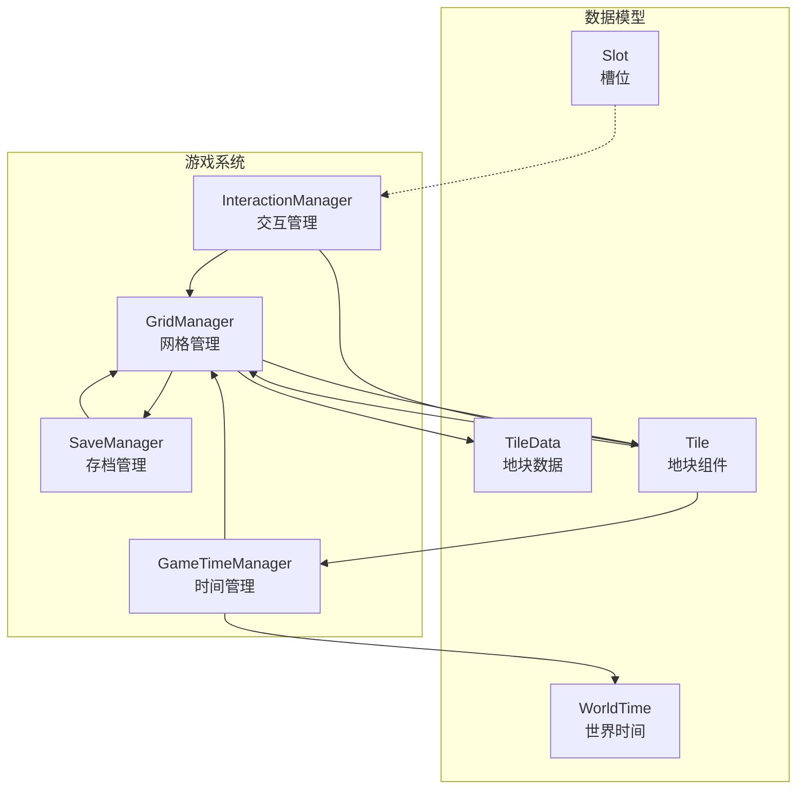
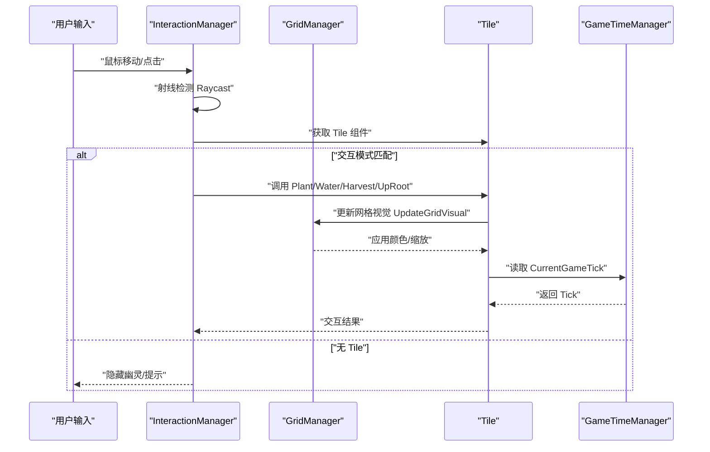
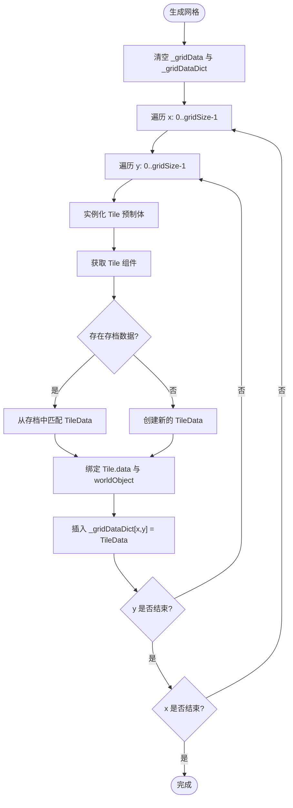
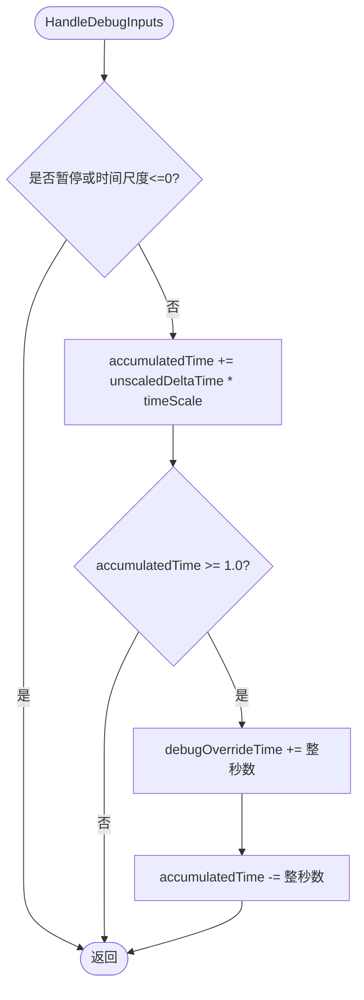
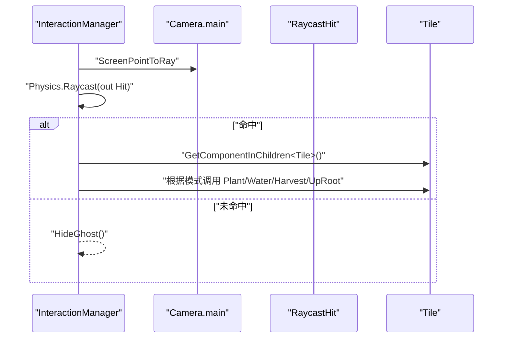
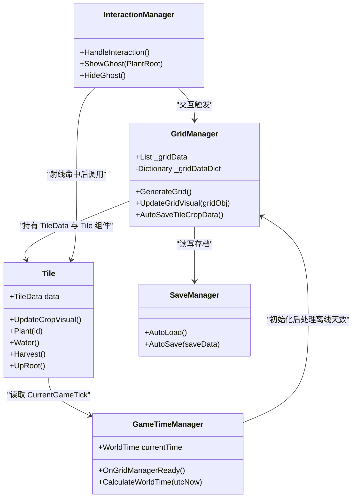

# 性能优化策略

<cite>
**本文引用的文件**
- [GridManager.cs](file://Assets/Scripts/GameSystem/GridManager.cs)
- [GameTimeManager.cs](file://Assets/Scripts/GameSystem/GameTimeManager.cs)
- [Tile.cs](file://Assets/Scripts/Data/Tile.cs)
- [InteractionManager.cs](file://Assets/Scripts/GameSystem/InteractionManager.cs)
- [WorldTime.cs](file://Assets/Scripts/Data/WorldTime.cs)
- [Slot.cs](file://Assets/Scripts/Data/Slot.cs)
- [SaveManager.cs](file://Assets/Scripts/GameSystem/SaveManager.cs)
- [这是一个备忘录.txt](file://Assets/Scripts/这是一个备忘录.txt)
</cite>

## 目录
1. [简介](#简介)
2. [项目结构](#项目结构)
3. [核心组件](#核心组件)
4. [架构总览](#架构总览)
5. [详细组件分析](#详细组件分析)
6. [依赖关系分析](#依赖关系分析)
7. [性能考量](#性能考量)
8. [故障排查指南](#故障排查指南)
9. [结论](#结论)
10. [附录](#附录)

## 简介
本文件聚焦于项目中的关键性能优化措施，围绕以下主题展开：
- GridManager 中使用 Dictionary<Vector2Int, TileData> 实现 O(1) 快速查找，替代 List 遍历，显著降低查找成本。
- GameTimeManager 中对累积时间 accumulatedTime 的处理，减少浮点误差的累积。
- Update 方法中频繁的 Raycast 与 GetComponent 调用可能成为性能瓶颈，建议缓存引用或使用对象池优化。
- 提供 Unity Profiler 使用指南，帮助开发者定位 CPU 与内存热点，确保游戏在低端设备上的流畅运行。

## 项目结构
项目采用按功能域分层组织：GameSystem（游戏系统）、Data（数据模型）、UI（界面）、Common（通用事件）。与性能优化直接相关的模块包括：
- GridManager：网格生成、TileData 存取、视觉更新。
- GameTimeManager：时间演进、离线天数处理、调试步进。
- Tile：地块数据与作物可视化更新。
- InteractionManager：基于射线检测的交互逻辑。
- SaveManager：存档读写，影响运行期性能与稳定性。

图表来源
- [GridManager.cs](file://Assets/Scripts/GameSystem/GridManager.cs#L1-L183)
- [GameTimeManager.cs](file://Assets/Scripts/GameSystem/GameTimeManager.cs#L1-L255)
- [Tile.cs](file://Assets/Scripts/Data/Tile.cs#L1-L194)
- [InteractionManager.cs](file://Assets/Scripts/GameSystem/InteractionManager.cs#L1-L206)
- [WorldTime.cs](file://Assets/Scripts/Data/WorldTime.cs#L1-L43)
- [Slot.cs](file://Assets/Scripts/Data/Slot.cs#L1-L11)

章节来源
- [GridManager.cs](file://Assets/Scripts/GameSystem/GridManager.cs#L1-L183)
- [GameTimeManager.cs](file://Assets/Scripts/GameSystem/GameTimeManager.cs#L1-L255)
- [Tile.cs](file://Assets/Scripts/Data/Tile.cs#L1-L194)
- [InteractionManager.cs](file://Assets/Scripts/GameSystem/InteractionManager.cs#L1-L206)
- [WorldTime.cs](file://Assets/Scripts/Data/WorldTime.cs#L1-L43)
- [Slot.cs](file://Assets/Scripts/Data/Slot.cs#L1-L11)

## 核心组件
- GridManager：负责网格生成、TileData 的字典化存储与快速访问、视觉更新、自动存档。
- GameTimeManager：负责时间演进、离线天数处理、调试步进与累计时间控制。
- Tile：承载 TileData 并负责作物可视化与阶段切换。
- InteractionManager：基于射线检测的交互逻辑，频繁调用 Raycast 与 GetComponent。
- SaveManager：统一的存档读写入口，影响运行期性能与稳定性。

章节来源
- [GridManager.cs](file://Assets/Scripts/GameSystem/GridManager.cs#L1-L183)
- [GameTimeManager.cs](file://Assets/Scripts/GameSystem/GameTimeManager.cs#L1-L255)
- [Tile.cs](file://Assets/Scripts/Data/Tile.cs#L1-L194)
- [InteractionManager.cs](file://Assets/Scripts/GameSystem/InteractionManager.cs#L1-L206)

## 架构总览
GridManager 与 GameTimeManager 形成“数据-时间”双轴驱动：GridManager 负责空间网格与 TileData 的 O(1) 访问，GameTimeManager 负责时间推进与离线天数处理。两者通过事件与回调协同，保证存档与运行期状态的一致性。

图表来源
- [InteractionManager.cs](file://Assets/Scripts/GameSystem/InteractionManager.cs#L49-L90)
- [GridManager.cs](file://Assets/Scripts/GameSystem/GridManager.cs#L84-L103)
- [Tile.cs](file://Assets/Scripts/Data/Tile.cs#L120-L170)
- [GameTimeManager.cs](file://Assets/Scripts/GameSystem/GameTimeManager.cs#L234-L244)

## 详细组件分析

### GridManager：O(1) 查找与字典化
- 数据结构设计
  - 使用 List<TileData> 作为持久化载体，便于序列化与存档。
  - 使用 Dictionary<Vector2Int, TileData> 在运行时提供 O(1) 快速查找，避免对 List 的线性扫描。
- 关键路径
  - 生成网格时，同时填充 _gridData 与 _gridDataDict，确保二者一致。
  - 视觉更新通过 Tile 组件上的 data 引用进行，避免跨组件查找。
- 性能收益
  - 字典查找为 O(1)，显著优于 List 查找的 O(n)。
  - 与 SaveManager 的配合，避免频繁 IO 与重建数据结构。

图表来源
- [GridManager.cs](file://Assets/Scripts/GameSystem/GridManager.cs#L130-L165)

章节来源
- [GridManager.cs](file://Assets/Scripts/GameSystem/GridManager.cs#L1-L183)

### GameTimeManager：累积时间与浮点误差控制
- 累积时间处理
  - 使用 accumulatedTime 累加每帧增量，仅在达到阈值时才更新 debugOverrideTime，避免每次 Update 都进行高精度时间运算。
  - 通过整数部分与小数部分分离，减少浮点误差的累积。
- 离线天数处理
  - 在 GridManager 初始化完成后，由 GameTimeManager 处理离线天数，避免读档前的状态覆盖。
- 时间演进
  - CalculateWorldTime 基于 UTC 与 CST 的换算，计算 gameDay 与进度，供 Tile 等组件使用。

图表来源
- [GameTimeManager.cs](file://Assets/Scripts/GameSystem/GameTimeManager.cs#L85-L109)

章节来源
- [GameTimeManager.cs](file://Assets/Scripts/GameSystem/GameTimeManager.cs#L1-L255)
- [WorldTime.cs](file://Assets/Scripts/Data/WorldTime.cs#L1-L43)

### InteractionManager：射线检测与组件获取的性能风险
- 当前实现
  - 每帧执行 Raycast，若命中则 GetComponent<Tile>() 获取 Tile 组件，再根据交互模式调用 Tile 的具体方法。
- 潜在瓶颈
  - Update 中每帧射线检测与组件获取，可能造成大量 GC 与 CPU 开销。
  - GetComponent 调用在热路径上，建议缓存引用或使用对象池减少分配。
- 优化建议
  - 缓存相机主摄像机与射线方向，避免重复构造。
  - 对命中目标进行弱引用缓存，减少 GetComponent 调用频率。
  - 使用 PhysicsScene.QueryOverlaps 或自定义射线命中缓存，降低每帧开销。
  - 对 UI 幽灵预览对象使用对象池，避免频繁 Instantiate/Destroy。

图表来源
- [InteractionManager.cs](file://Assets/Scripts/GameSystem/InteractionManager.cs#L49-L90)

章节来源
- [InteractionManager.cs](file://Assets/Scripts/GameSystem/InteractionManager.cs#L1-L206)

### Tile：阶段切换与可视化更新
- 性能注意点
  - UpdateCropVisual 每 60 帧检查一次，避免每帧都进行昂贵的阶段计算与模型切换。
  - 模型切换使用 Destroy/Instantiate，建议使用对象池或静态替换，减少 GC 峰值。
- 与时间系统的耦合
  - 通过 GameTimeManager.CurrentGameTick 记录阶段开始时间，保证跨帧一致性。

章节来源
- [Tile.cs](file://Assets/Scripts/Data/Tile.cs#L1-L194)

## 依赖关系分析
- GridManager 依赖 TileData、Tile、SaveManager；对外暴露 DataChange 事件，触发自动存档。
- GameTimeManager 依赖 GridManager（初始化完成后处理离线天数），依赖 WorldTime 结构化时间信息。
- InteractionManager 依赖 GridManager 与 Tile，负责射线交互与 UI 幽灵预览。
- Tile 依赖 GameTimeManager 与 CropDatabase（外部依赖）进行阶段计算与可视化更新。

图表来源
- [GridManager.cs](file://Assets/Scripts/GameSystem/GridManager.cs#L1-L183)
- [GameTimeManager.cs](file://Assets/Scripts/GameSystem/GameTimeManager.cs#L1-L255)
- [Tile.cs](file://Assets/Scripts/Data/Tile.cs#L1-L194)
- [InteractionManager.cs](file://Assets/Scripts/GameSystem/InteractionManager.cs#L1-L206)

章节来源
- [GridManager.cs](file://Assets/Scripts/GameSystem/GridManager.cs#L1-L183)
- [GameTimeManager.cs](file://Assets/Scripts/GameSystem/GameTimeManager.cs#L1-L255)
- [Tile.cs](file://Assets/Scripts/Data/Tile.cs#L1-L194)
- [InteractionManager.cs](file://Assets/Scripts/GameSystem/InteractionManager.cs#L1-L206)

## 性能考量

### 1) 字典化查找替代线性扫描
- 现状：GridManager 使用 Dictionary<Vector2Int, TileData> 提供 O(1) 查找，避免 List 遍历。
- 建议：保持该设计；在生成网格时同步维护 _gridData 与 _gridDataDict，确保一致性。

章节来源
- [GridManager.cs](file://Assets/Scripts/GameSystem/GridManager.cs#L18-L22)
- [GridManager.cs](file://Assets/Scripts/GameSystem/GridManager.cs#L130-L165)

### 2) 累积时间处理减少浮点误差
- 现状：GameTimeManager 使用 accumulatedTime 累加增量并在阈值处更新 debugOverrideTime，避免每帧高精度运算。
- 建议：保持该策略；在调试模式下谨慎使用 timeScale，避免过大倍率导致的累积误差放大。

章节来源
- [GameTimeManager.cs](file://Assets/Scripts/GameSystem/GameTimeManager.cs#L85-L109)

### 3) Update 中射线与组件获取的性能风险
- 现状：InteractionManager 与 GridManager 的 Update 中频繁执行 Raycast 与 GetComponent，可能成为瓶颈。
- 建议：
  - 缓存相机与射线方向，减少临时对象分配。
  - 对命中目标进行弱引用缓存，降低 GetComponent 调用频率。
  - 使用对象池管理 UI 幽灵预览与 Tile 模型，避免频繁 Instantiate/Destroy。
  - 对 Tile 的 UpdateCropVisual 逻辑进行节流，维持现有每 60 帧检查的策略。

章节来源
- [InteractionManager.cs](file://Assets/Scripts/GameSystem/InteractionManager.cs#L49-L90)
- [GridManager.cs](file://Assets/Scripts/GameSystem/GridManager.cs#L43-L55)
- [Tile.cs](file://Assets/Scripts/Data/Tile.cs#L64-L71)

### 4) 存档与初始化顺序的性能与稳定性
- 现状：备忘录记录了 ResetAllGridDry 在读档前被调用导致存档被覆盖的问题，现已调整为先初始化 GridManager 再处理离线天数。
- 建议：确保所有依赖 GridManager 的系统在 OnGridManagerReady 后再执行，避免状态覆盖与不必要的 IO。

章节来源
- [这是一个备忘录.txt](file://Assets/Scripts/这是一个备忘录.txt#L1-L20)
- [GameTimeManager.cs](file://Assets/Scripts/GameSystem/GameTimeManager.cs#L55-L63)
- [GridManager.cs](file://Assets/Scripts/GameSystem/GridManager.cs#L34-L41)

### 5) Unity Profiler 使用指南
- CPU 热点定位
  - 打开 Profiler，选择 CPU Usage，观察每帧调用次数与耗时，重点关注 Update、Raycast、GetComponent、Instantiate/Destroy。
  - 使用 GPU Profiler 观察渲染开销，关注 Draw Calls 与 Material Switch。
- 内存热点定位
  - 打开 Profiler 的 Memory 窗口，观察 Mono/GC Alloc，识别高频分配点（如每帧 Instantiate）。
  - 使用 Profiler 的 Allocation Callstack，定位具体调用链，针对性优化。
- 低端设备优化建议
  - 减少每帧射线命中数量，合并射线检测。
  - 使用对象池与静态替换，降低 GC 峰值。
  - 降低渲染复杂度，合并材质与网格，减少 Draw Calls。
  - 控制 Update 中的计算量，将部分逻辑延迟到必要时执行。

[本节为通用指导，不直接分析具体文件，故无章节来源]

## 故障排查指南
- 存档读档异常
  - 现象：tileData 为空列表，背包数据异常。
  - 排查：确认 SaveManager 的 AutoLoad/AutoSave 调用时机，避免在 GridManager 读档前被覆盖。
  - 参考：备忘录中记录的初始化顺序问题与修复方案。
- 射线交互无效
  - 现象：射线未命中 Tile 组件。
  - 排查：确认碰撞器与 LayerMask 设置，确保命中目标包含 Tile 组件。
- 阶段切换异常
  - 现象：作物无法进入下一阶段。
  - 排查：检查 GameTimeManager 的 CurrentGameTick 与 Tile 的阶段计算逻辑，确保初始化顺序正确。

章节来源
- [这是一个备忘录.txt](file://Assets/Scripts/这是一个备忘录.txt#L1-L20)
- [InteractionManager.cs](file://Assets/Scripts/GameSystem/InteractionManager.cs#L49-L90)
- [Tile.cs](file://Assets/Scripts/Data/Tile.cs#L83-L109)
- [GameTimeManager.cs](file://Assets/Scripts/GameSystem/GameTimeManager.cs#L234-L244)

## 结论
- GridManager 的字典化设计有效提升了查找效率，是项目性能的关键基石。
- GameTimeManager 的累积时间处理策略有助于减少浮点误差，提升时间演进的稳定性。
- Update 中的射线与组件获取是潜在瓶颈，建议通过缓存与对象池进行优化。
- 通过合理的初始化顺序与 Profiler 定位，可进一步提升低端设备上的运行质量。

[本节为总结性内容，不直接分析具体文件，故无章节来源]

## 附录
- 相关文件路径与职责
  - GridManager：网格生成、TileData 存取、视觉更新、自动存档。
  - GameTimeManager：时间演进、离线天数处理、调试步进。
  - Tile：作物阶段与可视化更新。
  - InteractionManager：射线交互与 UI 幽灵预览。
  - SaveManager：统一存档入口。
  - WorldTime：时间结构化表示。
  - Slot：槽位空位判断。

[本节为概览性内容，不直接分析具体文件，故无章节来源]