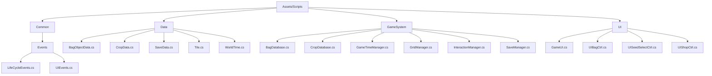
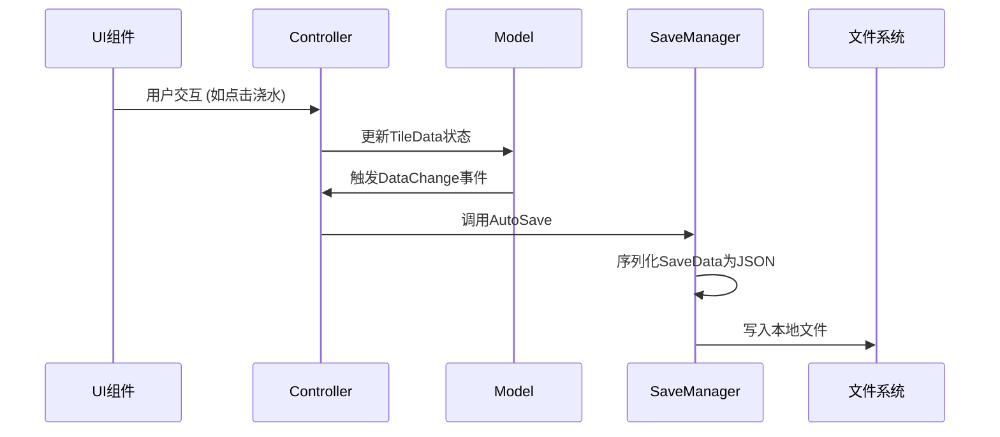
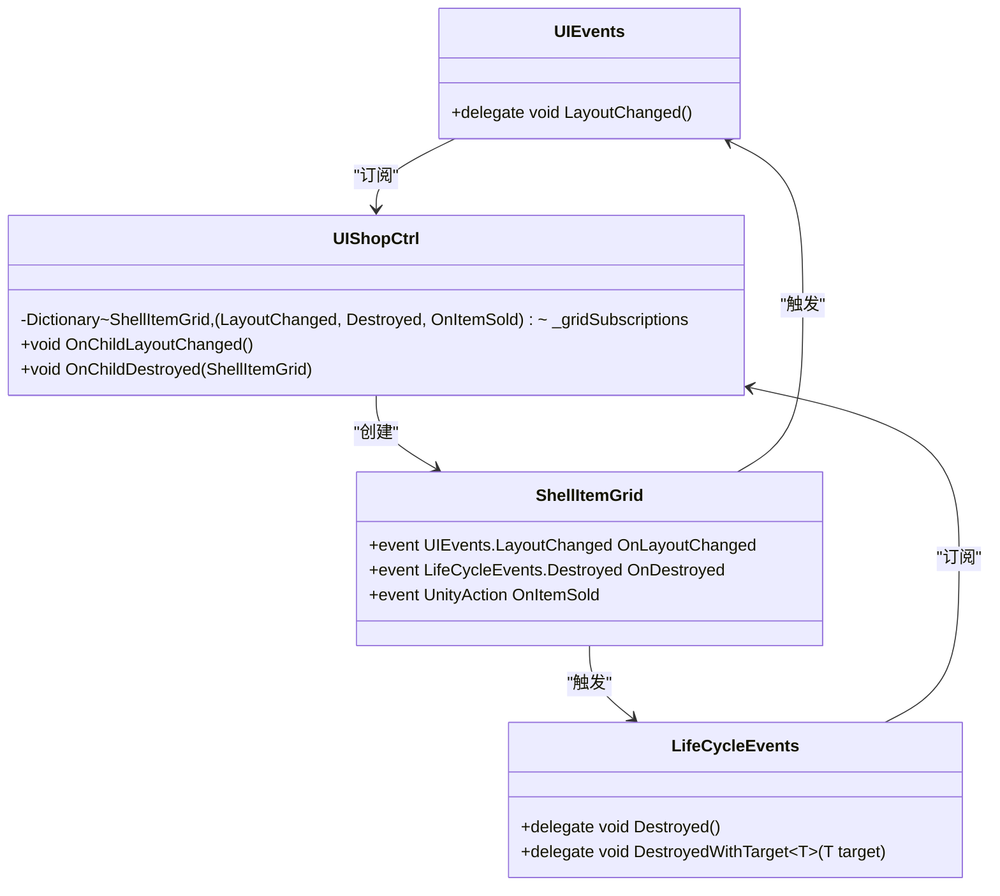
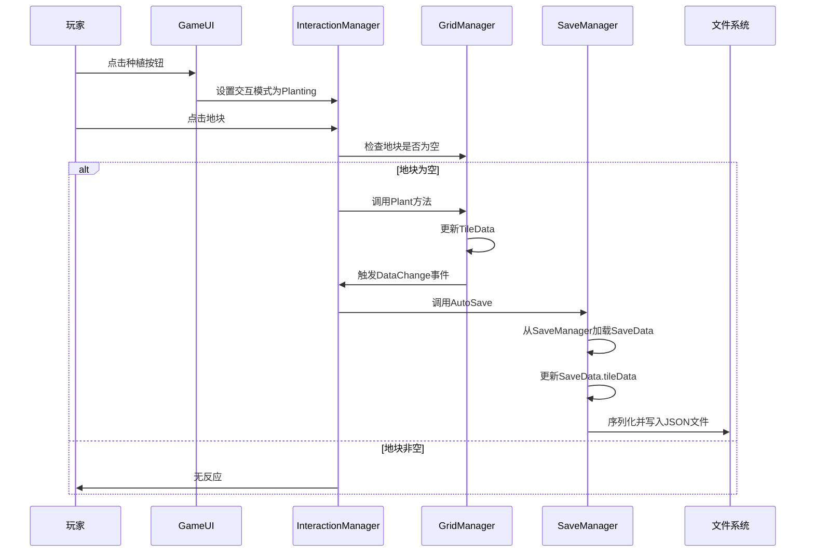

# 技术架构

<cite>
**本文档引用文件**  
- [GameUI.cs](file://UI/GameUI.cs)
- [UIBagCtrl.cs](file://UI/UIBagCtrl.cs)
- [UISeedSelectCtrl.cs](file://UI/UISeedSelectCtrl.cs)
- [UIShopCtrl.cs](file://UI/UIShopCtrl.cs)
- [GameTimeManager.cs](file://GameSystem/GameTimeManager.cs)
- [GridManager.cs](file://GameSystem/GridManager.cs)
- [InteractionManager.cs](file://GameSystem/InteractionManager.cs)
- [SaveManager.cs](file://GameSystem/SaveManager.cs)
- [BagDatabase.cs](file://GameSystem/BagDatabase.cs)
- [CropDatabase.cs](file://GameSystem/CropDatabase.cs)
- [LifeCycleEvents.cs](file://Common/Events/LifeCycleEvents.cs)
- [UIEvents.cs](file://Common/Events/UIEvents.cs)
- [SaveData.cs](file://Data/SaveData.cs)
- [Tile.cs](file://Data/Tile.cs)
- [WorldTime.cs](file://Data/WorldTime.cs)
- [BagObjectData.cs](file://Data/BagObjectData.cs)
- [CropData.cs](file://Data/CropData.cs)
</cite>

## 目录
1. [简介](#简介)
2. [项目结构](#项目结构)
3. [MVC架构模式](#mvc架构模式)
4. [视图层（View）](#视图层view)
5. [控制器层（Controller）](#控制器层controller)
6. [模型层（Model）](#模型层model)
7. [单例模式应用](#单例模式应用)
8. [观察者模式与事件系统](#观察者模式与事件系统)
9. [系统上下文与组件交互](#系统上下文与组件交互)
10. [架构决策与权衡](#架构决策与权衡)
11. [性能优化建议](#性能优化建议)
12. [结论](#结论)

## 简介
本项目为一个俯仰视角的种田类Unity游戏Demo，采用MVC（Model-View-Controller）架构模式进行组织。该架构将游戏逻辑、用户界面和数据管理清晰分离，提高了代码的可维护性和可扩展性。View层由UI目录下的各类UI控制器构成，负责用户交互和界面展示；Controller层由GameSystem中的各类管理器构成，处理核心游戏逻辑；Model层由Data目录下的数据类构成，负责数据的持久化和状态管理。系统通过单例模式确保核心管理器的全局唯一访问，并通过自定义事件系统实现模块间的松耦合通信。

## 项目结构
项目结构清晰地按照功能模块进行划分，主要分为Common、Data、GameSystem和UI四个核心目录。



**图示来源**  
- [项目结构](file://Assets/Scripts)

## MVC架构模式
本项目严格遵循MVC设计模式，将应用程序分为三个核心组件：模型（Model）、视图（View）和控制器（Controller）。这种分离确保了数据、逻辑和表现层的独立性，使得代码更易于测试、维护和扩展。

### MVC分层职责
- **模型（Model）**：位于`Data/`目录下，包含`SaveData`、`TileData`、`BagObjectData`等数据类，负责封装游戏状态和业务数据。
- **视图（View）**：位于`UI/`目录下，包含`GameUI`、`UIBagCtrl`等UI控制器，负责渲染界面和接收用户输入。
- **控制器（Controller）**：位于`GameSystem/`目录下，包含`GridManager`、`InteractionManager`等管理器，负责处理用户输入、更新模型并协调视图的更新。

该模式通过事件和回调机制进行通信，避免了层间的直接依赖，实现了高内聚、低耦合的设计目标。

**图示来源**  
- [SaveData.cs](file://Data/SaveData.cs)
- [GameUI.cs](file://UI/GameUI.cs)
- [GridManager.cs](file://GameSystem/GridManager.cs)

## 视图层（View）
视图层由`UI/`目录下的多个UI控制器组成，负责管理游戏的用户界面和用户交互。

### GameUI
`GameUI`是游戏的主UI控制器，作为其他UI控件的容器和协调者。它通过单例模式提供全局访问点，并管理时间显示、商店、背包等子UI的激活状态。它订阅`BagDatabase`的`BagItemsChange`事件，当背包数据发生变化时，自动刷新种子选择、背包和商店UI。

**代码路径**  
- [GameUI.cs](file://UI/GameUI.cs#L5-L110)

### UIBagCtrl
`UIBagCtrl`负责管理背包UI的显示和交互。它通过`BagDatabase`获取玩家物品列表，并在启动时生成相应数量的槽位。它提供了`AddItem`方法，用于向背包UI中添加物品，支持堆叠和空槽位查找。该组件通过`InitialItems`方法从`BagDatabase`加载数据并刷新UI。

**代码路径**  
- [UIBagCtrl.cs](file://UI/UIBagCtrl.cs#L6-L105)

### UISeedSelectCtrl
`UISeedSelectCtrl`是种子选择UI的控制器。它在`InitSeedList`方法中遍历`BagDatabase`中的物品，筛选出类型为种子且数量大于0的物品，并为其生成UI项。它通过`Setup`方法将`BagObject`数据绑定到`UISeedItem`预制体上。

**代码路径**  
- [UISeedSelectCtrl.cs](file://UI/UISeedSelectCtrl.cs#L8-L55)

### UIShopCtrl
`UIShopCtrl`管理商店UI，支持购买和出售两种模式。在出售模式下，它遍历`BagDatabase`中的可出售物品并生成`ShellItemGrid`。在购买模式下，它从`ShopDatabase`加载商品数据并生成`BuyItemGrid`。它通过事件订阅机制监听子组件的布局变化和销毁事件，确保UI的正确更新。

**代码路径**  
- [UIShopCtrl.cs](file://UI/UIShopCtrl.cs#L16-L214)

## 控制器层（Controller）
控制器层由`GameSystem/`目录下的多个管理器类构成，负责处理核心游戏逻辑和系统协调。

### InteractionManager
`InteractionManager`是核心交互控制器，管理玩家的种植、浇水、收获和铲除等操作。它通过`currInteractionMode`枚举跟踪当前交互模式，并在`Update`方法中根据鼠标输入执行相应逻辑。例如，在种植模式下，它会显示一个幽灵预览，并在左键点击时调用`PlantCrop`方法。

**代码路径**  
- [InteractionManager.cs](file://GameSystem/InteractionManager.cs#L13-L206)

### GridManager
`GridManager`负责管理游戏中的地块网格。它在`GenerateGrid`方法中生成`gridSize * gridSize`的网格，并优先从存档中加载`TileData`。它维护一个`_gridDataDict`字典，用于通过`Vector2Int`坐标快速查找`TileData`，实现了O(1)时间复杂度的查找。

**代码路径**  
- [GridManager.cs](file://GameSystem/GridManager.cs#L7-L179)

### GameTimeManager
`GameTimeManager`管理游戏时间系统。它基于UTC时间计算游戏日，并支持调试模式下的时间加速和手动步进。它在`OnNewGameDay`方法中通知`GridManager`重置所有地块的干燥状态，实现每日的作物生长逻辑。

**代码路径**  
- [GameTimeManager.cs](file://GameSystem/GameTimeManager.cs#L6-L244)

## 模型层（Model）
模型层由`Data/`目录下的数据类构成，负责数据的定义、持久化和状态管理。

### SaveData
`SaveData`是自动存档所用的数据类，包含存档时间、地块数据、玩家金币和物品列表等字段。它被`JsonUtility`序列化为JSON格式存储在本地文件中。该类通过`[System.Serializable]`属性标记，使其可被Unity序列化系统处理。

**代码路径**  
- [SaveData.cs](file://Data/SaveData.cs#L11-L30)

### TileData
`TileData`封装了单个地块的状态信息，包括坐标、作物ID、种植时间、当前阶段等。它是`GridManager`进行存档和读档的核心数据单元。`Tile`组件在`UpdateCropVisual`方法中根据`TileData`的状态更新作物的视觉表现。

**代码路径**  
- [Tile.cs](file://Data/Tile.cs#L12-L51)

### 数据持久化流程
数据持久化通过`SaveManager`实现。当游戏状态发生变化时（如浇水、收获），`InteractionManager`或`BagDatabase`会触发`DataChange`事件，`SaveManager`监听该事件并调用`AutoSave`方法。`AutoSave`方法将当前的`SaveData`对象序列化为JSON并写入文件。



**图示来源**  
- [SaveData.cs](file://Data/SaveData.cs#L11-L30)
- [SaveManager.cs](file://GameSystem/SaveManager.cs#L6-L73)
- [GridManager.cs](file://GameSystem/GridManager.cs#L7-L179)

## 单例模式应用
项目中广泛使用单例模式来确保核心管理器的全局唯一实例，避免了多实例导致的状态混乱。

### GameTimeManager
`GameTimeManager`通过`static Instance`字段和`Awake`方法中的实例检查实现单例。如果`Instance`为空，则将其设置为当前实例；否则销毁重复的游戏对象。该管理器还使用`[DefaultExecutionOrder(-10)]`属性确保其在其他组件之前初始化。

**代码路径**  
- [GameTimeManager.cs](file://GameSystem/GameTimeManager.cs#L7-L47)

### GridManager
`GridManager`的单例实现与`GameTimeManager`类似。它在`Awake`方法中检查`Instance`，确保只有一个实例存在。`GridManager`的`ResetAllGridDry`方法在每日开始时被`GameTimeManager`调用，用于更新所有地块的干燥状态。

**代码路径**  
- [GridManager.cs](file://GameSystem/GridManager.cs#L8-L31)

### SaveManager
`SaveManager`不仅实现了单例模式，还通过`DontDestroyOnLoad`确保其在场景切换时不会被销毁。这保证了存档功能在整个游戏生命周期内都可用。

**代码路径**  
- [SaveManager.cs](file://GameSystem/SaveManager.cs#L7-L18)

## 观察者模式与事件系统
项目通过Unity的`UnityEvent`和自定义静态事件类实现了观察者模式，实现了模块间的松耦合通信。

### UnityEvent
`BagDatabase`使用`UnityEvent BagItemsChange`来通知订阅者背包数据已更改。`GameUI`在`Start`方法中订阅此事件，并在`OnBagItemsChanged`回调中刷新所有相关的UI组件。

**代码路径**  
- [BagDatabase.cs](file://GameSystem/BagDatabase.cs#L20-L21)
- [GameUI.cs](file://UI/GameUI.cs#L37-L38)

### 自定义事件系统
`Common/Events/`目录下定义了`LifeCycleEvents`和`UIEvents`两个静态事件类。`UIShopCtrl`使用`UIEvents.LayoutChanged`来监听子组件的布局变化，并动态调整`ScrollView`的高度。`ShellItemGrid`在销毁时触发`LifeCycleEvents.Destroyed`事件，`UIShopCtrl`监听此事件以清理订阅，防止内存泄漏。



**图示来源**  
- [UIEvents.cs](file://Common/Events/UIEvents.cs#L5-L11)
- [LifeCycleEvents.cs](file://Common/Events/LifeCycleEvents.cs#L6-L12)
- [UIShopCtrl.cs](file://UI/UIShopCtrl.cs#L47-L168)
- [ShellItemGrid.cs](file://UI/ShellItemGrid.cs)

## 系统上下文与组件交互
本节展示游戏核心组件之间的数据流和调用关系。

### 系统上下文图
```mermaid
graph TD
subgraph "外部系统"
A[文件系统]
B[Unity引擎]
end
subgraph "View"
C[GameUI]
D[UIBagCtrl]
E[UISeedSelectCtrl]
F[UIShopCtrl]
end
subgraph "Controller"
G[InteractionManager]
H[GridManager]
I[GameTimeManager]
J[SaveManager]
end
subgraph "Model"
K[SaveData]
L[TileData]
M[BagObjectData]
end
C --> G : "设置交互模式"
C --> H : "获取地块数据"
C --> I : "显示时间"
D --> M : "获取物品数据"
E --> M : "获取种子数据"
F --> M : "获取商品数据"
G --> H : "执行种植/浇水"
G --> J : "触发存档"
H --> K : "同步地块数据"
H --> L : "管理地块状态"
I --> H : "通知新游戏日"
J --> A : "读写存档文件"
K --> J : "提供存档数据"
M --> D : "提供背包物品"
```

**图示来源**  
- [GameUI.cs](file://UI/GameUI.cs)
- [InteractionManager.cs](file://GameSystem/InteractionManager.cs)
- [GridManager.cs](file://GameSystem/GridManager.cs)
- [SaveManager.cs](file://GameSystem/SaveManager.cs)

### 组件交互序列图


**图示来源**  
- [GameUI.cs](file://UI/GameUI.cs#L82-L97)
- [InteractionManager.cs](file://GameSystem/InteractionManager.cs#L93-L104)
- [GridManager.cs](file://GameSystem/GridManager.cs#L132-L158)
- [SaveManager.cs](file://GameSystem/SaveManager.cs#L29-L59)

## 架构决策与权衡
### JsonUtility用于存档
**优点**：
- **集成度高**：`JsonUtility`是Unity内置的序列化工具，无需引入第三方库。
- **性能良好**：对于简单的数据结构，其序列化和反序列化速度较快。
- **易用性**：使用`[System.Serializable]`属性即可标记可序列化类，API简单。

**缺点**：
- **功能有限**：不支持泛型、接口和复杂类型（如`Dictionary`），限制了数据结构的设计。
- **可读性差**：生成的JSON文件包含大量Unity内部元数据，不易人工阅读和编辑。
- **版本兼容性**：字段重命名或删除可能导致反序列化失败。

### ScriptableObject用于数据配置
`BagObjectData`和`CropData`均继承自`ScriptableObject`，用于存储物品和作物的配置数据。

**可扩展性**：
- **编辑器友好**：可在Unity编辑器中直接创建和编辑资产，无需编写代码。
- **资源管理**：通过`Resources.LoadAll`等API可批量加载，便于管理大量配置数据。
- **热重载**：在编辑器中修改`ScriptableObject`后，游戏运行时可立即看到效果。

**代码路径**  
- [BagObjectData.cs](file://Data/BagObjectData.cs#L13)
- [CropData.cs](file://Data/CropData.cs#L10)

## 性能优化建议
### Dictionary用于快速查找
`GridManager`使用`Dictionary<Vector2Int, TileData> _gridDataDict`来存储地块数据，通过坐标实现O(1)时间复杂度的查找。这比在`List<TileData>`中遍历查找（O(n)）效率更高，尤其在处理大型网格时优势明显。

**代码路径**  
- [GridManager.cs](file://GameSystem/GridManager.cs#L21)

### 减少不必要的Update调用
`Tile`组件的`UpdateCropVisual`方法仅在`Time.frameCount % 60 == 0`时执行，即每秒执行一次，而不是每帧执行。这显著减少了CPU开销，避免了频繁的计算和对象创建。

**代码路径**  
- [Tile.cs](file://Data/Tile.cs#L68-L70)

### 事件驱动的存档机制
存档操作通过`DataChange`事件触发，而不是在每次数据修改时立即执行。这避免了频繁的磁盘I/O操作，提高了性能。`BagDatabase`在`SetQuantity`方法中调用`AutoSaveBagData`，但通过`StartCoroutine(ContinueAfterOneFrame)`延迟一帧执行，确保同一帧内的多次修改合并为一次存档。

**代码路径**  
- [BagObject.cs](file://Data/BagObjectData.cs#L148-L149)
- [BagDatabase.cs](file://GameSystem/BagDatabase.cs#L73-L74)

## 结论
本项目的架构设计合理，充分应用了MVC模式、单例模式和观察者模式等设计原则。View层与Controller层通过事件进行松耦合通信，Model层通过`JsonUtility`实现数据持久化。核心管理器如`GameTimeManager`和`GridManager`通过单例模式确保全局唯一访问。系统通过`UnityEvent`和自定义事件类实现了模块间的高效通信。尽管`JsonUtility`在功能上有所限制，但其性能和易用性使其成为小型项目的合适选择。通过使用`Dictionary`进行快速查找和事件驱动的存档机制，项目在性能方面也做出了有效的优化。