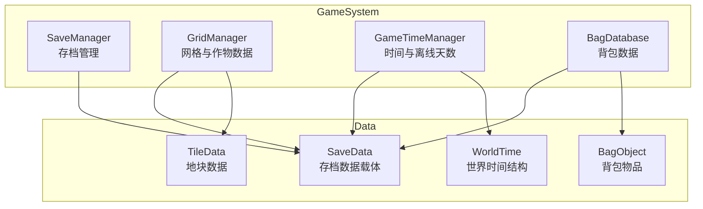
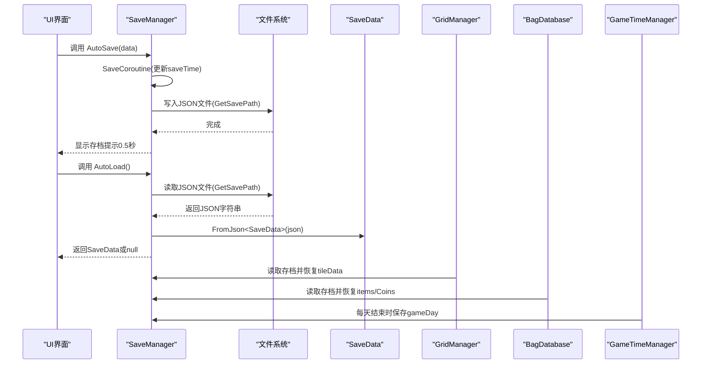
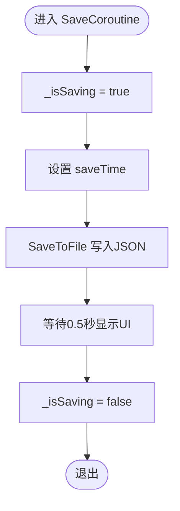
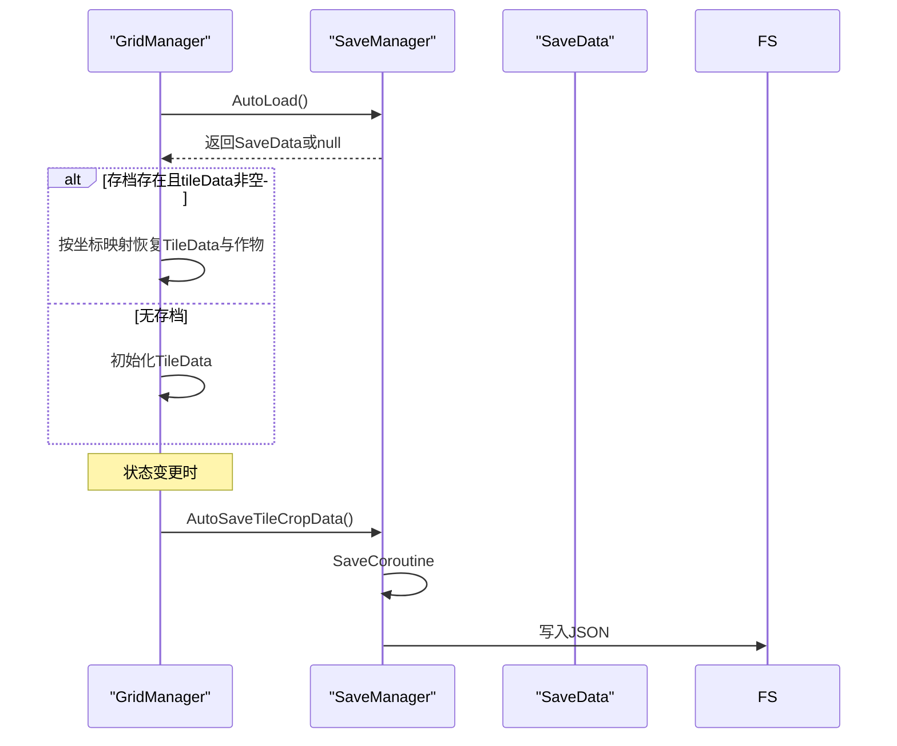
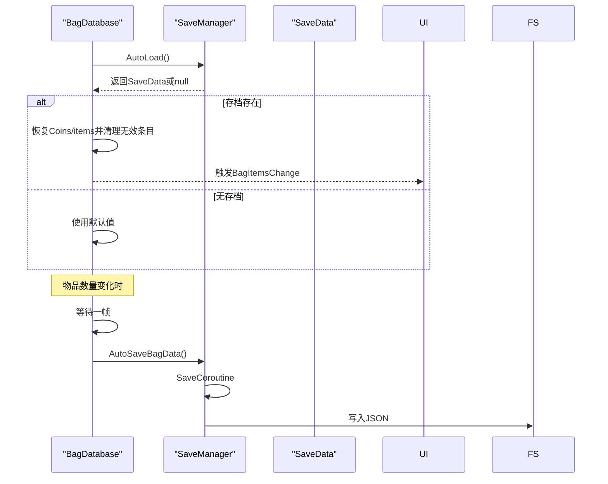
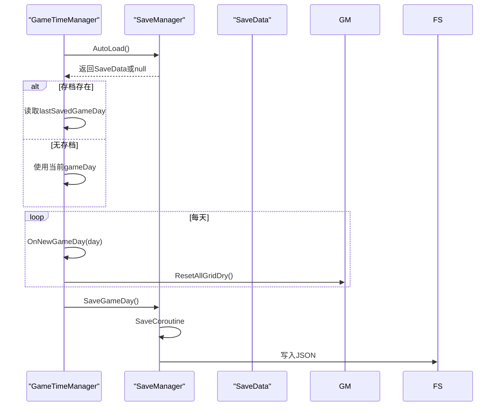
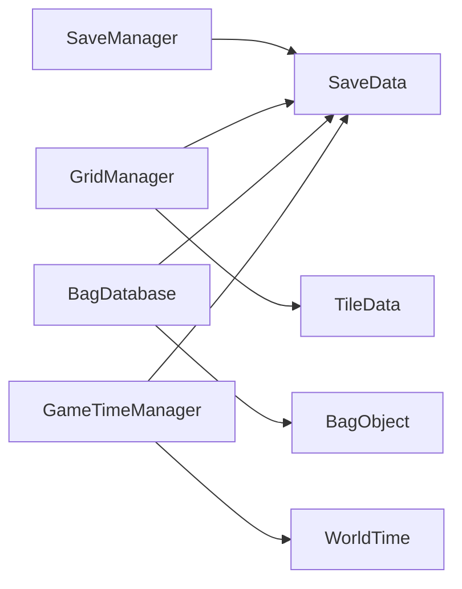

# 数据持久化机制

<cite>
**本文引用的文件**
- [SaveManager.cs](file://GameSystem/SaveManager.cs)
- [SaveData.cs](file://Data/SaveData.cs)
- [Tile.cs](file://Data/Tile.cs)
- [BagObjectData.cs](file://Data/BagObjectData.cs)
- [GridManager.cs](file://GameSystem/GridManager.cs)
- [GameTimeManager.cs](file://GameSystem/GameTimeManager.cs)
- [WorldTime.cs](file://Data/WorldTime.cs)
- [BagDatabase.cs](file://GameSystem/BagDatabase.cs)
</cite>

## 目录
1. [简介](#简介)
2. [项目结构](#项目结构)
3. [核心组件](#核心组件)
4. [架构总览](#架构总览)
5. [详细组件分析](#详细组件分析)
6. [依赖关系分析](#依赖关系分析)
7. [性能考量](#性能考量)
8. [故障排查指南](#故障排查指南)
9. [结论](#结论)

## 简介
本文件全面解析基于 Unity 的 JsonUtility 数据持久化方案，重点说明 SaveManager 中 AutoSave 与 AutoLoad 如何通过 JSON 序列化/反序列化实现存档读写，分析 GetSavePath 如何确定持久化路径，结合 SaveData 类结构解释被保存的数据项（如 gameDay、tileData、bagItems），并讨论使用 JsonUtility 的优缺点与性能优化建议（如异步 IO、数据压缩），同时指出当前同步写入可能导致帧率波动的问题。

## 项目结构
围绕数据持久化的相关模块主要分布在以下目录：
- GameSystem：SaveManager、GridManager、GameTimeManager、BagDatabase
- Data：SaveData、Tile、BagObjectData、WorldTime

图表来源
- [SaveManager.cs](file://GameSystem/SaveManager.cs#L1-L73)
- [SaveData.cs](file://Data/SaveData.cs#L1-L30)
- [Tile.cs](file://Data/Tile.cs#L1-L52)
- [BagObjectData.cs](file://Data/BagObjectData.cs#L131-L151)
- [GridManager.cs](file://GameSystem/GridManager.cs#L1-L183)
- [GameTimeManager.cs](file://GameSystem/GameTimeManager.cs#L1-L255)
- [WorldTime.cs](file://Data/WorldTime.cs#L1-L43)

章节来源
- [SaveManager.cs](file://GameSystem/SaveManager.cs#L1-L73)
- [SaveData.cs](file://Data/SaveData.cs#L1-L30)

## 核心组件
- SaveManager：负责存档生命周期控制、路径拼接、序列化/反序列化、UI提示与并发保护。
- SaveData：承载本次存档的所有数据，包括时间戳、网格作物数据、背包物品与离线天数。
- GridManager：负责生成网格、读取存档并恢复作物显示，以及在状态变更时触发自动存档。
- GameTimeManager：维护世界时间、计算离线天数并在新一天开始时触发重置与存档。
- BagDatabase：维护玩家金币与物品列表，物品数量变化时自动触发存档。
- TileData：单个地块的状态与作物信息，参与序列化。
- BagObject：背包物品包装，包含物品 id 与数量，参与序列化。

章节来源
- [SaveManager.cs](file://GameSystem/SaveManager.cs#L1-L73)
- [SaveData.cs](file://Data/SaveData.cs#L1-L30)
- [GridManager.cs](file://GameSystem/GridManager.cs#L130-L183)
- [GameTimeManager.cs](file://GameSystem/GameTimeManager.cs#L148-L158)
- [BagDatabase.cs](file://GameSystem/BagDatabase.cs#L67-L112)
- [Tile.cs](file://Data/Tile.cs#L1-L52)
- [BagObjectData.cs](file://Data/BagObjectData.cs#L131-L151)

## 架构总览
下面的时序图展示了“自动存档”与“自动读档”的完整流程，以及各组件之间的交互。

图表来源
- [SaveManager.cs](file://GameSystem/SaveManager.cs#L24-L69)
- [GridManager.cs](file://GameSystem/GridManager.cs#L130-L183)
- [BagDatabase.cs](file://GameSystem/BagDatabase.cs#L67-L112)
- [GameTimeManager.cs](file://GameSystem/GameTimeManager.cs#L148-L158)

## 详细组件分析

### SaveManager：自动存档与自动读档
- 路径确定：GetSavePath 使用 Application.persistentDataPath 拼接 slot 名称与扩展名，保证跨平台兼容性。
- 自动存档：AutoSave 通过协程 SaveCoroutine 控制 UI 提示与并发保护；在写入前设置 saveTime，随后调用 SaveToFile。
- 自动读档：AutoLoad 直接委托 LoadFromFile 读取指定 slot 的 JSON 并反序列化为 SaveData；若文件不存在则返回 null。
- 序列化/反序列化：SaveToFile 使用 JsonUtility.ToJson(data, prettyPrint=true)；LoadFromFile 使用 JsonUtility.FromJson<SaveData>(json)。

图表来源
- [SaveManager.cs](file://GameSystem/SaveManager.cs#L24-L69)

章节来源
- [SaveManager.cs](file://GameSystem/SaveManager.cs#L24-L69)

### SaveData：存档数据载体
- 字段概览：
  - saveTime：字符串，记录最近一次存档时间。
  - tileData：List<TileData>，记录网格中每个地块的状态与作物信息。
  - Coins：整数，玩家金币数量。
  - items：List<BagObject>，背包物品集合。
  - gameDay：整数，离线时累计的游戏天数。
- 作用：作为 JsonUtility 序列化/反序列化的统一载体，贯穿读写流程。

章节来源
- [SaveData.cs](file://Data/SaveData.cs#L1-L30)

### GridManager：网格与作物数据的读取与保存
- 生成网格时优先读取存档：若存在 tileData 且非空，则按坐标映射恢复 TileData 并重建作物显示；否则初始化新 TileData。
- 状态变更时自动存档：通过 DataChange 事件触发 GridManager.AutoSaveTileCropData，将当前 _gridData 写入 SaveData 并调用 SaveManager.AutoSave。
- 读档恢复：在 GenerateGrid 中根据 SaveData.tileData 恢复 TileData 与作物模型。

图表来源
- [GridManager.cs](file://GameSystem/GridManager.cs#L130-L183)
- [SaveManager.cs](file://GameSystem/SaveManager.cs#L24-L69)

章节来源
- [GridManager.cs](file://GameSystem/GridManager.cs#L130-L183)

### BagDatabase：背包数据的读取与保存
- 自动读档：启动时调用 AutoLoadBagData，读取 SaveData 并恢复 Coins 与 items，清理数量为 0 的条目，触发 UI 刷新事件。
- 自动存档：物品数量变化时通过 AutoSaveBagData，先等一帧确保逻辑稳定，再更新 SaveData 的 Coins 与 items 并调用 SaveManager.AutoSave。

图表来源
- [BagDatabase.cs](file://GameSystem/BagDatabase.cs#L67-L112)
- [SaveManager.cs](file://GameSystem/SaveManager.cs#L24-L69)

章节来源
- [BagDatabase.cs](file://GameSystem/BagDatabase.cs#L67-L112)

### GameTimeManager：离线天数与每日存档
- 维护 WorldTime 结构，计算 gameDay 并在新的一天开始时触发 ResetAllGridDry。
- 每次 gameDay 变化时调用 SaveGameDay，读取 SaveData 并更新 gameDay 后写回。

图表来源
- [GameTimeManager.cs](file://GameSystem/GameTimeManager.cs#L148-L158)
- [SaveManager.cs](file://GameSystem/SaveManager.cs#L24-L69)

章节来源
- [GameTimeManager.cs](file://GameSystem/GameTimeManager.cs#L148-L158)

### TileData：序列化支持的数据结构
- 字段覆盖：地块坐标、显示对象引用、状态（是否浇水、模式）、作物信息（id、播种时间、阶段开始时间、连续未浇水天数、是否枯死、是否可收获、当前阶段索引、是否为空）。
- 注意：TileData 包含 GameObject 引用字段 worldObject，JsonUtility 默认不会序列化引用类型，这会导致该字段在读档后丢失。实际运行中通过 GridManager 在读档后重新赋值 worldObject，以维持显示逻辑正常。

章节来源
- [Tile.cs](file://Data/Tile.cs#L1-L52)

### BagObject：序列化支持的数据结构
- 字段覆盖：id（物品标识）、quantity（数量）。
- 注意：数量字段使用私有字段并通过公开方法 SetQuantity/SetQuantity 触发自动存档，确保每次数量变化都会持久化。

章节来源
- [BagObjectData.cs](file://Data/BagObjectData.cs#L131-L151)

## 依赖关系分析
- SaveManager 依赖 Application.persistentDataPath 与 File API，负责 JSON 文件的读写。
- SaveData 作为统一数据载体，被 GridManager、BagDatabase、GameTimeManager 三处读写。
- GridManager 依赖 TileData 与 Tile 显示逻辑，读档时重建作物模型。
- BagDatabase 依赖 BagObject 与 UI 事件，物品数量变化触发存档。
- GameTimeManager 依赖 WorldTime 计算 gameDay，并在每天切换时触发存档。

图表来源
- [SaveManager.cs](file://GameSystem/SaveManager.cs#L24-L69)
- [SaveData.cs](file://Data/SaveData.cs#L1-L30)
- [GridManager.cs](file://GameSystem/GridManager.cs#L130-L183)
- [BagDatabase.cs](file://GameSystem/BagDatabase.cs#L67-L112)
- [GameTimeManager.cs](file://GameSystem/GameTimeManager.cs#L148-L158)
- [Tile.cs](file://Data/Tile.cs#L1-L52)
- [BagObjectData.cs](file://Data/BagObjectData.cs#L131-L151)
- [WorldTime.cs](file://Data/WorldTime.cs#L1-L43)

章节来源
- [SaveManager.cs](file://GameSystem/SaveManager.cs#L24-L69)
- [SaveData.cs](file://Data/SaveData.cs#L1-L30)
- [GridManager.cs](file://GameSystem/GridManager.cs#L130-L183)
- [BagDatabase.cs](file://GameSystem/BagDatabase.cs#L67-L112)
- [GameTimeManager.cs](file://GameSystem/GameTimeManager.cs#L148-L158)
- [Tile.cs](file://Data/Tile.cs#L1-L52)
- [BagObjectData.cs](file://Data/BagObjectData.cs#L131-L151)
- [WorldTime.cs](file://Data/WorldTime.cs#L1-L43)

## 性能考量
- 同步写入风险：当前 SaveManager 的 SaveToFile 使用 File.WriteAllText 是同步阻塞操作，可能在主线程引发卡顿，尤其在频繁存档或大量数据时。
- 异步 IO 建议：将写入改为异步（例如使用 async/await 与异步文件 API），或将写入放入后台线程队列，避免阻塞帧循环。
- 数据压缩：对 JSON 文本进行压缩（如 Gzip）可显著降低文件体积，减少磁盘 IO 时间与存储占用。
- 分片存档：将 tileData 拆分为多个小文件或分批写入，避免一次性序列化超大列表。
- 频率控制：合并多次存档请求，使用节流/去抖策略，避免短时间内多次写入。
- UI 提示：SaveCoroutine 中的 UI 显示仅用于反馈，不影响数据一致性，但仍建议在异步写入完成后统一收尾。

章节来源
- [SaveManager.cs](file://GameSystem/SaveManager.cs#L56-L69)

## 故障排查指南
- 读档后 tileData 为空：检查 GridManager.GenerateGrid 的读档分支，确认 SaveManager.AutoLoad 返回的 SaveData 是否包含 tileData；同时注意 TileData 中 worldObject 引用不会被序列化，需在读档后由 GridManager 重新赋值。
- 背包物品数量异常：确认 BagDatabase.AutoSaveBagData 是否在数量变化后正确调用 SaveManager.AutoSave；检查 BagObject 的数量字段是否通过 SetQuantity 触发存档。
- 离线天数未生效：确认 GameTimeManager.ProcessOfflineDays 是否在 GridManager 准备就绪后执行；检查 SaveGameDay 是否成功写入 gameDay。
- UI 报错“SerializedProperty items.Array.data[0] has disappeared”：该问题与读档时机有关，调试记录显示在读取 Tile 存档之前执行了 ResetAllGridDry 导致 UI 层引用丢失，建议在读档后再执行重置逻辑。

章节来源
- [GridManager.cs](file://GameSystem/GridManager.cs#L130-L183)
- [BagDatabase.cs](file://GameSystem/BagDatabase.cs#L67-L112)
- [GameTimeManager.cs](file://GameSystem/GameTimeManager.cs#L148-L158)
- [SaveManager.cs](file://GameSystem/SaveManager.cs#L24-L69)

## 结论
本项目采用 JsonUtility 实现轻量级数据持久化，通过 SaveManager 统一管理存档生命周期，配合 SaveData 承载 tileData、bagItems、gameDay 等关键数据。GridManager、BagDatabase、GameTimeManager 分别在不同场景触发自动存档，形成完整的存档闭环。当前实现简洁可靠，但在高频写入与大数据量场景下存在同步写入带来的帧率波动风险，建议引入异步 IO 与数据压缩等优化手段，以进一步提升稳定性与性能。