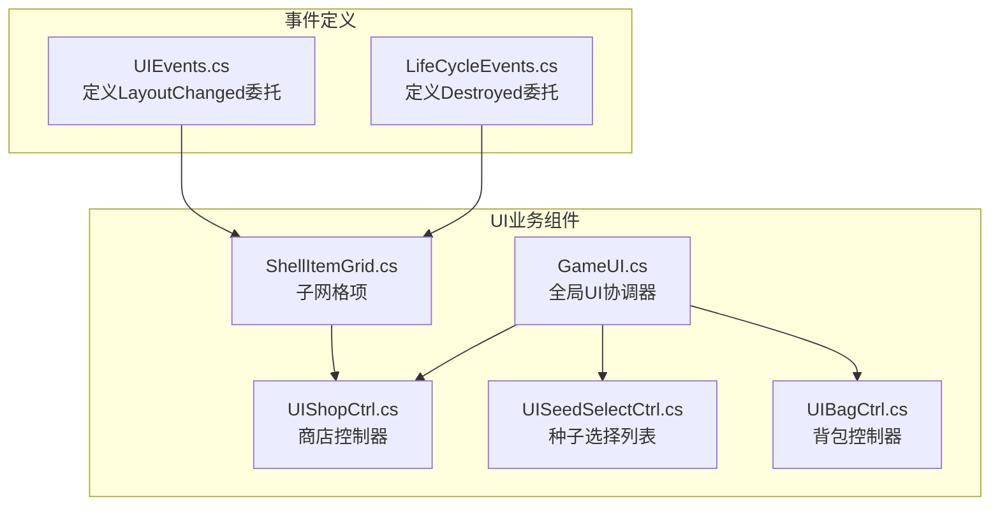
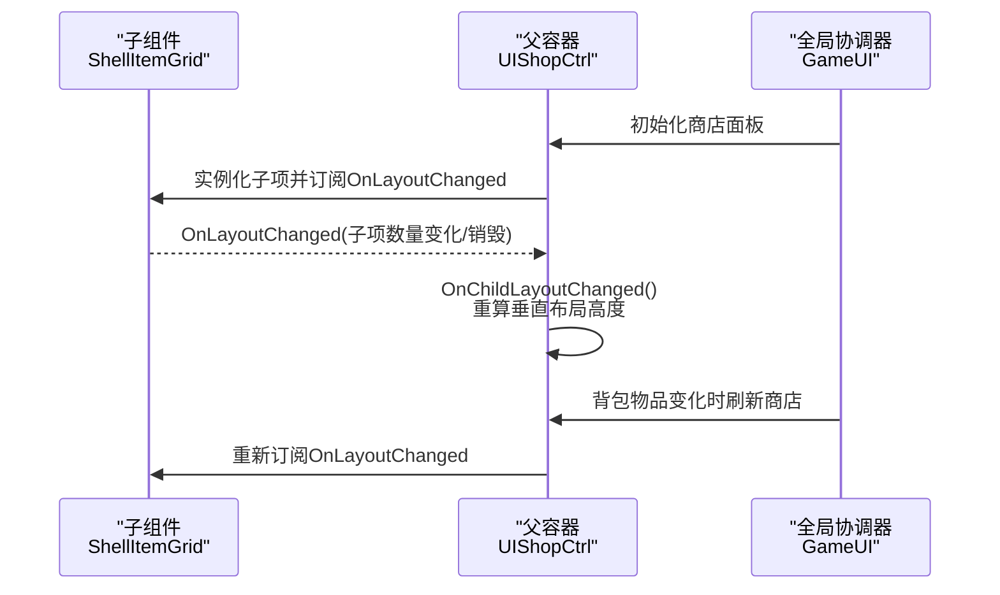
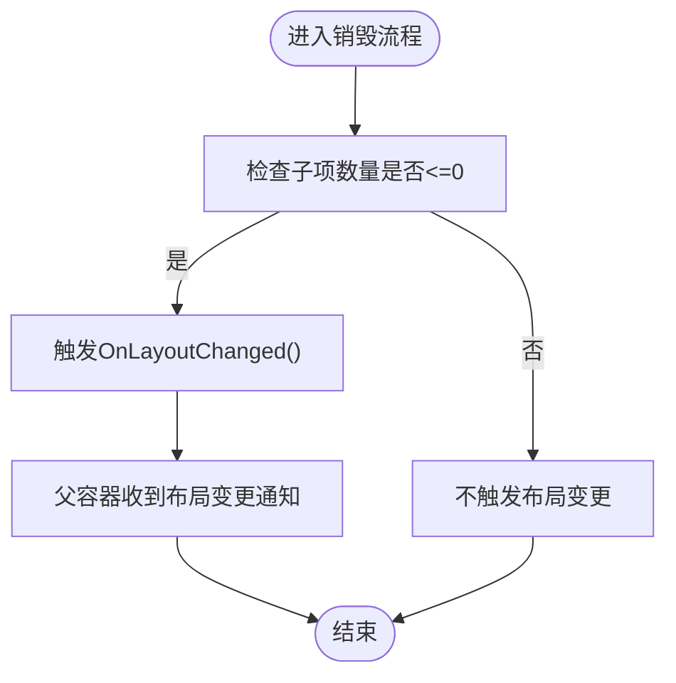
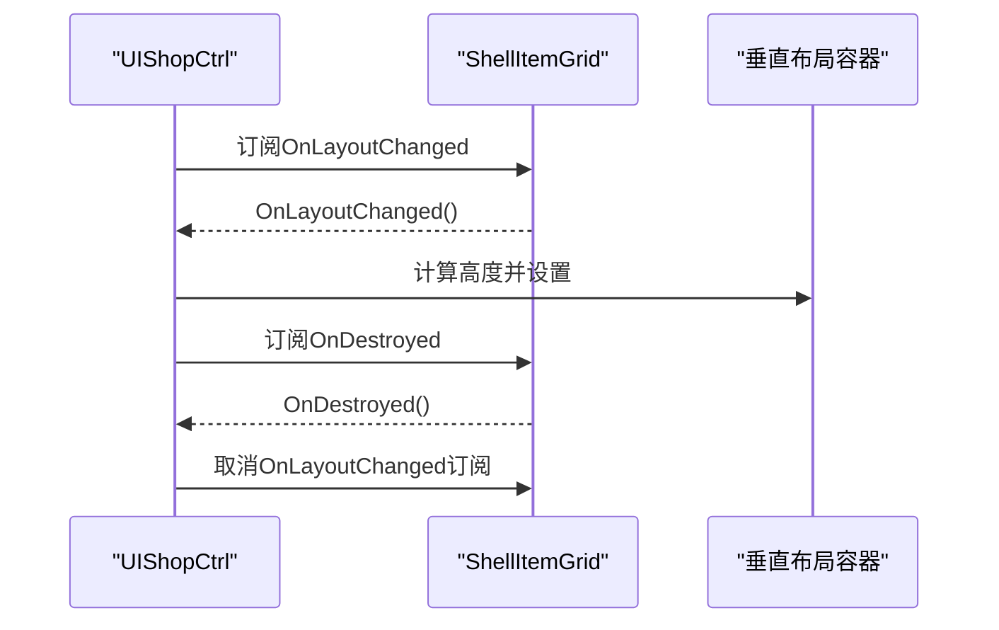
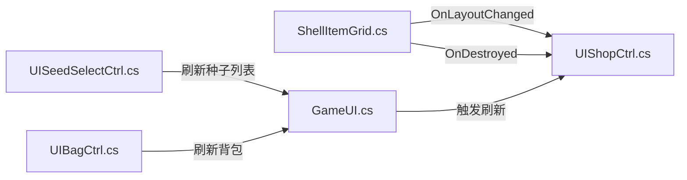

# UI事件

<cite>
**本文引用的文件**
- [UIEvents.cs](file://Common/Events/UIEvents.cs)
- [LifeCycleEvents.cs](file://Common/Events/LifeCycleEvents.cs)
- [ShellItemGrid.cs](file://Data/ShellItemGrid.cs)
- [UIShopCtrl.cs](file://UI/UIShopCtrl.cs)
- [GameUI.cs](file://UI/GameUI.cs)
- [UISeedSelectCtrl.cs](file://UI/UISeedSelectCtrl.cs)
- [UIBagCtrl.cs](file://UI/UIBagCtrl.cs)
</cite>

## 目录
1. [引言](#引言)
2. [项目结构](#项目结构)
3. [核心组件](#核心组件)
4. [架构总览](#架构总览)
5. [详细组件分析](#详细组件分析)
6. [依赖关系分析](#依赖关系分析)
7. [性能考量](#性能考量)
8. [故障排查指南](#故障排查指南)
9. [结论](#结论)
10. [附录](#附录)

## 引言
本文件聚焦于UIEvents类中LayoutChanged事件的设计目的、应用场景与实现方式，解释其在UI子组件状态变化时如何通知父容器进行布局更新，并结合实际UI交互流程展示事件触发时机与处理逻辑。同时给出事件订阅与触发的标准代码路径示例，讨论该事件在维护UI一致性方面的价值，并提出未来可扩展更多UI交互事件类型的建议。

## 项目结构
UI事件体系位于Common/Events目录下，采用“事件定义+具体业务组件订阅”的分层设计：
- 事件定义：UIEvents.cs定义了LayoutChanged委托类型，作为UI布局变更的通知信号。
- 生命周期事件：LifeCycleEvents.cs定义了销毁相关的委托，用于通知父容器取消订阅，避免内存泄漏。
- 业务组件：
  - ShellItemGrid.cs：子UI网格项，负责售卖、数量变化等交互，通过OnLayoutChanged通知父容器调整布局。
  - UIShopCtrl.cs：商店界面控制器，订阅子项布局变化事件，动态调整垂直布局组的高度。
  - GameUI.cs：全局UI协调器，统一管理多个UI模块的初始化与刷新。
  - UISeedSelectCtrl.cs、UIBagCtrl.cs：其他UI模块，配合事件体系完成一致性的布局与显示更新。

图表来源
- [UIEvents.cs](file://Common/Events/UIEvents.cs#L1-L11)
- [LifeCycleEvents.cs](file://Common/Events/LifeCycleEvents.cs#L1-L13)
- [ShellItemGrid.cs](file://Data/ShellItemGrid.cs#L37-L99)
- [UIShopCtrl.cs](file://UI/UIShopCtrl.cs#L1-L214)
- [GameUI.cs](file://UI/GameUI.cs#L1-L110)
- [UISeedSelectCtrl.cs](file://UI/UISeedSelectCtrl.cs#L1-L55)
- [UIBagCtrl.cs](file://UI/UIBagCtrl.cs#L1-L105)

章节来源
- [UIEvents.cs](file://Common/Events/UIEvents.cs#L1-L11)
- [LifeCycleEvents.cs](file://Common/Events/LifeCycleEvents.cs#L1-L13)
- [ShellItemGrid.cs](file://Data/ShellItemGrid.cs#L37-L99)
- [UIShopCtrl.cs](file://UI/UIShopCtrl.cs#L1-L214)
- [GameUI.cs](file://UI/GameUI.cs#L1-L110)
- [UISeedSelectCtrl.cs](file://UI/UISeedSelectCtrl.cs#L1-L55)
- [UIBagCtrl.cs](file://UI/UIBagCtrl.cs#L1-L105)

## 核心组件
- UIEvents.LayoutChanged：无参委托，用于通知父容器子组件布局发生改变，需要重新计算或调整父容器的尺寸/间距等。
- ShellItemGrid：子网格项，负责售卖、数量变化等交互；当自身被销毁或数量归零时，通过OnLayoutChanged通知父容器。
- UIShopCtrl：商店控制器，订阅每个子网格项的OnLayoutChanged事件，统一在初始化或子项变化后调用OnChildLayoutChanged以重算垂直布局组高度。
- GameUI：全局协调器，统一刷新种子选择、背包、商店等UI，确保多处UI的一致性。

章节来源
- [UIEvents.cs](file://Common/Events/UIEvents.cs#L1-L11)
- [ShellItemGrid.cs](file://Data/ShellItemGrid.cs#L37-L99)
- [UIShopCtrl.cs](file://UI/UIShopCtrl.cs#L73-L172)
- [GameUI.cs](file://UI/GameUI.cs#L34-L75)

## 架构总览
LayoutChanged事件遵循“子组件触发—父容器订阅—统一处理”的单向通知模式，避免直接耦合，提升可维护性与可扩展性。

图表来源
- [ShellItemGrid.cs](file://Data/ShellItemGrid.cs#L37-L99)
- [UIShopCtrl.cs](file://UI/UIShopCtrl.cs#L73-L172)
- [GameUI.cs](file://UI/GameUI.cs#L61-L75)

## 详细组件分析

### UIEvents.LayoutChanged事件设计与职责
- 设计目的：为UI子组件提供轻量级布局变更通知机制，使父容器能够感知子项数量、可见性或尺寸的变化，从而统一调整布局。
- 委托类型：UIEvents.LayoutChanged为无参委托，便于跨组件传递“布局需更新”的信号。
- 与其他事件的关系：与生命周期事件LifeCycleEvents.Destroyed配合使用，确保子组件销毁时父容器能及时取消订阅，避免内存泄漏。

章节来源
- [UIEvents.cs](file://Common/Events/UIEvents.cs#L1-L11)
- [LifeCycleEvents.cs](file://Common/Events/LifeCycleEvents.cs#L1-L13)

### 子组件触发：ShellItemGrid
- 触发时机：
  - 子项被销毁（如数量归零）时，调用OnDestroy并触发OnLayoutChanged。
  - 子项数量变化导致其可视状态改变时，也可触发OnLayoutChanged以通知父容器重新计算布局。
- 触发逻辑：在销毁阶段显式调用OnLayoutChanged，确保父容器能感知到子项数量减少或移除。
- 事件声明：在组件中公开UIEvents.LayoutChanged类型的OnLayoutChanged事件，供父容器订阅。

图表来源
- [ShellItemGrid.cs](file://Data/ShellItemGrid.cs#L92-L99)

章节来源
- [ShellItemGrid.cs](file://Data/ShellItemGrid.cs#L37-L99)

### 父容器订阅与处理：UIShopCtrl
- 订阅策略：
  - 在实例化子网格项后，立即订阅其OnLayoutChanged事件，并记录订阅信息以便后续取消。
  - 在子项销毁时，通过OnDestroyed事件回调取消对应订阅，防止内存泄漏。
- 处理逻辑：
  - OnChildLayoutChanged方法根据子项数量与预制体高度，计算垂直布局组的总高度并设置给容器。
  - 初始化商店面板时，先清理旧订阅与子项，再重新实例化并订阅，最后统一调用OnChildLayoutChanged以确保初始高度正确。

图表来源
- [UIShopCtrl.cs](file://UI/UIShopCtrl.cs#L73-L172)

章节来源
- [UIShopCtrl.cs](file://UI/UIShopCtrl.cs#L73-L172)

### 全局协调：GameUI
- 统一刷新：当背包物品变化时，GameUI统一刷新种子选择列表、背包UI以及商店面板（若商店处于打开状态），保证各UI模块间的状态一致性。
- 与布局事件的协作：通过触发商店面板的初始化流程，间接促使子项重新订阅OnLayoutChanged并触发OnChildLayoutChanged，从而保持布局正确。

章节来源
- [GameUI.cs](file://UI/GameUI.cs#L34-L75)

### UI一致性保障
- 单一职责：LayoutChanged仅关注布局变更，避免将数据变化与布局变化混杂在一起，降低耦合度。
- 可靠性：通过生命周期事件OnDestroyed与订阅字典，确保在子项销毁时及时取消订阅，避免重复触发或悬挂引用。
- 可扩展性：事件委托类型简单明确，易于扩展更多UI交互事件（如“子项可见性变化”“子项尺寸变化”等），以覆盖更复杂的布局场景。

章节来源
- [UIShopCtrl.cs](file://UI/UIShopCtrl.cs#L146-L168)
- [LifeCycleEvents.cs](file://Common/Events/LifeCycleEvents.cs#L1-L13)

## 依赖关系分析
- 低耦合高内聚：子组件仅暴露事件，父容器通过事件感知变化并集中处理布局；全局协调器负责触发刷新，避免跨模块直接调用。
- 订阅管理：使用字典记录每项的订阅句柄，便于在销毁时成对取消，降低内存泄漏风险。
- 事件链路清晰：从子组件触发到父容器处理再到全局协调器联动，形成稳定的事件传播路径。

图表来源
- [ShellItemGrid.cs](file://Data/ShellItemGrid.cs#L37-L99)
- [UIShopCtrl.cs](file://UI/UIShopCtrl.cs#L73-L172)
- [GameUI.cs](file://UI/GameUI.cs#L61-L75)
- [UISeedSelectCtrl.cs](file://UI/UISeedSelectCtrl.cs#L1-L55)
- [UIBagCtrl.cs](file://UI/UIBagCtrl.cs#L1-L105)

章节来源
- [ShellItemGrid.cs](file://Data/ShellItemGrid.cs#L37-L99)
- [UIShopCtrl.cs](file://UI/UIShopCtrl.cs#L73-L172)
- [GameUI.cs](file://UI/GameUI.cs#L61-L75)
- [UISeedSelectCtrl.cs](file://UI/UISeedSelectCtrl.cs#L1-L55)
- [UIBagCtrl.cs](file://UI/UIBagCtrl.cs#L1-L105)

## 性能考量
- 事件触发频率控制：仅在子项数量或可见性发生显著变化时触发OnLayoutChanged，避免频繁重算布局。
- 批量刷新：通过GameUI统一触发商店面板初始化，减少重复实例化与订阅的成本。
- 订阅清理：在子项销毁时及时取消订阅，避免无效回调累积导致的帧率下降。

## 故障排查指南
- 症状：布局未随子项数量变化而更新
  - 排查要点：确认子项在销毁或数量变化时是否触发OnLayoutChanged；父容器是否订阅并实现OnChildLayoutChanged。
  - 参考路径：[ShellItemGrid.cs](file://Data/ShellItemGrid.cs#L92-L99)、[UIShopCtrl.cs](file://UI/UIShopCtrl.cs#L182-L188)
- 症状：内存泄漏或重复触发
  - 排查要点：确认在子项销毁时通过OnDestroyed取消订阅；检查订阅字典是否正确记录与移除。
  - 参考路径：[UIShopCtrl.cs](file://UI/UIShopCtrl.cs#L146-L168)
- 症状：商店面板初始高度不正确
  - 排查要点：确认初始化完成后调用OnChildLayoutChanged；检查垂直布局组的spacing与padding设置。
  - 参考路径：[UIShopCtrl.cs](file://UI/UIShopCtrl.cs#L93-L95)

章节来源
- [ShellItemGrid.cs](file://Data/ShellItemGrid.cs#L92-L99)
- [UIShopCtrl.cs](file://UI/UIShopCtrl.cs#L146-L188)

## 结论
LayoutChanged事件通过“子组件触发—父容器订阅—集中处理”的模式，有效解耦了UI子组件与父容器的布局逻辑，提升了系统的可维护性与一致性。结合生命周期事件与统一的全局协调器，能够在动态UI更新中稳定地维持布局正确性。未来可在此基础上扩展更多UI交互事件类型，进一步增强系统对复杂交互场景的响应能力。

## 附录

### 事件订阅与触发的标准代码路径示例
- 子组件触发（销毁时）
  - 触发位置参考：[ShellItemGrid.cs](file://Data/ShellItemGrid.cs#L92-L99)
- 父容器订阅与处理
  - 订阅与初始化参考：[UIShopCtrl.cs](file://UI/UIShopCtrl.cs#L73-L95)
  - 布局重算参考：[UIShopCtrl.cs](file://UI/UIShopCtrl.cs#L182-L188)
- 全局刷新联动
  - 背包变化触发商店刷新参考：[GameUI.cs](file://UI/GameUI.cs#L61-L75)

### 未来可扩展的UI交互事件类型建议
- 子项尺寸变化：用于响应子项内部UI尺寸变化（如文字长度变化）导致的布局重排。
- 子项可见性变化：用于响应子项显隐状态变化，避免不必要的布局计算。
- 子项排序变化：用于响应子项顺序变化，触发父容器重新排列布局。
- 子项焦点变化：用于响应子项获得/失去焦点，触发父容器滚动至可视区域。

这些扩展可通过新增委托类型并在相应组件中触发，配合现有订阅与清理机制，即可平滑集成到现有事件体系中。