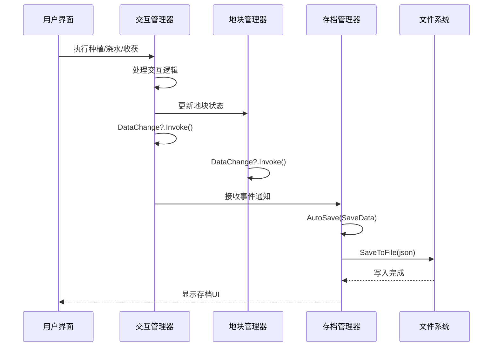
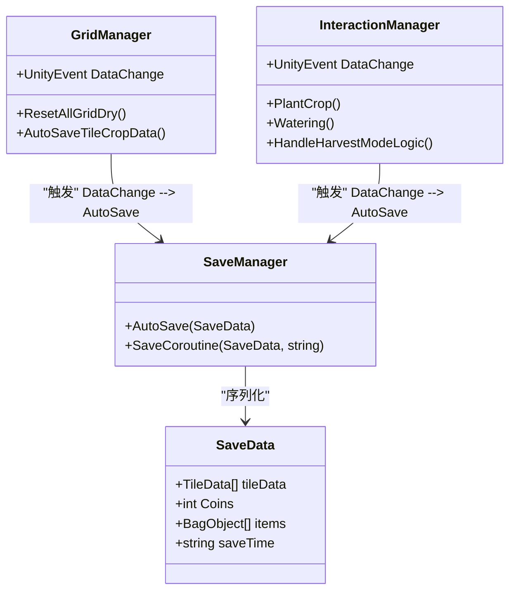

# 数据持久化事件

<cite>
**本文档中引用的文件**  
- [GridManager.cs](file://GameSystem/GridManager.cs)
- [SaveManager.cs](file://GameSystem/SaveManager.cs)
- [InteractionManager.cs](file://GameSystem/InteractionManager.cs)
- [SaveData.cs](file://Data/SaveData.cs)
- [Tile.cs](file://Data/Tile.cs)
</cite>

## 目录
1. [简介](#简介)
2. [核心组件](#核心组件)
3. [事件驱动的存档机制](#事件驱动的存档机制)
4. [DataChange事件的触发流程](#datachange事件的触发流程)
5. [系统解耦与可维护性分析](#系统解耦与可维护性分析)
6. [性能优化建议](#性能优化建议)
7. [结论](#结论)

## 简介
本项目为一个俯仰视角的种田类游戏Demo，采用UnityEvent实现事件驱动架构，通过`DataChange`事件在地块状态变化时触发自动存档。该机制由`GridManager`和`InteractionManager`共同维护，当玩家进行浇水、种植、收获等操作或系统自动更新地块状态时，均会触发此事件，进而驱动`SaveManager`执行数据持久化操作。本文将深入分析该事件的实现原理、调用流程及其对系统架构的影响。

## 核心组件

`DataChange` UnityEvent是整个自动存档机制的核心，它被定义在`GridManager`和`InteractionManager`两个类中，作为连接游戏逻辑与数据持久化的桥梁。该事件在多个关键操作中被触发，确保游戏状态的实时保存。

**Section sources**
- [GridManager.cs](file://GameSystem/GridManager.cs#L24)
- [InteractionManager.cs](file://GameSystem/InteractionManager.cs#L39)

## 事件驱动的存档机制



**Diagram sources**
- [GridManager.cs](file://GameSystem/GridManager.cs#L80)
- [InteractionManager.cs](file://GameSystem/InteractionManager.cs#L100)
- [SaveManager.cs](file://GameSystem/SaveManager.cs#L29)

## DataChange事件的触发流程

`DataChange`事件在以下场景中被触发：

1. **每日地块干燥处理**：`GridManager.ResetAllGridDry()`方法在每日开始时被调用，更新所有地块的干燥状态，并在处理完成后触发`DataChange?.Invoke()`。
2. **玩家交互操作**：`InteractionManager`在处理种植、浇水、收获、铲除等操作后，均会调用`DataChange?.Invoke()`以确保状态同步。
3. **作物数据自动保存**：`GridManager.AutoSaveTileCropData()`方法显式调用存档逻辑，用于在特定条件下强制保存。

该事件的调用采用了C#的空条件运算符（`?.`），确保在事件未被订阅时不会抛出异常，提高了代码的健壮性。

```mermaid
flowchart TD
Start([事件触发起点]) --> Condition1{"操作类型"}
Condition1 --> |每日干燥处理| ResetDry[GridManager.ResetAllGridDry]
Condition1 --> |玩家种植| Plant[InteractionManager.PlantCrop]
Condition1 --> |玩家浇水| Water[InteractionManager.Watering]
Condition1 --> |玩家收获| Harvest[InteractionManager.HandleHarvestModeLogic]
Condition1 --> |玩家铲除| UpRoot[InteractionManager.HandleUpRootModeLogic]
ResetDry --> Invoke1[DataChange?.Invoke()]
Plant --> Invoke2[DataChange?.Invoke()]
Water --> Invoke3[DataChange?.Invoke()]
Harvest --> Invoke4[DataChange?.Invoke()]
UpRoot --> Invoke5[DataChange?.Invoke()]
Invoke1 --> Save[SaveManager.AutoSave]
Invoke2 --> Save
Invoke3 --> Save
Invoke4 --> Save
Invoke5 --> Save
Save --> Serialize["SaveData -> Json"]
Serialize --> WriteFile["写入文件"]
WriteFile --> End([存档完成])
```

**Diagram sources**
- [GridManager.cs](file://GameSystem/GridManager.cs#L57-L81)
- [InteractionManager.cs](file://GameSystem/InteractionManager.cs#L99-L135)
- [SaveManager.cs](file://GameSystem/SaveManager.cs#L29-L32)

**Section sources**
- [GridManager.cs](file://GameSystem/GridManager.cs#L57-L82)
- [InteractionManager.cs](file://GameSystem/InteractionManager.cs#L99-L135)

## 系统解耦与可维护性分析

通过`DataChange`事件，游戏逻辑与数据持久化实现了良好的解耦：

- **职责分离**：`GridManager`和`InteractionManager`仅负责游戏状态的变更，无需关心存档的具体实现。
- **扩展性强**：任何需要响应状态变化的系统都可以订阅`DataChange`事件，如成就系统、统计系统等。
- **维护性高**：存档逻辑集中于`SaveManager`，修改存档格式或策略时只需改动单一模块。

然而，当前设计存在一个潜在问题：`ResetAllGridDry`方法在`GameTimeManager`中被调用的时间点早于存档数据的加载（根据备忘录.txt中的记录），可能导致新加载的数据被错误地覆盖。这表明事件触发时机的控制需要更加精细。

**Section sources**
- [GridManager.cs](file://GameSystem/GridManager.cs#L57-L82)
- [InteractionManager.cs](file://GameSystem/InteractionManager.cs#L38-L40)
- [这是一个备忘录.txt](file://这是一个备忘录.txt#L16)

## 性能优化建议

尽管当前事件驱动机制有效，但存在性能优化空间：

1. **事件去重**：在短时间内频繁触发的事件（如连续浇水多个地块）可进行合并，避免重复存档。
2. **条件触发**：增加条件判断，仅在数据实际发生变化时才触发事件，减少不必要的I/O操作。
3. **异步队列**：将存档请求加入队列，由`SaveManager`统一在非关键帧处理，避免影响游戏流畅度。
4. **延迟存档**：对于非关键操作，可采用延迟存档策略，如操作结束后1秒内无新操作则执行存档。



**Diagram sources**
- [GridManager.cs](file://GameSystem/GridManager.cs#L24)
- [InteractionManager.cs](file://GameSystem/InteractionManager.cs#L39)
- [SaveManager.cs](file://GameSystem/SaveManager.cs#L29)
- [SaveData.cs](file://Data/SaveData.cs#L12)

## 结论

`DataChange` UnityEvent在本项目中成功实现了游戏状态变化与数据持久化的解耦，通过事件驱动的方式确保了存档的实时性和可靠性。该设计提高了系统的模块化程度和可维护性，但也暴露出事件触发时机和频率控制不足的问题。建议引入事件合并、条件触发和异步处理机制，以优化性能并避免数据覆盖风险，从而构建更加健壮的自动存档系统。