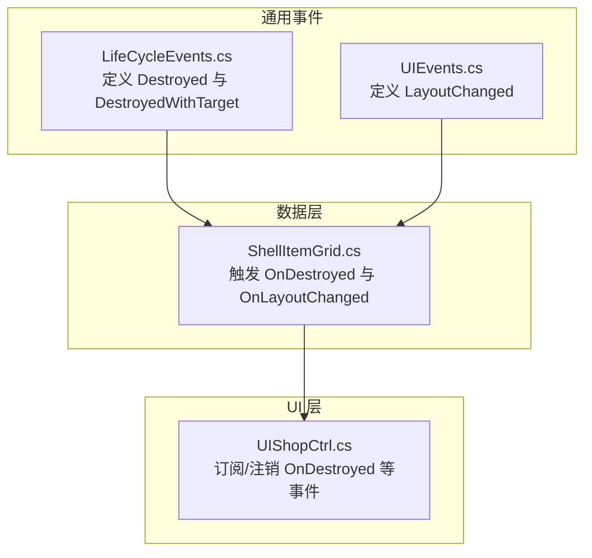
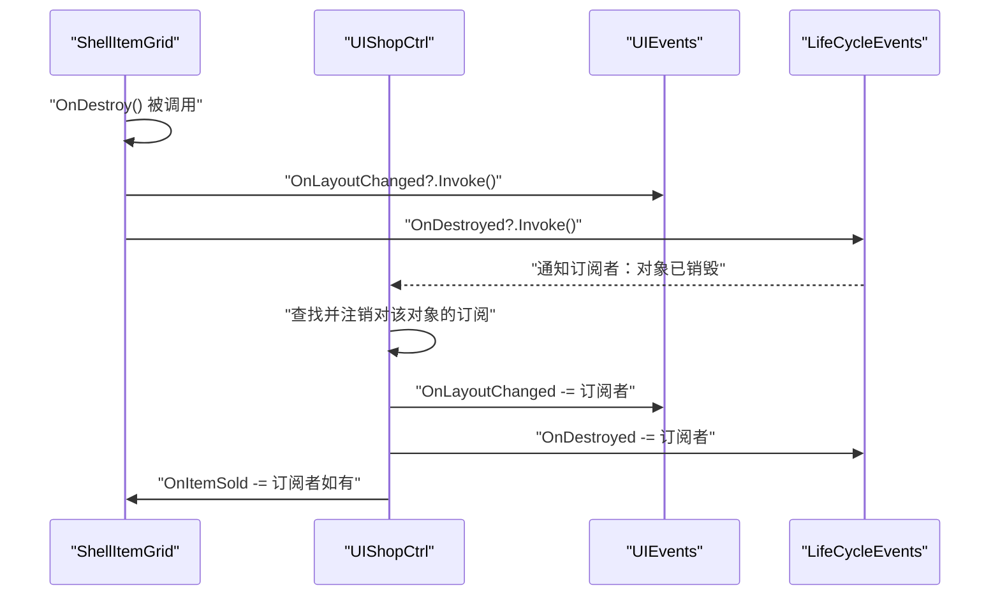
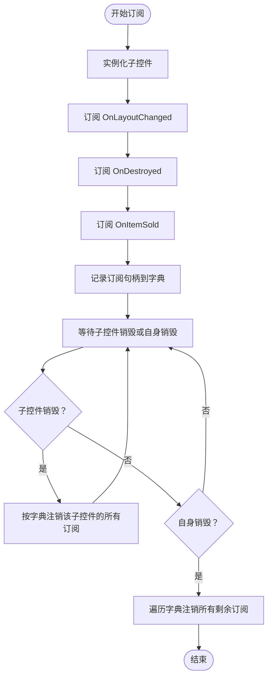
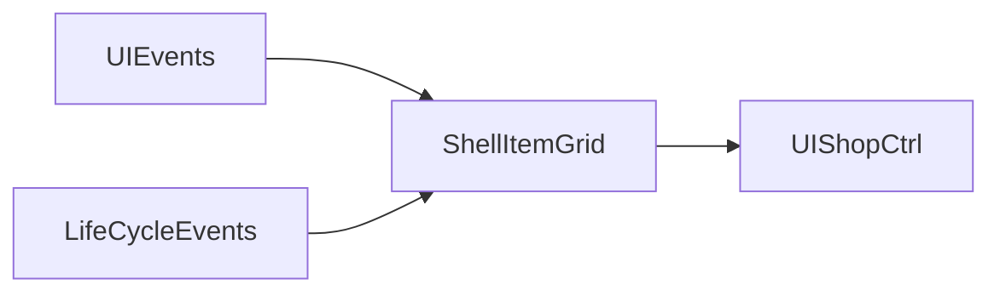

# 生命周期事件

<cite>
**本文引用的文件**
- [LifeCycleEvents.cs](file://Common/Events/LifeCycleEvents.cs)
- [UIEvents.cs](file://Common/Events/UIEvents.cs)
- [ShellItemGrid.cs](file://Data/ShellItemGrid.cs)
- [UIShopCtrl.cs](file://UI/UIShopCtrl.cs)
</cite>

## 目录
1. [引言](#引言)
2. [项目结构](#项目结构)
3. [核心组件](#核心组件)
4. [架构总览](#架构总览)
5. [详细组件分析](#详细组件分析)
6. [依赖关系分析](#依赖关系分析)
7. [性能考量](#性能考量)
8. [故障排查指南](#故障排查指南)
9. [结论](#结论)
10. [附录](#附录)

## 引言
本文件围绕生命周期事件系统展开，重点阐释 LifeCycleEvents 类中定义的两个委托：
- Destroyed：无参销毁事件委托
- DestroyedWithTarget<T>：带参销毁事件委托（泛型）

我们将从事件定义、实现机制、订阅与注销模式、资源清理与状态重置流程、以及潜在内存泄漏风险等维度进行深入分析，并结合实际代码路径给出可操作的最佳实践建议。

## 项目结构
生命周期事件系统位于通用事件模块下，作为跨模块的轻量级通知通道，服务于 UI 控件与业务层之间的解耦协作。

图表来源
- [LifeCycleEvents.cs](file://Common/Events/LifeCycleEvents.cs#L1-L13)
- [UIEvents.cs](file://Common/Events/UIEvents.cs#L1-L11)
- [ShellItemGrid.cs](file://Data/ShellItemGrid.cs#L38-L99)
- [UIShopCtrl.cs](file://UI/UIShopCtrl.cs#L46-L168)

章节来源
- [LifeCycleEvents.cs](file://Common/Events/LifeCycleEvents.cs#L1-L13)
- [UIEvents.cs](file://Common/Events/UIEvents.cs#L1-L11)
- [ShellItemGrid.cs](file://Data/ShellItemGrid.cs#L38-L99)
- [UIShopCtrl.cs](file://UI/UIShopCtrl.cs#L46-L168)

## 核心组件
- LifeCycleEvents：静态类，提供生命周期销毁事件委托，用于在对象销毁时通知订阅者执行资源清理与状态重置。
- UIEvents：静态类，提供 UI 布局变更事件委托，用于通知父容器调整布局。
- ShellItemGrid：具体 UI 控件，负责在自身销毁时广播“已销毁”与“布局变更”两类事件。
- UIShopCtrl：UI 控制器，负责实例化子控件并订阅/注销事件，确保在对象销毁后及时解除订阅，避免内存泄漏。

章节来源
- [LifeCycleEvents.cs](file://Common/Events/LifeCycleEvents.cs#L1-L13)
- [UIEvents.cs](file://Common/Events/UIEvents.cs#L1-L11)
- [ShellItemGrid.cs](file://Data/ShellItemGrid.cs#L38-L99)
- [UIShopCtrl.cs](file://UI/UIShopCtrl.cs#L46-L168)

## 架构总览
生命周期事件系统采用“发布-订阅”模式，通过 Unity 组件的 OnDestroy 生命周期钩子触发事件，订阅者在收到通知后执行必要的清理与重置逻辑。

图表来源
- [ShellItemGrid.cs](file://Data/ShellItemGrid.cs#L92-L99)
- [UIShopCtrl.cs](file://UI/UIShopCtrl.cs#L82-L91)
- [UIShopCtrl.cs](file://UI/UIShopCtrl.cs#L146-L154)
- [UIShopCtrl.cs](file://UI/UIShopCtrl.cs#L156-L168)
- [UIEvents.cs](file://Common/Events/UIEvents.cs#L1-L11)
- [LifeCycleEvents.cs](file://Common/Events/LifeCycleEvents.cs#L1-L13)

## 详细组件分析

### LifeCycleEvents：生命周期事件定义
- Destroyed：无参委托，用于通知订阅者“对象已销毁”，常用于触发资源释放、状态重置、订阅注销等清理逻辑。
- DestroyedWithTarget<T>：泛型委托，用于在销毁时携带目标对象参数，便于订阅者直接对目标对象执行针对性清理或状态同步。

实现要点
- 静态类 + 委托定义，不包含运行时状态，避免额外开销。
- 泛型版本允许订阅者在不额外维护外部映射的情况下直接获得目标对象引用，简化清理流程。

章节来源
- [LifeCycleEvents.cs](file://Common/Events/LifeCycleEvents.cs#L1-L13)

### UIEvents：UI 布局变更事件
- LayoutChanged：无参委托，用于通知父容器子元素布局变化，以便父容器动态调整尺寸或滚动区域。

章节来源
- [UIEvents.cs](file://Common/Events/UIEvents.cs#L1-L11)

### ShellItemGrid：销毁事件的触发方
职责
- 在自身销毁时，先广播“布局变更”事件，再广播“销毁”事件，确保父容器能先完成布局调整，再进行订阅注销。
- 同时提供“物品卖出”等业务事件，便于 UI 层联动更新。

关键行为
- OnDestroy 生命周期中依次调用 OnLayoutChanged 与 OnDestroyed。
- 当物品数量归零时触发销毁，从而触发上述事件链。

章节来源
- [ShellItemGrid.cs](file://Data/ShellItemGrid.cs#L92-L99)

### UIShopCtrl：订阅与注销的执行方
职责
- 实例化子控件并订阅三类事件：布局变更、销毁、物品卖出。
- 记录订阅句柄，以便在子控件销毁或自身销毁时统一注销，防止内存泄漏。

订阅与注销模式
- 订阅：在创建子控件后，为 OnLayoutChanged、OnDestroyed、OnItemSold 分别注册回调，并将回调句柄存入字典，键为子控件实例。
- 注销：当子控件销毁时，根据字典中的句柄执行反向订阅；当自身销毁时，遍历字典逐一注销剩余订阅。

图表来源
- [UIShopCtrl.cs](file://UI/UIShopCtrl.cs#L78-L91)
- [UIShopCtrl.cs](file://UI/UIShopCtrl.cs#L146-L154)
- [UIShopCtrl.cs](file://UI/UIShopCtrl.cs#L156-L168)

章节来源
- [UIShopCtrl.cs](file://UI/UIShopCtrl.cs#L46-L91)
- [UIShopCtrl.cs](file://UI/UIShopCtrl.cs#L146-L168)

### 泛型委托 DestroyedWithTarget<T> 的作用与实现机制
- 作用：在对象销毁时向订阅者传递目标对象引用，使订阅者无需额外的外部映射即可直接对目标对象执行清理或状态同步。
- 实现机制：通过泛型约束 T，订阅者在注册回调时可直接接收 T 类型的目标对象；在触发时由触发方传入目标对象引用。
- 适用场景：当多个对象共享同一清理逻辑，或需要基于目标对象执行差异化处理时尤为有用。

注意：当前仓库中未发现对 DestroyedWithTarget<T> 的直接使用示例。若需启用该能力，可在触发方改为调用带参委托，并在订阅方注册相应签名的回调。

章节来源
- [LifeCycleEvents.cs](file://Common/Events/LifeCycleEvents.cs#L1-L13)

## 依赖关系分析
- ShellItemGrid 依赖 UIEvents 与 LifeCycleEvents，分别用于布局变更与销毁通知。
- UIShopCtrl 依赖 ShellItemGrid 的事件接口，负责事件的订阅与注销管理。
- 事件系统整体呈现单向依赖：UI 控件触发事件，UI 控制器作为订阅者执行清理。

图表来源
- [UIEvents.cs](file://Common/Events/UIEvents.cs#L1-L11)
- [LifeCycleEvents.cs](file://Common/Events/LifeCycleEvents.cs#L1-L13)
- [ShellItemGrid.cs](file://Data/ShellItemGrid.cs#L38-L99)
- [UIShopCtrl.cs](file://UI/UIShopCtrl.cs#L46-L168)

章节来源
- [UIEvents.cs](file://Common/Events/UIEvents.cs#L1-L11)
- [LifeCycleEvents.cs](file://Common/Events/LifeCycleEvents.cs#L1-L13)
- [ShellItemGrid.cs](file://Data/ShellItemGrid.cs#L38-L99)
- [UIShopCtrl.cs](file://UI/UIShopCtrl.cs#L46-L168)

## 性能考量
- 事件触发成本低：委托调用在 Unity 生命周期钩子中触发，通常开销可忽略。
- 订阅管理成本：订阅与注销均在字典中进行，查找与删除为 O(1)，整体开销可控。
- 建议：尽量减少不必要的订阅；在大量动态生成的 UI 元素中，务必在销毁时及时注销，避免累积导致的性能问题。

## 故障排查指南
常见问题与对策
- 订阅未注销导致内存泄漏
  - 现象：频繁切换 UI 面板或反复实例化销毁子控件后，内存持续增长。
  - 排查：确认在子控件 OnDestroy 时是否触发了 OnDestroyed；确认 UIShopCtrl 是否在 OnChildDestroyed 中按字典注销了订阅；确认 UIShopCtrl 自身 OnDestroy 是否注销了剩余订阅。
  - 参考路径：
    - [ShellItemGrid.cs](file://Data/ShellItemGrid.cs#L92-L99)
    - [UIShopCtrl.cs](file://UI/UIShopCtrl.cs#L146-L154)
    - [UIShopCtrl.cs](file://UI/UIShopCtrl.cs#L156-L168)

- 订阅顺序不当导致布局异常
  - 现象：子控件销毁后父容器未及时调整布局。
  - 排查：确认 ShellItemGrid 在 OnDestroy 中先调用 OnLayoutChanged，再调用 OnDestroyed。
  - 参考路径：
    - [ShellItemGrid.cs](file://Data/ShellItemGrid.cs#L92-L99)

- 订阅句柄丢失
  - 现象：无法在子控件销毁时注销订阅。
  - 排查：确认 UIShopCtrl 是否在创建子控件后将回调句柄记录到字典，并在 OnChildDestroyed 中使用该字典进行注销。
  - 参考路径：
    - [UIShopCtrl.cs](file://UI/UIShopCtrl.cs#L78-L91)
    - [UIShopCtrl.cs](file://UI/UIShopCtrl.cs#L146-L154)

章节来源
- [ShellItemGrid.cs](file://Data/ShellItemGrid.cs#L92-L99)
- [UIShopCtrl.cs](file://UI/UIShopCtrl.cs#L78-L91)
- [UIShopCtrl.cs](file://UI/UIShopCtrl.cs#L146-L168)

## 结论
- LifeCycleEvents 提供了简洁而强大的生命周期事件抽象，配合 UIEvents 实现了 UI 层与业务层的解耦。
- 通过在 ShellItemGrid 的 OnDestroy 中触发“布局变更”与“销毁”事件，配合 UIShopCtrl 的订阅/注销模式，有效保障了资源清理与状态重置的正确性。
- 泛型委托 DestroyedWithTarget<T> 为带参销毁事件提供了扩展能力，当前仓库尚未启用，但可按现有模式无缝接入。
- 当前实现缺少显式的“事件注销机制”（即在触发 OnDestroyed 时自动注销订阅），但通过 UIShopCtrl 的手动注销流程弥补了这一不足。仍建议在触发方增加自动注销能力，进一步降低遗漏风险。

## 附录
- 事件订阅与注销最佳实践
  - 在创建子控件后立即订阅所有相关事件，并将回调句柄保存到字典，键为子控件实例。
  - 在子控件 OnDestroy 时，先触发 OnLayoutChanged，再触发 OnDestroyed。
  - 在 UIShopCtrl.OnChildDestroyed 中，按字典注销该子控件的所有订阅。
  - 在 UIShopCtrl.OnDestroy 中，遍历字典注销所有剩余订阅，确保彻底清理。
  - 参考路径：
    - [UIShopCtrl.cs](file://UI/UIShopCtrl.cs#L78-L91)
    - [UIShopCtrl.cs](file://UI/UIShopCtrl.cs#L146-L168)
    - [ShellItemGrid.cs](file://Data/ShellItemGrid.cs#L92-L99)