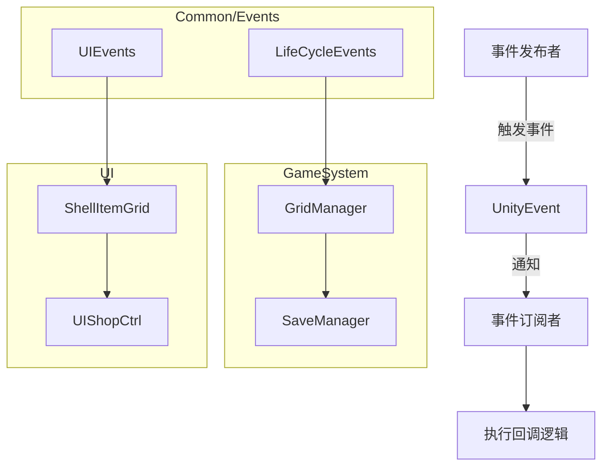
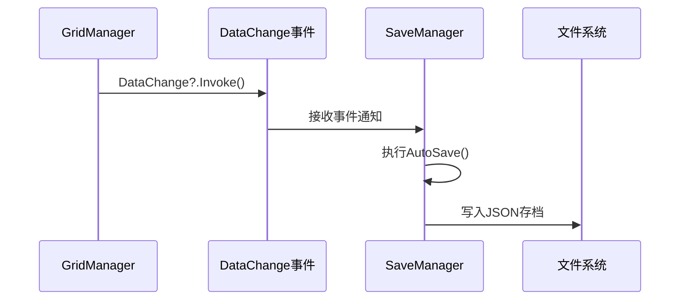
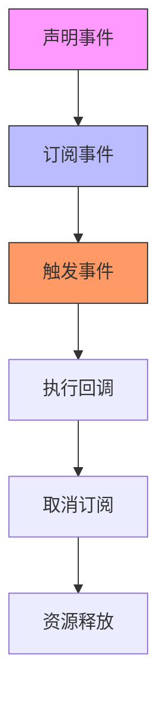

# 观察者模式与事件系统

<cite>
**本文档引用的文件**  
- [LifeCycleEvents.cs](file://Common\Events\LifeCycleEvents.cs)
- [UIEvents.cs](file://Common\Events\UIEvents.cs)
- [GridManager.cs](file://GameSystem\GridManager.cs)
- [SaveManager.cs](file://GameSystem\SaveManager.cs)
- [ShellItemGrid.cs](file://Data\ShellItemGrid.cs)
- [UIShopCtrl.cs](file://UI\UIShopCtrl.cs)
</cite>

## 目录
1. [引言](#引言)
2. [事件系统架构](#事件系统架构)
3. [自定义委托定义与用途](#自定义委托定义与用途)
4. [GridManager中的数据变更事件](#gridmanager中的数据变更事件)
5. [事件的声明、订阅与触发流程](#事件的声明、订阅与触发流程)
6. [模块间松耦合通信机制](#模块间松耦合通信机制)
7. [系统扩展性分析](#系统扩展性分析)
8. [事件系统优化建议](#事件系统优化建议)
9. [结论](#结论)

## 引言
本项目采用UnityEvent实现观察者模式，以支持模块间的解耦通信。通过自定义事件和委托机制，系统实现了生命周期管理、UI更新通知以及数据持久化等关键功能。本文将深入分析该事件系统的实现方式，重点探讨其在降低模块依赖、提升可维护性和扩展性方面的设计优势。

## 事件系统架构



**图示来源**  
- [LifeCycleEvents.cs](file://Common\Events\LifeCycleEvents.cs)
- [UIEvents.cs](file://Common\Events\UIEvents.cs)
- [GridManager.cs](file://GameSystem\GridManager.cs)
- [UIShopCtrl.cs](file://UI\UIShopCtrl.cs)

**本节来源**  
- [LifeCycleEvents.cs](file://Common\Events\LifeCycleEvents.cs)
- [UIEvents.cs](file://Common\Events\UIEvents.cs)

## 自定义委托定义与用途

项目中定义了两个静态事件类：`LifeCycleEvents` 和 `UIEvents`，用于封装特定场景下的通知机制。

### LifeCycleEvents 委托
该类定义了与对象生命周期相关的委托：
- `Destroyed`：通知订阅者某个对象已被销毁，用于取消订阅或清理资源
- `DestroyedWithTarget<T>`：带泛型参数的销毁通知，可传递被销毁的目标对象

此类委托主要用于组件销毁时的资源清理和事件反注册，防止内存泄漏。

### UIEvents 委托
该类定义了UI布局变化的通知：
- `LayoutChanged`：通知父节点其子元素发生变更，需重新计算布局或尺寸

此委托用于动态UI元素（如可变行数的商店列表）在增删子项时触发父容器的重新布局。

**本节来源**  
- [LifeCycleEvents.cs](file://Common\Events\LifeCycleEvents.cs#L6-L12)
- [UIEvents.cs](file://Common\Events\UIEvents.cs#L5-L10)

## GridManager中的数据变更事件

`GridManager` 类通过 `UnityEvent DataChange` 实现地块状态变化时的自动存档机制。

### 数据变更触发存档
当游戏中的地块状态发生变化（如浇水、作物生长、干旱死亡等），系统会在每帧调用 `ResetAllGridDry()` 方法进行状态更新。在此方法末尾，通过 `DataChange?.Invoke()` 触发事件，通知 `SaveManager` 执行自动存档。

### 事件驱动的持久化
该事件被 `SaveManager` 或其他持久化组件订阅，一旦触发即调用 `AutoSaveTileCropData()` 方法，将当前 `_gridData` 列表序列化并保存至本地文件，确保玩家进度不会丢失。



**图示来源**  
- [GridManager.cs](file://GameSystem\GridManager.cs#L24-L81)
- [SaveManager.cs](file://GameSystem\SaveManager.cs#L29-L45)

**本节来源**  
- [GridManager.cs](file://GameSystem\GridManager.cs#L24-L81)
- [SaveManager.cs](file://GameSystem\SaveManager.cs#L29-L45)

## 事件的声明、订阅与触发流程

### 事件声明
在 `GridManager` 中声明事件：
```csharp
public UnityEvent DataChange;
```

### 事件订阅
在 `ShellItemGrid` 中订阅自定义事件：
```csharp
public event UIEvents.LayoutChanged OnLayoutChanged;
public event LifeCycleEvents.Destroyed OnDestroyed;
```

### 事件触发
使用空条件运算符安全触发事件：
```csharp
OnItemSold?.Invoke();
OnLayoutChanged?.Invoke();
DataChange?.Invoke();
```

### 订阅管理
在 `UIShopCtrl` 中通过字典 `_gridSubscriptions` 管理多个动态生成的 `ShellItemGrid` 的事件订阅，并在 `OnDestroy` 时统一取消订阅，避免内存泄漏。



**图示来源**  
- [GridManager.cs](file://GameSystem\GridManager.cs#L24)
- [ShellItemGrid.cs](file://Data\ShellItemGrid.cs#L43-L48)
- [UIShopCtrl.cs](file://UI\UIShopCtrl.cs#L146-L167)

**本节来源**  
- [GridManager.cs](file://GameSystem\GridManager.cs#L24)
- [ShellItemGrid.cs](file://Data\ShellItemGrid.cs#L43-L99)
- [UIShopCtrl.cs](file://UI\UIShopCtrl.cs#L146-L167)

## 模块间松耦合通信机制

观察者模式的核心优势在于实现模块间的松耦合。

### 发布-订阅模式
`GridManager` 无需知道谁在监听 `DataChange` 事件，只需在状态变化时发布通知。`SaveManager` 作为独立模块，仅需订阅该事件即可实现自动存档，二者无直接依赖。

### UI动态更新
`ShellItemGrid` 在卖出物品或销毁时触发 `OnItemSold` 和 `OnLayoutChanged` 事件，`UIShopCtrl` 作为容器控制器订阅这些事件并更新UI状态，实现了子组件与父组件的解耦。

### 生命周期管理
通过 `OnDestroyed` 事件，子组件可主动通知父组件其即将销毁，父组件据此清理相关资源和事件监听，避免了强引用导致的内存泄漏。

**本节来源**  
- [ShellItemGrid.cs](file://Data\ShellItemGrid.cs#L43-L99)
- [UIShopCtrl.cs](file://UI\UIShopCtrl.cs#L146-L167)
- [GridManager.cs](file://GameSystem\GridManager.cs#L80-L81)

## 系统扩展性分析

当前事件系统具备良好的扩展性基础：

### 易于新增事件类型
通过在 `LifeCycleEvents` 或 `UIEvents` 中添加新的委托定义，即可快速扩展事件类型，现有代码无需修改。

### 支持多订阅者
一个事件可被多个对象订阅，例如 `DataChange` 未来可同时被成就系统、统计系统等监听，实现功能扩展。

### 动态组件支持
`ShellItemGrid` 的事件机制支持动态生成和销毁UI元素，适应内容可变的界面需求。

然而，当前系统仍为分散式事件管理，缺乏统一的事件总线，限制了跨模块复杂通信的实现。

**本节来源**  
- [LifeCycleEvents.cs](file://Common\Events\LifeCycleEvents.cs)
- [UIEvents.cs](file://Common\Events\UIEvents.cs)
- [ShellItemGrid.cs](file://Data\ShellItemGrid.cs)

## 事件系统优化建议

尽管当前实现满足基本需求，但仍有改进空间：

### 引入事件总线
建议引入如 `UnityEventChannelSO` 或第三方事件总线框架，实现全局事件中心，支持更复杂的事件路由和过滤机制。

### 统一事件命名规范
当前事件命名较为随意，建议制定统一的事件命名规则（如 `On[Subject][Action]`），提高代码可读性。

### 增强事件调试能力
可添加事件监听器的调试日志，便于开发时追踪事件的发布与订阅情况，降低调试难度。

### 支持异步事件
对于耗时操作（如存档），可考虑支持异步事件处理，避免阻塞主线程。

### 事件生命周期管理
建立统一的事件管理中心，自动处理订阅与取消订阅，减少手动管理带来的遗漏风险。

**本节来源**  
- [LifeCycleEvents.cs](file://Common\Events\LifeCycleEvents.cs)
- [UIEvents.cs](file://Common\Events\UIEvents.cs)
- [GridManager.cs](file://GameSystem\GridManager.cs)

## 结论
本项目基于UnityEvent实现的观察者模式有效支持了模块间的松耦合通信。通过 `LifeCycleEvents` 和 `UIEvents` 中的自定义委托，系统实现了生命周期管理和UI更新通知。`GridManager` 的 `DataChange` 事件在状态变化时触发存档操作，体现了事件驱动架构的优势。虽然当前实现较为基础，但已具备良好扩展性，未来可通过引入事件总线机制进一步提升系统的灵活性和可维护性。