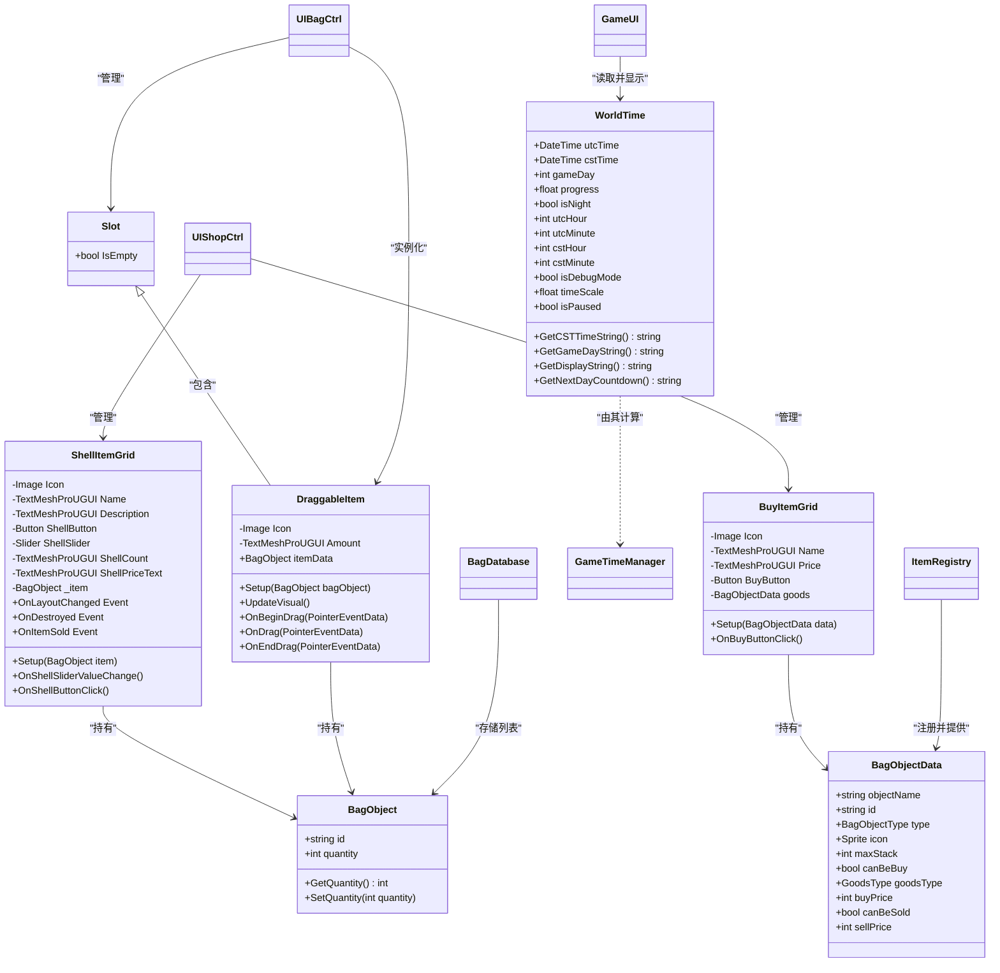
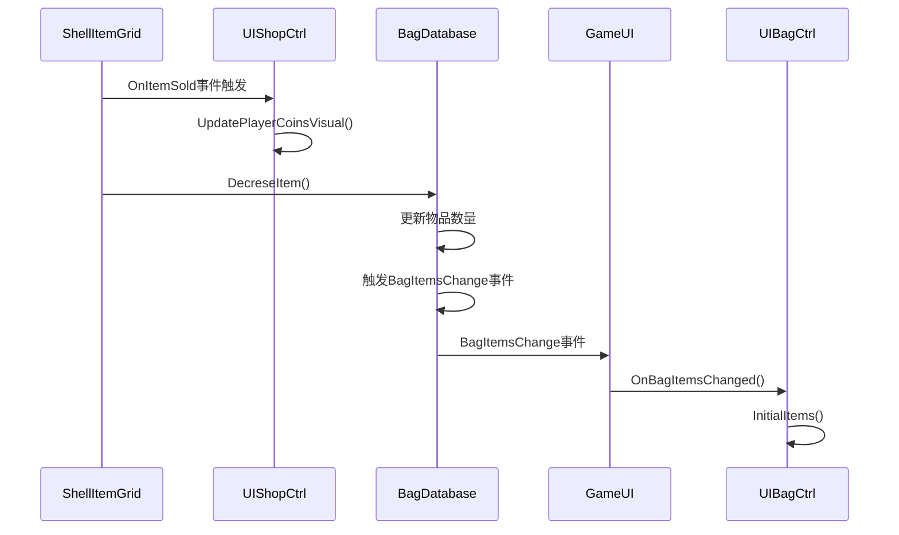

# UI相关数据模型

<cite>
**本文档中引用的文件**  
- [WorldTime.cs](file://Data\WorldTime.cs)
- [Slot.cs](file://Data\Slot.cs)
- [BuyItemGrid.cs](file://Data\BuyItemGrid.cs)
- [ShellItemGrid.cs](file://Data\ShellItemGrid.cs)
- [DraggableItem.cs](file://Data\DraggableItem.cs)
- [UIEvents.cs](file://Common\Events\UIEvents.cs)
- [BagObjectData.cs](file://Data\BagObjectData.cs)
- [UIBagCtrl.cs](file://UI\UIBagCtrl.cs)
- [UIShopCtrl.cs](file://UI\UIShopCtrl.cs)
- [GameTimeManager.cs](file://GameSystem\GameTimeManager.cs)
- [BagDatabase.cs](file://GameSystem\BagDatabase.cs)
- [ItemRegistry.cs](file://GameSystem\ItemRegistry.cs)
- [GameUI.cs](file://UI\GameUI.cs)
</cite>

## 目录
1. [简介](#简介)
2. [核心数据模型](#核心数据模型)
3. [WorldTime：游戏时间的存储与格式化](#worldtime游戏时间的存储与格式化)
4. [Slot：UI网格中的格子容器](#slotui网格中的格子容器)
5. [BuyItemGrid与ShellItemGrid：商店UI的数据载体](#buyitemgrid与shellitemgrid商店ui的数据载体)
6. [DraggableItem：拖拽操作中的物品传递](#draggableitem拖拽操作中的物品传递)
7. [UIEvents：数据模型与UI控制器的通信机制](#uievents数据模型与ui控制器的通信机制)
8. [交互流程示例：从背包拖拽物品到商店](#交互流程示例从背包拖拽物品到商店)
9. [总结](#总结)

## 简介
本文档旨在整合并详细说明项目中与UI相关的数据模型，包括`WorldTime`、`Slot`、`BuyItemGrid`、`ShellItemGrid`和`DraggableItem`。这些模型共同构成了游戏用户界面的核心数据结构，实现了时间显示、背包管理、商店交易和物品拖拽等关键功能。通过分析这些模型的结构、职责以及它们如何通过事件系统与UI控制器（如`UIBagCtrl`、`UIShopCtrl`）进行通信，本文将展示一个完整且高效的数据驱动UI架构。

## 核心数据模型
本节概述了构成UI系统基础的五个核心数据模型及其相互关系。



**图表来源**
- [WorldTime.cs](file://Data\WorldTime.cs)
- [Slot.cs](file://Data\Slot.cs)
- [BuyItemGrid.cs](file://Data\BuyItemGrid.cs)
- [ShellItemGrid.cs](file://Data\ShellItemGrid.cs)
- [DraggableItem.cs](file://Data\DraggableItem.cs)
- [BagObjectData.cs](file://Data\BagObjectData.cs)
- [UIBagCtrl.cs](file://UI\UIBagCtrl.cs)
- [UIShopCtrl.cs](file://UI\UIShopCtrl.cs)
- [GameTimeManager.cs](file://GameSystem\GameTimeManager.cs)
- [BagDatabase.cs](file://GameSystem\BagDatabase.cs)
- [ItemRegistry.cs](file://GameSystem\ItemRegistry.cs)

## WorldTime：游戏时间的存储与格式化
`WorldTime`结构体是游戏时间系统的核心，它封装了游戏世界中的时间信息，并提供了一系列方法用于格式化和显示。

### 时间存储
`WorldTime`存储了两种时间：
- **UTC时间**：以协调世界时（UTC）表示的绝对时间，用于精确计算。
- **CST时间**：以中国标准时间（CST）表示的本地时间，用于玩家直观理解。

此外，它还存储了游戏特有的时间概念：
- **gameDay**：表示当前是游戏的第几天，从一个固定的纪元（2025年1月1日CST 06:00）开始计算。
- **progress**：表示一天的进度，范围从0.0（00:00）到1.0（24:00），便于计算动画和状态。
- **isNight**：一个布尔值，当CST时间在00:00-06:00或20:00-24:00时为`true`，用于判断昼夜。

### 时间格式化
`WorldTime`提供了多个方法将内部数据转换为适合UI显示的字符串：
- `GetCSTTimeString()`：返回格式为"HH:mm"的CST时间字符串。
- `GetGameDayString()`：返回格式为"day-{gameDay}"的游戏日字符串。
- `GetDisplayString()`：组合游戏日、CST时间和昼夜状态，形成主界面的时间显示。
- `GetNextDayCountdown()`：计算并返回距离下一个游戏日（CST 06:00）的倒计时。

`GameTimeManager`负责根据真实时间计算`WorldTime`的实例，并通过`GameUI`组件将其显示在屏幕上。

**章节来源**
- [WorldTime.cs](file://Data\WorldTime.cs#L1-L43)
- [GameTimeManager.cs](file://GameSystem\GameTimeManager.cs#L1-L254)
- [GameUI.cs](file://UI\GameUI.cs#L77-L80)

## Slot：UI网格中的格子容器
`Slot`类是UI网格系统中的基本单元，代表背包或商店中的一个格子。

### 功能与职责
`Slot`本身不直接持有物品数据，而是作为一个容器，通过其子对象来管理物品的显示。它的核心功能是通过`IsEmpty`属性动态判断格子是否为空。

```csharp
public bool IsEmpty {
    get { return transform.childCount == 0; }
}
```
该属性通过检查`Slot`的`Transform`组件下是否有子对象来判断。如果一个`DraggableItem`被放置在`Slot`中，它就会成为`Slot`的子对象，从而使`IsEmpty`返回`false`。这种设计避免了手动维护“空/非空”状态可能带来的bug，更加健壮。

### 与UI控制器的协作
`UIBagCtrl`在初始化时会根据`bagSize`生成相应数量的`Slot`预制件，并将它们放置在`SlotContainer`下。当需要在某个格子中显示物品时，`UIBagCtrl`会将一个`DraggableItem`实例化并作为子对象添加到对应的`Slot`中。

**章节来源**
- [Slot.cs](file://Data\Slot.cs#L1-L12)
- [UIBagCtrl.cs](file://UI\UIBagCtrl.cs#L33-L37)

## BuyItemGrid与ShellItemGrid：商店UI的数据载体
`BuyItemGrid`和`ShellItemGrid`是商店UI中两种不同模式下可交互格子的数据载体，它们分别对应购买和出售功能。

### BuyItemGrid：购买格子
`BuyItemGrid`用于在商店的“购买”面板中显示可购买的物品。

- **数据绑定**：它持有一个`BagObjectData`类型的`goods`字段，该字段通过`Setup`方法进行初始化。`Setup`方法会根据`BagObjectData`中的数据（如图标、名称、价格）来填充其UI子控件（`Icon`、`Name`、`Price`）。
- **交互逻辑**：`OnBuyButtonClick`方法处理购买逻辑。它首先检查玩家金币是否足够，然后从`BagDatabase`中扣除金币，并向玩家背包中添加物品。最后，它通过`GameUI`的单例引用，通知`UIShopCtrl`和`UIBagCtrl`更新各自的UI。

### ShellItemGrid：出售格子
`ShellItemGrid`用于在商店的“出售”面板中显示玩家可以出售的物品。

- **数据绑定**：它持有一个`BagObject`类型的`_item`字段，该字段通过`Setup`方法进行初始化。`Setup`方法会从`ItemRegistry`中根据`_item`的ID获取`BagObjectData`，并用其数据填充UI。
- **交互逻辑**：它包含一个`Slider`（`ShellSlider`），允许玩家选择要出售的数量。`OnShellButtonClick`方法处理出售逻辑：它调用`BagDatabase`的`DecreseItem`方法减少物品数量，并增加玩家金币。关键的是，它通过`OnItemSold`事件通知UI进行更新。
- **事件通信**：`ShellItemGrid`定义了三个事件：
  - `OnLayoutChanged`：当格子内容变化（如数量改变）时，通知父容器调整布局（如ScrollView高度）。
  - `OnDestroyed`：当格子被销毁时，通知父容器清理事件订阅，防止内存泄漏。
  - `OnItemSold`：当物品被成功出售时，触发此事件。

`UIShopCtrl`在初始化`ShellItemGrid`时会订阅这些事件，从而实现松耦合的通信。

**章节来源**
- [BuyItemGrid.cs](file://Data\BuyItemGrid.cs#L1-L52)
- [ShellItemGrid.cs](file://Data\ShellItemGrid.cs#L1-L100)
- [UIShopCtrl.cs](file://UI\UIShopCtrl.cs#L59-L95)

## DraggableItem：拖拽操作中的物品传递
`DraggableItem`是实现物品拖拽功能的核心组件，它在拖拽过程中承载物品数据。

### 数据与UI
`DraggableItem`持有一个`BagObject`类型的`itemData`字段，这是它所代表的物品的数据。`Setup`方法会根据`itemData`从`ItemRegistry`中获取`BagObjectData`，并用其图标和数量来初始化自身的UI（`Icon`和`Amount`）。

### 拖拽流程
`DraggableItem`实现了`IBeginDragHandler`、`IDragHandler`和`IEndDragHandler`接口，以处理拖拽的三个阶段：
1.  **开始拖拽 (`OnBeginDrag`)**：记录原始父对象（即`Slot`），并将自身移动到一个顶层的`DargCanvas`上，确保它显示在所有UI元素之上。
2.  **拖拽中 (`OnDrag`)**：将自身的位置设置为鼠标光标的位置。
3.  **结束拖拽 (`OnEndDrag`)**：这是最复杂的阶段。它使用Unity的`EventSystem`进行射线检测，找出鼠标下方的UI元素。如果找到一个`Slot`组件，则认为这是一个有效的放置目标。
    - 如果目标`Slot`为空，则将`DraggableItem`的父对象设置为该`Slot`。
    - 如果目标`Slot`已有物品，则交换两个`Slot`中`DraggableItem`的父对象，实现物品交换。
    - 如果没有有效目标或目标是原`Slot`，则将`DraggableItem`放回原位。

### 与UI控制器的协作
`UIBagCtrl`负责管理`DraggableItem`的生命周期。`InitialItems`方法会遍历`BagDatabase`中的物品列表，并为每个物品在对应的`Slot`中创建一个`DraggableItem`实例。

**章节来源**
- [DraggableItem.cs](file://Data\DraggableItem.cs#L1-L87)
- [UIBagCtrl.cs](file://UI\UIBagCtrl.cs#L49-L55)

## UIEvents：数据模型与UI控制器的通信机制
UI数据模型与UI控制器之间的通信主要通过事件（Events）和直接调用实现，确保了数据驱动的界面更新。

### 事件驱动通信
`ShellItemGrid`是事件驱动通信的典范。它定义了`OnItemSold`、`OnLayoutChanged`和`OnDestroyed`事件。`UIShopCtrl`在创建`ShellItemGrid`实例后，会立即订阅这些事件。



当玩家点击“出售”按钮时，`ShellItemGrid`会先更新`BagDatabase`中的数据，然后触发`OnItemSold`事件。`UIShopCtrl`监听到此事件后，会立即更新自己的金币显示。同时，`BagDatabase`在数据变更后会触发`BagItemsChange`事件，`GameUI`监听此事件并通知`UIBagCtrl`刷新背包UI。这种模式确保了所有相关UI都能及时响应数据变化。

### 直接调用
对于一些简单的、单向的更新，如`BuyItemGrid`在购买成功后直接调用`UIShopCtrl.SetPlayerCoins()`和`UIBagCtrl.InitialItems()`，则采用了直接调用的方式。这种方式更直接，适用于逻辑清晰且耦合度可以接受的场景。

**图表来源**
- [UIEvents.cs](file://Common\Events\UIEvents.cs#L1-L11)
- [ShellItemGrid.cs](file://Data\ShellItemGrid.cs#L78-L79)
- [UIShopCtrl.cs](file://UI\UIShopCtrl.cs#L85-L86)
- [GameUI.cs](file://UI\GameUI.cs#L64-L74)

**章节来源**
- [ShellItemGrid.cs](file://Data\ShellItemGrid.cs#L38-L53)
- [UIShopCtrl.cs](file://UI\UIShopCtrl.cs#L78-L87)
- [GameUI.cs](file://UI\GameUI.cs#L64-L74)

## 交互流程示例：从背包拖拽物品到商店
本节将详细描述一个完整的交互流程：玩家从背包中拖拽一个物品到商店的出售面板。

1.  **准备阶段**：
    - `UIBagCtrl`根据`BagDatabase`中的`items`列表，为每个物品在`SlotContainer`中创建一个`DraggableItem`。
    - `UIShopCtrl`在商店打开时，根据`BagDatabase`中的物品和`ItemRegistry`的`canBeSold`属性，为每个可出售的物品在`ShellItemContainer`中创建一个`ShellItemGrid`。

2.  **开始拖拽**：
    - 玩家点击并按住背包中的一个`DraggableItem`。
    - `DraggableItem.OnBeginDrag`被调用，它记录下原始的`Slot`，并将自身移动到`DargCanvas`上。

3.  **拖拽过程**：
    - `DraggableItem.OnDrag`被持续调用，使其跟随鼠标移动。

4.  **结束拖拽（出售）**：
    - 玩家将`DraggableItem`拖到商店的“出售”面板并松开鼠标。
    - `DraggableItem.OnEndDrag`被调用。射线检测发现鼠标下方没有`Slot`（因为出售面板使用的是`ShellItemGrid`，它本身不是`Slot`），因此`targetSlot`为`null`。
    - 由于`targetSlot`为`null`，`DraggableItem`不会自动归位。此时，`DraggableItem`悬浮在出售面板上，等待玩家与`ShellItemGrid`交互。

5.  **出售操作**：
    - 玩家点击`ShellItemGrid`上的“出售”按钮。
    - `ShellItemGrid.OnShellButtonClick`被调用。它通过`BagDatabase`减少物品数量并增加金币。
    - `BagDatabase`的`DecreaseItem`方法会触发`BagItemsChange`事件。
    - `GameUI`监听到`BagItemsChange`事件，调用`OnBagItemsChanged`方法。
    - `OnBagItemsChanged`通知`UIBagCtrl`调用`InitialItems()`，刷新背包UI，移除已出售的物品。
    - 同时，`ShellItemGrid`触发`OnItemSold`事件，`UIShopCtrl`更新金币显示。

6.  **UI更新**：
    - 背包UI和商店UI都得到了更新，反映了最新的物品和金币状态。

**章节来源**
- [DraggableItem.cs](file://Data\DraggableItem.cs#L33-L86)
- [ShellItemGrid.cs](file://Data\ShellItemGrid.cs#L73-L80)
- [BagDatabase.cs](file://GameSystem\BagDatabase.cs#L51-L65)
- [GameUI.cs](file://UI\GameUI.cs#L64-L74)

## 总结
本文档详细分析了项目中`WorldTime`、`Slot`、`BuyItemGrid`、`ShellItemGrid`和`DraggableItem`这五个核心UI数据模型。`WorldTime`为游戏提供了精确的时间基准和友好的显示格式。`Slot`作为UI网格的基本容器，通过其子对象管理物品的显示。`BuyItemGrid`和`ShellItemGrid`作为商店UI的数据载体，分别实现了购买和出售的逻辑，并通过事件与`UIShopCtrl`进行通信。`DraggableItem`则在拖拽操作中承载物品数据，实现了直观的物品交互。整个系统通过`UIEvents`和`BagDatabase`的事件机制，实现了数据驱动的UI更新，确保了界面状态与游戏数据的高度一致性。这种清晰的职责划分和松耦合的通信方式，构成了一个健壮且易于维护的UI架构。