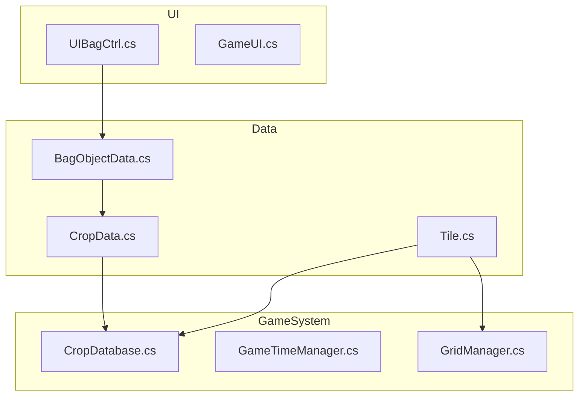
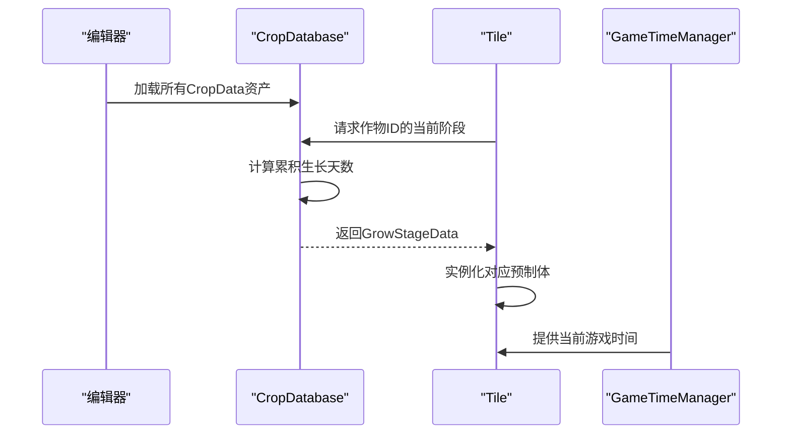
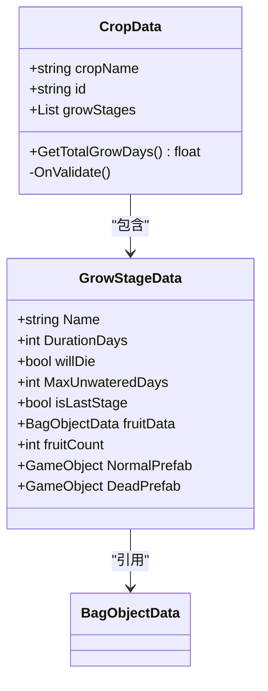
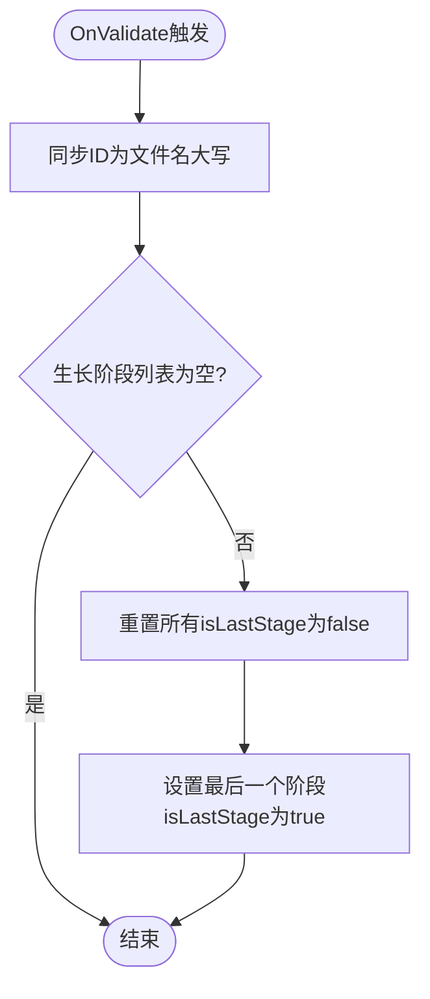
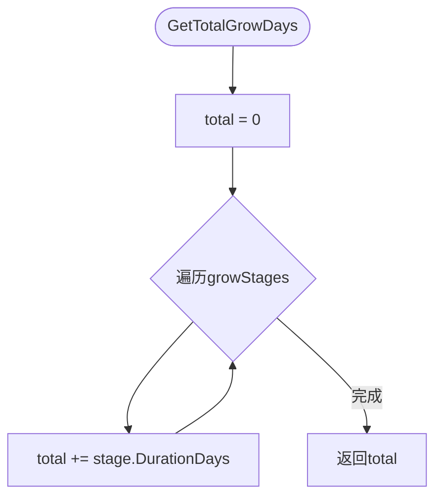
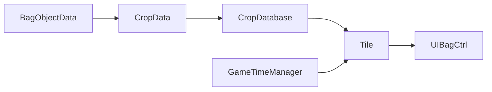

# 作物数据模型 (CropData)

<cite>
**本文档引用的文件**  
- [CropData.cs](file://Data\CropData.cs)
- [BagObjectData.cs](file://Data\BagObjectData.cs)
- [CropDatabase.cs](file://GameSystem\CropDatabase.cs)
- [Tile.cs](file://Data\Tile.cs)
</cite>

## 目录
1. [简介](#简介)
2. [项目结构](#项目结构)
3. [核心组件](#核心组件)
4. [架构概述](#架构概述)
5. [详细组件分析](#详细组件分析)
6. [依赖分析](#依赖分析)
7. [性能考虑](#性能考虑)
8. [故障排除指南](#故障排除指南)
9. [结论](#结论)

## 简介
本文档详细阐述了基于Unity的种田类游戏中作物数据模型的设计与实现，重点分析`CropData` ScriptableObject类及其与`GrowStageData`、`BagObjectData`、`CropDatabase`和`Tile`等核心组件的交互机制。该模型支持灵活配置作物从种子到成熟的完整生命周期，通过编辑器自动化确保数据一致性，并与游戏系统无缝集成，驱动视觉更新与逻辑处理。

## 项目结构
项目采用模块化设计，将功能划分为Common、Data、GameSystem和UI四个主要目录。Data目录存放所有ScriptableObject数据类，GameSystem目录管理全局服务和数据库，UI目录处理用户界面逻辑，Common目录提供通用工具和事件系统。

**Diagram sources**
- [CropData.cs](file://Data\CropData.cs#L1-L67)
- [BagObjectData.cs](file://Data\BagObjectData.cs#L1-L151)
- [CropDatabase.cs](file://GameSystem\CropDatabase.cs#L1-L110)
- [Tile.cs](file://Data\Tile.cs#L1-L194)

**Section sources**
- [CropData.cs](file://Data\CropData.cs#L1-L67)
- [BagObjectData.cs](file://Data\BagObjectData.cs#L1-L151)

## 核心组件

`CropData`是定义作物生长特性的核心ScriptableObject，包含作物名称、唯一ID和生长阶段列表。`GrowStageData`作为其嵌套类，定义了每个生长阶段的持续时间、死亡机制和视觉表现。`BagObjectData`用于定义背包中物品的数据，与作物的种子和果实关联。`CropDatabase`作为单例服务，集中管理所有作物数据的访问。

**Section sources**
- [CropData.cs](file://Data\CropData.cs#L1-L67)
- [BagObjectData.cs](file://Data\BagObjectData.cs#L1-L151)
- [CropDatabase.cs](file://GameSystem\CropDatabase.cs#L1-L110)

## 架构概述
系统采用数据驱动架构，`CropData`资产在编辑器中配置，由`CropDatabase`在运行时加载和管理。`Tile`组件引用`CropData`的ID，结合`GameTimeManager`提供的时间系统，动态计算作物的当前生长阶段并更新视觉模型。

**Diagram sources**
- [CropDatabase.cs](file://GameSystem\CropDatabase.cs#L28-L59)
- [Tile.cs](file://Data\Tile.cs#L84-L108)

## 详细组件分析

### CropData 类分析
`CropData`继承自ScriptableObject，允许在Unity编辑器中创建和配置数据资产。其字段设计旨在提供直观的编辑体验和数据完整性。

#### 字段定义

**Diagram sources**
- [CropData.cs](file://Data\CropData.cs#L10-L66)
- [BagObjectData.cs](file://Data\BagObjectData.cs#L13-L151)

**Section sources**
- [CropData.cs](file://Data\CropData.cs#L1-L67)

### GrowStageData 嵌套类分析
`GrowStageData`定义了作物生命周期中每个阶段的具体行为和属性。

#### 属性说明
- **Name**: 阶段名称（如“种子”、“发芽”）。
- **DurationDays**: 该阶段持续的天数。
- **willDie**: 若未浇水，此阶段作物是否会死亡。
- **MaxUnwateredDays**: 当`willDie`为true时，允许的最大未浇水天数。
- **isLastStage**: 标记是否为最终阶段（成熟），由`OnValidate`自动设置。
- **fruitData**: 成熟阶段产出的果实对应的`BagObjectData`。
- **fruitCount**: 每次收获可获得的果实数量。
- **NormalPrefab**: 正常状态下的视觉模型预制体。
- **DeadPrefab**: 死亡状态下的视觉模型预制体。

这些属性通过`[ShowWhen]`属性实现条件显示，优化了编辑器中的用户体验。

**Section sources**
- [CropData.cs](file://Data\CropData.cs#L52-L66)

### OnValidate 方法分析
`OnValidate`方法在编辑器中自动执行，确保数据一致性。

#### 自动化逻辑

**Diagram sources**
- [CropData.cs](file://Data\CropData.cs#L21-L35)

**Section sources**
- [CropData.cs](file://Data\CropData.cs#L21-L35)

### GetTotalGrowDays 方法分析
该方法计算作物从种植到成熟所需的总天数。

#### 实现逻辑

此方法在游戏设计和UI提示中用于显示作物的完整生长周期。

**Section sources**
- [CropData.cs](file://Data\CropData.cs#L39-L45)

## 依赖分析
系统各组件间存在明确的依赖关系，确保了数据流的清晰和功能的解耦。

**Diagram sources**
- [CropDatabase.cs](file://GameSystem\CropDatabase.cs#L10-L110)
- [Tile.cs](file://Data\Tile.cs#L53-L194)

**Section sources**
- [CropDatabase.cs](file://GameSystem\CropDatabase.cs#L1-L110)
- [Tile.cs](file://Data\Tile.cs#L1-L194)

## 性能考虑
- `Tile.Update`中使用`Time.frameCount % 60`进行节流，避免每帧更新作物状态，提升性能。
- `CropDatabase`使用`FirstOrDefault`进行ID查找，对于大型数据库，可考虑使用`Dictionary<string, CropData>`以获得O(1)查找性能。
- 模型切换前检查`lastStageIndex`，避免不必要的`Destroy/Instantiate`操作。

## 故障排除指南
- **问题**: 新作物在编辑器中ID未自动同步。
  - **原因**: `OnValidate`未触发。
  - **解决**: 确保脚本文件名与期望的ID一致，并在编辑器中修改任意字段以触发验证。

- **问题**: 作物无法正常生长或阶段不切换。
  - **原因**: `currStageStartTimeTick`未正确更新。
  - **解决**: 检查`Tile.UpdateCropVisual`中`data.currStageStartTimeTick`的赋值逻辑。

- **问题**: 收获时背包未添加物品。
  - **原因**: `fruitData`引用为空或`BagDatabase`未正确初始化。
  - **解决**: 确认`GrowStageData.fruitData`已配置，且`BagDatabase.Instance`存在。

**Section sources**
- [CropData.cs](file://Data\CropData.cs#L21-L35)
- [Tile.cs](file://Data\Tile.cs#L93-L102)
- [Tile.cs](file://Data\Tile.cs#L157-L169)

## 结论
`CropData`模型设计灵活且健壮，通过ScriptableObject实现了数据与逻辑的分离。`OnValidate`方法确保了编辑时的数据一致性，`CropDatabase`提供了高效的运行时数据访问。该架构易于扩展，支持快速创建新作物类型，并与游戏的其他系统（如时间、UI、存档）紧密集成，为种田类游戏的核心玩法提供了坚实的基础。