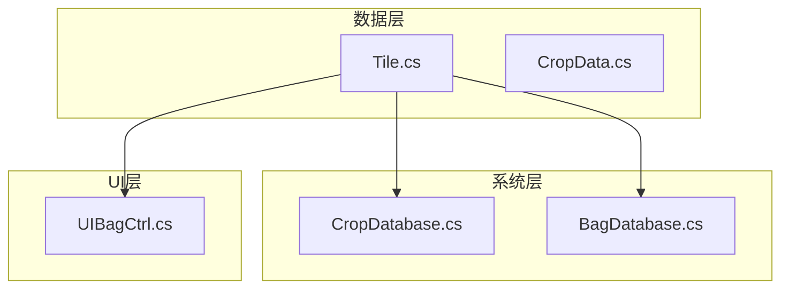
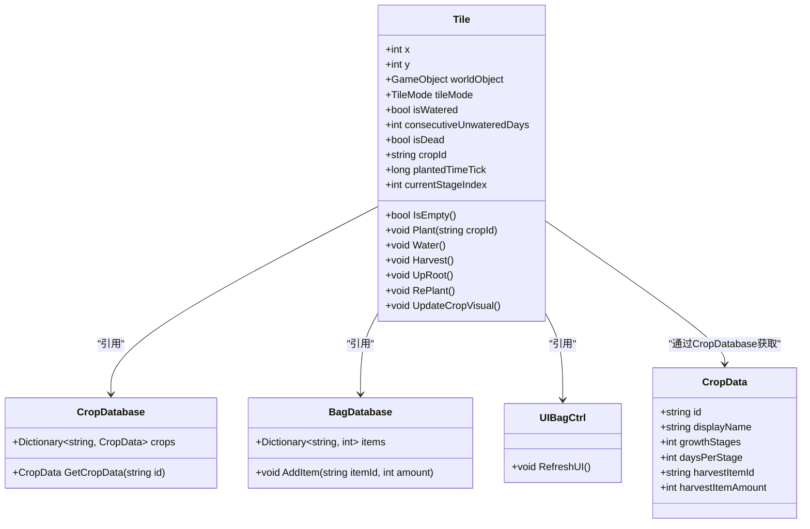
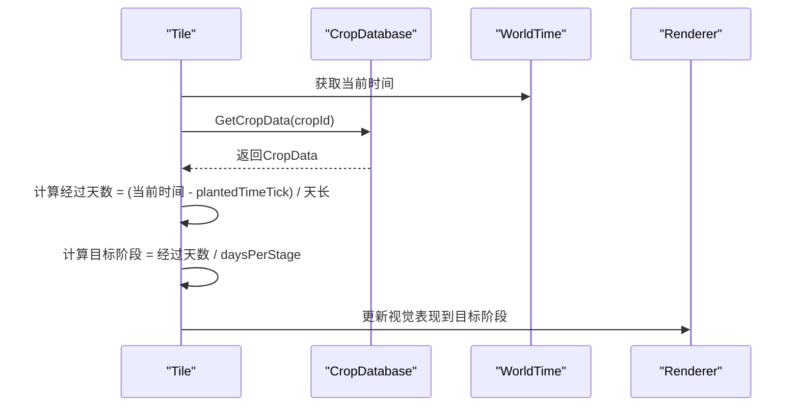
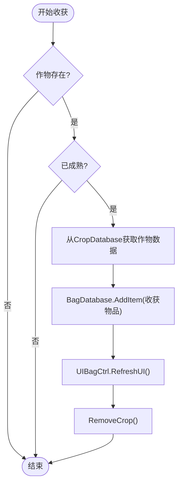
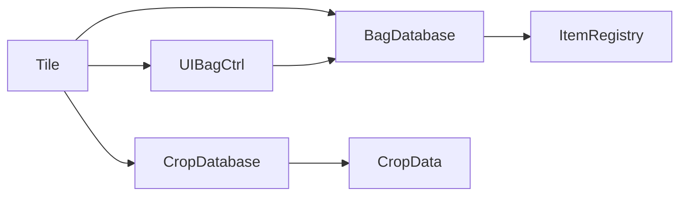

# 地块数据模型 (TileData)

<cite>
**本文档中引用的文件**  
- [Tile.cs](file://Data\Tile.cs)
- [CropData.cs](file://Data\CropData.cs)
- [CropDatabase.cs](file://GameSystem\CropDatabase.cs)
- [UIBagCtrl.cs](file://UI\UIBagCtrl.cs)
- [BagDatabase.cs](file://GameSystem\BagDatabase.cs)
</cite>

## 目录
1. [简介](#简介)
2. [项目结构](#项目结构)
3. [核心组件](#核心组件)
4. [架构概述](#架构概述)
5. [详细组件分析](#详细组件分析)
6. [依赖分析](#依赖分析)
7. [性能考虑](#性能考虑)
8. [故障排除指南](#故障排除指南)
9. [结论](#结论)

## 简介
本文档深入分析俯仰视角种田游戏中地块系统的核心数据模型 `TileData` 及其对应的 `Tile` MonoBehaviour 组件。重点阐述地块状态管理、作物生长逻辑、视觉更新机制以及与背包系统的交互流程，为开发者提供全面的技术参考。

## 项目结构
地块系统相关代码分布在 `Data` 和 `GameSystem` 模块中，`UI` 模块负责与玩家交互。`Tile.cs` 定义了地块数据结构和行为，`CropData` 和 `CropDatabase` 提供作物元数据支持，`UIBagCtrl` 和 `BagDatabase` 处理收获物品的存储。



**图示来源**  
- [Tile.cs](file://Data\Tile.cs#L1-L10)
- [CropDatabase.cs](file://GameSystem\CropDatabase.cs#L1-L10)
- [BagDatabase.cs](file://GameSystem\BagDatabase.cs#L1-L10)
- [UIBagCtrl.cs](file://UI\UIBagCtrl.cs#L1-L10)

**本节来源**  
- [Tile.cs](file://Data\Tile.cs#L1-L50)
- [CropData.cs](file://Data\CropData.cs#L1-L30)

## 核心组件
`TileData` 类是地块状态的序列化核心，包含坐标、作物信息、浇水状态等字段。`Tile` 类封装了地块的业务逻辑，包括种植、浇水、收获等操作。

**本节来源**  
- [Tile.cs](file://Data\Tile.cs#L25-L100)
- [CropData.cs](file://Data\CropData.cs#L15-L80)

## 架构概述
地块系统采用数据-行为分离的设计模式，`TileData` 负责状态持久化，`Tile` 负责运行时逻辑。系统通过 `CropDatabase` 查询作物生长参数，并通过 `BagDatabase` 和 `UIBagCtrl` 管理收获物品。



**图示来源**  
- [Tile.cs](file://Data\Tile.cs#L10-L100)
- [CropData.cs](file://Data\CropData.cs#L5-L25)
- [CropDatabase.cs](file://GameSystem\CropDatabase.cs#L10-L30)

## 详细组件分析

### TileData 数据结构分析
`TileData` 序列化类包含以下核心字段：
- **坐标信息**：`x` 和 `y` 字段标识地块在网格中的位置
- **世界对象引用**：`worldObject` 引用场景中的 GameObject，用于视觉表现
- **土壤状态**：`tileMode`（Dry/Watered）和 `isWatered` 字段管理浇水状态
- **作物生长信息**：
  - `cropId`：标识当前种植的作物类型
  - `plantedTimeTick`：记录种植时的游戏时间戳
  - `currentStageIndex`：表示作物当前的生长阶段
- **空状态判断**：`IsEmpty` 属性通过检查 `cropId` 是否为空来判断地块是否空闲
- **作物移除**：`RemoveCrop()` 方法重置所有作物相关字段，将地块恢复为空状态

**本节来源**  
- [Tile.cs](file://Data\Tile.cs#L50-L150)

### Tile 行为逻辑分析

#### 作物视觉更新机制
`UpdateCropVisual()` 方法是地块视觉表现的核心。该方法根据当前游戏时间、作物生长阶段和 `CropDatabase` 中的配置信息，动态更新 `worldObject` 的视觉表现。它计算自种植以来经过的游戏天数，确定当前应显示的生长阶段，并相应地更新渲染器或子对象。



**图示来源**  
- [Tile.cs](file://Data\Tile.cs#L200-L250)
- [CropDatabase.cs](file://GameSystem\CropDatabase.cs#L30-L50)

#### 核心业务方法分析
- **Plant()**：在空地块上种植指定作物，初始化作物生长参数
- **Water()**：将地块标记为已浇水，重置 `consecutiveUnwateredDays` 计数器
- **Harvest()**：收获成熟作物，通过 `BagDatabase` 增加物品，并调用 `UIBagCtrl.RefreshUI()` 更新界面
- **UpRoot()**：移除未成熟作物，不给予收获物



**图示来源**  
- [Tile.cs](file://Data\Tile.cs#L300-L400)
- [BagDatabase.cs](file://GameSystem\BagDatabase.cs#L20-L40)
- [UIBagCtrl.cs](file://UI\UIBagCtrl.cs#L50-L70)

#### 作物死亡机制
`consecutiveUnwateredDays` 和 `isDead` 字段共同实现作物死亡逻辑。每当游戏天数推进且地块未被浇水时，`consecutiveUnwateredDays` 递增。当该值超过作物耐旱阈值时，`isDead` 被设为 `true`，作物无法继续生长，玩家需使用 `UpRoot()` 移除。

**本节来源**  
- [Tile.cs](file://Data\Tile.cs#L150-L200)

#### 状态流转与重植机制
```mermaid
stateDiagram-v2
[*] --> 空闲
空闲 --> 种植 : Plant()
种植 --> 生长中 : UpdateCropVisual()
生长中 --> 已成熟 : 达到最大生长阶段
生长中 --> 死亡 : consecutiveUnwateredDays超限
已成熟 --> 空闲 : Harvest()
死亡 --> 空闲 : UpRoot()
空闲 --> 重新种植 : RePlant()
note right of RePlant
RePlant()在游戏加载时
用于恢复保存的作物状态
end note
```

**图示来源**  
- [Tile.cs](file://Data\Tile.cs#L400-L450)

**本节来源**  
- [Tile.cs](file://Data\Tile.cs#L100-L450)

## 依赖分析
地块系统依赖于作物数据库和背包系统，形成清晰的依赖链。



**图示来源**  
- [Tile.cs](file://Data\Tile.cs#L10-L30)
- [CropDatabase.cs](file://GameSystem\CropDatabase.cs#L5-L15)
- [BagDatabase.cs](file://GameSystem\BagDatabase.cs#L5-L15)
- [UIBagCtrl.cs](file://UI\UIBagCtrl.cs#L5-L15)

**本节来源**  
- [Tile.cs](file://Data\Tile.cs#L1-L50)
- [CropDatabase.cs](file://GameSystem\CropDatabase.cs#L1-L20)
- [BagDatabase.cs](file://GameSystem\BagDatabase.cs#L1-L20)

## 性能考虑
`UpdateCropVisual()` 方法在每帧或每天调用，应避免频繁的字符串操作和数据库查询。建议缓存 `CropData` 引用，并仅在作物阶段变化时更新视觉表现。

## 故障排除指南
- **作物不生长**：检查 `plantedTimeTick` 是否正确设置，`WorldTime` 是否正常推进
- **收获无反应**：验证 `BagDatabase` 和 `UIBagCtrl` 引用是否正确赋值
- **视觉不更新**：确认 `worldObject` 引用有效，生长阶段计算逻辑正确

**本节来源**  
- [Tile.cs](file://Data\Tile.cs#L200-L250)
- [UIBagCtrl.cs](file://UI\UIBagCtrl.cs#L50-L70)

## 结论
`TileData` 和 `Tile` 类构成了种田游戏的核心机制，通过清晰的数据结构和行为分离，实现了可扩展的作物生长系统。`RePlant()` 方法确保了游戏状态的持久化恢复，而与背包系统的松耦合设计便于未来功能扩展。