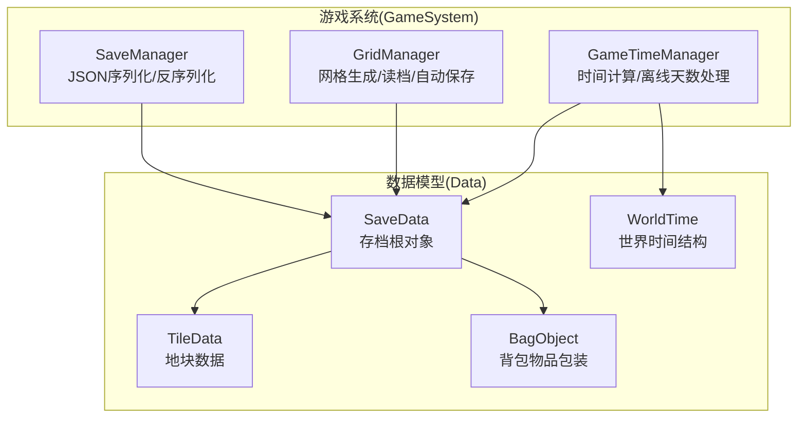
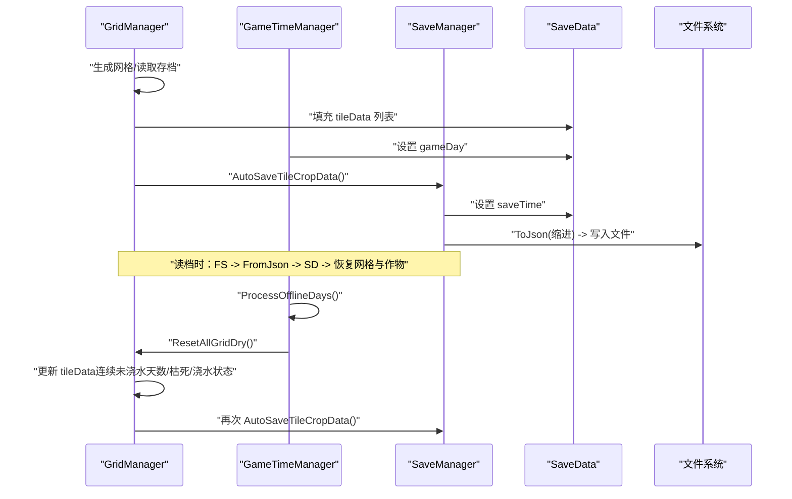
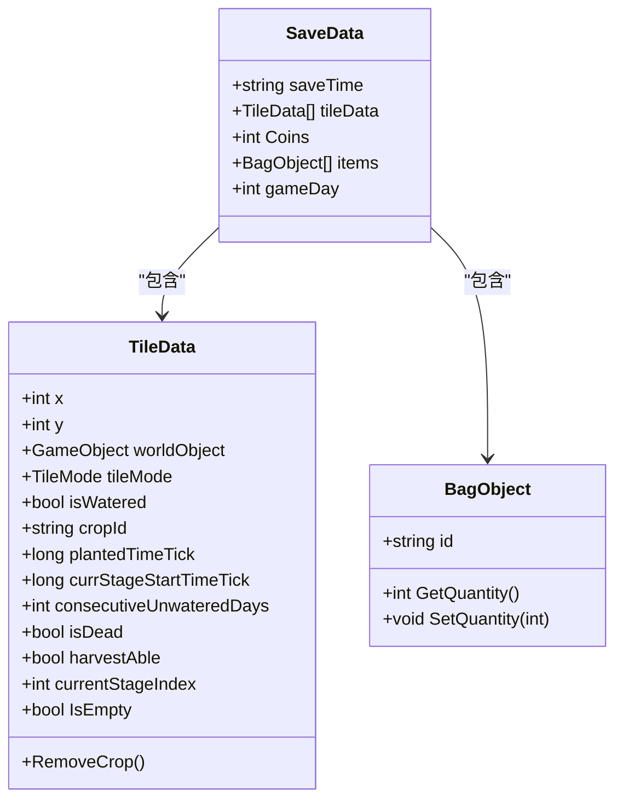
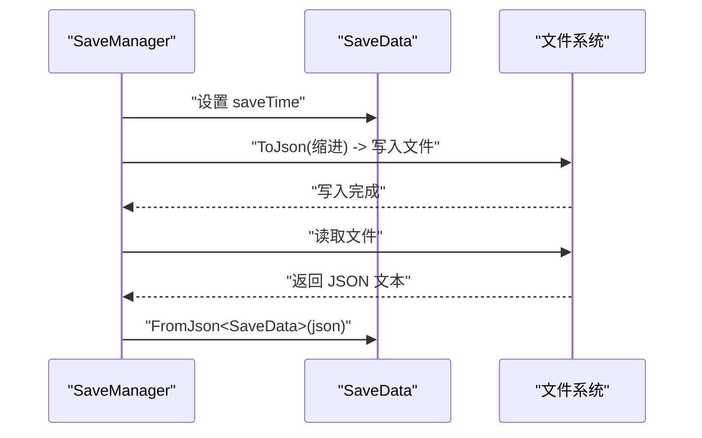
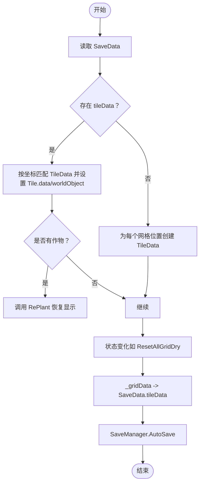
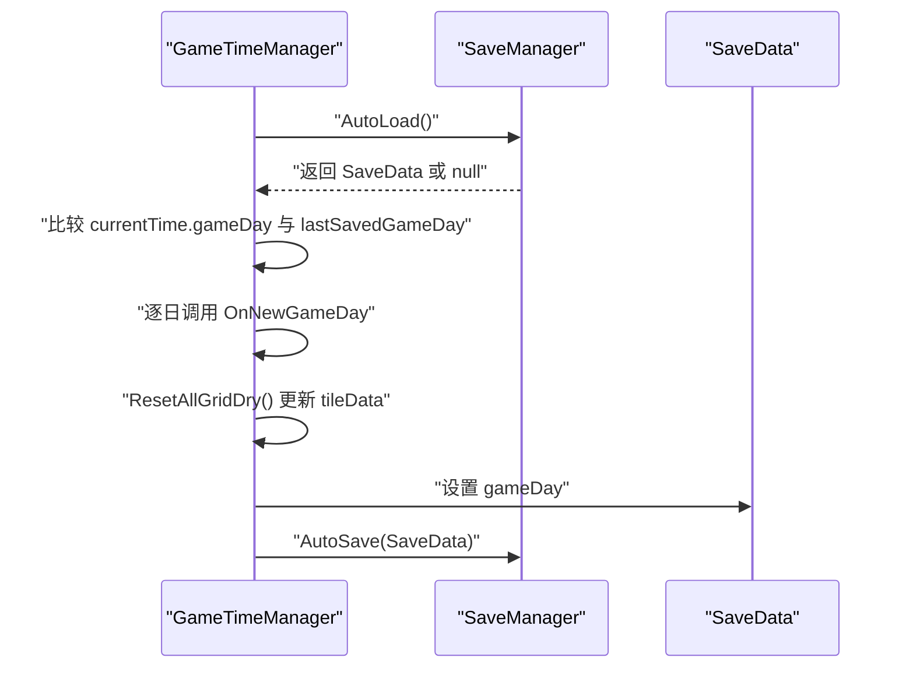
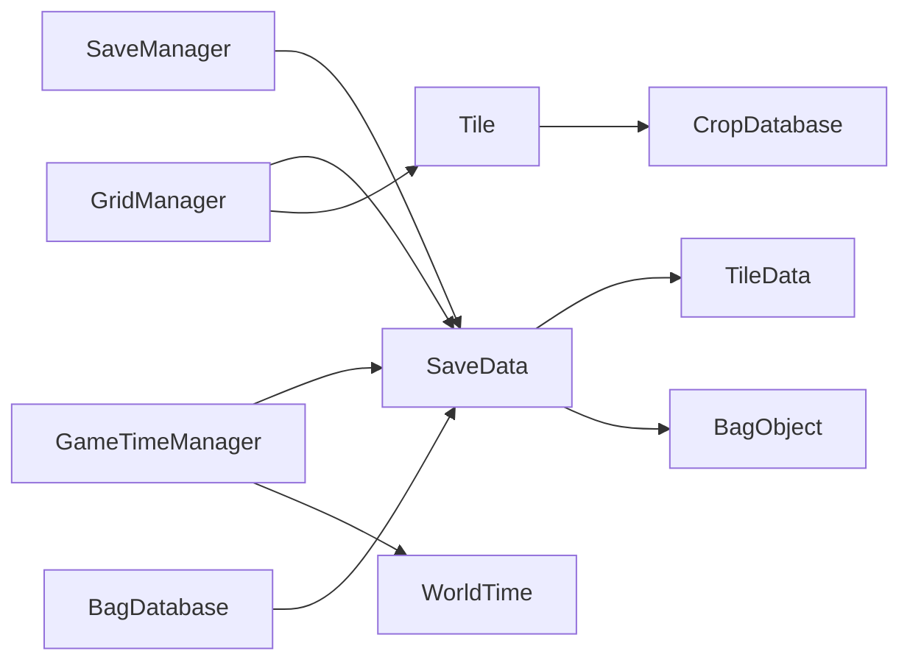

# 存档数据模型（SaveData）

<cite>
**本文引用的文件**
- [SaveData.cs](file://Data/SaveData.cs)
- [Tile.cs](file://Data/Tile.cs)
- [BagObjectData.cs](file://Data/BagObjectData.cs)
- [SaveManager.cs](file://GameSystem/SaveManager.cs)
- [GameTimeManager.cs](file://GameSystem/GameTimeManager.cs)
- [GridManager.cs](file://GameSystem/GridManager.cs)
- [WorldTime.cs](file://Data/WorldTime.cs)
</cite>

## 目录
1. [简介](#简介)
2. [项目结构](#项目结构)
3. [核心组件](#核心组件)
4. [架构总览](#架构总览)
5. [详细组件分析](#详细组件分析)
6. [依赖关系分析](#依赖关系分析)
7. [性能考量](#性能考量)
8. [故障排查指南](#故障排查指南)
9. [结论](#结论)
10. [附录](#附录)

## 简介
本文件围绕 SaveData 类构建全面的存档数据模型文档，重点阐述其作为游戏存档根对象的角色与职责，涵盖字段语义（如存档时间、地块数据列表、玩家货币、背包物品列表、离线天数）、与 SaveManager 的 JSON 序列化协作机制、与 TileData、BagObject 的关系图、典型序列化 JSON 示例、数据生命周期（从 GameTimeManager 和 GridManager 收集数据到 SaveManager 写入文件）、设计决策（如使用 List<TileData> 存储所有地块状态、离线天数单独存储）以及对初学者的安全修改建议与专家级序列化性能优化与版本迁移策略。

## 项目结构
- 数据模型层：Data 目录包含 SaveData、TileData、BagObject、WorldTime 等核心数据结构。
- 游戏系统层：GameSystem 目录包含 SaveManager、GameTimeManager、GridManager 等负责时间、网格与存档管理的系统组件。
- UI 层：UI 目录包含与背包交互的 UI 控件，间接参与物品变更与自动存档触发。

图表来源
- [SaveData.cs](file://Data/SaveData.cs#L1-L30)
- [Tile.cs](file://Data/Tile.cs#L1-L51)
- [BagObjectData.cs](file://Data/BagObjectData.cs#L131-L151)
- [SaveManager.cs](file://GameSystem/SaveManager.cs#L1-L73)
- [GameTimeManager.cs](file://GameSystem/GameTimeManager.cs#L1-L244)
- [GridManager.cs](file://GameSystem/GridManager.cs#L1-L179)
- [WorldTime.cs](file://Data/WorldTime.cs#L1-L43)

章节来源
- [SaveData.cs](file://Data/SaveData.cs#L1-L30)
- [SaveManager.cs](file://GameSystem/SaveManager.cs#L1-L73)
- [GameTimeManager.cs](file://GameSystem/GameTimeManager.cs#L1-L244)
- [GridManager.cs](file://GameSystem/GridManager.cs#L1-L179)
- [Tile.cs](file://Data/Tile.cs#L1-L51)
- [BagObjectData.cs](file://Data/BagObjectData.cs#L131-L151)
- [WorldTime.cs](file://Data/WorldTime.cs#L1-L43)

## 核心组件
- SaveData：存档根对象，承载本次会话的存档快照，包含存档时间、所有地块状态、玩家货币与背包物品、离线天数等关键字段。
- TileData：单块地的状态集合，包含坐标、显示对象引用、浇水状态、作物信息（ID、播种时间、当前阶段开始时间、连续未浇水天数、是否枯死、是否可收获、当前阶段索引）等。
- BagObject：背包物品包装，包含物品 id 与数量，提供数量读写与自动存档触发。
- SaveManager：负责将 SaveData 序列化为 JSON 并写入持久化目录，或从持久化目录读取 JSON 反序列化为 SaveData。
- GameTimeManager：负责时间计算、离线天数处理与每日触发，维护 WorldTime 结构。
- GridManager：负责网格生成、读档恢复、离线时的“干涸”处理与自动保存。

章节来源
- [SaveData.cs](file://Data/SaveData.cs#L1-L30)
- [Tile.cs](file://Data/Tile.cs#L1-L51)
- [BagObjectData.cs](file://Data/BagObjectData.cs#L131-L151)
- [SaveManager.cs](file://GameSystem/SaveManager.cs#L1-L73)
- [GameTimeManager.cs](file://GameSystem/GameTimeManager.cs#L1-L244)
- [GridManager.cs](file://GameSystem/GridManager.cs#L1-L179)
- [WorldTime.cs](file://Data/WorldTime.cs#L1-L43)

## 架构总览
SaveData 作为存档根对象，贯穿以下流程：
- 数据采集：GridManager 聚合所有 TileData；BagDatabase 聚合 Coins 与 items；GameTimeManager 提供 gameDay。
- 序列化：SaveManager 使用 Unity 的 JsonUtility 将 SaveData 序列化为 JSON，并写入持久化路径。
- 读取：启动时 SaveManager 从持久化路径读取 JSON 并反序列化为 SaveData；GridManager 依据 SaveData 恢复网格与作物显示。
- 生命周期：离线天数通过 GameTimeManager 的 ProcessOfflineDays 逐日触发 GridManager 的 ResetAllGridDry，期间可能影响 tileData 的一致性，需注意读档时机。

图表来源
- [GridManager.cs](file://GameSystem/GridManager.cs#L125-L179)
- [GameTimeManager.cs](file://GameSystem/GameTimeManager.cs#L133-L173)
- [SaveManager.cs](file://GameSystem/SaveManager.cs#L28-L70)
- [SaveData.cs](file://Data/SaveData.cs#L1-L30)

章节来源
- [GridManager.cs](file://GameSystem/GridManager.cs#L125-L179)
- [GameTimeManager.cs](file://GameSystem/GameTimeManager.cs#L133-L173)
- [SaveManager.cs](file://GameSystem/SaveManager.cs#L28-L70)
- [SaveData.cs](file://Data/SaveData.cs#L1-L30)

## 详细组件分析

### SaveData 类分析
- 字段语义
  - saveTime：字符串格式的存档时间，由 SaveManager 在每次自动存档时写入。
  - tileData：List<TileData>，存储整个网格的所有地块状态，包含坐标、浇水状态、作物信息等。
  - Coins：整型玩家货币，由 BagDatabase 管理并在物品变更时自动存档。
  - items：List<BagObject>，存储背包物品（id 与数量），由 BagDatabase 管理并在物品变更时自动存档。
  - gameDay：整型离线天数，由 GameTimeManager 在每日切换时写入 SaveData 并持久化。
- 设计要点
  - 使用 List<TileData> 存储所有地块状态，便于一次性序列化与反序列化，简化读档逻辑。
  - 将离线天数单独存储在 SaveData 中，避免在 GridManager 的 _gridData 中混入时间逻辑，降低耦合。
- 与 SaveManager 协作
  - SaveManager 在 AutoSave 中设置 saveTime 并调用 JsonUtility.ToJson 写入文件；AutoLoad 读取 JSON 并反序列化为 SaveData。
- 与 GridManager 协作
  - GridManager 在生成网格时优先从 SaveData 读取 tileData，若无存档则创建新的 TileData；在状态变化时调用 AutoSaveTileCropData 将 _gridData 写回 SaveData 并持久化。
- 与 GameTimeManager 协作
  - GameTimeManager 在每日切换时将 currentTime.gameDay 写入 SaveData 并持久化；ProcessOfflineDays 会在读档后逐日触发 ResetAllGridDry，更新 tileData 的连续未浇水天数、枯死状态与浇水标记。
- 与 BagDatabase 协作
  - BagDatabase 在物品变更时调用 AutoSaveBagData，将 Coins 与 items 写入 SaveData 并持久化。

图表来源
- [SaveData.cs](file://Data/SaveData.cs#L1-L30)
- [Tile.cs](file://Data/Tile.cs#L1-L51)
- [BagObjectData.cs](file://Data/BagObjectData.cs#L131-L151)

章节来源
- [SaveData.cs](file://Data/SaveData.cs#L1-L30)
- [Tile.cs](file://Data/Tile.cs#L1-L51)
- [BagObjectData.cs](file://Data/BagObjectData.cs#L131-L151)

### SaveManager 与 JSON 序列化
- 序列化流程
  - SaveToFile：使用 JsonUtility.ToJson(data, true) 生成带缩进的 JSON 文本并写入持久化路径。
  - LoadFromFile：从持久化路径读取 JSON 文本并使用 JsonUtility.FromJson<SaveData>(json) 反序列化为 SaveData。
- 自动存档
  - AutoSave：设置 saveTime，调用 SaveToFile，并通过 UI 状态提示存档完成。
  - AutoLoad：直接读取默认存档槽 autosave。
- 注意事项
  - 由于 Unity 的 JsonUtility 不支持复杂泛型序列化（如 Dictionary），因此使用 List<TileData> 与 List<BagObject> 是合理选择。
  - 读取失败时返回 null，调用方需进行空值判断与兜底处理。

图表来源
- [SaveManager.cs](file://GameSystem/SaveManager.cs#L28-L70)

章节来源
- [SaveManager.cs](file://GameSystem/SaveManager.cs#L28-L70)

### GridManager 与 TileData 生命周期
- 生成网格
  - 读取 SaveData.tileData，按坐标匹配 TileData 并设置 Tile.data 与 worldObject，若有作物则调用 RePlant 恢复显示。
  - 若无存档，则为每个网格位置创建新的 TileData。
- 状态变化
  - ResetAllGridDry：逐地块增加连续未浇水天数，若超过作物最大未浇水天数则标记枯死；清除浇水状态并更新网格视觉；随后触发 DataChange 事件以触发自动存档。
  - AutoSaveTileCropData：将 _gridData 写回 SaveData.tileData 并持久化。
- 读档一致性
  - 读档时 ResetAllGridDry 会在读取 Tile 的存档之前执行，可能导致 tileData 的连续未浇水天数与枯死状态提前更新。调试日志指出该问题，需在读档流程中保证 ResetAllGridDry 的调用时机与 tileData 的一致性。

图表来源
- [GridManager.cs](file://GameSystem/GridManager.cs#L125-L179)
- [Tile.cs](file://Data/Tile.cs#L120-L150)

章节来源
- [GridManager.cs](file://GameSystem/GridManager.cs#L125-L179)
- [Tile.cs](file://Data/Tile.cs#L120-L150)

### GameTimeManager 与离线天数
- 时间计算
  - CalculateWorldTime：基于 UTC 时间与北京时间（CST 06:00 切日）计算 gameDay、progress、昼夜等。
- 离线天数处理
  - ProcessOfflineDays：读取上次保存的 gameDay，若当前 gameDay 大于上次保存，则逐日调用 OnNewGameDay，期间会触发 ResetAllGridDry，更新 tileData。
  - SaveGameDay：将 currentTime.gameDay 写回 SaveData 并持久化。
- 与 SaveData 的交互
  - SaveGameDay：读取 SaveData，更新 gameDay，再调用 SaveManager.AutoSave。

图表来源
- [GameTimeManager.cs](file://GameSystem/GameTimeManager.cs#L133-L173)
- [SaveManager.cs](file://GameSystem/SaveManager.cs#L28-L70)

章节来源
- [GameTimeManager.cs](file://GameSystem/GameTimeManager.cs#L133-L173)
- [SaveManager.cs](file://GameSystem/SaveManager.cs#L28-L70)

### 典型序列化 JSON 示例
以下为 SaveData 的典型 JSON 结构示意（字段名称与类型来自 SaveData.cs）：
- saveTime：字符串，表示存档时间
- tileData：数组，元素为 TileData 对象（包含 x、y、worldObject 引用、tileMode、isWatered、cropId、plantedTimeTick、currStageStartTimeTick、consecutiveUnwateredDays、isDead、harvestAble、currentStageIndex 等）
- Coins：整数，玩家货币
- items：数组，元素为 BagObject 对象（包含 id、quantity）
- gameDay：整数，离线天数

章节来源
- [SaveData.cs](file://Data/SaveData.cs#L1-L30)
- [Tile.cs](file://Data/Tile.cs#L1-L51)
- [BagObjectData.cs](file://Data/BagObjectData.cs#L131-L151)

## 依赖关系分析
- SaveData 依赖
  - TileData：通过 List<TileData> 聚合所有地块状态。
  - BagObject：通过 List<BagObject> 聚合背包物品。
- SaveManager 依赖
  - SaveData：作为序列化/反序列化的根对象。
  - 文件系统：持久化路径位于 Application.persistentDataPath。
- GridManager 依赖
  - SaveData：读取 tileData 恢复网格与作物。
  - Tile：通过 Tile.data 与 TileData 交互。
  - CropDatabase：用于阶段数据查询（在 Tile 与 GridManager 中使用）。
- GameTimeManager 依赖
  - SaveData：写入 gameDay。
  - WorldTime：提供时间计算结果。
- BagDatabase 依赖
  - SaveData：写入 Coins 与 items。
  - BagObject：封装物品数量与自动存档触发。

图表来源
- [SaveData.cs](file://Data/SaveData.cs#L1-L30)
- [SaveManager.cs](file://GameSystem/SaveManager.cs#L1-L73)
- [GridManager.cs](file://GameSystem/GridManager.cs#L1-L179)
- [GameTimeManager.cs](file://GameSystem/GameTimeManager.cs#L1-L244)
- [Tile.cs](file://Data/Tile.cs#L1-L51)
- [BagObjectData.cs](file://Data/BagObjectData.cs#L131-L151)
- [WorldTime.cs](file://Data/WorldTime.cs#L1-L43)

章节来源
- [SaveData.cs](file://Data/SaveData.cs#L1-L30)
- [SaveManager.cs](file://GameSystem/SaveManager.cs#L1-L73)
- [GridManager.cs](file://GameSystem/GridManager.cs#L1-L179)
- [GameTimeManager.cs](file://GameSystem/GameTimeManager.cs#L1-L244)
- [Tile.cs](file://Data/Tile.cs#L1-L51)
- [BagObjectData.cs](file://Data/BagObjectData.cs#L131-L151)
- [WorldTime.cs](file://Data/WorldTime.cs#L1-L43)

## 性能考量
- 序列化性能
  - 使用 JsonUtility.ToJson(data, true) 生成带缩进的 JSON，便于调试但会增大体积；生产环境可考虑关闭缩进以减少 IO 与磁盘占用。
  - SaveManager 的 AutoSave 使用协程与 UI 状态提示，避免频繁触发导致的 UI 抖动；但多次状态变化仍会频繁写盘，建议合并变更或节流写入。
- 数据规模
  - List<TileData> 存储全网格状态，网格越大，序列化/反序列化成本越高；可考虑分片存档或按需加载。
- 时间计算
  - GameTimeManager 的 ProcessOfflineDays 会逐日调用 ResetAllGridDry，若网格较大，可能带来额外 CPU 开销；可在离线处理时批量应用状态变更后再统一写盘。
- UI 与存档耦合
  - BagObject.SetQuantity 中直接触发 BagDatabase.AutoSaveBagData，可能在高频操作（如拖拽堆叠）时引发频繁存档；建议引入节流/去抖策略。

章节来源
- [SaveManager.cs](file://GameSystem/SaveManager.cs#L28-L70)
- [GridManager.cs](file://GameSystem/GridManager.cs#L125-L179)
- [BagObjectData.cs](file://Data/BagObjectData.cs#L131-L151)
- [GameTimeManager.cs](file://GameSystem/GameTimeManager.cs#L133-L173)

## 故障排查指南
- 读档后 tileData 为空或作物无法读档
  - 现象：存档 JSON 中 tileData 为空列表，作物无法读档。
  - 原因：GridManager.ResetAllGridDry 会在读取 Tile 的存档之前被调用，导致 tileData 的连续未浇水天数与枯死状态提前更新，进而影响后续匹配与恢复。
  - 解决：确保在读档流程中先完成 tileData 的恢复，再执行 ResetAllGridDry；或在 ProcessOfflineDays 中避免在读档前执行 ResetAllGridDry。
- 背包物品读档异常
  - 现象：编辑器报错 SerializedProperty items.Array.data[0] has disappeared!。
  - 原因：Unity 编辑器在某些情况下对序列化属性的引用丢失，通常与脚本重命名或字段结构变化有关。
  - 解决：重建存档或修复字段结构；确保 BagObject 的字段与序列化兼容。
- 离线天数不一致
  - 现象：离线天数与实际游戏日不一致。
  - 原因：调试模式下的时间覆盖或 ProcessOfflineDays 未正确执行。
  - 解决：确认 GameTimeManager 的调试覆盖与时间流速设置；确保 SaveGameDay 在每日切换时被调用。

章节来源
- [GridManager.cs](file://GameSystem/GridManager.cs#L125-L179)
- [GameTimeManager.cs](file://GameSystem/GameTimeManager.cs#L133-L173)
- [SaveManager.cs](file://GameSystem/SaveManager.cs#L28-L70)
- [Tile.cs](file://Data/Tile.cs#L120-L150)

## 结论
SaveData 作为存档根对象，通过与 SaveManager 的 JSON 序列化协作，实现了游戏状态的持久化。其设计以 List<TileData> 聚合全网格状态、以独立的 gameDay 字段管理离线天数，兼顾了读档简洁性与时间逻辑解耦。在实际工程中，需关注读档时机与离线处理的顺序、频繁存档带来的性能开销，以及编辑器环境下序列化属性的稳定性问题。对于专家用户，建议结合版本迁移策略与序列化性能优化，进一步提升系统的可靠性与扩展性。

## 附录
- 版本迁移建议
  - 为 SaveData 引入版本号字段，读取旧存档时进行字段映射与默认值填充。
  - 对新增字段采用可选序列化策略，避免老版本客户端无法解析新字段。
  - 对 List<TileData> 的坐标索引进行校验，防止坐标越界或重复。
- 安全修改指导（初学者）
  - 修改字段前先备份存档，确保可回滚。
  - 新增字段时保持向后兼容，提供默认值。
  - 避免删除或重命名关键字段，必要时通过版本迁移处理。
  - 在 SaveManager 中增加 JSON 校验与异常捕获，防止损坏的存档导致崩溃。
- 性能优化建议（专家）
  - 合并存档写入：将短时间内多次状态变化合并为一次写盘。
  - 分片存档：按网格区域拆分 tileData，按需加载。
  - 压缩 JSON：在生产环境关闭缩进，或启用压缩传输（如 Gzip）。
  - 异步 IO：将写盘操作放入后台线程，避免阻塞主线程。