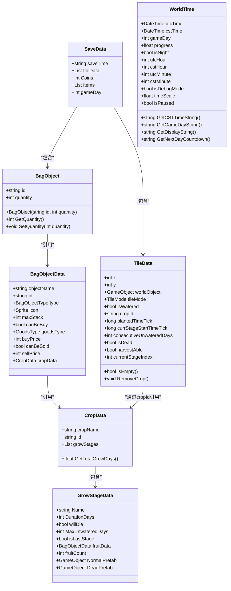
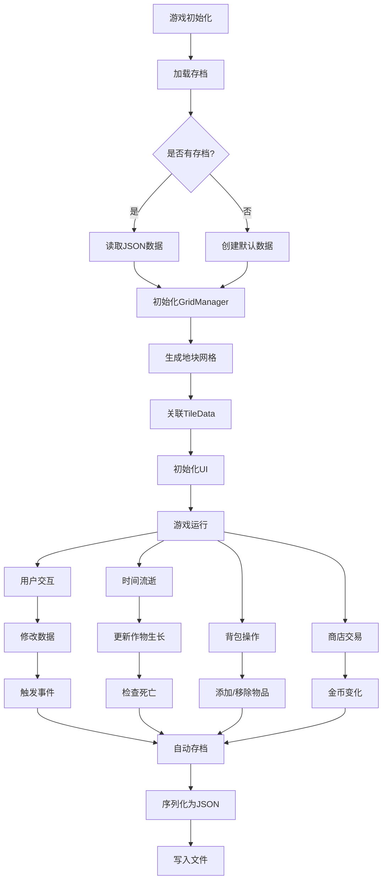

# 数据模型设计

<cite>
**本文档引用的文件**
- [SaveData.cs](file://Assets/Scripts/Data/SaveData.cs)
- [Tile.cs](file://Assets/Scripts/Data/Tile.cs)
- [BagObjectData.cs](file://Assets/Scripts/Data/BagObjectData.cs)
- [CropData.cs](file://Assets/Scripts/Data/CropData.cs)
- [WorldTime.cs](file://Assets/Scripts/Data/WorldTime.cs)
- [Slot.cs](file://Assets/Scripts/Data/Slot.cs)
- [BuyItemGrid.cs](file://Assets/Scripts/Data/BuyItemGrid.cs)
- [ShellItemGrid.cs](file://Assets/Scripts/Data/ShellItemGrid.cs)
- [DraggableItem.cs](file://Assets/Scripts/Data/DraggableItem.cs)
- [SaveManager.cs](file://Assets/Scripts/GameSystem/SaveManager.cs)
- [GridManager.cs](file://Assets/Scripts/GameSystem/GridManager.cs)
- [CropDatabase.cs](file://Assets/Scripts/GameSystem/CropDatabase.cs)
- [BagDatabase.cs](file://Assets/Scripts/GameSystem/BagDatabase.cs)
</cite>

## 目录
1. [简介](#简介)
2. [核心数据模型](#核心数据模型)
3. [数据模型关系图](#数据模型关系图)
4. [UI相关数据模型](#ui相关数据模型)
5. [数据验证规则](#数据验证规则)
6. [数据生命周期](#数据生命周期)
7. [与ScriptableObject和JSON序列化的集成](#与scriptableobject和json序列化的集成)

## 简介
本项目采用基于Unity的组件化数据模型设计，以`SaveData`作为存档根对象，通过JSON序列化实现数据持久化。系统包含地块、作物、背包、商店等核心模块，通过`ScriptableObject`实现配置数据的可视化编辑。数据模型设计注重性能优化，采用延迟存档、字典索引等技术提升运行效率。

## 核心数据模型

### SaveData：存档根对象
`SaveData`类作为游戏存档的根数据结构，包含游戏时间、地块状态和玩家库存等核心信息。该对象通过`SaveManager`进行JSON序列化存储，是游戏状态持久化的基础。

**核心字段：**
- `saveTime`: 存档时间戳
- `tileData`: 地块数据列表，存储所有地块及其作物状态
- `Coins`: 玩家金币数量
- `items`: 背包物品列表
- `gameDay`: 当前游戏天数

**Section sources**
- [SaveData.cs](file://Assets/Scripts/Data/SaveData.cs#L1-L30)

### Tile和TileData：地块数据模型
`TileData`类表示单个地块的状态信息，包含位置坐标、作物生长数据和浇水状态等。`Tile`类作为Unity组件，关联`TileData`并负责视觉更新。

**TileData核心字段：**
- `x`, `y`: 地块坐标
- `worldObject`: 对应的世界实体
- `tileMode`: 地块模式（干燥/已浇水）
- `isWatered`: 是否已浇水
- `cropId`: 作物ID
- `plantedTimeTick`: 种植时间（Ticks）
- `currStageStartTimeTick`: 当前阶段开始时间
- `consecutiveUnwateredDays`: 连续未浇水天数
- `isDead`: 是否已枯死
- `harvestAble`: 是否可收获
- `currentStageIndex`: 当前生长阶段索引

`Tile`类提供`Plant`、`Water`、`Harvest`、`UpRoot`等方法，实现地块的种植、浇水、收获和铲除功能。

**Section sources**
- [Tile.cs](file://Assets/Scripts/Data/Tile.cs#L1-L194)

### BagObjectData：背包物品数据
`BagObjectData`继承自`ScriptableObject`，定义背包中物品的元数据。通过`[CreateAssetMenu]`属性支持在Unity编辑器中创建资源文件。

**核心字段：**
- `objectName`: 物品名称
- `id`: 物品唯一标识符
- `type`: 物品类型（种子/果实/其他）
- `icon`: 物品图标
- `maxStack`: 最大堆叠数量
- `canBeBuy`: 是否可购买
- `buyPrice`: 购买价格
- `canBeSold`: 是否可出售
- `sellPrice`: 出售价格
- `cropData`: 种子特有属性，引用作物数据

`OnValidate`方法在编辑器中自动同步ID为物品名的大写形式，确保数据一致性。

**Section sources**
- [BagObjectData.cs](file://Assets/Scripts/Data/BagObjectData.cs#L1-L151)

### CropData：作物数据模型
`CropData`继承自`ScriptableObject`，定义作物的生长特性和阶段信息。通过`[CreateAssetMenu]`属性支持在Unity编辑器中创建作物配置。

**核心字段：**
- `cropName`: 作物名称
- `id`: 作物唯一标识符
- `growStages`: 生长阶段数据列表

`GrowStageData`类定义单个生长阶段的属性：
- `Name`: 阶段名称
- `DurationDays`: 阶段持续时间（天数）
- `willDie`: 是否可能死亡
- `MaxUnwateredDays`: 最大允许未浇水天数
- `isLastStage`: 是否为最后阶段
- `fruitData`: 果实物品数据
- `fruitCount`: 收获数量
- `NormalPrefab`: 正常状态预制体
- `DeadPrefab`: 死亡状态预制体

`OnValidate`方法自动设置最后一个阶段的`isLastStage`标记，并同步ID为文件名的大写形式。

**Section sources**
- [CropData.cs](file://Assets/Scripts/Data/CropData.cs#L1-L67)

### WorldTime：游戏时间模型
`WorldTime`结构体存储游戏时间和相关状态信息，支持调试模式下的时间缩放和暂停功能。

**核心字段：**
- `utcTime`, `cstTime`: UTC和CST时间
- `gameDay`: 游戏天数
- `progress`: 时间进度
- `isNight`: 是否为夜晚
- `utcHour`, `utcMinute`: UTC时分
- `cstHour`, `cstMinute`: CST时分
- `isDebugMode`: 调试模式
- `timeScale`: 时间缩放
- `isPaused`: 是否暂停

提供`GetCSTTimeString`、`GetGameDayString`等方法生成显示字符串，以及`GetNextDayCountdown`计算距离下一天的倒计时。

**Section sources**
- [WorldTime.cs](file://Assets/Scripts/Data/WorldTime.cs#L1-L43)

## 数据模型关系图

**Diagram sources**
- [SaveData.cs](file://Assets/Scripts/Data/SaveData.cs#L1-L30)
- [Tile.cs](file://Assets/Scripts/Data/Tile.cs#L1-L194)
- [BagObjectData.cs](file://Assets/Scripts/Data/BagObjectData.cs#L1-L151)
- [CropData.cs](file://Assets/Scripts/Data/CropData.cs#L1-L67)
- [WorldTime.cs](file://Assets/Scripts/Data/WorldTime.cs#L1-L43)

## UI相关数据模型

### Slot：槽位模型
`Slot`类表示UI中的槽位，通过检查子对象数量判断槽位是否为空。这种设计避免了手动管理状态可能带来的bug。

**核心属性：**
- `IsEmpty`: 只读属性，通过`transform.childCount == 0`判断

**Section sources**
- [Slot.cs](file://Assets/Scripts/Data/Slot.cs#L1-L12)

### BuyItemGrid：商店物品网格
`BuyItemGrid`类表示商店中的可购买物品，包含UI显示和购买逻辑。

**核心字段：**
- `Icon`, `Name`, `Price`: UI子控件
- `BuyButton`: 购买按钮
- `goods`: 商品数据

`Setup`方法初始化UI显示，`OnBuyButtonClick`处理购买逻辑，包括金币检查、背包更新和UI刷新。

**Section sources**
- [BuyItemGrid.cs](file://Assets/Scripts/Data/BuyItemGrid.cs#L1-L52)

### ShellItemGrid：出售物品网格
`ShellItemGrid`类表示背包中可出售的物品，支持数量选择和批量出售。

**核心字段：**
- `Icon`, `Name`, `Description`: UI子控件
- `ShellButton`, `ShellSlider`, `ShellCount`, `ShellPriceText`: 出售相关控件
- `_item`: 背包物品数据
- `ItemCount`: 当前物品数量
- `SelectedShellCount`: 选择的出售数量
- `ShellPrice`: 出售价格

提供`Setup`、`OnShellSliderValueChange`和`OnShellButtonClick`方法处理UI交互和数据更新。

**Section sources**
- [ShellItemGrid.cs](file://Assets/Scripts/Data/ShellItemGrid.cs#L1-L100)

### DraggableItem：可拖拽物品
`DraggableItem`类实现背包物品的拖拽功能，继承自`IBeginDragHandler`、`IDragHandler`和`IEndDragHandler`。

**核心字段：**
- `Icon`, `Amount`: UI显示
- `itemData`: 背包物品数据
- `originalParent`: 原始父对象

`OnBeginDrag`、`OnDrag`和`OnEndDrag`方法处理拖拽的开始、过程和结束，支持物品交换功能。

**Section sources**
- [DraggableItem.cs](file://Assets/Scripts/Data/DraggableItem.cs#L1-L87)

## 数据验证规则
系统通过多种机制确保数据有效性：

1. **作物生长阶段验证**：`CropDatabase.GetStageIndex`方法根据当前时间和阶段持续时间计算正确阶段，确保阶段转换的准确性。

2. **物品堆叠验证**：`BagDatabase.AddItem`方法检查物品是否可堆叠，避免超过最大堆叠数量。

3. **购买验证**：`BuyItemGrid.OnBuyButtonClick`检查玩家金币是否足够，防止负值。

4. **出售验证**：`ShellItemGrid.OnShellButtonClick`通过`Slider`限制出售数量在有效范围内。

5. **数据清理**：`BagDatabase.AutoLoadBagData`在加载存档时清理数量为0的物品，保持数据整洁。

6. **ID同步**：`BagObjectData`和`CropData`的`OnValidate`方法自动同步ID，确保标识符一致性。

**Section sources**
- [CropDatabase.cs](file://Assets/Scripts/GameSystem/CropDatabase.cs#L1-L110)
- [BagDatabase.cs](file://Assets/Scripts/GameSystem/BagDatabase.cs#L1-L118)
- [BuyItemGrid.cs](file://Assets/Scripts/Data/BuyItemGrid.cs#L1-L52)
- [ShellItemGrid.cs](file://Assets/Scripts/Data/ShellItemGrid.cs#L1-L100)

## 数据生命周期
数据模型的生命周期包括初始化、运行时修改和持久化三个阶段：

**Diagram sources**
- [SaveManager.cs](file://Assets/Scripts/GameSystem/SaveManager.cs#L1-L73)
- [GridManager.cs](file://Assets/Scripts/GameSystem/GridManager.cs#L1-L179)
- [BagDatabase.cs](file://Assets/Scripts/GameSystem/BagDatabase.cs#L1-L118)

## 与ScriptableObject和JSON序列化的集成

### ScriptableObject集成
系统广泛使用`ScriptableObject`实现配置数据的可视化编辑：

1. **BagObjectData**：通过`[CreateAssetMenu(fileName = "NewBagObject", menuName = "Inventory/Bag Object")]`属性，在Unity编辑器中创建背包物品资源。

2. **CropData**：通过`[CreateAssetMenu(fileName = "NewCropData", menuName = "Farming/Crop Data")]`属性，在Unity编辑器中创建作物配置资源。

3. **编辑器扩展**：使用`[CustomPropertyDrawer]`和`[ShowWhen]`属性实现条件字段显示，提升编辑体验。

4. **自动收集**：`CropDatabase.FindAllCrops`方法在编辑器中自动收集Resources/Farming目录下的所有作物配置。

### JSON序列化集成
系统使用Unity的`JsonUtility`实现数据持久化：

1. **SaveManager**：提供`AutoSave`和`AutoLoad`方法，将`SaveData`对象序列化为JSON并存储到`Application.persistentDataPath`。

2. **自动存档**：`GridManager.AutoSaveTileCropData`和`BagDatabase.AutoSaveBagData`在数据变化时触发自动存档。

3. **延迟存档**：`BagDatabase.AutoSaveBagData`使用协程等待一帧后再存档，确保同一帧内所有逻辑执行完毕，避免数据不一致。

4. **存档路径**：使用`Path.Combine(Application.persistentDataPath, slotName + ".json")`生成存档文件路径。

5. **存档事件**：`GridManager.DataChange`和`BagDatabase.BagItemsChange`事件在数据变化时触发，通知系统进行存档。

**Section sources**
- [SaveManager.cs](file://Assets/Scripts/GameSystem/SaveManager.cs#L1-L73)
- [GridManager.cs](file://Assets/Scripts/GameSystem/GridManager.cs#L1-L179)
- [BagDatabase.cs](file://Assets/Scripts/GameSystem/BagDatabase.cs#L1-L118)
- [BagObjectData.cs](file://Assets/Scripts/Data/BagObjectData.cs#L1-L151)
- [CropData.cs](file://Assets/Scripts/Data/CropData.cs#L1-L67)