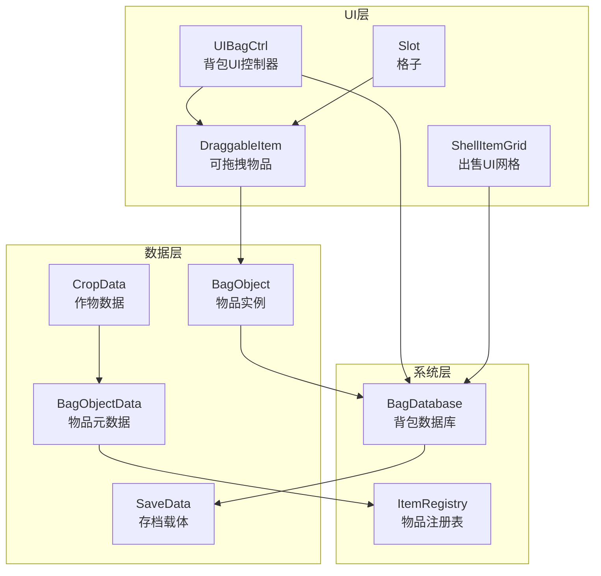
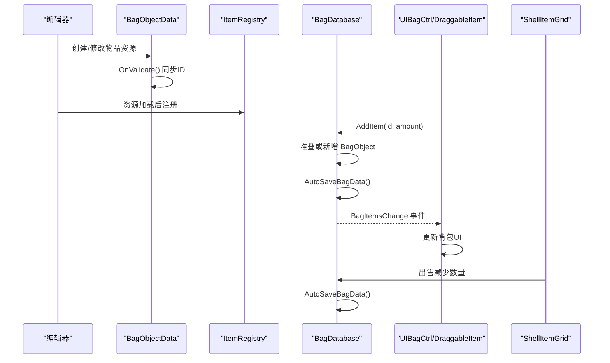
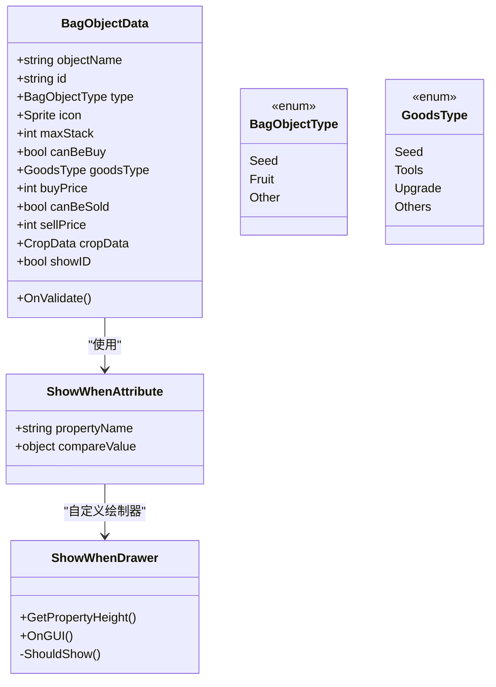
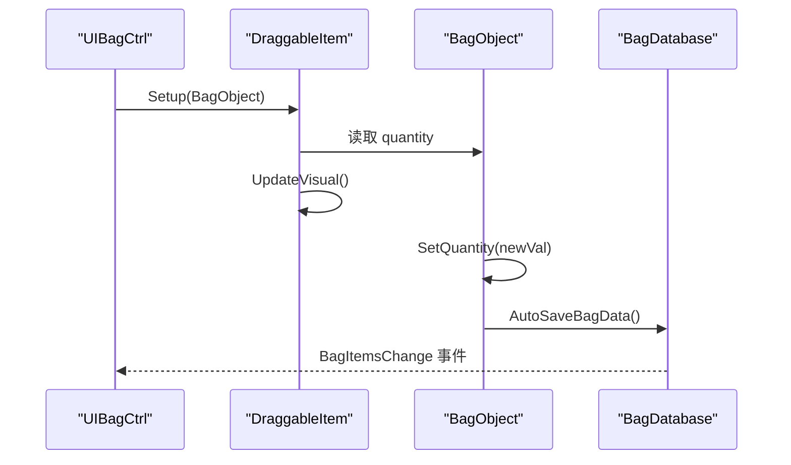
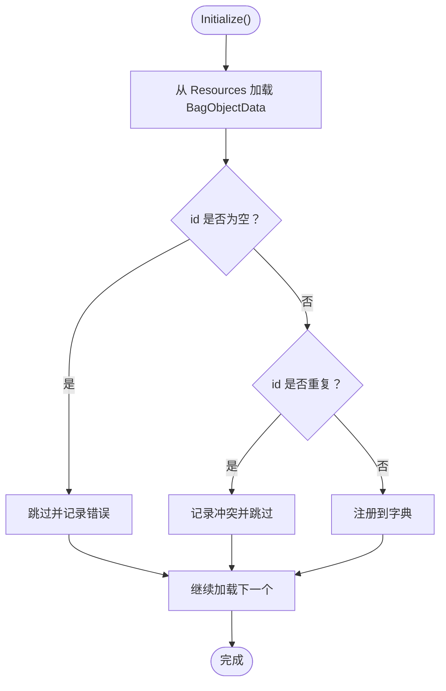
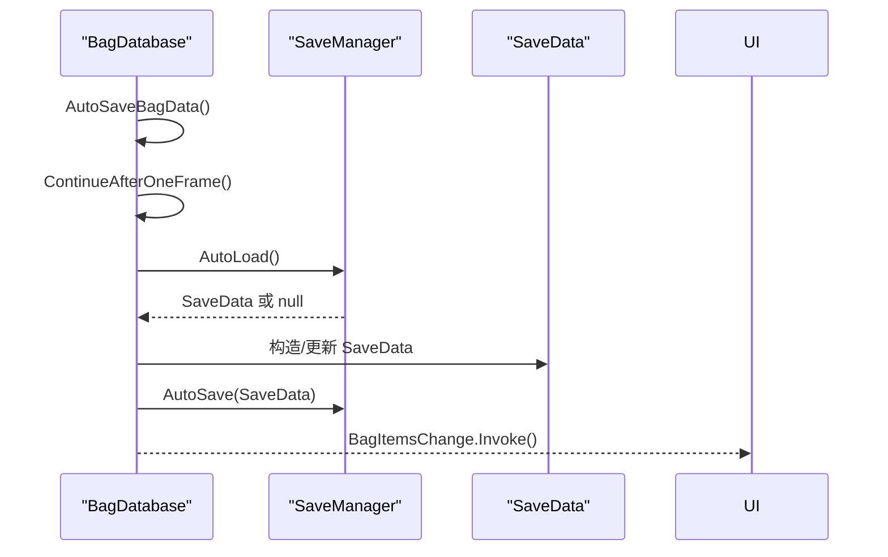
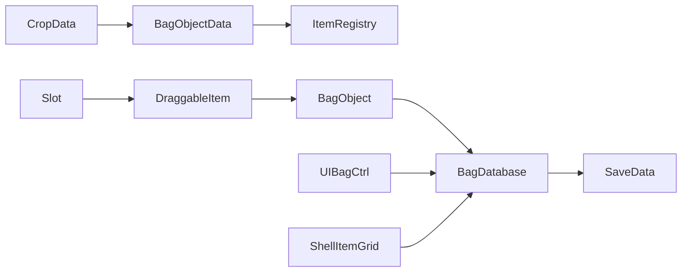

# 背包物品数据模型 (BagObjectData)

<cite>
**本文引用的文件**
- [BagObjectData.cs](file://Assets/Scripts/Data/BagObjectData.cs)
- [CropData.cs](file://Assets/Scripts/Data/CropData.cs)
- [BagDatabase.cs](file://Assets/Scripts/GameSystem/BagDatabase.cs)
- [ItemRegistry.cs](file://Assets/Scripts/GameSystem/ItemRegistry.cs)
- [UIBagCtrl.cs](file://Assets/Scripts/UI/UIBagCtrl.cs)
- [DraggableItem.cs](file://Assets/Scripts/Data/DraggableItem.cs)
- [Slot.cs](file://Assets/Scripts/Data/Slot.cs)
- [SaveData.cs](file://Assets/Scripts/Data/SaveData.cs)
- [ShellItemGrid.cs](file://Assets/Scripts/Data/ShellItemGrid.cs)
</cite>

## 目录
1. [简介](#简介)
2. [项目结构](#项目结构)
3. [核心组件](#核心组件)
4. [架构总览](#架构总览)
5. [详细组件分析](#详细组件分析)
6. [依赖关系分析](#依赖关系分析)
7. [性能考量](#性能考量)
8. [故障排查指南](#故障排查指南)
9. [结论](#结论)
10. [附录](#附录)

## 简介
本文件围绕背包物品数据模型的核心——BagObjectData ScriptableObject，系统性梳理其字段与行为，解释经济属性与种子特有属性，解析编辑器条件显示属性 ShowWhenAttribute 的工作原理，说明 OnValidate 如何自动同步 ID，阐述 BagObjectType 与 GoodsType 枚举的作用，以及 BagObject 类如何与 BagObjectData 配合形成背包中的实际物品实例。同时，说明 SetQuantity 如何触发 BagDatabase 的自动存档，并给出种子与果实的完整配置案例，最后提供扩展新物品类型的实践建议。

## 项目结构
背包系统涉及数据层、系统层与 UI 层的协同：
- 数据层：BagObjectData（物品元数据）、CropData（作物数据）、BagObject（物品实例）、SaveData（存档载体）
- 系统层：BagDatabase（背包数据库）、ItemRegistry（物品注册表）
- UI 层：UIBagCtrl（背包界面控制器）、DraggableItem（可拖拽物品）、Slot（格子）

图表来源
- [BagObjectData.cs](file://Assets/Scripts/Data/BagObjectData.cs#L1-L151)
- [CropData.cs](file://Assets/Scripts/Data/CropData.cs#L1-L67)
- [BagDatabase.cs](file://Assets/Scripts/GameSystem/BagDatabase.cs#L1-L118)
- [ItemRegistry.cs](file://Assets/Scripts/GameSystem/ItemRegistry.cs#L1-L34)
- [UIBagCtrl.cs](file://Assets/Scripts/UI/UIBagCtrl.cs#L1-L105)
- [DraggableItem.cs](file://Assets/Scripts/Data/DraggableItem.cs#L1-L87)
- [Slot.cs](file://Assets/Scripts/Data/Slot.cs#L1-L12)
- [SaveData.cs](file://Assets/Scripts/Data/SaveData.cs#L1-L30)
- [ShellItemGrid.cs](file://Assets/Scripts/Data/ShellItemGrid.cs#L1-L99)

章节来源
- [BagObjectData.cs](file://Assets/Scripts/Data/BagObjectData.cs#L1-L151)
- [BagDatabase.cs](file://Assets/Scripts/GameSystem/BagDatabase.cs#L1-L118)
- [ItemRegistry.cs](file://Assets/Scripts/GameSystem/ItemRegistry.cs#L1-L34)
- [UIBagCtrl.cs](file://Assets/Scripts/UI/UIBagCtrl.cs#L1-L105)
- [DraggableItem.cs](file://Assets/Scripts/Data/DraggableItem.cs#L1-L87)
- [Slot.cs](file://Assets/Scripts/Data/Slot.cs#L1-L12)
- [SaveData.cs](file://Assets/Scripts/Data/SaveData.cs#L1-L30)
- [ShellItemGrid.cs](file://Assets/Scripts/Data/ShellItemGrid.cs#L1-L99)

## 核心组件
- BagObjectData：定义物品元数据，包含基础信息、经济信息、种子特有属性、编辑器辅助字段与条件显示逻辑。
- BagObject：封装物品实例的 id 与 quantity，提供 SetQuantity 并触发自动存档。
- BagDatabase：维护玩家物品列表、金币、事件与自动存档/读档。
- ItemRegistry：集中注册与查询 BagObjectData，保证 id 唯一性。
- CropData：描述作物的生长阶段与收获产物，与种子类型物品关联。
- UI 组件：UIBagCtrl、DraggableItem、Slot、ShellItemGrid，负责可视化与交互。

章节来源
- [BagObjectData.cs](file://Assets/Scripts/Data/BagObjectData.cs#L1-L151)
- [BagDatabase.cs](file://Assets/Scripts/GameSystem/BagDatabase.cs#L1-L118)
- [ItemRegistry.cs](file://Assets/Scripts/GameSystem/ItemRegistry.cs#L1-L34)
- [CropData.cs](file://Assets/Scripts/Data/CropData.cs#L1-L67)
- [UIBagCtrl.cs](file://Assets/Scripts/UI/UIBagCtrl.cs#L1-L105)
- [DraggableItem.cs](file://Assets/Scripts/Data/DraggableItem.cs#L1-L87)
- [Slot.cs](file://Assets/Scripts/Data/Slot.cs#L1-L12)
- [SaveData.cs](file://Assets/Scripts/Data/SaveData.cs#L1-L30)
- [ShellItemGrid.cs](file://Assets/Scripts/Data/ShellItemGrid.cs#L1-L99)

## 架构总览
背包系统遵循“数据模型 + 注册表 + 数据库 + UI”的分层设计。BagObjectData 作为 ScriptableObject 提供只读元数据；BagObject 作为运行时实例承载数量；BagDatabase 负责增删改查与持久化；ItemRegistry 提供统一查询入口；UI 层通过事件与数据库联动展示与交互。

图表来源
- [BagObjectData.cs](file://Assets/Scripts/Data/BagObjectData.cs#L38-L47)
- [ItemRegistry.cs](file://Assets/Scripts/GameSystem/ItemRegistry.cs#L1-L34)
- [BagDatabase.cs](file://Assets/Scripts/GameSystem/BagDatabase.cs#L35-L65)
- [UIBagCtrl.cs](file://Assets/Scripts/UI/UIBagCtrl.cs#L64-L103)
- [DraggableItem.cs](file://Assets/Scripts/Data/DraggableItem.cs#L18-L31)
- [ShellItemGrid.cs](file://Assets/Scripts/Data/ShellItemGrid.cs#L73-L90)

## 详细组件分析

### BagObjectData：物品元数据模型
- 字段与用途
  - objectName：物品名称（用于编辑器与显示）
  - id：唯一标识符（编辑器 OnValidate 自动同步为 objectName 的大写形式）
  - type：物品类型（枚举，区分种子、果实、其他）
  - icon：物品图标
  - maxStack：最大堆叠数量
  - canBeBuy/canBeSold：是否可购买/可出售
  - buyPrice/sellPrice：购买/出售价格
  - cropData：种子特有属性，指向 CropData 引用
  - showID：编辑器开关，控制是否显示 id 字段
- 条件显示属性 ShowWhenAttribute
  - 通过 [ShowWhen("propertyName", compareValue)] 控制字段显示
  - 编辑器自定义绘制器 ShowWhenDrawer 根据条件属性值决定字段可见性
- OnValidate 自动同步 ID
  - 在编辑器中，若 id 与 objectName 不一致，自动将 id 设为 objectName 的大写形式，并标记资源脏
- 枚举
  - BagObjectType：Seed/Fruit/Other
  - GoodsType：Seed/Tools/Upgrade/Others（用于商店货物分类）

图表来源
- [BagObjectData.cs](file://Assets/Scripts/Data/BagObjectData.cs#L12-L95)
- [BagObjectData.cs](file://Assets/Scripts/Data/BagObjectData.cs#L100-L126)

章节来源
- [BagObjectData.cs](file://Assets/Scripts/Data/BagObjectData.cs#L12-L95)
- [BagObjectData.cs](file://Assets/Scripts/Data/BagObjectData.cs#L100-L126)

### BagObject：物品实例与自动存档
- 结构
  - id：引用 BagObjectData 的唯一标识
  - quantity：物品数量
  - SetQuantity：设置数量并触发 BagDatabase 的自动存档
- 行为
  - SetQuantity 内部调用 BagDatabase.Instance.AutoSaveBagData()，确保数据变更后持久化

图表来源
- [UIBagCtrl.cs](file://Assets/Scripts/UI/UIBagCtrl.cs#L64-L103)
- [DraggableItem.cs](file://Assets/Scripts/Data/DraggableItem.cs#L18-L31)
- [BagObject.cs](file://Assets/Scripts/Data/BagObjectData.cs#L135-L151)
- [BagDatabase.cs](file://Assets/Scripts/GameSystem/BagDatabase.cs#L67-L87)

章节来源
- [BagObjectData.cs](file://Assets/Scripts/Data/BagObjectData.cs#L135-L151)
- [BagDatabase.cs](file://Assets/Scripts/GameSystem/BagDatabase.cs#L67-L87)
- [UIBagCtrl.cs](file://Assets/Scripts/UI/UIBagCtrl.cs#L64-L103)
- [DraggableItem.cs](file://Assets/Scripts/Data/DraggableItem.cs#L18-L31)

### ItemRegistry：物品注册与查询
- 初始化：在场景加载前从 Resources 中加载所有 BagObjectData，校验 id 唯一性并建立映射
- 查询：提供 Get/Contains/All 接口，UI 与系统层通过 id 快速获取物品元数据

图表来源
- [ItemRegistry.cs](file://Assets/Scripts/GameSystem/ItemRegistry.cs#L1-L34)

章节来源
- [ItemRegistry.cs](file://Assets/Scripts/GameSystem/ItemRegistry.cs#L1-L34)

### BagDatabase：背包数据库与自动存档
- 数据结构：Coins、List<BagObject> items
- 关键方法
  - AddItem/DecreaseItem：按 id 查找并堆叠或新增/减少数量
  - AutoSaveBagData：等待一帧后合并当前数据到 SaveData 并调用 SaveManager 自动保存
  - AutoLoadBagData：从 SaveManager 读取存档，清理数量为 0 的物品并触发 UI 刷新
- 事件：BagItemsChange 用于通知 UI 刷新

图表来源
- [BagDatabase.cs](file://Assets/Scripts/GameSystem/BagDatabase.cs#L67-L112)
- [SaveData.cs](file://Assets/Scripts/Data/SaveData.cs#L11-L30)

章节来源
- [BagDatabase.cs](file://Assets/Scripts/GameSystem/BagDatabase.cs#L1-L118)
- [SaveData.cs](file://Assets/Scripts/Data/SaveData.cs#L11-L30)

### UI 层：背包与出售交互
- UIBagCtrl：生成槽位、初始化物品、处理堆叠与新增槽位
- DraggableItem：绑定 BagObject，显示图标与数量，支持拖拽与交换
- Slot：通过子对象是否存在判断是否为空
- ShellItemGrid：出售界面，根据物品 sellPrice 与数量计算总价并减少数据库中的数量

章节来源
- [UIBagCtrl.cs](file://Assets/Scripts/UI/UIBagCtrl.cs#L1-L105)
- [DraggableItem.cs](file://Assets/Scripts/Data/DraggableItem.cs#L1-L87)
- [Slot.cs](file://Assets/Scripts/Data/Slot.cs#L1-L12)
- [ShellItemGrid.cs](file://Assets/Scripts/Data/ShellItemGrid.cs#L1-L99)

## 依赖关系分析
- BagObjectData 依赖 ShowWhenAttribute 与自定义绘制器实现编辑器条件显示
- BagObjectData 与 CropData 关联（种子类型物品引用作物数据）
- BagObject 与 BagDatabase 协作，SetQuantity 触发自动存档
- ItemRegistry 依赖 BagObjectData 的 id 唯一性，为 UI 与系统层提供查询接口
- UI 层通过 BagDatabase 事件与数据库联动

图表来源
- [BagObjectData.cs](file://Assets/Scripts/Data/BagObjectData.cs#L1-L151)
- [CropData.cs](file://Assets/Scripts/Data/CropData.cs#L1-L67)
- [ItemRegistry.cs](file://Assets/Scripts/GameSystem/ItemRegistry.cs#L1-L34)
- [BagDatabase.cs](file://Assets/Scripts/GameSystem/BagDatabase.cs#L1-L118)
- [UIBagCtrl.cs](file://Assets/Scripts/UI/UIBagCtrl.cs#L1-L105)
- [DraggableItem.cs](file://Assets/Scripts/Data/DraggableItem.cs#L1-L87)
- [Slot.cs](file://Assets/Scripts/Data/Slot.cs#L1-L12)
- [ShellItemGrid.cs](file://Assets/Scripts/Data/ShellItemGrid.cs#L1-L99)

章节来源
- [BagObjectData.cs](file://Assets/Scripts/Data/BagObjectData.cs#L1-L151)
- [CropData.cs](file://Assets/Scripts/Data/CropData.cs#L1-L67)
- [ItemRegistry.cs](file://Assets/Scripts/GameSystem/ItemRegistry.cs#L1-L34)
- [BagDatabase.cs](file://Assets/Scripts/GameSystem/BagDatabase.cs#L1-L118)
- [UIBagCtrl.cs](file://Assets/Scripts/UI/UIBagCtrl.cs#L1-L105)
- [DraggableItem.cs](file://Assets/Scripts/Data/DraggableItem.cs#L1-L87)
- [Slot.cs](file://Assets/Scripts/Data/Slot.cs#L1-L12)
- [ShellItemGrid.cs](file://Assets/Scripts/Data/ShellItemGrid.cs#L1-L99)

## 性能考量
- 自动存档采用“等待一帧”策略，避免跨帧数据竞争，提高一致性
- ItemRegistry 使用字典查询，Get/Contains/All 均为 O(1) 查找
- BagDatabase 对物品列表的查找使用 LINQ FirstOrDefault，建议在物品量较大时考虑更高效的数据结构或缓存
- UI 层在 AddItem 时优先堆叠，减少 UI 重建次数

[本节为通用性能建议，不直接分析具体文件]

## 故障排查指南
- ID 冲突
  - 现象：日志提示物品 ID 冲突
  - 处理：确保每个 BagObjectData 的 id 唯一
  - 参考路径：[ItemRegistry.cs](file://Assets/Scripts/GameSystem/ItemRegistry.cs#L17-L24)
- ID 为空
  - 现象：日志提示物品 id 为空
  - 处理：检查资源是否正确创建并填写 objectName
  - 参考路径：[ItemRegistry.cs](file://Assets/Scripts/GameSystem/ItemRegistry.cs#L17-L20)
- OnValidate 未生效
  - 现象：编辑器中 id 未自动同步
  - 处理：确认资源保存后再次进入编辑器，OnValidate 在资源被验证时触发
  - 参考路径：[BagObjectData.cs](file://Assets/Scripts/Data/BagObjectData.cs#L38-L47)
- 条件字段不显示
  - 现象：canBeBuy/canBeSold/type 等字段未按预期显示
  - 处理：检查 ShowWhen 的 propertyName 与 compareValue 是否匹配当前值
  - 参考路径：[BagObjectData.cs](file://Assets/Scripts/Data/BagObjectData.cs#L48-L95)
- 出售后数量未更新
  - 现象：出售界面数量不变
  - 处理：确认 ShellItemGrid 是否调用 BagDatabase.DecreaseItem 并触发 UI 更新
  - 参考路径：[ShellItemGrid.cs](file://Assets/Scripts/Data/ShellItemGrid.cs#L73-L90)

章节来源
- [ItemRegistry.cs](file://Assets/Scripts/GameSystem/ItemRegistry.cs#L17-L24)
- [BagObjectData.cs](file://Assets/Scripts/Data/BagObjectData.cs#L38-L47)
- [BagObjectData.cs](file://Assets/Scripts/Data/BagObjectData.cs#L48-L95)
- [ShellItemGrid.cs](file://Assets/Scripts/Data/ShellItemGrid.cs#L73-L90)

## 结论
BagObjectData 作为背包系统的元数据核心，通过清晰的字段划分与编辑器增强（ShowWhenAttribute、OnValidate），显著提升了配置效率与一致性。结合 BagObject 的实例化与 BagDatabase 的自动存档机制，形成了稳定的数据流闭环。ItemRegistry 提供高效的查询能力，UI 层通过事件与数据库联动实现直观的交互体验。整体架构层次清晰、职责明确，易于扩展与维护。

[本节为总结性内容，不直接分析具体文件]

## 附录

### 字段与枚举说明
- objectName：物品名称（用于显示与编辑器）
- id：唯一标识符（编辑器 OnValidate 自动同步为 objectName 的大写形式）
- type：物品类型（Seed/Fruit/Other）
- icon：物品图标
- maxStack：最大堆叠数量
- canBeBuy/canBeSold：是否可购买/可出售
- buyPrice/sellPrice：购买/出售价格
- cropData：种子特有属性，指向 CropData
- goodsType：商店货物分类（Seed/Tools/Upgrade/Others）

章节来源
- [BagObjectData.cs](file://Assets/Scripts/Data/BagObjectData.cs#L12-L33)
- [BagObjectData.cs](file://Assets/Scripts/Data/BagObjectData.cs#L111-L126)

### 完整配置案例

- 种子配置步骤
  1) 创建 CropData 资源，配置作物名称、id、生长阶段列表（至少包含一个最终阶段）
  2) 在 GrowStageData 的最终阶段设置 fruitData 与 fruitCount
  3) 创建 BagObjectData 资源，设置 objectName、type 为 Seed、icon、maxStack
  4) 将 cropData 指向对应的 CropData
  5) 保存资源并在编辑器中确认 OnValidate 已同步 id
  6) 在 ItemRegistry 初始化后即可通过 id 获取该种子数据

- 果实配置步骤
  1) 在 GrowStageData 的最终阶段设置 fruitData 指向该果实的 BagObjectData
  2) 在 BagObjectData 中设置 canBeSold、sellPrice 等经济属性
  3) 保存资源并在编辑器中确认 OnValidate 已同步 id

章节来源
- [CropData.cs](file://Assets/Scripts/Data/CropData.cs#L1-L67)
- [BagObjectData.cs](file://Assets/Scripts/Data/BagObjectData.cs#L12-L33)

### 扩展新物品类型的实践建议
- 新增枚举值
  - 在 BagObjectType 或 GoodsType 中添加新类型（如 Tool、ToolUpgrade 等）
  - 参考路径：[BagObjectData.cs](file://Assets/Scripts/Data/BagObjectData.cs#L111-L126)
- 新增条件字段
  - 使用 [ShowWhen("propertyName", compareValue)] 为新类型添加专属字段
  - 参考路径：[BagObjectData.cs](file://Assets/Scripts/Data/BagObjectData.cs#L16-L33)
- 新增特有数据
  - 为新类型创建专用 ScriptableObject（如 ToolData），并在 BagObjectData 中添加引用字段
  - 在 UI 与系统层增加对该类型的处理逻辑
- 验证与测试
  - 使用 ItemRegistry 的 Get/Contains 接口验证 id 唯一性
  - 通过 BagDatabase 的 AddItem/DecreaseItem 测试堆叠与存档
  - 参考路径：[ItemRegistry.cs](file://Assets/Scripts/GameSystem/ItemRegistry.cs#L1-L34)，[BagDatabase.cs](file://Assets/Scripts/GameSystem/BagDatabase.cs#L35-L65)

章节来源
- [BagObjectData.cs](file://Assets/Scripts/Data/BagObjectData.cs#L111-L126)
- [ItemRegistry.cs](file://Assets/Scripts/GameSystem/ItemRegistry.cs#L1-L34)
- [BagDatabase.cs](file://Assets/Scripts/GameSystem/BagDatabase.cs#L35-L65)