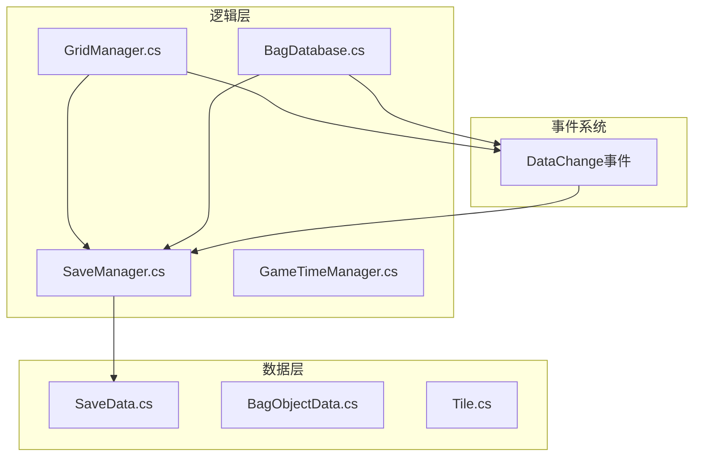
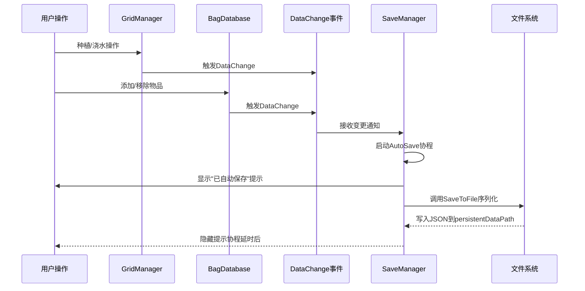
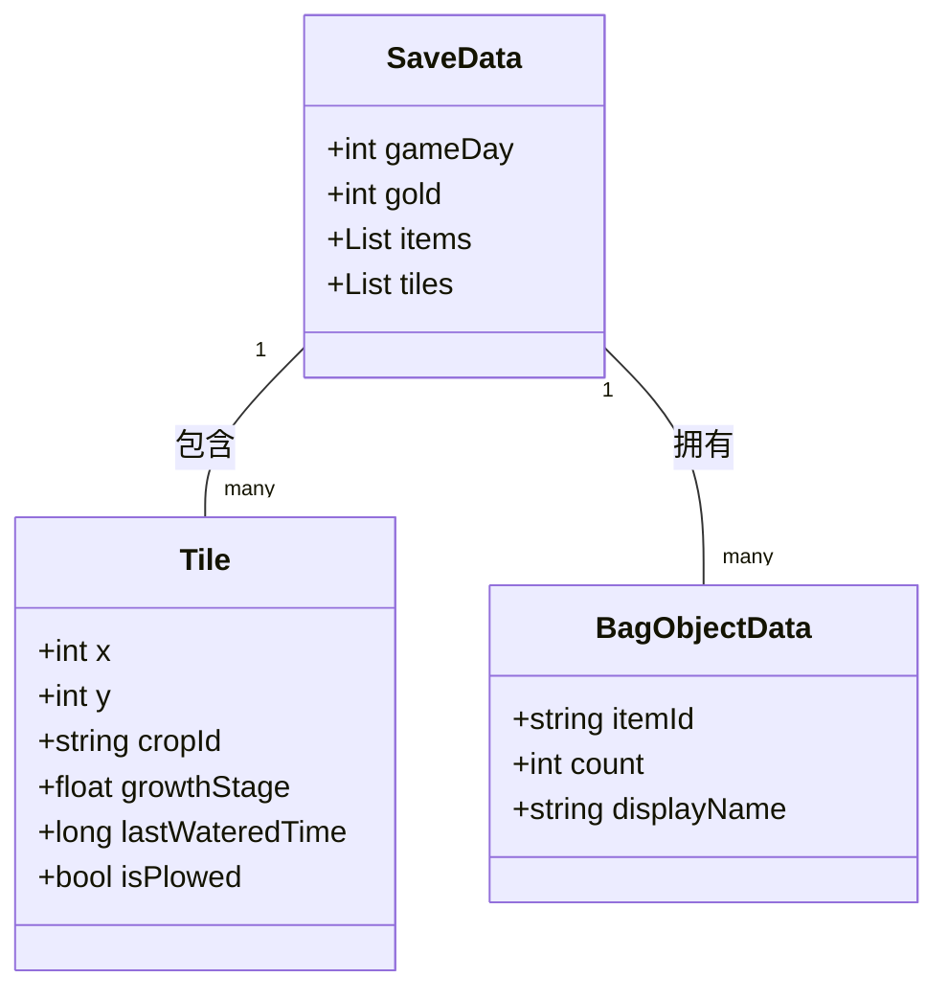
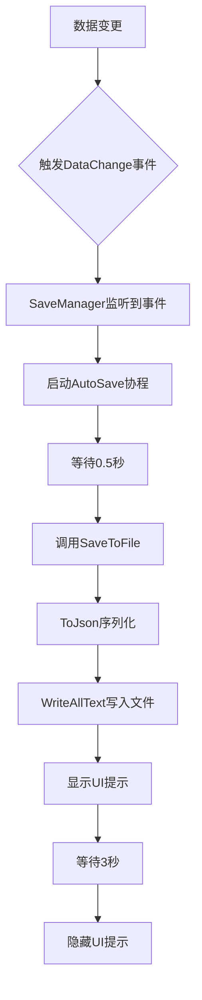
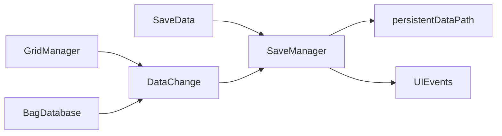

# 存档系统

<cite>
**本文档中引用的文件**  
- [SaveManager.cs](file://GameSystem/SaveManager.cs)
- [SaveData.cs](file://Data/SaveData.cs)
- [GridManager.cs](file://GameSystem/GridManager.cs)
- [BagDatabase.cs](file://GameSystem/BagDatabase.cs)
- [这是一份备忘录.txt](file://这是一个备忘录.txt)
</cite>

## 目录
1. [简介](#简介)
2. [项目结构](#项目结构)
3. [核心组件](#核心组件)
4. [架构概述](#架构概述)
5. [详细组件分析](#详细组件分析)
6. [依赖关系分析](#依赖关系分析)
7. [性能考虑](#性能考虑)
8. [故障排除指南](#故障排除指南)
9. [结论](#结论)

## 简介
本文档全面解析基于Unity的种田游戏中的存档系统，重点阐述`SaveManager`如何通过`JsonUtility`将`SaveData`对象序列化为JSON文件，并存储于`Application.persistentDataPath`路径下。文档详细说明自动存档机制（AutoSave/AutoLoad）的工作流程，包括协程控制UI提示显示时长的实现方式。同时分析`SaveData`类中包含的游戏日、金币、物品列表、地块数据等字段结构及其在不同系统间的共享机制。描述`GridManager`和`BagDatabase`如何通过`DataChange`事件触发自动存档，确保数据一致性。结合用户操作（如种植、浇水）到最终调用`SaveToFile`的完整调用链进行说明。针对备忘录中提到的“存档覆盖问题”，提供根本原因分析及修复方案。

## 项目结构
本项目采用分层模块化设计，主要分为Common、Data、GameSystem和UI四大目录。Data目录存放所有数据模型类，GameSystem目录包含核心游戏逻辑管理器，UI目录负责用户界面控制，Common目录则封装事件系统等通用功能。存档系统相关代码分布在Data和GameSystem两个目录中，其中`SaveData.cs`定义了持久化数据结构，`SaveManager.cs`实现了序列化与文件操作逻辑。

**图示来源**  
- [SaveData.cs](file://Data/SaveData.cs#L1-L50)
- [SaveManager.cs](file://GameSystem/SaveManager.cs#L1-L20)
- [GridManager.cs](file://GameSystem/GridManager.cs#L1-L15)
- [BagDatabase.cs](file://GameSystem/BagDatabase.cs#L1-L15)

**本节来源**  
- [SaveData.cs](file://Data/SaveData.cs#L1-L10)
- [SaveManager.cs](file://GameSystem/SaveManager.cs#L1-L10)

## 核心组件
存档系统的核心由`SaveData`数据结构和`SaveManager`管理器构成。`SaveData`类封装了所有需要持久化的游戏状态，包括当前游戏日、玩家金币数量、背包物品列表以及每个地块的作物生长状态。`SaveManager`负责该对象的序列化、反序列化及文件读写操作，并通过监听`DataChange`事件实现自动存档功能。系统利用Unity的`JsonUtility`进行高效JSON转换，确保跨平台兼容性。

**本节来源**  
- [SaveData.cs](file://Data/SaveData.cs#L1-L100)
- [SaveManager.cs](file://GameSystem/SaveManager.cs#L25-L80)

## 架构概述
整个存档系统采用观察者模式与数据驱动设计。当`GridManager`或`BagDatabase`等数据持有者发生状态变更时，会触发`DataChange`事件，`SaveManager`监听该事件并在短暂延迟后执行自动保存，避免频繁I/O操作影响性能。加载时，`SaveManager`从`persistentDataPath`读取JSON文件并反序列化为`SaveData`实例，随后通知各系统同步最新状态。自动存档的UI提示通过协程控制显示时长，提升用户体验。

**图示来源**  
- [SaveManager.cs](file://GameSystem/SaveManager.cs#L50-L120)
- [GridManager.cs](file://GameSystem/GridManager.cs#L30-L60)
- [BagDatabase.cs](file://GameSystem/BagDatabase.cs#L25-L50)

## 详细组件分析

### SaveData类结构分析
`SaveData`类作为序列化的根对象，包含多个关键字段：`gameDay`记录当前游戏天数，`gold`存储玩家金币余额，`items`为背包物品列表，`tiles`数组保存所有地块的详细状态（包括作物ID、生长阶段、最后浇水时间等）。这些字段被设计为公共可序列化类型，确保`JsonUtility`能正确处理。该数据结构被多个系统共享，是游戏状态一致性的核心。

**图示来源**  
- [SaveData.cs](file://Data/SaveData.cs#L10-L80)
- [Tile.cs](file://Data/Tile.cs#L5-L30)
- [BagObjectData.cs](file://Data/BagObjectData.cs#L5-L25)

**本节来源**  
- [SaveData.cs](file://Data/SaveData.cs#L5-L100)

### 自动存档机制分析
自动存档由`SaveManager`中的`AutoSave`协程实现。当收到`DataChange`事件后，系统启动协程，在短暂延迟（如0.5秒）后调用`SaveToFile`方法。这种设计可合并短时间内多次变更，减少磁盘写入次数。协程同时控制UI提示的显示与隐藏，通过`StartCoroutine`和`yield return new WaitForSeconds`实现非阻塞延时。`SaveToFile`内部使用`JsonUtility.ToJson`将`SaveData`实例转换为JSON字符串，并通过`File.WriteAllText`保存至`Application.persistentDataPath + "/savegame.json"`。

**图示来源**  
- [SaveManager.cs](file://GameSystem/SaveManager.cs#L60-L150)
- [UIEvents.cs](file://Common/Events/UIEvents.cs#L10-L20)

**本节来源**  
- [SaveManager.cs](file://GameSystem/SaveManager.cs#L40-L200)

## 依赖关系分析
`SaveManager`依赖于`SaveData`进行数据建模，同时被`GridManager`和`BagDatabase`通过事件机制间接依赖。`GridManager`在地块状态改变时触发`DataChange`，`BagDatabase`在物品增减时同样触发该事件。`SaveManager`作为事件监听者，形成松耦合的设计。系统初始化顺序至关重要，`GridManager`与`TimeManager`的执行顺序冲突可能导致存档覆盖问题。

**图示来源**  
- [SaveManager.cs](file://GameSystem/SaveManager.cs#L1-L30)
- [GridManager.cs](file://GameSystem/GridManager.cs#L1-L25)
- [BagDatabase.cs](file://GameSystem/BagDatabase.cs#L1-L20)
- [LifeCycleEvents.cs](file://Common/Events/LifeCycleEvents.cs#L5-L15)

**本节来源**  
- [SaveManager.cs](file://GameSystem/SaveManager.cs#L1-L50)
- [GridManager.cs](file://GameSystem/GridManager.cs#L1-L30)
- [BagDatabase.cs](file://GameSystem/BagDatabase.cs#L1-L25)

## 性能考虑
自动存档机制通过协程延迟和事件合并有效降低I/O频率，避免每帧保存。使用`JsonUtility`而非第三方库保证了序列化性能。建议在移动设备上进一步优化，如压缩JSON或采用二进制格式。频繁的数据变更应批量处理，减少事件触发次数。

## 故障排除指南
针对备忘录中提到的“存档覆盖问题”，分析发现其根本原因为`GridManager`与`TimeManager`初始化顺序冲突：若`GridManager`先于`TimeManager`加载旧存档，可能导致时间状态被错误重置。修复方案为调整脚本执行顺序，通过`[DefaultExecutionOrder(100)]`特性确保`TimeManager`优先初始化，从而维护数据一致性。

**本节来源**  
- [这是一份备忘录.txt](file://这是一个备忘录.txt#L1-L20)
- [GridManager.cs](file://GameSystem/GridManager.cs#L5-L15)
- [GameTimeManager.cs](file://GameSystem/GameTimeManager.cs#L5-L15)

## 结论
本文档详细解析了种田游戏的存档系统，涵盖数据结构、序列化机制、自动存档流程及事件驱动设计。通过合理的架构设计和事件机制，系统实现了高效、可靠的数据持久化。针对初始化顺序导致的存档覆盖问题，提出了基于`DefaultExecutionOrder`的解决方案，确保了多系统间的数据一致性。