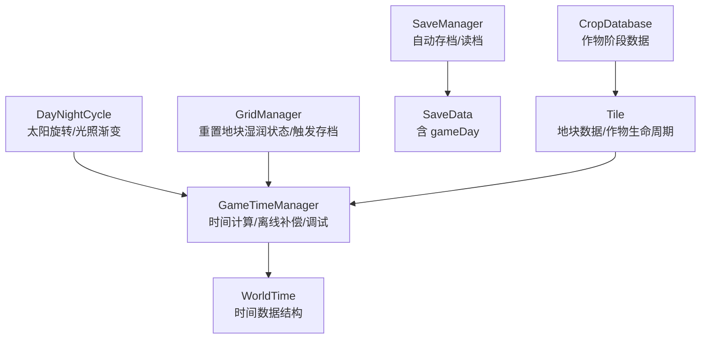
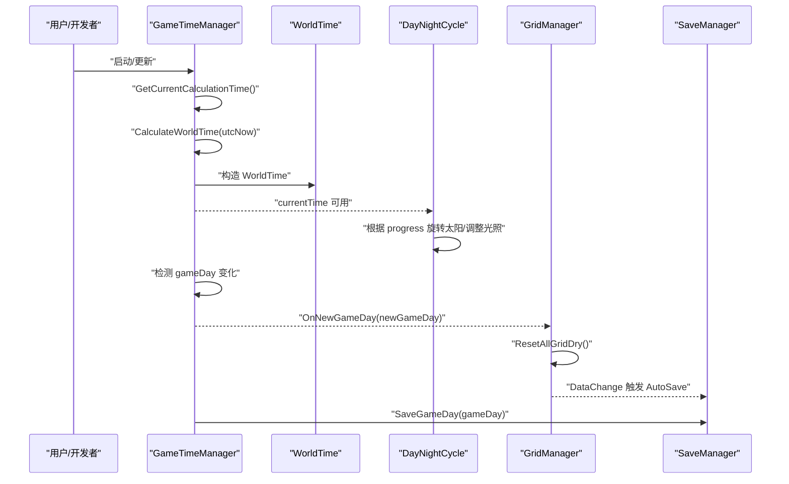
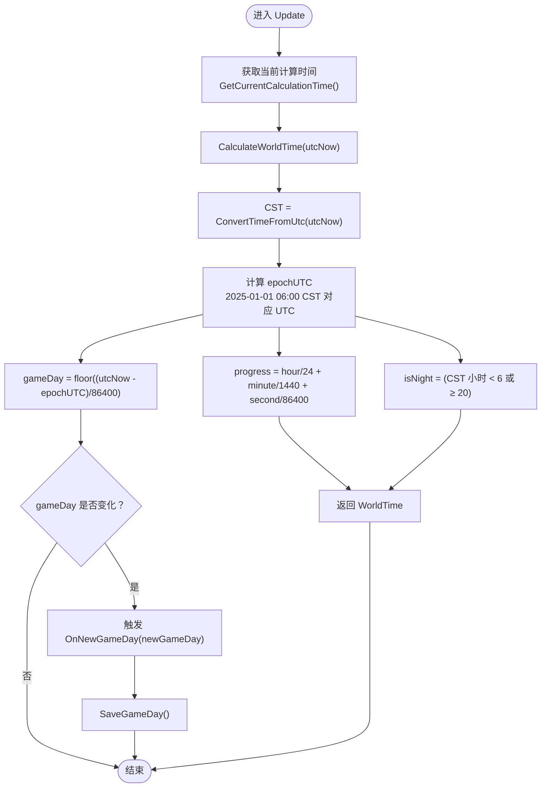
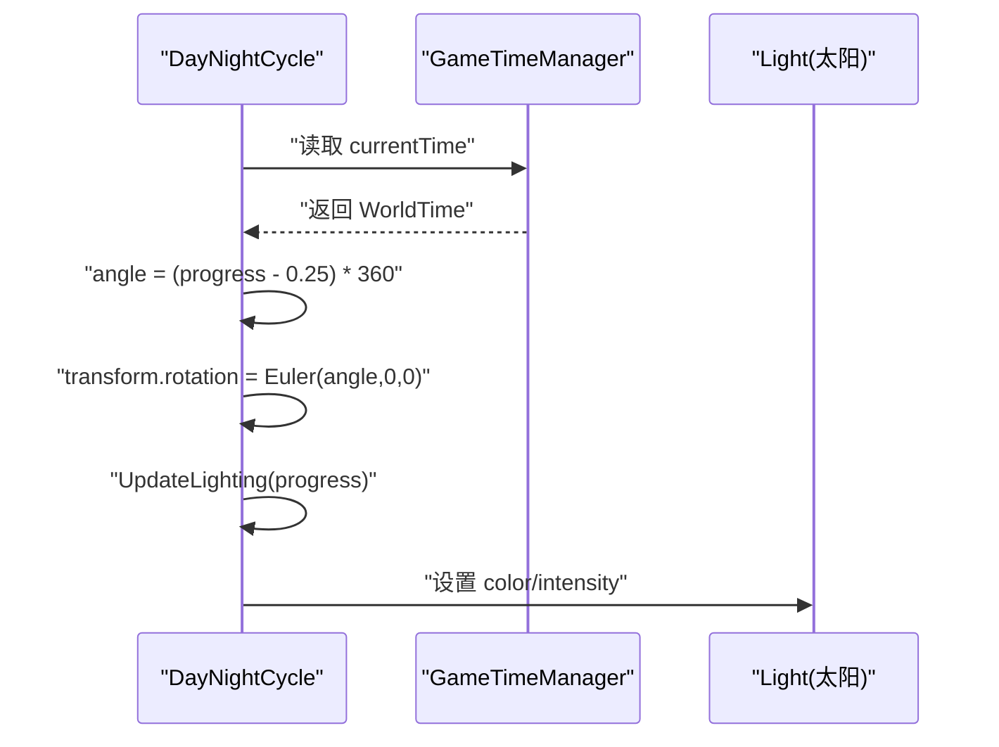
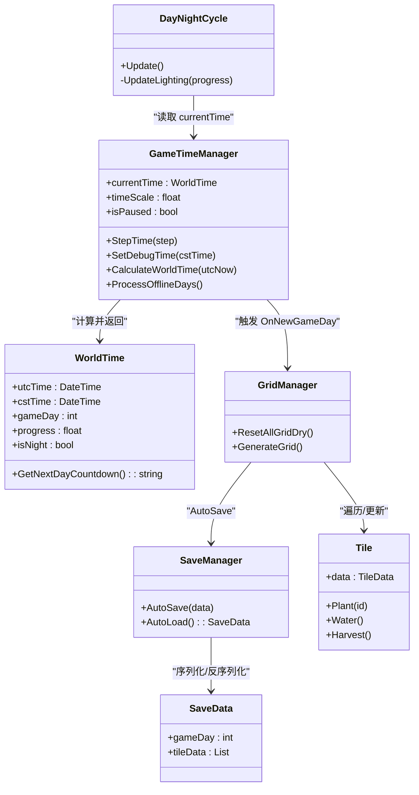
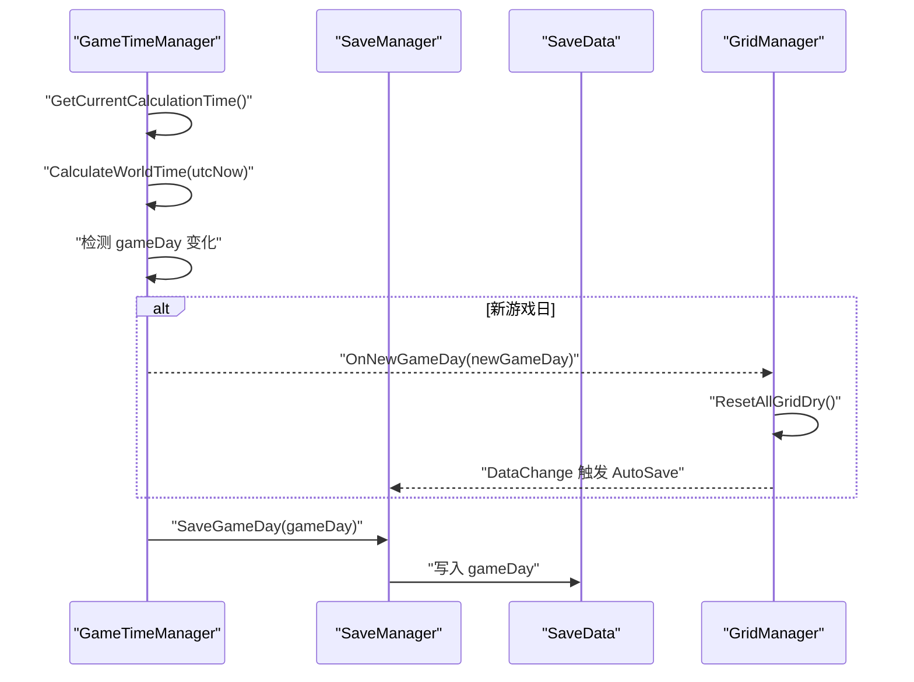

# 时间系统

<cite>
**本文引用的文件**
- [GameTimeManager.cs](file://GameSystem/GameTimeManager.cs)
- [WorldTime.cs](file://Data/WorldTime.cs)
- [DayNightCycle.cs](file://GameSystem/DayNightCycle.cs)
- [GridManager.cs](file://GameSystem/GridManager.cs)
- [SaveManager.cs](file://GameSystem/SaveManager.cs)
- [SaveData.cs](file://Data/SaveData.cs)
- [Tile.cs](file://Data/Tile.cs)
- [CropDatabase.cs](file://GameSystem/CropDatabase.cs)
</cite>

## 目录
1. [简介](#简介)
2. [项目结构](#项目结构)
3. [核心组件](#核心组件)
4. [架构总览](#架构总览)
5. [详细组件分析](#详细组件分析)
6. [依赖关系分析](#依赖关系分析)
7. [性能考量](#性能考量)
8. [故障排查指南](#故障排查指南)
9. [结论](#结论)
10. [附录](#附录)

## 简介
本文件系统性阐述时间系统的实现与使用，重点包括：
- GameTimeManager 如何基于 UTC 时间计算游戏内时间，并以北京时间 06:00 为每日起点实现游戏日切换逻辑；
- WorldTime 结构体各字段（如 gameDay、progress、isNight）的含义与计算方式；
- DayNightCycle 组件如何根据 GameTimeManager 提供的 progress 值驱动太阳旋转与光照渐变，实现昼夜过渡效果；
- 从 UTC 时间转换到 CST 时间、游戏日递增、离线天数补偿的完整流程；
- 调试功能（timeScale 加速、stepOneMinute 步进、SetDebugTime 手动设时）在开发中的用途；
- 如何监听新游戏日事件（OnNewGameDay）并触发相关系统更新（如重置地块湿润状态）。

## 项目结构
时间系统涉及以下关键模块：
- GameSystem/GameTimeManager.cs：全局时间管理器，负责时间计算、游戏日切换、离线补偿、调试控制与持久化。
- Data/WorldTime.cs：世界时间数据结构，封装 UTC/CST 时间、游戏日、进度、昼夜等信息。
- GameSystem/DayNightCycle.cs：昼夜循环组件，依据 WorldTime.progress 控制太阳旋转与光照。
- GameSystem/GridManager.cs：网格管理器，接收新游戏日事件，重置地块湿润状态并触发存档。
- GameSystem/SaveManager.cs：自动存档/读档，提供 AutoSave/AutoLoad。
- Data/SaveData.cs：存档数据载体，包含 gameDay 字段。
- Data/Tile.cs：地块数据与作物生命周期逻辑，与时间系统紧密耦合。
- GameSystem/CropDatabase.cs：作物阶段数据查询，用于判断连续未浇水天数与死亡判定。

图表来源
- [GameTimeManager.cs](file://GameSystem/GameTimeManager.cs#L1-L244)
- [WorldTime.cs](file://Data/WorldTime.cs#L1-L43)
- [DayNightCycle.cs](file://GameSystem/DayNightCycle.cs#L1-L64)
- [GridManager.cs](file://GameSystem/GridManager.cs#L1-L179)
- [SaveManager.cs](file://GameSystem/SaveManager.cs#L1-L72)
- [SaveData.cs](file://Data/SaveData.cs#L1-L30)
- [Tile.cs](file://Data/Tile.cs#L1-L155)
- [CropDatabase.cs](file://GameSystem/CropDatabase.cs)

章节来源
- [GameTimeManager.cs](file://GameSystem/GameTimeManager.cs#L1-L244)
- [WorldTime.cs](file://Data/WorldTime.cs#L1-L43)
- [DayNightCycle.cs](file://GameSystem/DayNightCycle.cs#L1-L64)
- [GridManager.cs](file://GameSystem/GridManager.cs#L1-L179)
- [SaveManager.cs](file://GameSystem/SaveManager.cs#L1-L72)
- [SaveData.cs](file://Data/SaveData.cs#L1-L30)
- [Tile.cs](file://Data/Tile.cs#L1-L155)

## 核心组件
- GameTimeManager：全局单例，负责：
  - 将 UTC 时间转换为 CST 时间；
  - 基于 CST 06:00 作为每日起点计算 gameDay；
  - 计算 progress（0~1）表示一天内的进度；
  - 判定 isNight（CST 06:00~20:00 为白天）；
  - 处理离线天数补偿（仅在真实时间模式下）；
  - 调试功能：timeScale 加速、stepOneMinute 步进、SetDebugTime 手动设时；
  - 触发新游戏日事件并保存 gameDay。
- WorldTime：不可变数据结构，包含 UTC/CST 时间、gameDay、progress、isNight、调试状态等。
- DayNightCycle：根据 WorldTime.progress 控制太阳 Transform 旋转与光照颜色/强度插值。
- GridManager：响应新游戏日事件，重置所有非空地块的连续未浇水天数、清空已浇水标记、切换为 Dry 并触发存档。
- SaveManager/SaveData：持久化 gameDay 与网格数据。

章节来源
- [GameTimeManager.cs](file://GameSystem/GameTimeManager.cs#L1-L244)
- [WorldTime.cs](file://Data/WorldTime.cs#L1-L43)
- [DayNightCycle.cs](file://GameSystem/DayNightCycle.cs#L1-L64)
- [GridManager.cs](file://GameSystem/GridManager.cs#L1-L179)
- [SaveManager.cs](file://GameSystem/SaveManager.cs#L1-L72)
- [SaveData.cs](file://Data/SaveData.cs#L1-L30)

## 架构总览
时间系统采用“集中式时间计算 + 分布式消费”的架构：
- GameTimeManager 作为唯一权威源，计算并暴露 WorldTime；
- DayNightCycle 仅消费 WorldTime，不关心底层计算细节；
- GridManager 通过 GameTimeManager 的新游戏日事件进行系统级联动；
- SaveManager 与 SaveData 负责持久化。

图表来源
- [GameTimeManager.cs](file://GameSystem/GameTimeManager.cs#L1-L244)
- [DayNightCycle.cs](file://GameSystem/DayNightCycle.cs#L1-L64)
- [GridManager.cs](file://GameSystem/GridManager.cs#L1-L179)
- [SaveManager.cs](file://GameSystem/SaveManager.cs#L1-L72)

## 详细组件分析

### GameTimeManager：UTC→CST 游戏日计算与离线补偿
- 时区与基准：
  - 使用 China Standard Time 作为 CST 时区；
  - 以 2025-01-01 06:00:00 CST 为 epoch，换算为 UTC 作为计算基准。
- 游戏日计算：
  - 基于 UTC 时间与 epoch 的秒差除以 86400 得到 gameDay；
  - 保证最小为 0。
- 进度与昼夜：
  - progress = 0 + hour/24 + minute/1440 + second/86400；
  - isNight = CST 小时 < 6 或 ≥ 20。
- 离线补偿：
  - 仅在未设置调试覆盖时间时生效；
  - 从上次保存的 gameDay 到当前逐天触发 OnNewGameDay，确保离线期间的系统更新。
- 调试功能：
  - timeScale：加速倍率（0 表示暂停，>0 表示加速）；
  - stepOneMinute：单次步进 1 分钟；
  - SetDebugTime(DateTime cstTime)：将输入的北京时间转换为 UTC 存储，用于测试切日场景；
  - resetToRealTime：取消调试覆盖，回到真实时间。
- 事件与持久化：
  - 每当 gameDay 发生变化时触发 OnNewGameDay(newGameDay)，并保存 gameDay；
  - 保存逻辑通过 SaveManager.AutoSave 写入 SaveData。

图表来源
- [GameTimeManager.cs](file://GameSystem/GameTimeManager.cs#L1-L244)

章节来源
- [GameTimeManager.cs](file://GameSystem/GameTimeManager.cs#L1-L244)

### WorldTime：时间数据结构与辅助方法
- 字段含义：
  - utcTime/cstTime：UTC/CST 时间；
  - gameDay：自 epochUTC 开始的完整游戏日数；
  - progress：0~1 的一天内进度；
  - isNight：是否夜晚；
  - utcHour/utcMinute、cstHour/cstMinute：UTC/CST 小时/分钟；
  - isDebugMode/timeScale/isPaused：调试状态。
- 辅助方法：
  - GetCSTTimeString()/GetGameDayString()/GetDisplayString()：格式化输出；
  - GetNextDayCountdown()：计算距离下次 06:00 CST 还剩的时分秒。

章节来源
- [WorldTime.cs](file://Data/WorldTime.cs#L1-L43)

### DayNightCycle：昼夜循环与光照渐变
- 太阳旋转：
  - 根据 WorldTime.progress 计算角度，绕 X 轴旋转，使太阳呈现日升日落轨迹；
  - 0.25 对应 6:00（正午），0.0 对应 0:00，0.5 对应 12:00，0.75 对应 18:00。
- 光照渐变：
  - 日出/日落/白天/夜晚四个区间分别插值颜色与强度；
  - 使用 Time.deltaTime 进行平滑过渡，避免闪烁。

图表来源
- [DayNightCycle.cs](file://GameSystem/DayNightCycle.cs#L1-L64)
- [GameTimeManager.cs](file://GameSystem/GameTimeManager.cs#L1-L244)

章节来源
- [DayNightCycle.cs](file://GameSystem/DayNightCycle.cs#L1-L64)

### GridManager：新游戏日联动与存档
- 新游戏日事件：
  - GameTimeManager 检测到 gameDay 变化后触发 OnNewGameDay(newGameDay)；
  - GridManager 接收事件，调用 ResetAllGridDry()。
- ResetAllGridDry 行为：
  - 遍历所有非空地块：连续未浇水天数 +1；
  - 查询作物阶段数据，若达到最大连续未浇水天数且 willDie 为真，则标记死亡；
  - 若地块已浇水则清空浇水标记、切换为 Dry、更新网格视觉；
  - 触发 DataChange 事件，SaveManager 自动保存。
- 注意事项：
  - 该方法在读档前不应被调用，否则会覆盖旧存档；已在备注中说明修正方案。

章节来源
- [GridManager.cs](file://GameSystem/GridManager.cs#L1-L179)
- [Tile.cs](file://Data/Tile.cs#L1-L155)

### SaveManager/SaveData：持久化与离线补偿
- SaveData：
  - 包含 gameDay 字段，用于离线补偿；
  - 同时保存 tileData、Coins、items 等。
- SaveManager：
  - AutoSave(AutoLoad)：异步写入/读取 JSON 文件；
  - 避免并发写入冲突，提供 UI 提示。

章节来源
- [SaveData.cs](file://Data/SaveData.cs#L1-L30)
- [SaveManager.cs](file://GameSystem/SaveManager.cs#L1-L72)

### 作物生命周期与时间耦合（Tile/CropDatabase）
- 种植/浇水/收获：
  - 种植时记录 plantedTimeTick；
  - 浇水时重置 consecutiveUnwateredDays；
  - 收获时判断是否可收获。
- 生长阶段推进：
  - 根据当前阶段开始时间与当前游戏 tick 计算应处阶段；
  - 若阶段变化且满足条件（已浇水或为第一阶段），切换模型并更新当前阶段开始时间。

章节来源
- [Tile.cs](file://Data/Tile.cs#L1-L155)
- [CropDatabase.cs](file://GameSystem/CropDatabase.cs)

## 依赖关系分析
- GameTimeManager 依赖：
  - System.TimeZoneInfo（CST 时区）；
  - SaveManager（AutoSave/AutoLoad）；
  - GridManager（触发 ResetAllGridDry）。
- DayNightCycle 依赖：
  - GameTimeManager.currentTime；
  - Unity Light 组件。
- GridManager 依赖：
  - SaveManager（AutoSave）；
  - CropDatabase（阶段数据）；
  - Tile（地块数据）。
- SaveManager 依赖：
  - Unity File API；
  - SaveData 数据结构。

图表来源
- [GameTimeManager.cs](file://GameSystem/GameTimeManager.cs#L1-L244)
- [WorldTime.cs](file://Data/WorldTime.cs#L1-L43)
- [DayNightCycle.cs](file://GameSystem/DayNightCycle.cs#L1-L64)
- [GridManager.cs](file://GameSystem/GridManager.cs#L1-L179)
- [SaveManager.cs](file://GameSystem/SaveManager.cs#L1-L72)
- [SaveData.cs](file://Data/SaveData.cs#L1-L30)
- [Tile.cs](file://Data/Tile.cs#L1-L155)

## 性能考量
- Update 中仅做必要计算（时间转换、进度、昼夜、事件检测），避免每帧重复昂贵操作；
- DayNightCycle 使用 Time.deltaTime 进行平滑插值，减少视觉跳变；
- SaveManager 采用协程异步写入，避免阻塞主线程；
- GridManager 在 ResetAllGridDry 中仅对非空地块进行必要检查，避免无效操作；
- 通过 timeScale 累加器（accumulatedTime）避免帧率波动带来的时间漂移。

[本节为通用建议，无需列出具体文件来源]

## 故障排查指南
- 离线补偿未生效：
  - 确认未启用调试覆盖时间（debugOverrideTime.HasValue 为 false）；
  - 确认 SaveData 中存在 gameDay 且大于上次保存值。
- 新游戏日事件未触发：
  - 检查 GameTimeManager.Update 中 lastFrameGameDay 初始化与 currentTime.gameDay 比较逻辑；
  - 确认 OnNewGameDay(newGameDay) 被调用并保存 gameDay。
- 地块状态异常（反复清空/死亡）：
  - 确保 ResetAllGridDry 在读档之后执行，避免覆盖旧存档；
  - 检查 CropDatabase 阶段数据是否存在，以及 willDie/MaxUnwateredDays 配置是否合理。
- 调试加速导致时间跳变：
  - 使用 accumulatedTime 累加策略，避免帧率依赖；
  - 在 Editor/Debug 条件下使用 stepOneMinute 单步推进验证。

章节来源
- [GameTimeManager.cs](file://GameSystem/GameTimeManager.cs#L1-L244)
- [GridManager.cs](file://GameSystem/GridManager.cs#L1-L179)

## 结论
该时间系统以 GameTimeManager 为核心，将 UTC 时间转换为 CST 游戏时间，以 06:00 为每日起点，提供稳定的游戏日计算与昼夜循环。通过离线补偿机制与调试工具，既保证了玩家体验，也提升了开发效率。GridManager 与 SaveManager 的协同确保了新游戏日事件能够可靠地驱动系统更新与数据持久化。

[本节为总结，无需列出具体文件来源]

## 附录

### 从 UTC 到 CST、游戏日递增与离线补偿的完整流程
- 步骤概览：
  1) 获取当前计算时间（真实时间或调试覆盖时间）；
  2) 转换为 CST 时间；
  3) 以 epochUTC 为基准计算 gameDay；
  4) 计算 progress 与 isNight；
  5) 检测 gameDay 是否变化，若变化则触发 OnNewGameDay；
  6) 离线补偿：从上次保存 gameDay 到当前逐天触发 OnNewGameDay；
  7) 保存当前 gameDay 至存档。

图表来源
- [GameTimeManager.cs](file://GameSystem/GameTimeManager.cs#L1-L244)
- [SaveManager.cs](file://GameSystem/SaveManager.cs#L1-L72)
- [SaveData.cs](file://Data/SaveData.cs#L1-L30)
- [GridManager.cs](file://GameSystem/GridManager.cs#L1-L179)

### 调试功能使用说明
- timeScale：在 Editor/Debug 下有效，0 表示暂停，>0 表示加速；
- stepOneMinute：点击后单步前进 1 分钟；
- SetDebugTime(DateTime cstTime)：将输入的北京时间转换为 UTC 存储，便于测试切日；
- resetToRealTime：取消调试覆盖，回到真实时间。

章节来源
- [GameTimeManager.cs](file://GameSystem/GameTimeManager.cs#L1-L244)

### 监听新游戏日事件并触发系统更新
- 订阅方式：
  - 在 GridManager 中注册 OnNewGameDay 事件（由 GameTimeManager 触发）；
  - 在回调中调用 ResetAllGridDry()，重置所有非空地块的连续未浇水天数并清空已浇水标记；
  - 通过 DataChange 事件触发 SaveManager 自动保存。
- 注意：
  - 避免在读档前调用 ResetAllGridDry，以免覆盖旧存档。

章节来源
- [GameTimeManager.cs](file://GameSystem/GameTimeManager.cs#L1-L244)
- [GridManager.cs](file://GameSystem/GridManager.cs#L1-L179)