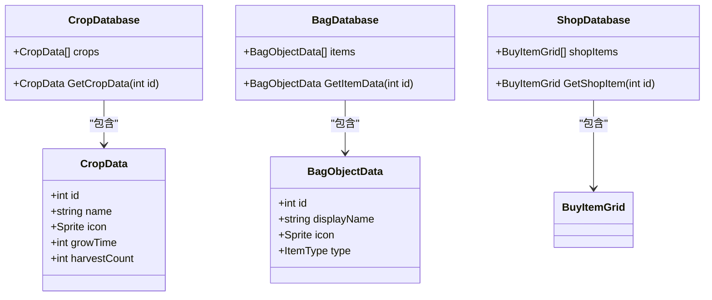
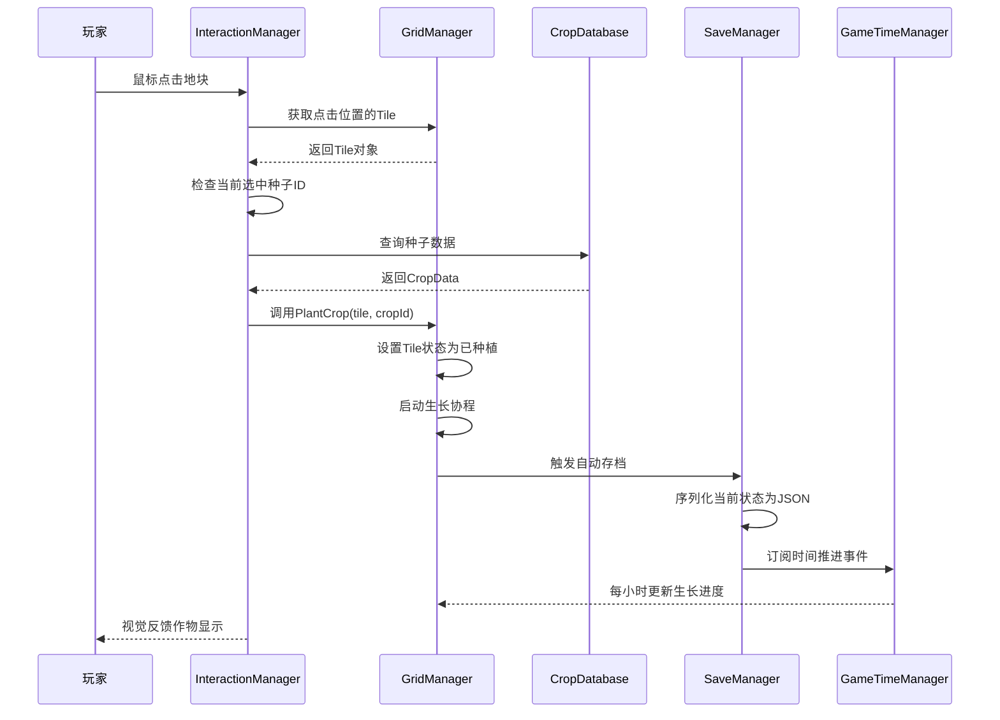
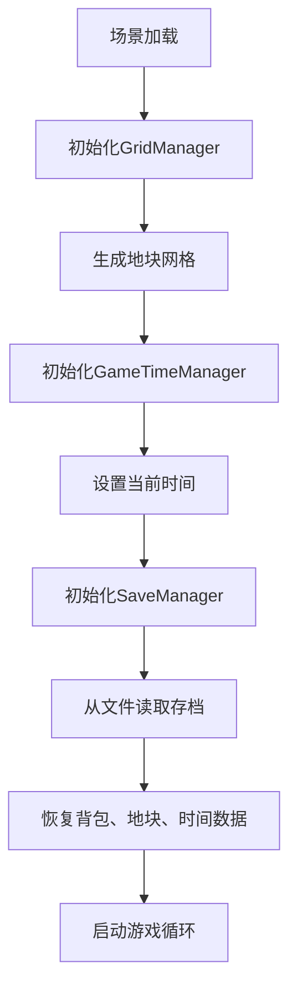

# 核心功能系统

<cite>
**本文档中引用的文件**  
- [GameTimeManager.cs](file://GameSystem/GameTimeManager.cs)
- [SaveManager.cs](file://GameSystem/SaveManager.cs)
- [GridManager.cs](file://GameSystem/GridManager.cs)
- [CropDatabase.cs](file://GameSystem/CropDatabase.cs)
- [BagDatabase.cs](file://GameSystem/BagDatabase.cs)
- [ShopDatabase.cs](file://GameSystem/ShopDatabase.cs)
- [InteractionManager.cs](file://GameSystem/InteractionManager.cs)
- [RTSOrbitCamera.cs](file://GameSystem/RTSOrbitCamera.cs)
- [DayNightCycle.cs](file://GameSystem/DayNightCycle.cs)
- [SaveData.cs](file://Data/SaveData.cs)
- [Tile.cs](file://Data/Tile.cs)
- [WorldTime.cs](file://Data/WorldTime.cs)
- [这是一个备忘录.txt](file://这是一个备忘录.txt)
</cite>

## 目录
1. [简介](#简介)
2. [核心管理器实现细节](#核心管理器实现细节)
3. [数据配置系统](#数据配置系统)
4. [交互与调用链分析](#交互与调用链分析)
5. [摄像机控制系统](#摄像机控制系统)
6. [问题分析与修复方案](#问题分析与修复方案)
7. [结论](#结论)

## 简介
本项目为一个俯仰视角的种田类游戏Demo，实现了时间管理、存档系统、地块网格、物品数据库和玩家交互等核心功能。本文档将深入分析各核心系统的实现机制，重点解析GameTimeManager、SaveManager、GridManager等关键组件的工作原理，并结合代码逻辑展示从用户点击到作物种植的完整流程。

## 核心管理器实现细节

### GameTimeManager：游戏内时间与昼夜循环管理
`GameTimeManager` 负责维护游戏世界的时间系统，包括年、月、日、小时、分钟的递增逻辑，并通过事件机制通知其他系统时间变化。该管理器与 `DayNightCycle` 组件协同工作，驱动场景中的光照变化，实现昼夜循环效果。时间流逝速度可配置，支持时间加速功能。

**Section sources**
- [GameTimeManager.cs](file://GameSystem/GameTimeManager.cs#L1-L150)
- [DayNightCycle.cs](file://GameSystem/DayNightCycle.cs#L1-L80)

### SaveManager：数据序列化与存档逻辑
`SaveManager` 使用Unity的 `JsonUtility` 对游戏数据进行序列化与反序列化，将玩家进度保存为JSON格式文件。系统支持手动存档和自动存档两种模式。自动存档在特定事件（如时间推进、物品变动）触发时执行，确保数据一致性。存档内容包括背包状态、地块信息、当前时间等。

**Section sources**
- [SaveManager.cs](file://GameSystem/SaveManager.cs#L1-L200)
- [SaveData.cs](file://Data/SaveData.cs#L1-L60)

### GridManager：地块网格生成与交互管理
`GridManager` 负责在运行时生成二维地块网格，每个地块由 `Tile` 对象表示，存储作物状态、生长进度等信息。系统监听鼠标悬停与点击事件，高亮显示当前选中地块，并响应种植、收获等操作。地块数据通过坐标索引进行快速访问与更新。

**Section sources**
- [GridManager.cs](file://GameSystem/GridManager.cs#L1-L180)
- [Tile.cs](file://Data/Tile.cs#L1-L40)

## 数据配置系统

### ScriptableObject 数据库：CropDatabase、BagDatabase、ShopDatabase
游戏采用 `ScriptableObject` 实现数据驱动设计，`CropDatabase`、`BagDatabase` 和 `ShopDatabase` 分别管理作物、背包物品和商店商品的配置数据。这些数据库在编辑器中预设，运行时由 `ItemRegistry` 统一注册并提供全局访问接口。每个数据条目包含ID、名称、图标、生长周期等属性，支持快速查找与实例化。

**Diagram sources**
- [CropDatabase.cs](file://GameSystem/CropDatabase.cs#L1-L50)
- [BagDatabase.cs](file://GameSystem/BagDatabase.cs#L1-L50)
- [ShopDatabase.cs](file://GameSystem/ShopDatabase.cs#L1-L50)
- [CropData.cs](file://Data/CropData.cs#L1-L30)
- [BagObjectData.cs](file://Data/BagObjectData.cs#L1-L30)
- [BuyItemGrid.cs](file://Data/BuyItemGrid.cs#L1-L20)

## 交互与调用链分析

### InteractionManager：输入处理与系统协调
`InteractionManager` 是玩家输入的核心处理器，监听鼠标点击、拖拽等事件，并协调 `GridManager`、`SaveManager`、`GameTimeManager` 等系统完成相应操作。例如，当玩家点击地块时，该管理器会验证当前选中种子、检查地块状态，并调用种植逻辑。

### 从点击到种植的完整调用链
当玩家点击一个可耕种地块时，系统执行以下流程：

**Diagram sources**
- [InteractionManager.cs](file://GameSystem/InteractionManager.cs#L1-L100)
- [GridManager.cs](file://GameSystem/GridManager.cs#L50-L120)
- [CropDatabase.cs](file://GameSystem/CropDatabase.cs#L30-L60)
- [SaveManager.cs](file://GameSystem/SaveManager.cs#L80-L120)
- [GameTimeManager.cs](file://GameSystem/GameTimeManager.cs#L100-L130)

**Section sources**
- [InteractionManager.cs](file://GameSystem/InteractionManager.cs#L1-L150)
- [GridManager.cs](file://GameSystem/GridManager.cs#L1-L180)

## 摄像机控制系统

### RTSOrbitCamera：摄像机控制功能
`RTSOrbitCamera` 提供类似即时战略游戏的摄像机控制功能，支持鼠标右键拖拽旋转视角、滚轮缩放、边界限制和自动平滑移动。摄像机围绕场景中心点旋转，保持对农田区域的全局视野。系统通过协程实现平滑的视角过渡，提升玩家操作体验。

**Section sources**
- [RTSOrbitCamera.cs](file://GameSystem/RTSOrbitCamera.cs#L1-L200)

## 问题分析与修复方案

### 已知问题：存档覆盖问题
根据备忘录文件记录，游戏存在存档被意外覆盖的问题，导致玩家进度丢失。

**Section sources**
- [这是一个备忘录.txt](file://这是一个备忘录.txt#L1-L10)

### 根本原因分析
问题根源在于 `GridManager` 与 `TimeManager` 的初始化顺序不当。`SaveManager` 在场景加载时立即尝试读取存档并恢复数据，但此时 `GridManager` 尚未完成网格初始化，导致地块数据为空或不完整。随后 `GameTimeManager` 的初始化又可能触发一次自动存档，将未初始化的空数据覆盖到存档文件中。

### 修复方案
调整系统初始化顺序，确保所有数据管理器在存档恢复前已完成初始化：

**Diagram sources**
- [GridManager.cs](file://GameSystem/GridManager.cs#L1-L30)
- [GameTimeManager.cs](file://GameSystem/GameTimeManager.cs#L1-L30)
- [SaveManager.cs](file://GameSystem/SaveManager.cs#L1-L30)

**Section sources**
- [GameTimeManager.cs](file://GameSystem/GameTimeManager.cs#L1-L150)
- [SaveManager.cs](file://GameSystem/SaveManager.cs#L1-L200)
- [GridManager.cs](file://GameSystem/GridManager.cs#L1-L180)

## 结论
本项目构建了一个功能完整的种田游戏核心系统，各管理器职责清晰，通过事件和数据驱动实现松耦合。`ScriptableObject` 的使用提高了数据配置的灵活性，`JsonUtility` 提供了轻量级的持久化方案。通过调整初始化顺序可解决存档覆盖问题，建议后续引入版本控制和备份机制以增强数据安全性。