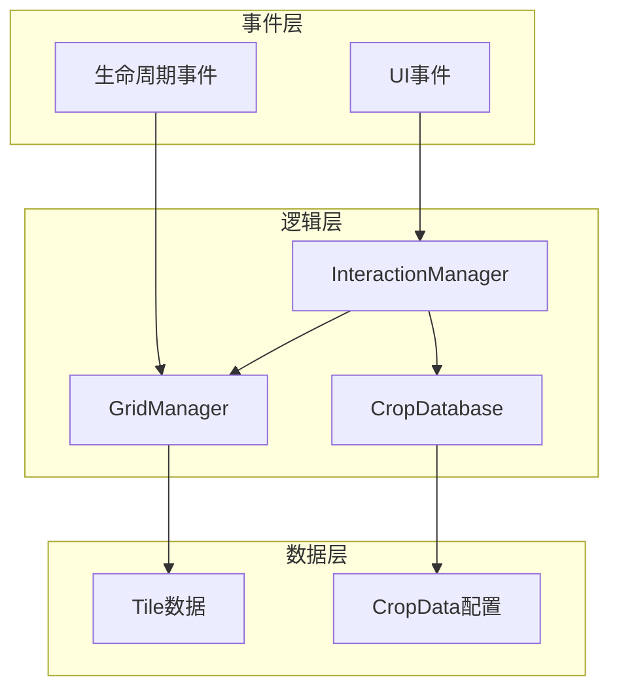
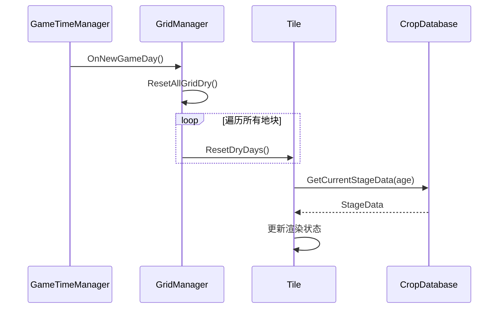
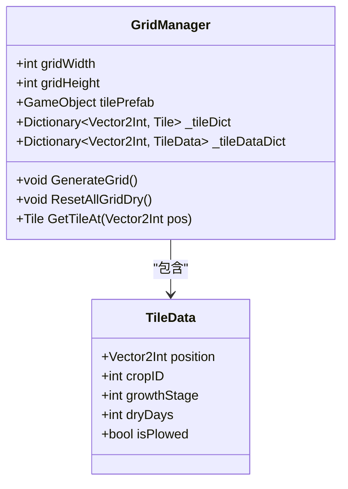
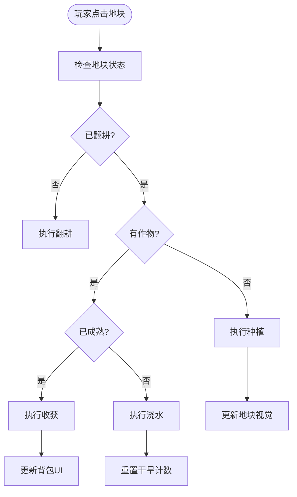
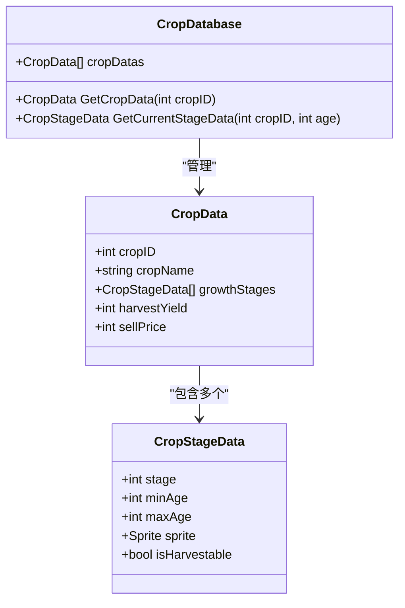
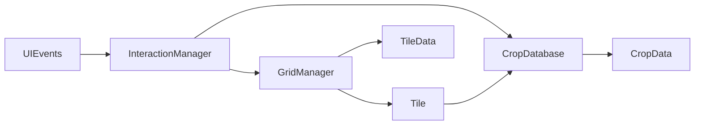

# 网格与作物系统

<cite>
**本文档引用文件**  
- [GridManager.cs](file://GameSystem/GridManager.cs)
- [Tile.cs](file://Data/Tile.cs)
- [CropDatabase.cs](file://GameSystem/CropDatabase.cs)
- [CropData.cs](file://Data/CropData.cs)
- [InteractionManager.cs](file://GameSystem/InteractionManager.cs)
- [UIEvents.cs](file://Common/Events/UIEvents.cs)
- [LifeCycleEvents.cs](file://Common/Events/LifeCycleEvents.cs)
</cite>

## 目录
1. [简介](#简介)
2. [项目结构](#项目结构)
3. [核心组件](#核心组件)
4. [架构概览](#架构概览)
5. [详细组件分析](#详细组件分析)
6. [依赖关系分析](#依赖关系分析)
7. [性能考量](#性能考量)
8. [故障排除指南](#故障排除指南)
9. [结论](#结论)

## 简介
本系统实现了俯瞰视角种田游戏中地块网格与作物生长的核心机制。通过GridManager管理8x8的地块网格，每个Tile记录作物状态并通过CropDatabase获取生长配置，形成完整的种植、浇水、收获生命周期管理。

## 项目结构
系统主要分布在GameSystem和Data两个目录中，GameSystem包含运行时逻辑管理器，Data包含数据模型定义。

**图示来源**
- [GridManager.cs](file://GameSystem/GridManager.cs#L1-L10)
- [Tile.cs](file://Data/Tile.cs#L1-L10)
- [CropDatabase.cs](file://GameSystem/CropDatabase.cs#L1-L10)

**本节来源**
- [GridManager.cs](file://GameSystem/GridManager.cs#L1-L50)
- [Tile.cs](file://Data/Tile.cs#L1-L30)

## 核心组件
系统核心由GridManager、Tile、CropDatabase三大组件构成。GridManager负责网格生成与全局状态管理，Tile代表单个地块并处理交互逻辑，CropDatabase提供作物配置数据查询服务。

**本节来源**
- [GridManager.cs](file://GameSystem/GridManager.cs#L25-L100)
- [Tile.cs](file://Data/Tile.cs#L15-L80)
- [CropDatabase.cs](file://GameSystem/CropDatabase.cs#L20-L60)

## 架构概览
系统采用数据-逻辑分离架构，通过事件驱动实现组件间通信。GridManager在OnNewGameDay时触发干旱重置，Tile通过CropDatabase获取生长阶段数据。

**图示来源**
- [GridManager.cs](file://GameSystem/GridManager.cs#L100-L150)
- [Tile.cs](file://Data/Tile.cs#L50-L100)
- [CropDatabase.cs](file://GameSystem/CropDatabase.cs#L30-L70)

## 详细组件分析

### GridManager分析
GridManager负责8x8网格的初始化，使用tilePrefab实例化地块，并通过_tileDataDict字典实现O(1)时间复杂度的高效访问。每日游戏开始时调用ResetAllGridDry()重置所有地块的干旱计数。

**图示来源**
- [GridManager.cs](file://GameSystem/GridManager.cs#L15-L45)
- [Tile.cs](file://Data/Tile.cs#L5-L20)

**本节来源**
- [GridManager.cs](file://GameSystem/GridManager.cs#L1-L200)

### Tile组件分析
Tile组件处理种植、浇水、收获、拔除等核心交互。Plant方法根据当前选择的种子ID更新TileData，Water方法重置干旱天数，Harvest方法收获作物并触发UI更新。

**图示来源**
- [Tile.cs](file://Data/Tile.cs#L45-L120)
- [InteractionManager.cs](file://GameSystem/InteractionManager.cs#L15-L50)

**本节来源**
- [Tile.cs](file://Data/Tile.cs#L1-L150)
- [InteractionManager.cs](file://GameSystem/InteractionManager.cs#L1-L80)

### CropDatabase分析
CropDatabase作为ScriptableObject容器管理所有CropData配置。通过GetCurrentStageData方法根据作物年龄确定当前生长阶段，实现生长状态的动态查询。

**图示来源**
- [CropDatabase.cs](file://GameSystem/CropDatabase.cs#L15-L45)
- [CropData.cs](file://Data/CropData.cs#L5-L20)

**本节来源**
- [CropDatabase.cs](file://GameSystem/CropDatabase.cs#L1-L100)
- [CropData.cs](file://Data/CropData.cs#L1-L80)

## 依赖关系分析
系统各组件通过明确的依赖关系协同工作，避免循环依赖。

**图示来源**
- [GridManager.cs](file://GameSystem/GridManager.cs#L1-L20)
- [InteractionManager.cs](file://GameSystem/InteractionManager.cs#L1-L15)
- [CropDatabase.cs](file://GameSystem/CropDatabase.cs#L1-L10)

**本节来源**
- [GridManager.cs](file://GameSystem/GridManager.cs#L1-L30)
- [InteractionManager.cs](file://GameSystem/InteractionManager.cs#L1-L50)

## 性能考量
- _tileDataDict字典提供O(1)访问性能
- 批量处理每日干旱重置，避免逐帧计算
- ScriptableObject实现数据共享，减少内存占用
- 事件驱动架构降低组件耦合度

## 故障排除指南
常见问题及解决方案：
- 地块无法种植：检查是否已翻耕，种子是否有效
- 作物不生长：确认GameTimeManager正常触发OnNewGameDay
- 收获无反应：验证CropData中isHarvestable标志位
- UI未更新：检查LifeCycleEvents事件是否正确触发

**本节来源**
- [Tile.cs](file://Data/Tile.cs#L100-L150)
- [GridManager.cs](file://GameSystem/GridManager.cs#L120-L140)
- [LifeCycleEvents.cs](file://Common/Events/LifeCycleEvents.cs#L5-L20)

## 结论
该网格与作物系统实现了高效、可扩展的种植机制。通过合理的数据结构设计和事件驱动架构，确保了系统的稳定性和可维护性，为游戏核心玩法提供了坚实基础。