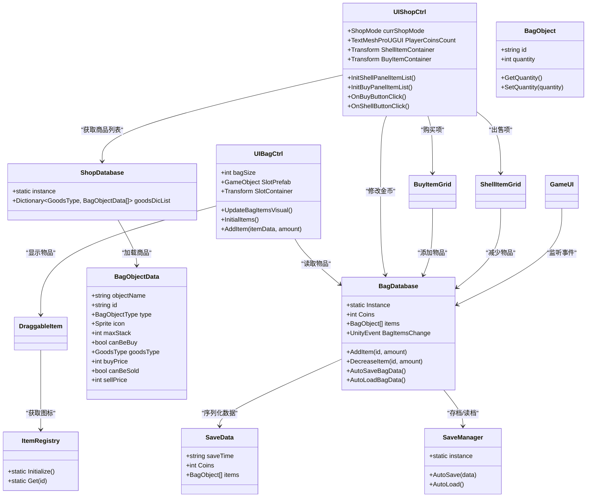
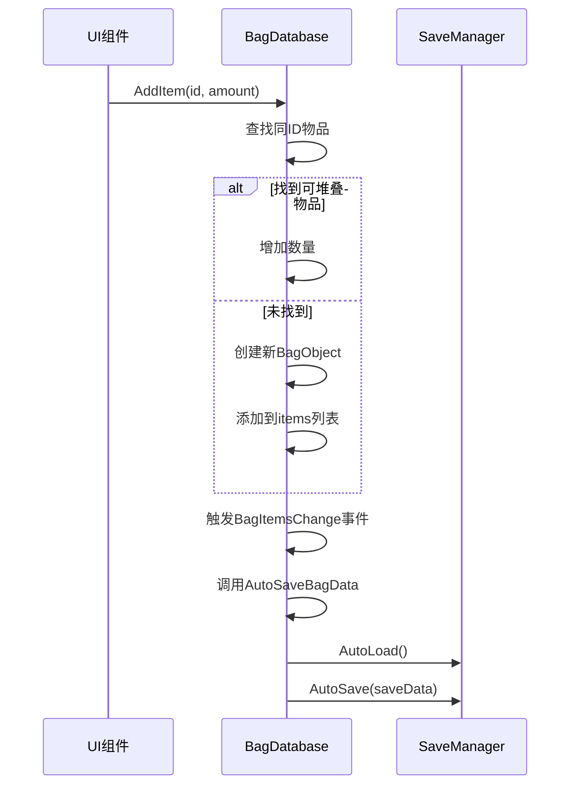
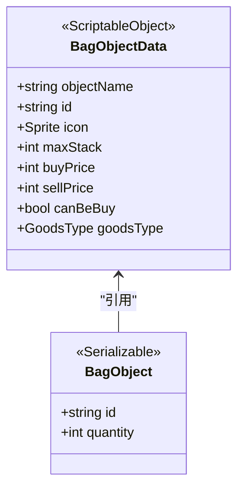
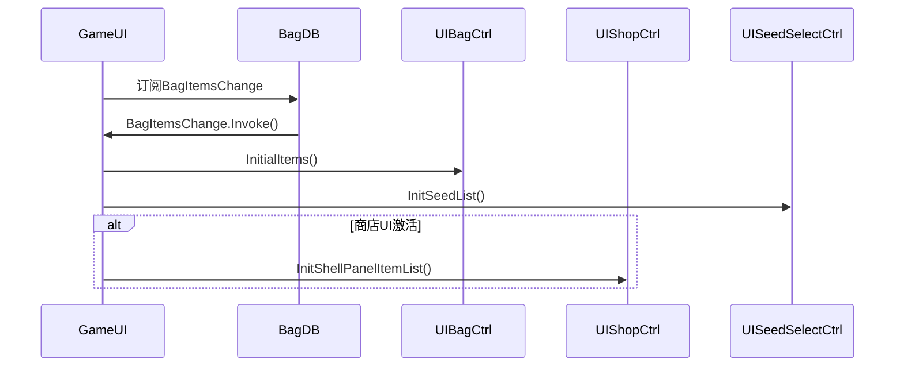
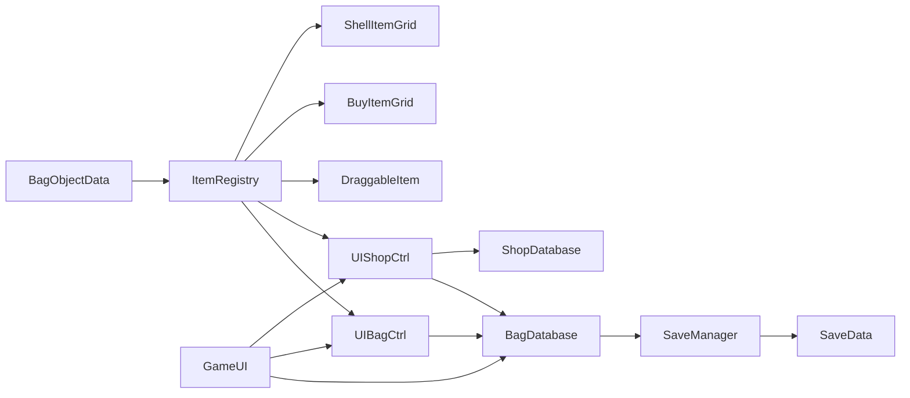

# 背包与商店系统

<cite>
**本文档引用文件**  
- [BagDatabase.cs](file://GameSystem/BagDatabase.cs)
- [ShopDatabase.cs](file://GameSystem/ShopDatabase.cs)
- [BagObjectData.cs](file://Data/BagObjectData.cs)
- [UIBagCtrl.cs](file://UI/UIBagCtrl.cs)
- [UIShopCtrl.cs](file://UI/UIShopCtrl.cs)
- [BuyItemGrid.cs](file://Data/BuyItemGrid.cs)
- [ShellItemGrid.cs](file://Data/ShellItemGrid.cs)
- [DraggableItem.cs](file://Data/DraggableItem.cs)
- [SaveData.cs](file://Data/SaveData.cs)
- [SaveManager.cs](file://GameSystem/SaveManager.cs)
- [ItemRegistry.cs](file://GameSystem/ItemRegistry.cs)
- [GameUI.cs](file://UI/GameUI.cs)
</cite>

## 目录
1. [简介](#简介)
2. [项目结构](#项目结构)
3. [核心组件](#核心组件)
4. [架构概览](#架构概览)
5. [详细组件分析](#详细组件分析)
6. [依赖分析](#依赖分析)
7. [性能考虑](#性能考虑)
8. [故障排除指南](#故障排除指南)
9. [结论](#结论)

## 简介
本系统实现了Unity项目中的背包与商店功能，支持物品堆叠管理、UI实时更新、自动存档与商店购买逻辑。系统通过`BagDatabase`管理玩家持有的物品和金币，利用`UnityEvent`通知UI刷新；`ShopDatabase`从资源目录加载可购买物品并分类；`UIBagCtrl`和`UIShopCtrl`分别控制背包与商店界面的显示与交互。系统设计注重数据一致性与用户体验，支持动态扩展新商品。

## 项目结构
项目结构清晰，按功能模块划分目录：`Data`存放数据类，`GameSystem`包含核心逻辑，`UI`负责界面控制。

```mermaid
graph TB
subgraph "Data"
A[BagObjectData]
B[SaveData]
C[Slot]
D[DraggableItem]
end
subgraph "GameSystem"
E[BagDatabase]
F[ShopDatabase]
G[SaveManager]
H[ItemRegistry]
end
subgraph "UI"
I[UIBagCtrl]
J[UIShopCtrl]
K[GameUI]
end
E --> G : "存档/读档"
E --> H : "获取物品数据"
F --> A : "加载物品数据"
I --> E : "读取物品列表"
J --> E : "修改金币与物品"
K --> E : "监听物品变更"
```

**图示来源**  
- [BagDatabase.cs](file://GameSystem/BagDatabase.cs#L1-L118)
- [ShopDatabase.cs](file://GameSystem/ShopDatabase.cs#L1-L35)
- [BagObjectData.cs](file://Data/BagObjectData.cs#L1-L151)
- [UIBagCtrl.cs](file://UI/UIBagCtrl.cs#L1-L105)
- [UIShopCtrl.cs](file://UI/UIShopCtrl.cs#L1-L214)
- [GameUI.cs](file://UI/GameUI.cs#L1-L110)

**本节来源**  
- [BagDatabase.cs](file://GameSystem/BagDatabase.cs#L1-L118)
- [ShopDatabase.cs](file://GameSystem/ShopDatabase.cs#L1-L35)

## 核心组件

系统由`BagDatabase`、`ShopDatabase`、`UIBagCtrl`、`UIShopCtrl`等核心组件构成。`BagDatabase`作为背包数据中枢，维护玩家物品列表与金币，并通过`UnityEvent`触发UI更新。`ShopDatabase`负责加载和分类商店商品。`UIBagCtrl`和`UIShopCtrl`分别管理背包与商店的UI展示与用户交互。

**本节来源**  
- [BagDatabase.cs](file://GameSystem/BagDatabase.cs#L1-L118)
- [ShopDatabase.cs](file://GameSystem/ShopDatabase.cs#L1-L35)
- [UIBagCtrl.cs](file://UI/UIBagCtrl.cs#L1-L105)
- [UIShopCtrl.cs](file://UI/UIShopCtrl.cs#L1-L214)

## 架构概览

系统采用数据与UI分离的设计模式，`BagDatabase`和`ShopDatabase`作为单例提供数据服务，UI组件通过事件和方法调用与之交互。



**图示来源**  
- [BagDatabase.cs](file://GameSystem/BagDatabase.cs#L1-L118)
- [ShopDatabase.cs](file://GameSystem/ShopDatabase.cs#L1-L35)
- [BagObjectData.cs](file://Data/BagObjectData.cs#L1-L151)
- [UIBagCtrl.cs](file://UI/UIBagCtrl.cs#L1-L105)
- [UIShopCtrl.cs](file://UI/UIShopCtrl.cs#L1-L214)
- [SaveData.cs](file://Data/SaveData.cs#L1-L30)
- [SaveManager.cs](file://GameSystem/SaveManager.cs#L1-L73)
- [ItemRegistry.cs](file://GameSystem/ItemRegistry.cs#L1-L34)

## 详细组件分析

### 背包数据库分析

`BagDatabase`是背包系统的核心，使用`List<BagObject>`管理玩家持有的所有可堆叠物品。每个`BagObject`包含物品ID和数量，支持通过`AddItem`和`DecreaseItem`方法增减物品。当物品数量减至0时，会自动从列表中移除。



**图示来源**  
- [BagDatabase.cs](file://GameSystem/BagDatabase.cs#L35-L65)

**本节来源**  
- [BagDatabase.cs](file://GameSystem/BagDatabase.cs#L1-L118)

### 商店数据库分析

`ShopDatabase`在启动时初始化，遍历`Resources`目录下所有`BagObjectData`资源，筛选出`canBeBuy=true`的物品，并按`GoodsType`分类存入字典`goodsDicList`中，供商店界面按类别展示。

```mermaid
flowchart TD
Start([Start]) --> InitDict["创建goodsDicList字典<br/>为每个GoodsType初始化List"]
InitDict --> LoadRes["Resources.LoadAll<BagObjectData>(\"\")"]
LoadRes --> Filter["遍历所有BagObjectData"]
Filter --> CheckBuy{"canBeBuy?"}
CheckBuy --> |是| AddToDict["添加到goodsDicList[goodsType]"]
CheckBuy --> |否| Next
AddToDict --> Next
Next --> Filter
Filter --> End([完成加载])
```

**图示来源**  
- [ShopDatabase.cs](file://GameSystem/ShopDatabase.cs#L20-L32)

**本节来源**  
- [ShopDatabase.cs](file://GameSystem/ShopDatabase.cs#L1-L35)

### BagObject与BagObjectData区别

`BagObjectData`是继承自`ScriptableObject`的静态配置数据，定义了物品的名称、ID、图标、价格、最大堆叠数等元数据，存储在`Resources`目录中。`BagObject`是运行时实例，仅包含物品ID和当前数量，代表玩家背包中的一个物品堆。



**图示来源**  
- [BagObjectData.cs](file://Data/BagObjectData.cs#L13-L151)

**本节来源**  
- [BagObjectData.cs](file://Data/BagObjectData.cs#L1-L151)

### 背包与商店UI分析

`UIBagCtrl`负责背包界面，通过`SlotContainer`生成固定数量的槽位，并根据`BagDatabase.Instance.items`初始化显示。`UIShopCtrl`管理商店界面，分为购买和出售两种模式。购买模式从`ShopDatabase`加载商品，出售模式从`BagDatabase`读取玩家持有的可出售物品。



**图示来源**  
- [GameUI.cs](file://UI/GameUI.cs#L34-L75)

**本节来源**  
- [UIBagCtrl.cs](file://UI/UIBagCtrl.cs#L1-L105)
- [UIShopCtrl.cs](file://UI/UIShopCtrl.cs#L1-L214)
- [GameUI.cs](file://UI/GameUI.cs#L1-L110)

## 依赖分析

系统各组件间依赖关系明确，无循环依赖。`BagDatabase`依赖`SaveManager`进行持久化，`ShopDatabase`依赖`Resources`系统加载数据，UI组件依赖`ItemRegistry`获取物品元数据。



**图示来源**  
- [ItemRegistry.cs](file://GameSystem/ItemRegistry.cs#L1-L34)
- [SaveManager.cs](file://GameSystem/SaveManager.cs#L1-L73)

**本节来源**  
- [ItemRegistry.cs](file://GameSystem/ItemRegistry.cs#L1-L34)
- [SaveManager.cs](file://GameSystem/SaveManager.cs#L1-L73)

## 性能考虑

系统在性能方面表现良好。`BagDatabase`使用`List<BagObject>`进行线性查找，在物品数量较少时性能可接受。自动存档采用协程延迟一帧执行，避免了频繁I/O操作。`ItemRegistry`在游戏启动时预加载所有`BagObjectData`，运行时通过字典O(1)查找，提高了性能。UI更新采用事件驱动，仅在数据变更时刷新，避免了每帧遍历。

## 故障排除指南

- **问题：背包物品未显示**  
  检查`UIBagCtrl.InitialItems()`是否被正确调用，确认`BagDatabase.Instance.items`不为空。

- **问题：商店无法购买物品**  
  确认`BagObjectData.canBeBuy`为true，且`buyPrice`已设置。检查金币是否足够。

- **问题：存档失败**  
  查看控制台是否有异常，确认`Application.persistentDataPath`可写。

- **问题：UI未更新**  
  确保`BagItemsChange`事件被正确订阅，`GameUI`中的监听器未被意外移除。

**本节来源**  
- [BagDatabase.cs](file://GameSystem/BagDatabase.cs#L46-L48)
- [GameUI.cs](file://UI/GameUI.cs#L36-L38)
- [SaveManager.cs](file://GameSystem/SaveManager.cs#L29-L46)

## 结论

本背包与商店系统设计合理，实现了物品管理、UI同步、数据持久化和商店交易等核心功能。系统采用模块化设计，易于维护和扩展。通过`UnityEvent`实现松耦合，保证了数据一致性。扩展新商品只需创建`BagObjectData`资产并设置`canBeBuy=true`，即可在商店中自动出现。建议未来对`BagDatabase`的物品查找进行优化，例如引入字典索引，以支持更大量的物品管理。