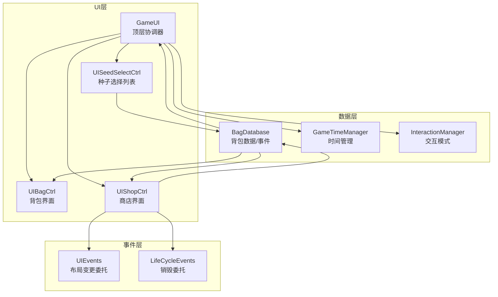
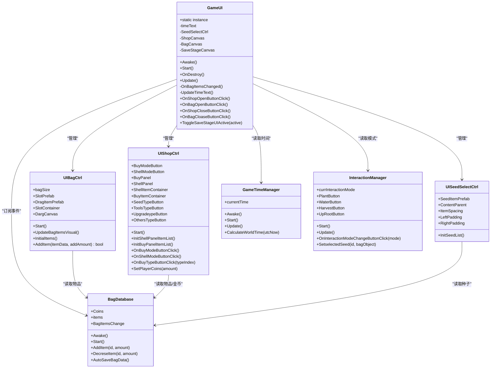
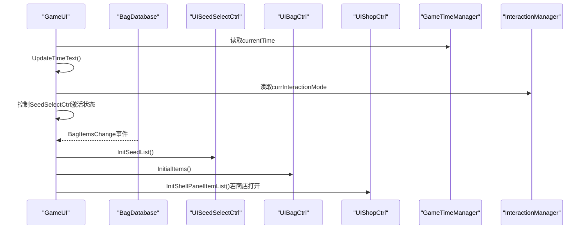
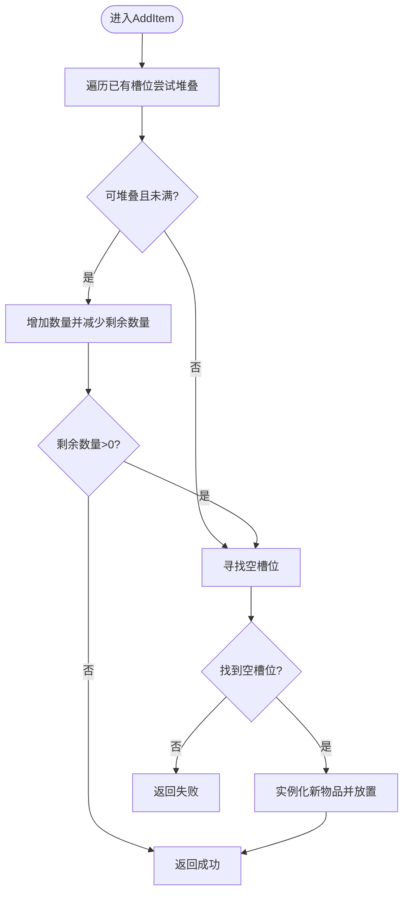
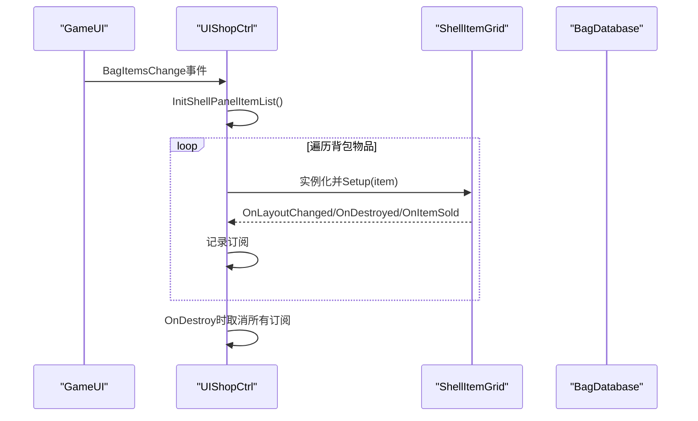
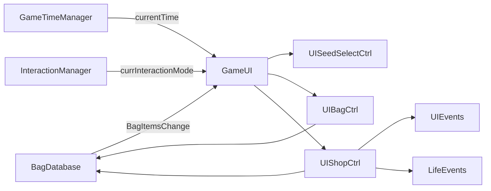

# 主游戏UI控制器

<cite>
**本文引用的文件**
- [GameUI.cs](file://UI/GameUI.cs)
- [UIBagCtrl.cs](file://UI/UIBagCtrl.cs)
- [UIShopCtrl.cs](file://UI/UIShopCtrl.cs)
- [UISeedSelectCtrl.cs](file://UI/UISeedSelectCtrl.cs)
- [BagDatabase.cs](file://GameSystem/BagDatabase.cs)
- [GameTimeManager.cs](file://GameSystem/GameTimeManager.cs)
- [InteractionManager.cs](file://GameSystem/InteractionManager.cs)
- [UIEvents.cs](file://Common/Events/UIEvents.cs)
- [LifeCycleEvents.cs](file://Common/Events/LifeCycleEvents.cs)
- [BagObjectData.cs](file://Data/BagObjectData.cs)
- [WorldTime.cs](file://Data/WorldTime.cs)
</cite>

## 目录
1. [简介](#简介)
2. [项目结构](#项目结构)
3. [核心组件](#核心组件)
4. [架构总览](#架构总览)
5. [详细组件分析](#详细组件分析)
6. [依赖关系分析](#依赖关系分析)
7. [性能考量](#性能考量)
8. [故障排查指南](#故障排查指南)
9. [结论](#结论)
10. [附录](#附录)

## 简介
本文件围绕GameUI组件展开，系统性说明其作为UI系统核心控制器的角色定位、单例模式实现、生命周期初始化流程、与事件系统的集成方式，以及如何驱动多个UI子组件（背包、商店、种子选择）协同工作。文档特别聚焦以下要点：
- 单例模式（instance）实现全局访问与生命周期管理
- Awake/Start中订阅背包物品变更事件（BagItemsChange），实现数据驱动的UI更新
- UpdateTimeText方法从GameTimeManager获取当前时间并更新UI显示
- OnBagItemsChanged方法响应背包数据变化，触发UISeedSelectCtrl、UIBagCtrl、UIShopCtrl的刷新逻辑
- 公共方法（如OnShopOpenButtonClick、OnBagOpenButtonClick等）的调用关系与使用场景
- 在MVC架构中作为视图协调器的关键作用
- 如何扩展GameUI以集成新UI面板的实践建议（事件订阅最佳实践与内存泄漏防范）

## 项目结构
UI系统由GameUI作为顶层协调器，向下管理UISeedSelectCtrl、UIBagCtrl、UIShopCtrl三个子控制器；数据层由BagDatabase、GameTimeManager、InteractionManager等系统组件提供支撑；事件层通过UIEvents、LifeCycleEvents等静态委托类型实现松耦合通信。

图表来源
- [GameUI.cs](file://UI/GameUI.cs#L1-L110)
- [UIBagCtrl.cs](file://UI/UIBagCtrl.cs#L1-L105)
- [UIShopCtrl.cs](file://UI/UIShopCtrl.cs#L1-L214)
- [UISeedSelectCtrl.cs](file://UI/UISeedSelectCtrl.cs#L1-L55)
- [BagDatabase.cs](file://GameSystem/BagDatabase.cs#L1-L118)
- [GameTimeManager.cs](file://GameSystem/GameTimeManager.cs#L1-L244)
- [InteractionManager.cs](file://GameSystem/InteractionManager.cs#L1-L206)
- [UIEvents.cs](file://Common/Events/UIEvents.cs#L1-L11)
- [LifeCycleEvents.cs](file://Common/Events/LifeCycleEvents.cs#L1-L13)

章节来源
- [GameUI.cs](file://UI/GameUI.cs#L1-L110)
- [BagDatabase.cs](file://GameSystem/BagDatabase.cs#L1-L118)
- [GameTimeManager.cs](file://GameSystem/GameTimeManager.cs#L1-L244)
- [InteractionManager.cs](file://GameSystem/InteractionManager.cs#L1-L206)
- [UIBagCtrl.cs](file://UI/UIBagCtrl.cs#L1-L105)
- [UIShopCtrl.cs](file://UI/UIShopCtrl.cs#L1-L214)
- [UISeedSelectCtrl.cs](file://UI/UISeedSelectCtrl.cs#L1-L55)
- [UIEvents.cs](file://Common/Events/UIEvents.cs#L1-L11)
- [LifeCycleEvents.cs](file://Common/Events/LifeCycleEvents.cs#L1-L13)

## 核心组件
- GameUI：UI系统顶层协调器，负责单例生命周期、UI显示更新、交互模式联动、事件订阅与注销、以及各子UI的开关控制。
- UIBagCtrl：背包界面控制器，负责生成槽位、初始化物品、更新视觉、添加物品等。
- UIShopCtrl：商店界面控制器，负责买卖模式切换、购买/出售面板初始化、金币显示、网格订阅与清理。
- UISeedSelectCtrl：种子选择列表控制器，负责根据背包中可用种子生成列表并布局。
- BagDatabase：背包数据与事件中心，提供UnityEvent BagItemsChange，统一管理物品增删与自动存档。
- GameTimeManager：时间管理器，提供当前世界时间WorldTime，用于UI时间显示。
- InteractionManager：交互模式管理器，提供当前交互模式，驱动种子选择UI的显隐。

章节来源
- [GameUI.cs](file://UI/GameUI.cs#L1-L110)
- [UIBagCtrl.cs](file://UI/UIBagCtrl.cs#L1-L105)
- [UIShopCtrl.cs](file://UI/UIShopCtrl.cs#L1-L214)
- [UISeedSelectCtrl.cs](file://UI/UISeedSelectCtrl.cs#L1-L55)
- [BagDatabase.cs](file://GameSystem/BagDatabase.cs#L1-L118)
- [GameTimeManager.cs](file://GameSystem/GameTimeManager.cs#L1-L244)
- [InteractionManager.cs](file://GameSystem/InteractionManager.cs#L1-L206)

## 架构总览
GameUI在MVC架构中扮演“视图协调器”角色：
- Model：BagDatabase、GameTimeManager、InteractionManager等系统组件提供数据与状态。
- View：GameUI及其子控制器（UIBagCtrl、UIShopCtrl、UISeedSelectCtrl）负责渲染与用户交互。
- Controller：GameUI协调各View与Model之间的数据流，通过事件驱动实现解耦。

图表来源
- [GameUI.cs](file://UI/GameUI.cs#L1-L110)
- [UIBagCtrl.cs](file://UI/UIBagCtrl.cs#L1-L105)
- [UIShopCtrl.cs](file://UI/UIShopCtrl.cs#L1-L214)
- [UISeedSelectCtrl.cs](file://UI/UISeedSelectCtrl.cs#L1-L55)
- [BagDatabase.cs](file://GameSystem/BagDatabase.cs#L1-L118)
- [GameTimeManager.cs](file://GameSystem/GameTimeManager.cs#L1-L244)
- [InteractionManager.cs](file://GameSystem/InteractionManager.cs#L1-L206)

## 详细组件分析

### GameUI组件分析
- 单例模式与生命周期
  - 通过静态instance实现全局唯一访问；Awake中若无实例则接管，否则销毁自身，保证场景中只有一个GameUI实例。
  - Start中订阅BagDatabase的BagItemsChange事件，确保背包数据变化时能驱动UI刷新；同时初始化UI状态（如隐藏种子选择、显示背包）。
  - OnDestroy中取消订阅，防止事件残留导致内存泄漏。
- 时间显示更新
  - Update中每帧调用UpdateTimeText，从GameTimeManager获取currentTime并格式化显示字符串，更新TextMeshProUGUI。
- 交互模式联动
  - Update中读取InteractionManager的currInteractionMode，动态控制SeedSelectCtrl的激活状态，实现“种植模式下显示种子选择”的行为。
- 事件驱动的UI刷新
  - OnBagItemsChanged中分别调用：
    - UISeedSelectCtrl.InitSeedList：刷新种子选择列表
    - UIBagCtrl.InitialItems：刷新背包物品
    - UIShopCtrl.InitShellPanelItemList：若商店处于打开状态，则刷新出售面板
  - 以上逻辑确保多界面数据一致性与实时同步。
- 公共方法与使用场景
  - OnShopOpenButtonClick/OnBagOpenButtonClick：打开商店/背包界面
  - OnShopCloseButtonClick/OnBagCloaseButtonClick：关闭商店/背包界面
  - ToggleSaveStageUIActive：控制存档界面的显隐
  - 这些方法通常由UI按钮的OnClick事件绑定，形成“视图→控制器→系统”的调用链。

图表来源
- [GameUI.cs](file://UI/GameUI.cs#L1-L110)
- [BagDatabase.cs](file://GameSystem/BagDatabase.cs#L1-L118)
- [UISeedSelectCtrl.cs](file://UI/UISeedSelectCtrl.cs#L1-L55)
- [UIBagCtrl.cs](file://UI/UIBagCtrl.cs#L1-L105)
- [UIShopCtrl.cs](file://UI/UIShopCtrl.cs#L1-L214)
- [GameTimeManager.cs](file://GameSystem/GameTimeManager.cs#L1-L244)
- [InteractionManager.cs](file://GameSystem/InteractionManager.cs#L1-L206)

章节来源
- [GameUI.cs](file://UI/GameUI.cs#L1-L110)

### UIBagCtrl组件分析
- 初始化与槽位生成
  - Start中生成固定数量的槽位，随后InitialItems清空旧物品并按BagDatabase.items实例化DraggableItem，完成初始渲染。
- 视觉更新
  - UpdateBagItemsVisual遍历SlotContainer下的每个槽位，更新其中DraggableItem的视觉表现。
- 添加物品逻辑
  - AddItem优先尝试堆叠，若仍有剩余则寻找空槽位放置新物品，返回是否全部添加成功。

图表来源
- [UIBagCtrl.cs](file://UI/UIBagCtrl.cs#L1-L105)
- [BagObjectData.cs](file://Data/BagObjectData.cs#L1-L151)

章节来源
- [UIBagCtrl.cs](file://UI/UIBagCtrl.cs#L1-L105)
- [BagObjectData.cs](file://Data/BagObjectData.cs#L1-L151)

### UIShopCtrl组件分析
- 模式与类型管理
  - ShopMode枚举区分Buy/Shell两种模式；currShopMode与按钮颜色联动，BuyTypeButton按GoodsType切换购买面板。
- 初始化与刷新
  - Start中初始化模式、金币、出售/购买面板；InitShellPanelItemList按背包物品筛选可出售项并订阅网格事件；InitBuyPanelItemList按GoodsType生成购买网格。
- 事件订阅与内存安全
  - 使用字典记录每个ShellItemGrid的订阅，OnChildDestroyed与OnDestroy中成对取消订阅，避免内存泄漏。

图表来源
- [UIShopCtrl.cs](file://UI/UIShopCtrl.cs#L1-L214)
- [BagDatabase.cs](file://GameSystem/BagDatabase.cs#L1-L118)
- [UIEvents.cs](file://Common/Events/UIEvents.cs#L1-L11)
- [LifeCycleEvents.cs](file://Common/Events/LifeCycleEvents.cs#L1-L13)

章节来源
- [UIShopCtrl.cs](file://UI/UIShopCtrl.cs#L1-L214)
- [UIEvents.cs](file://Common/Events/UIEvents.cs#L1-L11)
- [LifeCycleEvents.cs](file://Common/Events/LifeCycleEvents.cs#L1-L13)

### UISeedSelectCtrl组件分析
- 数据来源与过滤
  - InitSeedList遍历BagDatabase.items，筛选类型为Seed且数量大于0的物品，实例化UISeedItem并设置位置。
- 布局计算
  - 通过ItemSpacing、LeftPadding、RightPadding手动计算ContentParent的宽度，保证横向排列整齐。

章节来源
- [UISeedSelectCtrl.cs](file://UI/UISeedSelectCtrl.cs#L1-L55)
- [BagObjectData.cs](file://Data/BagObjectData.cs#L1-L151)

### 数据模型与事件系统
- BagObjectData与BagObject
  - BagObjectData定义物品元数据（名称、类型、图标、最大堆叠、买卖价格等）；BagObject封装id与quantity，并在SetQuantity时触发自动存档。
- WorldTime
  - 提供UTC/CST时间、游戏日、昼夜、显示字符串等，GameUI通过GameTimeManager.currentTime获取并展示。
- UIEvents/LifeCycleEvents
  - UIEvents提供LayoutChanged委托，用于子控件通知父节点调整布局；LifeCycleEvents提供Destroyed委托，用于通知订阅者取消订阅。

章节来源
- [BagObjectData.cs](file://Data/BagObjectData.cs#L1-L151)
- [WorldTime.cs](file://Data/WorldTime.cs#L1-L43)
- [UIEvents.cs](file://Common/Events/UIEvents.cs#L1-L11)
- [LifeCycleEvents.cs](file://Common/Events/LifeCycleEvents.cs#L1-L13)

## 依赖关系分析
- GameUI对BagDatabase的依赖体现在事件订阅与UI刷新；对GameTimeManager的依赖体现在时间显示；对InteractionManager的依赖体现在交互模式联动。
- UIBagCtrl与UIShopCtrl均依赖BagDatabase读取物品数据；UIShopCtrl还依赖UIEvents/LifeCycleEvents实现网格级事件管理。
- BagDatabase通过UnityEvent对外广播BagItemsChange，形成“数据变更→事件→UI刷新”的单向数据流。

图表来源
- [GameUI.cs](file://UI/GameUI.cs#L1-L110)
- [BagDatabase.cs](file://GameSystem/BagDatabase.cs#L1-L118)
- [GameTimeManager.cs](file://GameSystem/GameTimeManager.cs#L1-L244)
- [InteractionManager.cs](file://GameSystem/InteractionManager.cs#L1-L206)
- [UIBagCtrl.cs](file://UI/UIBagCtrl.cs#L1-L105)
- [UIShopCtrl.cs](file://UI/UIShopCtrl.cs#L1-L214)
- [UIEvents.cs](file://Common/Events/UIEvents.cs#L1-L11)
- [LifeCycleEvents.cs](file://Common/Events/LifeCycleEvents.cs#L1-L13)

章节来源
- [GameUI.cs](file://UI/GameUI.cs#L1-L110)
- [BagDatabase.cs](file://GameSystem/BagDatabase.cs#L1-L118)
- [GameTimeManager.cs](file://GameSystem/GameTimeManager.cs#L1-L244)
- [InteractionManager.cs](file://GameSystem/InteractionManager.cs#L1-L206)
- [UIBagCtrl.cs](file://UI/UIBagCtrl.cs#L1-L105)
- [UIShopCtrl.cs](file://UI/UIShopCtrl.cs#L1-L214)
- [UIEvents.cs](file://Common/Events/UIEvents.cs#L1-L11)
- [LifeCycleEvents.cs](file://Common/Events/LifeCycleEvents.cs#L1-L13)

## 性能考量
- 事件驱动的UI更新避免了轮询与频繁查找，降低CPU开销。
- UIShopCtrl在InitShellPanelItemList中成对订阅/取消订阅，避免大量网格事件残留导致的内存压力。
- GameUI在Update中仅做必要检查（时间显示与模式联动），避免在每帧进行昂贵操作。
- UIBagCtrl的AddItem采用优先堆叠策略，减少UI重建次数，提高交互流畅度。

[本节为通用性能讨论，无需列出具体文件来源]

## 故障排查指南
- UI不刷新或显示异常
  - 检查BagDatabase的BagItemsChange是否正确触发（例如在BagObject.SetQuantity中）。
  - 确认GameUI是否在Start中订阅了该事件，且在OnDestroy中取消订阅。
- 种子选择UI不显示
  - 检查InteractionManager的currInteractionMode是否为Planting，以及SeedSelectCtrl是否被GameUI正确激活。
- 商店界面不更新
  - 确认UIShopCtrl在打开状态下会调用InitShellPanelItemList；若未打开，需在打开时主动刷新。
- 内存泄漏风险
  - 确保UIShopCtrl在网格销毁时调用OnChildDestroyed取消订阅；在自身销毁时遍历字典取消所有订阅。

章节来源
- [GameUI.cs](file://UI/GameUI.cs#L1-L110)
- [BagDatabase.cs](file://GameSystem/BagDatabase.cs#L1-L118)
- [UIShopCtrl.cs](file://UI/UIShopCtrl.cs#L1-L214)
- [InteractionManager.cs](file://GameSystem/InteractionManager.cs#L1-L206)

## 结论
GameUI作为UI系统的核心协调器，通过单例模式确保全局唯一性，借助BagDatabase的事件机制实现数据驱动的UI更新，并通过GameTimeManager与InteractionManager提供时间与交互模式的联动能力。其设计遵循MVC思想，将视图协调与业务逻辑解耦，既保证了UI的一致性与实时性，又便于扩展新的UI面板与功能。

[本节为总结性内容，无需列出具体文件来源]

## 附录

### 扩展新UI面板的实践指南
- 事件订阅最佳实践
  - 在Start中订阅所需事件（如BagItemsChange），并在OnDestroy中成对取消订阅，避免内存泄漏。
  - 对于网格类UI，采用字典记录订阅，随网格销毁时逐一取消，确保生命周期结束。
- UI刷新策略
  - 将刷新逻辑集中在单一入口（如OnBagItemsChanged），统一调用各子UI的刷新方法，避免重复渲染。
  - 对于昂贵操作（如重建网格），尽量采用增量更新或延迟处理。
- 与GameUI的集成
  - 在GameUI中新增对新UI的引用与初始化逻辑，确保在Start阶段完成订阅与默认状态设置。
  - 通过公共方法（如Open/Close/Toggle）暴露UI开关，由按钮事件绑定调用。

章节来源
- [GameUI.cs](file://UI/GameUI.cs#L1-L110)
- [UIShopCtrl.cs](file://UI/UIShopCtrl.cs#L1-L214)
- [BagDatabase.cs](file://GameSystem/BagDatabase.cs#L1-L118)