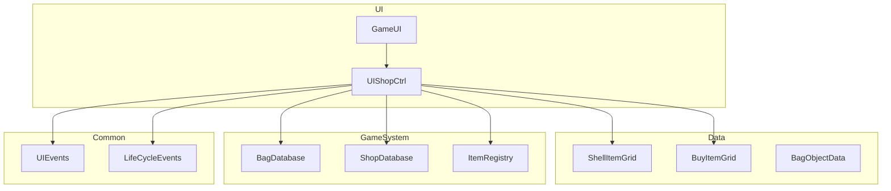
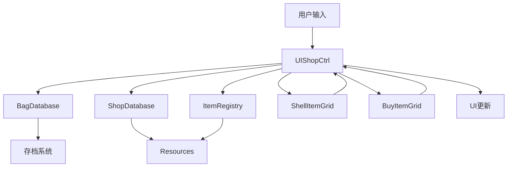
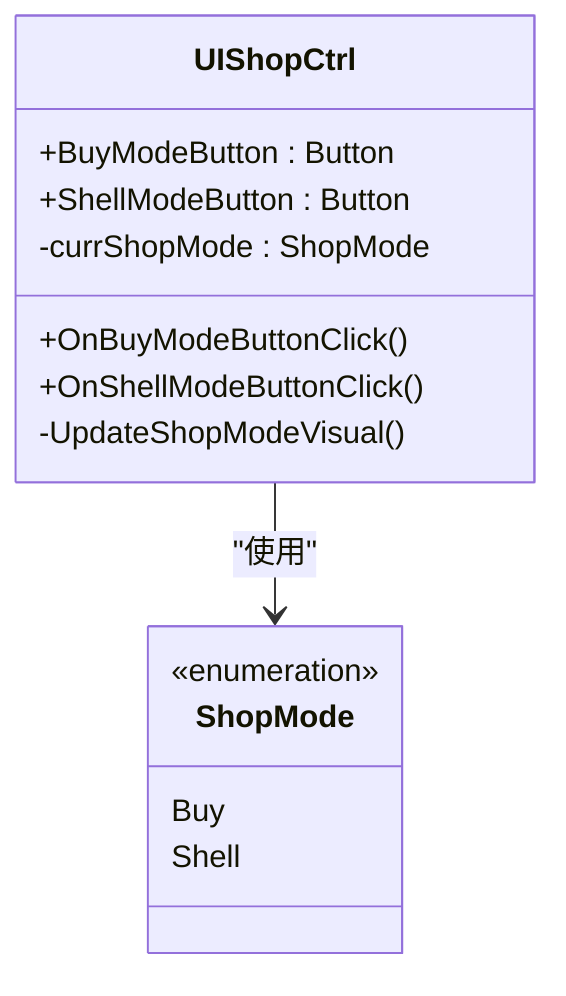
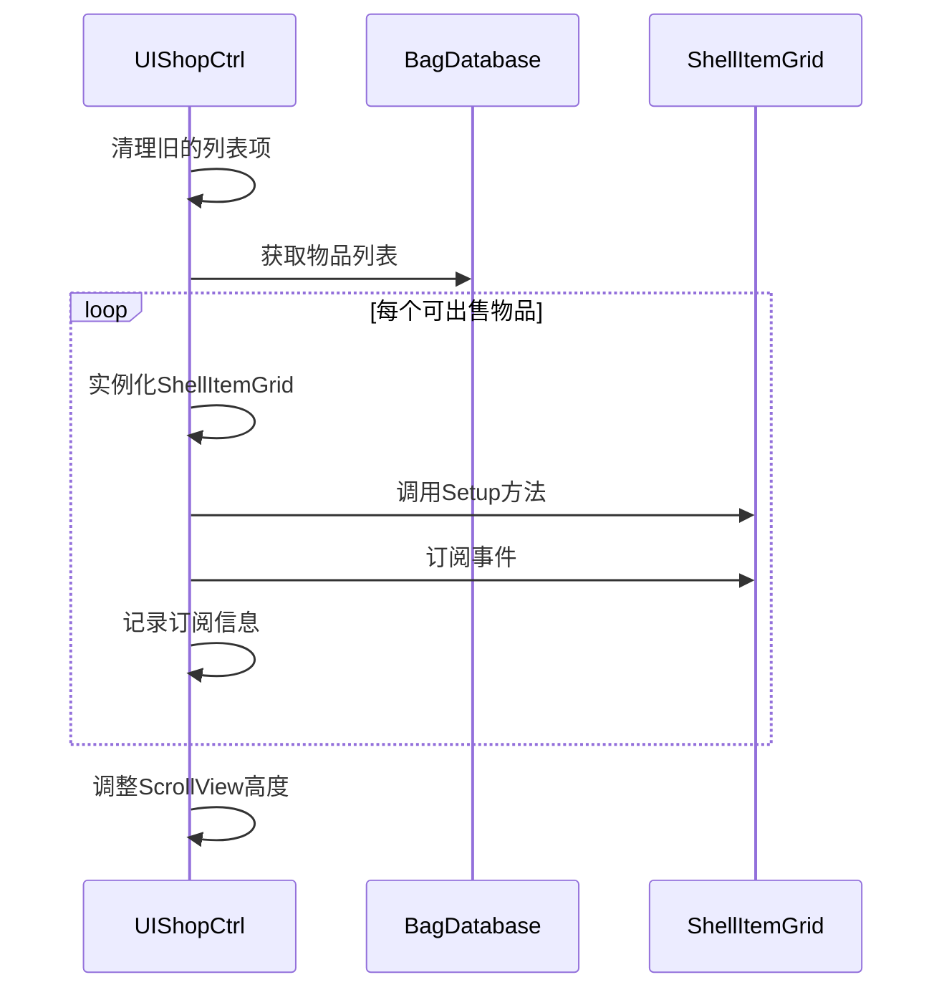
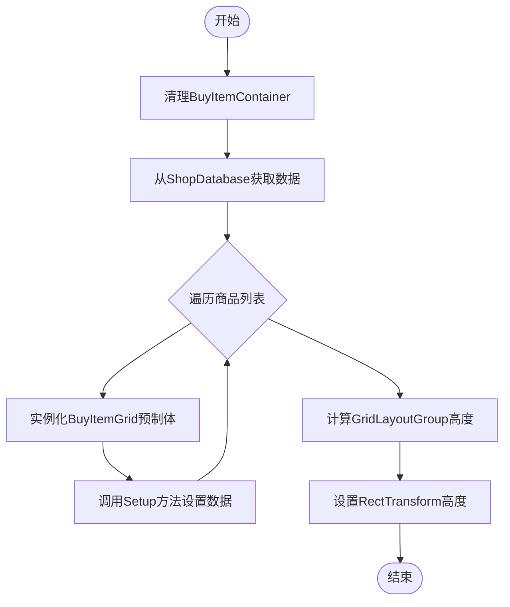
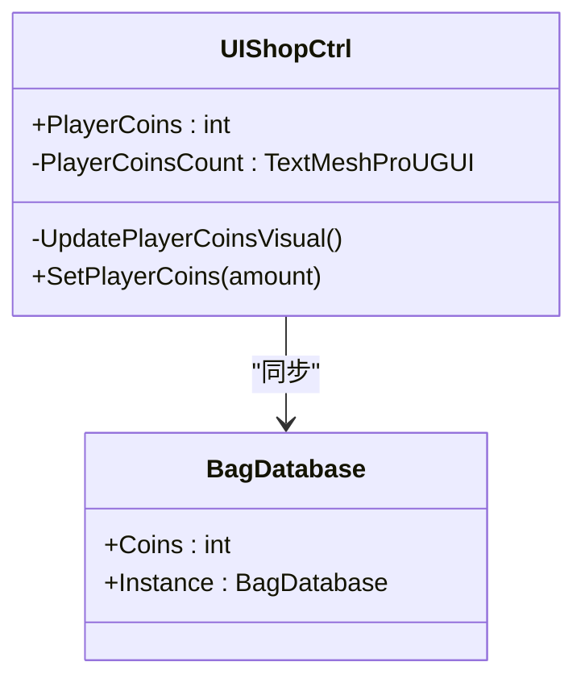
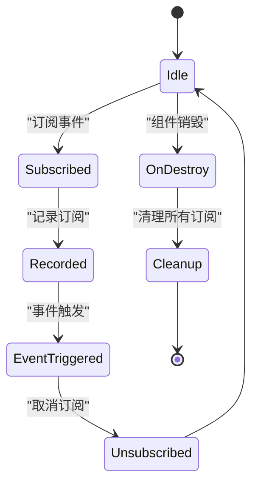
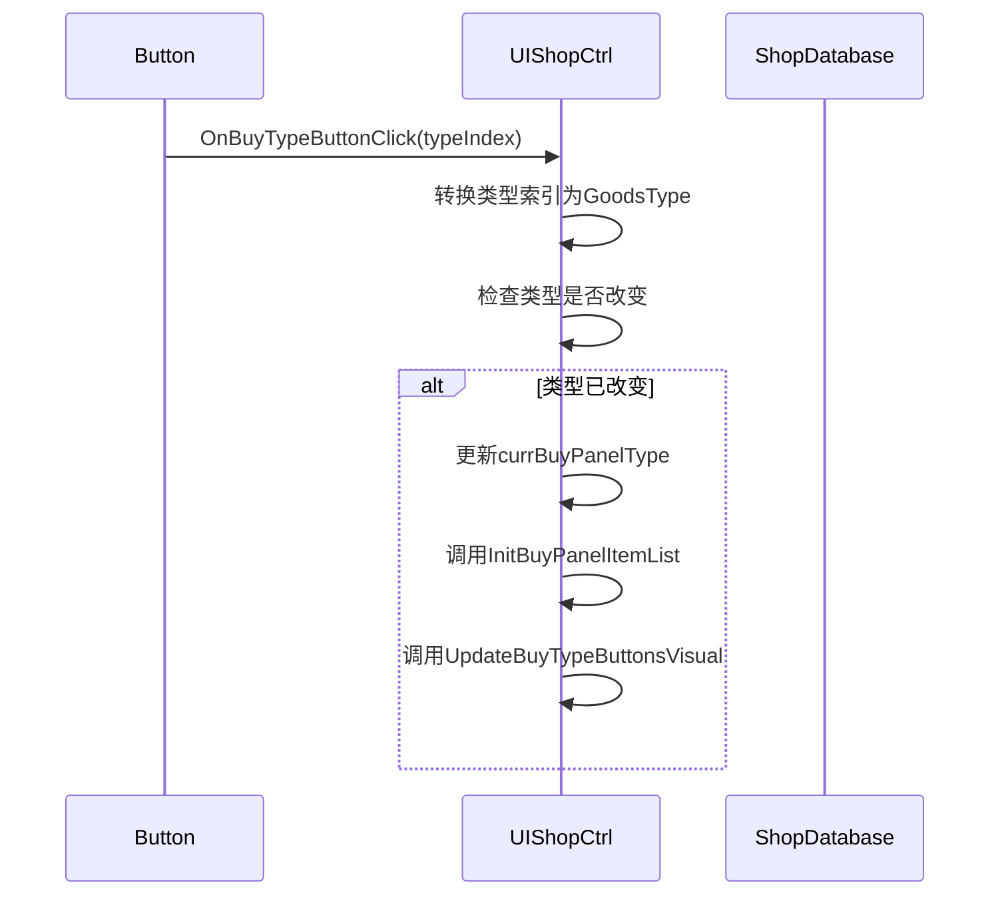
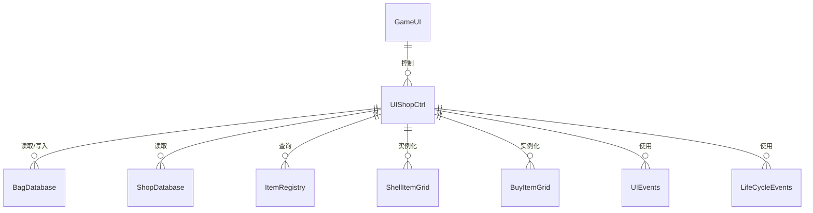

# 商店UI控制器

<cite>
**本文档引用的文件**   
- [UIShopCtrl.cs](file://UI\UIShopCtrl.cs)
- [BagDatabase.cs](file://GameSystem\BagDatabase.cs)
- [ShopDatabase.cs](file://GameSystem\ShopDatabase.cs)
- [ShellItemGrid.cs](file://Data\ShellItemGrid.cs)
- [BuyItemGrid.cs](file://Data\BuyItemGrid.cs)
- [UIEvents.cs](file://Common\Events\UIEvents.cs)
- [LifeCycleEvents.cs](file://Common\Events\LifeCycleEvents.cs)
- [GameUI.cs](file://UI\GameUI.cs)
- [BagObjectData.cs](file://Data\BagObjectData.cs)
- [ItemRegistry.cs](file://GameSystem\ItemRegistry.cs)
</cite>

## 目录
1. [简介](#简介)
2. [项目结构](#项目结构)
3. [核心组件](#核心组件)
4. [架构概述](#架构概述)
5. [详细组件分析](#详细组件分析)
6. [依赖分析](#依赖分析)
7. [性能考虑](#性能考虑)
8. [故障排除指南](#故障排除指南)
9. [结论](#结论)

## 简介
`UIShopCtrl` 组件是商店系统的核心控制器，负责管理商店UI的双模式（购买/出售）切换功能。该组件通过事件驱动机制与背包系统和商店数据库进行交互，实现了动态的物品列表更新、金币同步和用户界面状态管理。本技术文档将深入分析其内部工作机制，包括模式切换、物品列表初始化、事件订阅管理以及数据流设计。

## 项目结构
商店系统由多个组件协同工作，形成一个完整的UI交互体系。核心文件分布在不同的目录中，体现了清晰的关注点分离设计。

**图示来源**
- [UIShopCtrl.cs](file://UI\UIShopCtrl.cs)
- [BagDatabase.cs](file://GameSystem\BagDatabase.cs)
- [ShopDatabase.cs](file://GameSystem\ShopDatabase.cs)

**本节来源**
- [UIShopCtrl.cs](file://UI\UIShopCtrl.cs)
- [project_structure](file://)

## 核心组件
`UIShopCtrl` 组件实现了商店系统的完整功能，包括双模式切换、物品列表管理、金币同步和事件订阅机制。其核心功能围绕购买和出售两个主要模式展开，通过精心设计的状态管理和数据流确保UI的实时性和一致性。

**本节来源**
- [UIShopCtrl.cs](file://UI\UIShopCtrl.cs)

## 架构概述
商店系统的架构采用分层设计，将UI逻辑、数据管理和事件处理分离。`UIShopCtrl` 作为中间层，协调UI组件与底层数据系统之间的交互。

**图示来源**
- [UIShopCtrl.cs](file://UI\UIShopCtrl.cs)
- [BagDatabase.cs](file://GameSystem\BagDatabase.cs)
- [ShopDatabase.cs](file://GameSystem\ShopDatabase.cs)

## 详细组件分析
### UIShopCtrl 组件分析
`UIShopCtrl` 组件是商店系统的中枢，负责管理所有UI状态和数据流。它通过一系列方法和属性实现复杂的功能，同时保持代码的可维护性和扩展性。

#### 双模式切换机制
商店系统支持购买和出售两种模式，通过 `ShopMode` 枚举和相关方法实现无缝切换。

**图示来源**
- [UIShopCtrl.cs](file://UI\UIShopCtrl.cs#L11-L14)

#### 出售物品列表初始化
`InitShellPanelItemList` 方法负责初始化可出售物品列表，从 `BagDatabase` 获取数据并实例化 `ShellItemGrid` 预制体。

**图示来源**
- [UIShopCtrl.cs](file://UI\UIShopCtrl.cs#L59-L95)
- [BagDatabase.cs](file://GameSystem\BagDatabase.cs#L17)
- [ShellItemGrid.cs](file://Data\ShellItemGrid.cs#L10)

#### 购买物品列表初始化
`InitBuyPanelItemList` 方法根据当前商品类型从 `ShopDatabase` 加载数据并生成购买项列表。

**图示来源**
- [UIShopCtrl.cs](file://UI\UIShopCtrl.cs#L100-L123)
- [ShopDatabase.cs](file://GameSystem\ShopDatabase.cs#L10)
- [BuyItemGrid.cs](file://Data\BuyItemGrid.cs#L7)

#### 金币同步机制
`PlayerCoins` 属性与 `BagDatabase.Instance.Coins` 保持同步，并通过 `UpdatePlayerCoinsVisual` 方法更新UI显示。

**图示来源**
- [UIShopCtrl.cs](file://UI\UIShopCtrl.cs#L41-L44)
- [BagDatabase.cs](file://GameSystem\BagDatabase.cs#L14)

#### 事件订阅管理
`_gridSubscriptions` 字典用于管理事件订阅，防止内存泄漏，并在 `OnDestroy` 中正确清理。

**图示来源**
- [UIShopCtrl.cs](file://UI\UIShopCtrl.cs#L47-L48)
- [UIShopCtrl.cs](file://UI\UIShopCtrl.cs#L156-L168)

#### 商品类型切换
`OnBuyTypeButtonClick` 方法响应不同类型商品的切换，更新当前购买面板类型并重新初始化列表。

**图示来源**
- [UIShopCtrl.cs](file://UI\UIShopCtrl.cs#L202-L209)
- [BagObjectData.cs](file://Data\BagObjectData.cs#L120-L125)

**本节来源**
- [UIShopCtrl.cs](file://UI\UIShopCtrl.cs)
- [ShellItemGrid.cs](file://Data\ShellItemGrid.cs)
- [BuyItemGrid.cs](file://Data\BuyItemGrid.cs)

## 依赖分析
商店系统依赖于多个核心组件，形成了一个复杂的依赖网络。这些依赖关系确保了系统的模块化和可维护性。

**图示来源**
- [UIShopCtrl.cs](file://UI\UIShopCtrl.cs)
- [BagDatabase.cs](file://GameSystem\BagDatabase.cs)
- [ShopDatabase.cs](file://GameSystem\ShopDatabase.cs)

**本节来源**
- [UIShopCtrl.cs](file://UI\UIShopCtrl.cs)
- [BagDatabase.cs](file://GameSystem\BagDatabase.cs)
- [ShopDatabase.cs](file://GameSystem\ShopDatabase.cs)

## 性能考虑
`UIShopCtrl` 组件在设计时考虑了性能优化，通过合理的事件管理和对象生命周期控制，避免了常见的性能问题。

- **事件订阅管理**：使用 `_gridSubscriptions` 字典记录所有订阅，在 `OnDestroy` 时统一清理，防止内存泄漏。
- **对象池替代方案**：虽然没有使用对象池，但通过及时销毁和重新实例化UI元素，确保了内存的有效使用。
- **数据同步优化**：`PlayerCoins` 属性直接代理到 `BagDatabase.Instance.Coins`，避免了数据冗余和同步延迟。
- **UI更新效率**：只在必要时更新UI，如模式切换、物品买卖等关键操作。

**本节来源**
- [UIShopCtrl.cs](file://UI\UIShopCtrl.cs)
- [BagDatabase.cs](file://GameSystem\BagDatabase.cs)

## 故障排除指南
### 常见问题及解决方案
1. **出售物品后UI未更新**
   - 检查 `ShellItemGrid.OnItemSold` 事件是否正确触发
   - 确认 `UIShopCtrl.UpdatePlayerCoinsVisual` 方法被调用

2. **购买面板高度计算错误**
   - 检查 `GridLayoutGroup` 的 `cellSize` 和 `spacing` 设置
   - 确认 `buyItemsPerRow` 配置值正确

3. **事件订阅内存泄漏**
   - 确保 `OnDestroy` 方法被正确调用
   - 验证 `_gridSubscriptions` 字典在销毁时被清空

4. **商品类型切换无效**
   - 检查按钮的 `onClick` 事件是否绑定到 `OnBuyTypeButtonClick`
   - 确认 `GoodsType` 枚举值与按钮索引匹配

**本节来源**
- [UIShopCtrl.cs](file://UI\UIShopCtrl.cs)
- [ShellItemGrid.cs](file://Data\ShellItemGrid.cs)

## 结论
`UIShopCtrl` 组件通过精心设计的架构和实现，成功实现了商店系统的双模式切换功能。其核心优势在于：
- 清晰的职责分离，将UI逻辑与数据管理解耦
- 高效的事件驱动机制，确保UI的实时更新
- 完善的内存管理，通过 `_gridSubscriptions` 字典防止内存泄漏
- 灵活的配置系统，支持不同类型的物品展示

该组件的设计模式可作为其他UI系统的参考，特别是在需要动态列表和状态管理的场景中。建议在未来的开发中考虑引入对象池机制，以进一步优化性能。