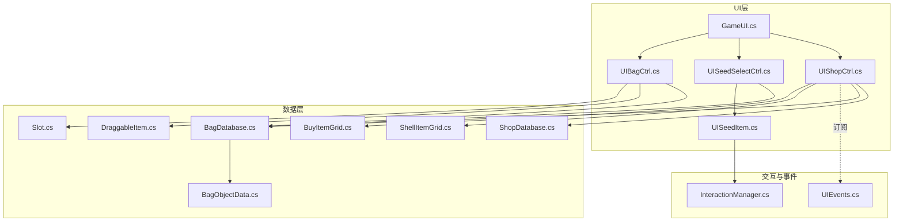
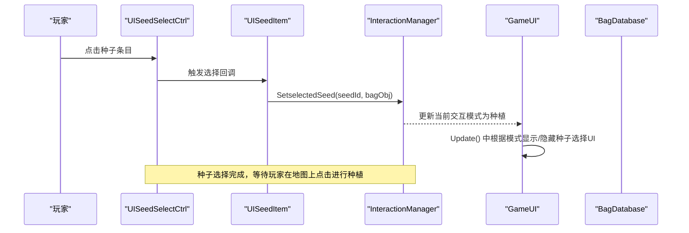
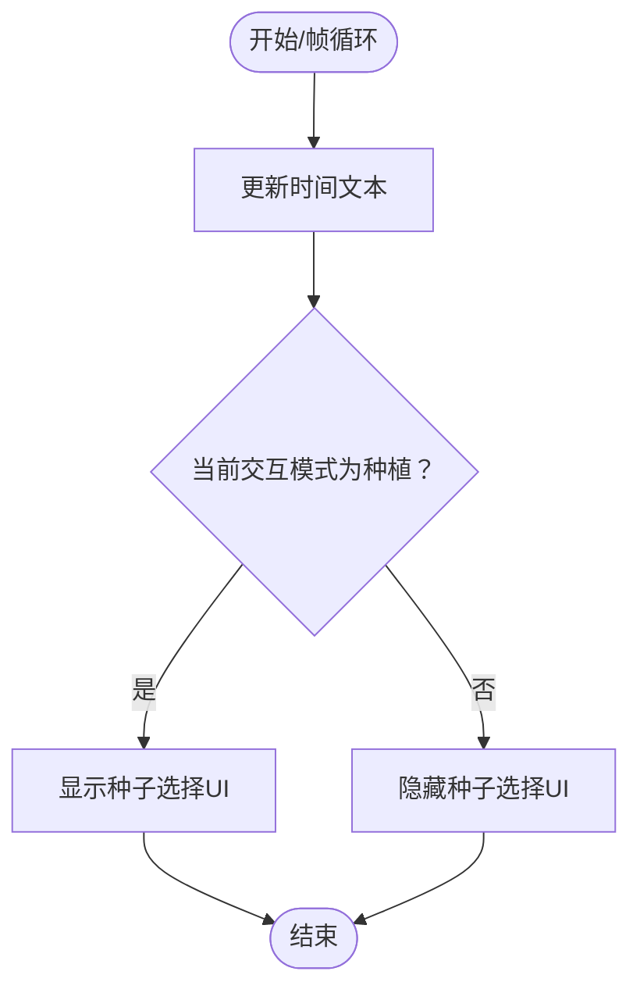
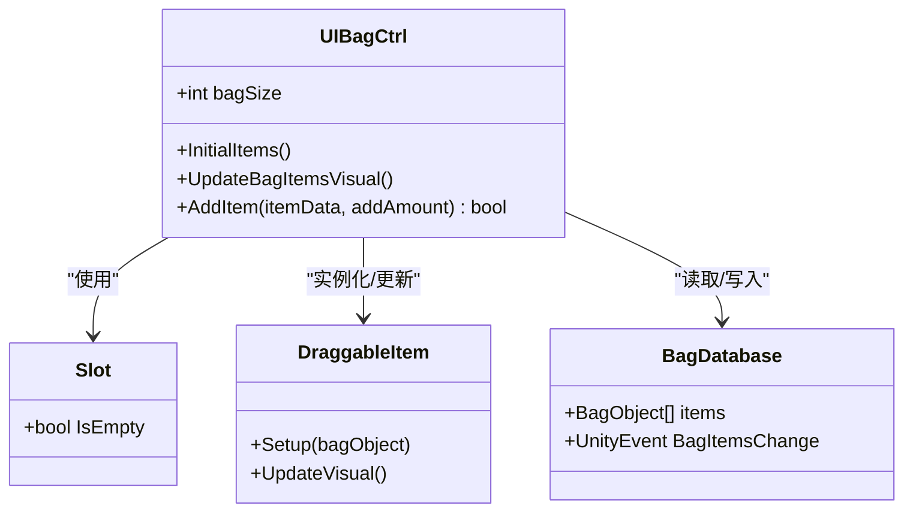
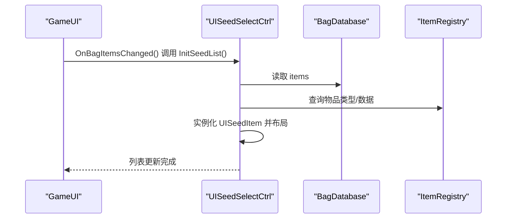
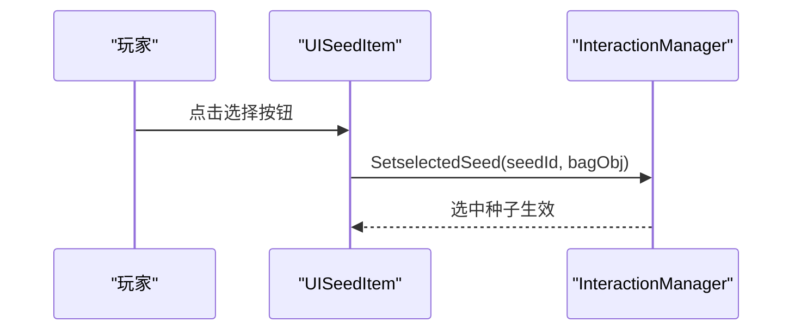
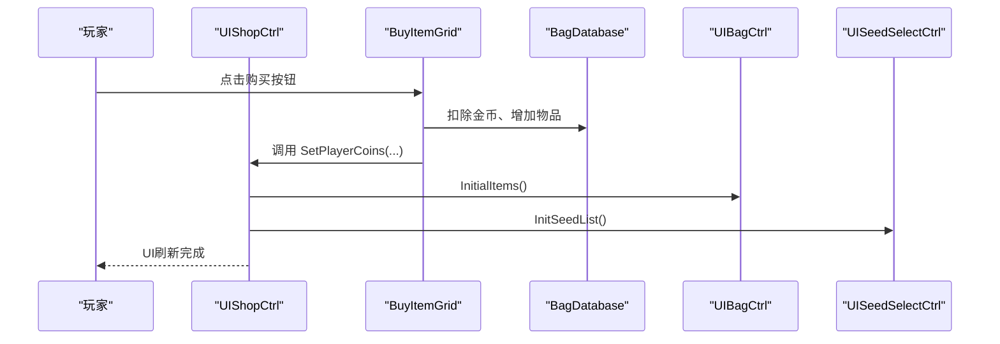
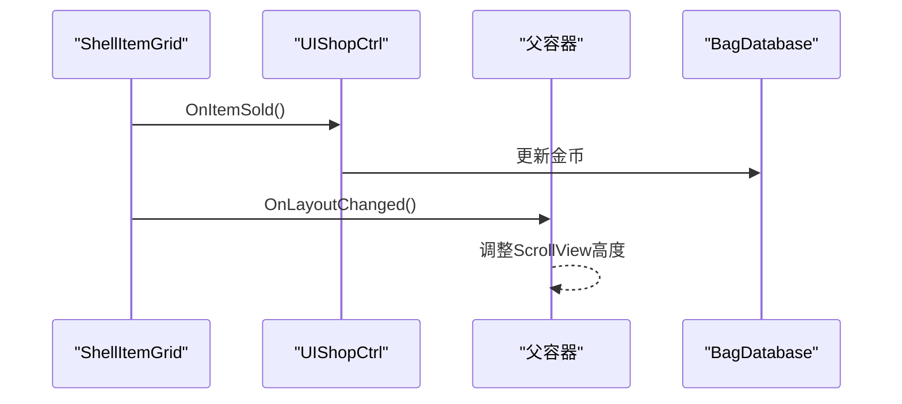
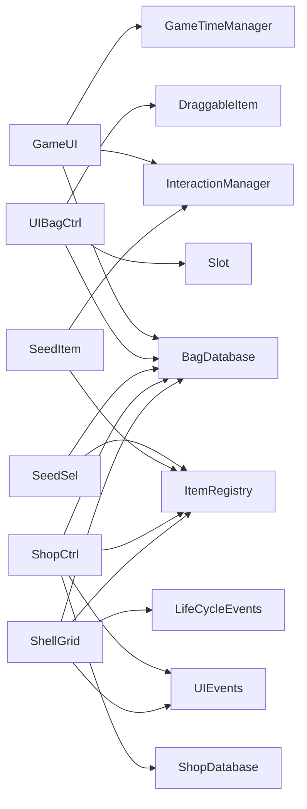

# 用户界面系统

<cite>
**本文引用的文件**
- [GameUI.cs](file://UI/GameUI.cs)
- [UIBagCtrl.cs](file://UI/UIBagCtrl.cs)
- [UISeedSelectCtrl.cs](file://UI/UISeedSelectCtrl.cs)
- [UISeedItem.cs](file://UI/UISeedItem.cs)
- [UIShopCtrl.cs](file://UI/UIShopCtrl.cs)
- [UIEvents.cs](file://Common/Events/UIEvents.cs)
- [BagObjectData.cs](file://Data/BagObjectData.cs)
- [Slot.cs](file://Data/Slot.cs)
- [DraggableItem.cs](file://Data/DraggableItem.cs)
- [BuyItemGrid.cs](file://Data/BuyItemGrid.cs)
- [ShellItemGrid.cs](file://Data/ShellItemGrid.cs)
- [BagDatabase.cs](file://GameSystem/BagDatabase.cs)
- [ShopDatabase.cs](file://GameSystem/ShopDatabase.cs)
- [InteractionManager.cs](file://GameSystem/InteractionManager.cs)
</cite>

## 目录
1. [简介](#简介)
2. [项目结构](#项目结构)
3. [核心组件](#核心组件)
4. [架构总览](#架构总览)
5. [详细组件分析](#详细组件分析)
6. [依赖关系分析](#依赖关系分析)
7. [性能考量](#性能考量)
8. [故障排查指南](#故障排查指南)
9. [结论](#结论)
10. [附录](#附录)

## 简介
本文件系统性地文档化了用户界面系统，重点围绕以下目标：
- GameUI 作为主控制器如何管理各 UI 组件的激活状态与全局更新。
- UIBagCtrl 如何实现背包的打开/关闭、物品的显示与拖拽逻辑。
- UISeedSelectCtrl 如何处理种子选择界面的交互，以及 UISeedItem 如何表示单个种子 UI 元素。
- UIShopCtrl 如何管理商店的购买逻辑与界面更新。
- 文档化每个 UI 组件的公开方法、事件与依赖关系。
- 提供使用示例，例如如何通过 UISeedSelectCtrl 触发种植操作。
- 讨论 UI 与事件系统（如 UIEvents）的集成，确保界面状态能响应游戏逻辑的变化。
- 包含关于 UI 布局、响应式设计和用户交互流程的指导。

## 项目结构
UI 子系统由一个主控制器 GameUI 与若干子 UI 控制器组成，配合数据层（BagDatabase、ShopDatabase）、交互层（InteractionManager）与通用事件（UIEvents）协同工作。下图展示了关键文件之间的关系。

图表来源
- [GameUI.cs](file://UI/GameUI.cs#L1-L110)
- [UIBagCtrl.cs](file://UI/UIBagCtrl.cs#L1-L105)
- [UISeedSelectCtrl.cs](file://UI/UISeedSelectCtrl.cs#L1-L55)
- [UISeedItem.cs](file://UI/UISeedItem.cs#L1-L43)
- [UIShopCtrl.cs](file://UI/UIShopCtrl.cs#L1-L214)
- [BagDatabase.cs](file://GameSystem/BagDatabase.cs#L1-L118)
- [ShopDatabase.cs](file://GameSystem/ShopDatabase.cs#L1-L35)
- [BagObjectData.cs](file://Data/BagObjectData.cs#L1-L151)
- [Slot.cs](file://Data/Slot.cs#L1-L12)
- [DraggableItem.cs](file://Data/DraggableItem.cs#L1-L87)
- [BuyItemGrid.cs](file://Data/BuyItemGrid.cs#L1-L52)
- [ShellItemGrid.cs](file://Data/ShellItemGrid.cs#L1-L100)
- [InteractionManager.cs](file://GameSystem/InteractionManager.cs#L1-L206)
- [UIEvents.cs](file://Common/Events/UIEvents.cs#L1-L11)

章节来源
- [GameUI.cs](file://UI/GameUI.cs#L1-L110)
- [UIBagCtrl.cs](file://UI/UIBagCtrl.cs#L1-L105)
- [UISeedSelectCtrl.cs](file://UI/UISeedSelectCtrl.cs#L1-L55)
- [UISeedItem.cs](file://UI/UISeedItem.cs#L1-L43)
- [UIShopCtrl.cs](file://UI/UIShopCtrl.cs#L1-L214)
- [BagDatabase.cs](file://GameSystem/BagDatabase.cs#L1-L118)
- [ShopDatabase.cs](file://GameSystem/ShopDatabase.cs#L1-L35)
- [BagObjectData.cs](file://Data/BagObjectData.cs#L1-L151)
- [Slot.cs](file://Data/Slot.cs#L1-L12)
- [DraggableItem.cs](file://Data/DraggableItem.cs#L1-L87)
- [BuyItemGrid.cs](file://Data/BuyItemGrid.cs#L1-L52)
- [ShellItemGrid.cs](file://Data/ShellItemGrid.cs#L1-L100)
- [InteractionManager.cs](file://GameSystem/InteractionManager.cs#L1-L206)
- [UIEvents.cs](file://Common/Events/UIEvents.cs#L1-L11)

## 核心组件
- GameUI：全局 UI 控制器，负责时间显示、种子选择 UI 的显隐控制、商店与背包的开关、以及订阅背包物品变更事件以联动刷新多个 UI。
- UIBagCtrl：背包 UI 控制器，负责生成槽位、初始化物品、更新物品显示、实现拖拽逻辑（与 DraggableItem 协作）。
- UISeedSelectCtrl：种子选择面板控制器，负责筛选背包中的种子、实例化 UISeedItem 并布局。
- UISeedItem：单个种子条目 UI，负责显示图标、名称、数量，并在点击时向 InteractionManager 设置选中的种子。
- UIShopCtrl：商店控制器，负责切换购买/出售模式、按类型加载商品、更新玩家金币显示、处理购买与出售逻辑。
- 事件系统 UIEvents：提供子 UI 更新布局的委托类型，用于通知父容器调整尺寸等。

章节来源
- [GameUI.cs](file://UI/GameUI.cs#L1-L110)
- [UIBagCtrl.cs](file://UI/UIBagCtrl.cs#L1-L105)
- [UISeedSelectCtrl.cs](file://UI/UISeedSelectCtrl.cs#L1-L55)
- [UISeedItem.cs](file://UI/UISeedItem.cs#L1-L43)
- [UIShopCtrl.cs](file://UI/UIShopCtrl.cs#L1-L214)
- [UIEvents.cs](file://Common/Events/UIEvents.cs#L1-L11)

## 架构总览
UI 系统采用“主控制器 + 子控制器 + 数据/交互/事件”的分层架构。GameUI 作为中枢，统一调度种子选择、商店与背包 UI；UIBagCtrl 与 DraggableItem 协作实现拖拽与槽位管理；UISeedSelectCtrl 与 UISeedItem 负责种子选择；UIShopCtrl 与 BuyItemGrid/ShellItemGrid 协作完成购买与出售；事件系统（UIEvents）与 BagDatabase 的事件驱动 UI 刷新。

图表来源
- [UISeedSelectCtrl.cs](file://UI/UISeedSelectCtrl.cs#L1-L55)
- [UISeedItem.cs](file://UI/UISeedItem.cs#L1-L43)
- [InteractionManager.cs](file://GameSystem/InteractionManager.cs#L1-L206)
- [GameUI.cs](file://UI/GameUI.cs#L1-L110)

## 详细组件分析

### GameUI 主控制器
职责与行为
- 单例管理：保证全局唯一实例，避免重复。
- 时间显示：每帧更新时间文本。
- 种子选择 UI 显隐：根据 InteractionManager 的当前交互模式（种植）决定显示或隐藏。
- 背包与商店开关：提供按钮回调以显示/隐藏对应画布。
- 背包物品变更联动：订阅 BagDatabase 的物品变更事件，刷新种子选择列表、背包物品、商店出售面板。

公开方法
- OnShopOpenButtonClick()/OnShopCloseButtonClick()
- OnBagOpenButtonClick()/OnBagCloaseButtonClick()
- ToggleSaveStageUIActive(bool)

事件与依赖
- 订阅 BagDatabase.BagItemsChange，回调 OnBagItemsChanged。
- 依赖 InteractionManager、GameTimeManager、ShopCanvas、BagCanvas、SaveStageCanvas。

图表来源
- [GameUI.cs](file://UI/GameUI.cs#L1-L110)
- [InteractionManager.cs](file://GameSystem/InteractionManager.cs#L1-L206)

章节来源
- [GameUI.cs](file://UI/GameUI.cs#L1-L110)

### UIBagCtrl 背包控制器
职责与行为
- 初始化：生成固定数量的槽位，初始隐藏，避免拾取阶段 UI 异常。
- 物品初始化：遍历 SlotContainer，销毁旧物品，按 BagDatabase.items 生成 DraggableItem。
- 物品更新：遍历槽位，调用 DraggableItem.UpdateVisual() 刷新数量显示。
- 拖拽支持：通过 DraggableItem 实现拖拽、交换与回退逻辑。
- 添加物品：优先堆叠，否则寻找空槽位，返回是否成功。

公开方法
- UpdateBagItemsVisual()
- InitialItems()
- AddItem(BagObjectData, int): 返回是否成功

内部协作
- 依赖 Slot（空槽判断）、DraggableItem（拖拽与可视化）、BagDatabase（物品数据）。

图表来源
- [UIBagCtrl.cs](file://UI/UIBagCtrl.cs#L1-L105)
- [Slot.cs](file://Data/Slot.cs#L1-L12)
- [DraggableItem.cs](file://Data/DraggableItem.cs#L1-L87)
- [BagDatabase.cs](file://GameSystem/BagDatabase.cs#L1-L118)

章节来源
- [UIBagCtrl.cs](file://UI/UIBagCtrl.cs#L1-L105)
- [Slot.cs](file://Data/Slot.cs#L1-L12)
- [DraggableItem.cs](file://Data/DraggableItem.cs#L1-L87)
- [BagDatabase.cs](file://GameSystem/BagDatabase.cs#L1-L118)

### UISeedSelectCtrl 种子选择控制器
职责与行为
- 初始化种子列表：清理旧内容，遍历 BagDatabase.items，筛选种子类型且数量大于 0 的物品，实例化 UISeedItem 并手动布局。
- 手动布局：根据种子项宽度与间距计算 Content 的宽度，保证横向滚动正常。

公开方法
- InitSeedList()

依赖
- BagDatabase（物品列表）
- ItemRegistry（类型与数据查询）
- UISeedItem（条目组件）

图表来源
- [GameUI.cs](file://UI/GameUI.cs#L1-L110)
- [UISeedSelectCtrl.cs](file://UI/UISeedSelectCtrl.cs#L1-L55)
- [BagDatabase.cs](file://GameSystem/BagDatabase.cs#L1-L118)
- [BagObjectData.cs](file://Data/BagObjectData.cs#L1-L151)

章节来源
- [UISeedSelectCtrl.cs](file://UI/UISeedSelectCtrl.cs#L1-L55)
- [BagDatabase.cs](file://GameSystem/BagDatabase.cs#L1-L118)
- [BagObjectData.cs](file://Data/BagObjectData.cs#L1-L151)

### UISeedItem 种子条目
职责与行为
- 显示：图标、名称、数量。
- 交互：绑定按钮点击，调用 InteractionManager.SetselectedSeed(seedId, bagObj)，将选中的种子传递给交互系统。

公开方法
- Setup(BagObject)
- OnSelectSeed()（私有，绑定 onClick）

依赖
- ItemRegistry（获取物品数据）
- InteractionManager（设置选中种子）

图表来源
- [UISeedItem.cs](file://UI/UISeedItem.cs#L1-L43)
- [InteractionManager.cs](file://GameSystem/InteractionManager.cs#L1-L206)

章节来源
- [UISeedItem.cs](file://UI/UISeedItem.cs#L1-L43)
- [InteractionManager.cs](file://GameSystem/InteractionManager.cs#L1-L206)

### UIShopCtrl 商店控制器
职责与行为
- 模式切换：购买/出售两种模式，分别显示不同面板并高亮对应按钮。
- 购买面板：按 GoodsType 分类加载商品，计算网格高度，支持滑动浏览。
- 出售面板：根据背包物品生成 ShellItemGrid，支持滑条选择数量并出售，触发事件通知父容器调整高度与取消订阅。
- 金币显示：实时更新玩家金币文本。

公开方法
- InitShellPanelItemList()
- InitBuyPanelItemList()
- SetPlayerCoins(int)
- OnBuyModeButtonClick()
- OnShellModeButtonClick()
- OnBuyTypeButtonClick(int)

事件与依赖
- 订阅 UIEvents.LayoutChanged（子项布局变化时通知父容器调整高度）。
- 订阅 LifeCycleEvents.Destroyed（子项销毁时取消订阅）。
- 订阅 ShellItemGrid.OnItemSold（更新金币与界面）。
- 依赖 BagDatabase（金币、物品）、ShopDatabase（商品列表）、ItemRegistry（价格与图标）。

图表来源
- [UIShopCtrl.cs](file://UI/UIShopCtrl.cs#L1-L214)
- [BuyItemGrid.cs](file://Data/BuyItemGrid.cs#L1-L52)
- [BagDatabase.cs](file://GameSystem/BagDatabase.cs#L1-L118)
- [GameUI.cs](file://UI/GameUI.cs#L1-L110)

章节来源
- [UIShopCtrl.cs](file://UI/UIShopCtrl.cs#L1-L214)
- [BuyItemGrid.cs](file://Data/BuyItemGrid.cs#L1-L52)
- [ShellItemGrid.cs](file://Data/ShellItemGrid.cs#L1-L100)
- [UIEvents.cs](file://Common/Events/UIEvents.cs#L1-L11)
- [BagDatabase.cs](file://GameSystem/BagDatabase.cs#L1-L118)

### 事件系统与数据流
- UIEvents：提供 LayoutChanged 委托，用于子 UI 通知父容器调整布局。
- BagDatabase：维护物品列表与金币，提供 BagItemsChange 事件，用于 UI 刷新。
- ShellItemGrid：在出售时触发 OnItemSold，通知商店控制器更新金币与界面。
- UIShopCtrl：在 InitShellPanelItemList 中订阅子项事件，并在 OnDestroy 中统一取消订阅，避免内存泄漏。

图表来源
- [ShellItemGrid.cs](file://Data/ShellItemGrid.cs#L1-L100)
- [UIShopCtrl.cs](file://UI/UIShopCtrl.cs#L1-L214)
- [UIEvents.cs](file://Common/Events/UIEvents.cs#L1-L11)
- [BagDatabase.cs](file://GameSystem/BagDatabase.cs#L1-L118)

章节来源
- [UIEvents.cs](file://Common/Events/UIEvents.cs#L1-L11)
- [ShellItemGrid.cs](file://Data/ShellItemGrid.cs#L1-L100)
- [UIShopCtrl.cs](file://UI/UIShopCtrl.cs#L1-L214)
- [BagDatabase.cs](file://GameSystem/BagDatabase.cs#L1-L118)

## 依赖关系分析
- GameUI 依赖 InteractionManager（模式控制）、BagDatabase（物品变更事件）、GameTimeManager（时间显示）。
- UIBagCtrl 依赖 Slot、DraggableItem、BagDatabase。
- UISeedSelectCtrl 依赖 BagDatabase、ItemRegistry。
- UIShopCtrl 依赖 BagDatabase、ShopDatabase、ItemRegistry、UIEvents。
- UISeedItem 依赖 ItemRegistry、InteractionManager。
- ShellItemGrid 依赖 UIEvents、LifeCycleEvents、BagDatabase、ItemRegistry。

图表来源
- [GameUI.cs](file://UI/GameUI.cs#L1-L110)
- [UIBagCtrl.cs](file://UI/UIBagCtrl.cs#L1-L105)
- [UISeedSelectCtrl.cs](file://UI/UISeedSelectCtrl.cs#L1-L55)
- [UISeedItem.cs](file://UI/UISeedItem.cs#L1-L43)
- [UIShopCtrl.cs](file://UI/UIShopCtrl.cs#L1-L214)
- [ShellItemGrid.cs](file://Data/ShellItemGrid.cs#L1-L100)
- [InteractionManager.cs](file://GameSystem/InteractionManager.cs#L1-L206)
- [BagDatabase.cs](file://GameSystem/BagDatabase.cs#L1-L118)
- [ShopDatabase.cs](file://GameSystem/ShopDatabase.cs#L1-L35)
- [BagObjectData.cs](file://Data/BagObjectData.cs#L1-L151)
- [UIEvents.cs](file://Common/Events/UIEvents.cs#L1-L11)

章节来源
- [GameUI.cs](file://UI/GameUI.cs#L1-L110)
- [UIBagCtrl.cs](file://UI/UIBagCtrl.cs#L1-L105)
- [UISeedSelectCtrl.cs](file://UI/UISeedSelectCtrl.cs#L1-L55)
- [UISeedItem.cs](file://UI/UISeedItem.cs#L1-L43)
- [UIShopCtrl.cs](file://UI/UIShopCtrl.cs#L1-L214)
- [ShellItemGrid.cs](file://Data/ShellItemGrid.cs#L1-L100)
- [InteractionManager.cs](file://GameSystem/InteractionManager.cs#L1-L206)
- [BagDatabase.cs](file://GameSystem/BagDatabase.cs#L1-L118)
- [ShopDatabase.cs](file://GameSystem/ShopDatabase.cs#L1-L35)
- [BagObjectData.cs](file://Data/BagObjectData.cs#L1-L151)
- [UIEvents.cs](file://Common/Events/UIEvents.cs#L1-L11)

## 性能考量
- 背包初始化与刷新：UIBagCtrl 在 Start 时一次性生成槽位并隐藏，避免初始化阶段的视觉闪烁；OnBagItemsChanged 中仅刷新必要的 UI，减少不必要的重建。
- 种子列表布局：UISeedSelectCtrl 手动计算 Content 宽度，避免频繁的 LayoutRebuilder 调用。
- 商店面板：InitBuyPanelItemList 通过计算行数与单元格尺寸一次性设置高度，减少多次布局计算。
- 事件订阅：UIShopCtrl 在 OnDestroy 中统一取消订阅，防止内存泄漏；UIBagCtrl 与 GameUI 在 OnDestroy 中取消订阅 BagDatabase 事件，避免泄漏。
- 拖拽性能：DraggableItem 在 OnEndDrag 中仅进行必要的父子变换与比较，避免复杂计算。

[本节为通用建议，不直接分析具体文件，故无章节来源]

## 故障排查指南
- 背包物品未刷新
  - 检查 BagDatabase 是否正确触发 BagItemsChange。
  - 确认 GameUI.OnBagItemsChanged 是否被调用。
  - 确认 UIBagCtrl.InitialItems() 与 UISeedSelectCtrl.InitSeedList() 是否被调用。
- 种子选择不显示
  - 检查 GameUI.Update() 中是否根据 InteractionManager.currInteractionMode 正确设置 SeedSelectCtrl 的激活状态。
  - 确认 UISeedSelectCtrl.InitSeedList() 是否筛选到种子类型且数量大于 0。
- 商店购买无效
  - 检查 BuyItemGrid.OnBuyButtonClick() 是否正确扣减金币与增加物品。
  - 确认 UIShopCtrl.SetPlayerCoins() 与 UIBagCtrl.InitialItems() 是否被调用。
- 拖拽异常
  - 检查 DraggableItem 的 OnBeginDrag/OnDrag/OnEndDrag 是否正确设置父级与回退逻辑。
  - 确认 Slot.IsEmpty 的判断是否基于子对象存在。

章节来源
- [GameUI.cs](file://UI/GameUI.cs#L1-L110)
- [BagDatabase.cs](file://GameSystem/BagDatabase.cs#L1-L118)
- [UIBagCtrl.cs](file://UI/UIBagCtrl.cs#L1-L105)
- [UISeedSelectCtrl.cs](file://UI/UISeedSelectCtrl.cs#L1-L55)
- [BuyItemGrid.cs](file://Data/BuyItemGrid.cs#L1-L52)
- [DraggableItem.cs](file://Data/DraggableItem.cs#L1-L87)

## 结论
本 UI 系统通过 GameUI 统一调度，结合 BagDatabase 的事件驱动与 InteractionManager 的交互模式，实现了从种子选择到购买/出售的完整闭环。UIBagCtrl 与 DraggableItem 提供了稳定的拖拽体验，UISeedSelectCtrl 与 UISeedItem 精准地将玩家选择传递至交互层，UIShopCtrl 则通过事件系统与数据层协同，确保界面状态与游戏逻辑保持一致。整体架构清晰、职责明确、扩展性强。

[本节为总结性内容，不直接分析具体文件，故无章节来源]

## 附录

### 使用示例：通过 UISeedSelectCtrl 触发种植操作
- 步骤
  1) 玩家在种子选择面板点击某个种子条目。
  2) UISeedItem 调用 InteractionManager.SetselectedSeed(seedId, bagObj)。
  3) GameUI 根据 InteractionManager.currInteractionMode 显示种子选择 UI。
  4) 玩家在地图上点击可种植区域，调用 InteractionManager.PlantCrop(tile, seedId)。
  5) BagDatabase.DecreseItem 减少背包中该种子数量，Tile.Plant 完成播种。
  6) GameUI.OnBagItemsChanged 刷新种子列表与背包显示。

章节来源
- [UISeedItem.cs](file://UI/UISeedItem.cs#L1-L43)
- [InteractionManager.cs](file://GameSystem/InteractionManager.cs#L1-L206)
- [GameUI.cs](file://UI/GameUI.cs#L1-L110)
- [BagDatabase.cs](file://GameSystem/BagDatabase.cs#L1-L118)

### UI 布局与响应式设计建议
- 使用 Content Size Fitter 或手动设置 Content 宽度，避免频繁布局重算。
- 对于 ScrollView，优先在初始化时计算并设置高度，减少运行时动态调整。
- 事件驱动的布局更新：子项通过 UIEvents.LayoutChanged 通知父容器，父容器集中处理尺寸调整。
- 按钮状态高亮：使用颜色区分当前模式，提升用户感知。

[本节为通用建议，不直接分析具体文件，故无章节来源]