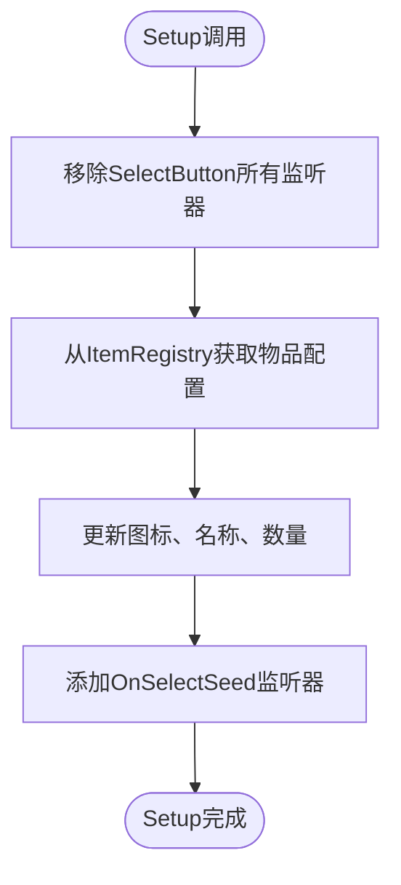
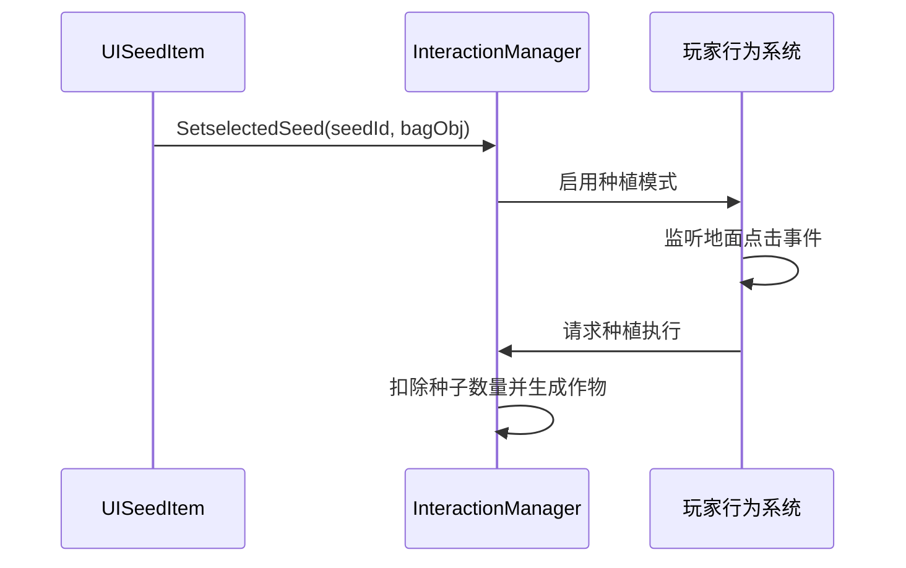

# 种子UI项组件

<cite>
**本文档中引用的文件**  
- [UISeedItem.cs](file://UI\UISeedItem.cs)
- [UISeedSelectCtrl.cs](file://UI\UISeedSelectCtrl.cs)
- [InteractionManager.cs](file://GameSystem\InteractionManager.cs)
- [BagObjectData.cs](file://Data\BagObjectData.cs)
- [ItemRegistry.cs](file://GameSystem\ItemRegistry.cs)
</cite>

## 目录
1. [简介](#简介)
2. [核心职责与UI结构](#核心职责与ui结构)
3. [Setup方法详解](#setup方法详解)
4. [事件绑定机制分析](#事件绑定机制分析)
5. [OnSelectSeed方法与游戏逻辑交互](#onselectseed方法与游戏逻辑交互)
6. [bagObj字段的作用与意义](#bagobj字段的作用与意义)
7. [Bg Image在布局中的角色](#bg-image在布局中的角色)
8. [功能扩展建议](#功能扩展建议)
9. [总结](#总结)

## 简介
`UISeedItem` 是一个用于表示单个可种植种子的用户界面组件，广泛应用于背包或种子选择界面中。该组件负责可视化展示种子的图标、名称和当前持有数量，并支持用户交互以选择特定种子进行种植操作。其设计注重可复用性与状态隔离，确保在动态列表中重复使用时不会产生事件冲突或数据错乱。

本文档将深入剖析该组件的内部实现机制，涵盖其数据绑定、事件管理、与核心系统的交互方式，并提出可行的功能增强方向。

## 核心职责与UI结构
`UISeedItem` 组件的主要职责包括：
- 显示种子图标（IconImage）
- 展示种子名称（Seedname）
- 更新并呈现当前持有的种子数量（SeedAmountText）
- 响应用户点击以触发选中逻辑
- 与背包数据对象（BagObject）保持引用关联，便于直接更新数量

该组件通过Unity UI系统构建，包含Image、Text等基础UI元素，由脚本驱动数据填充与交互行为。

**Section sources**
- [UISeedItem.cs](file://UI\UISeedItem.cs#L5-L20)

## Setup方法详解
`Setup` 方法是 `UISeedItem` 的核心初始化入口，接收一个 `BagObject` 类型参数，该对象封装了背包中某一物品的实例数据（如ID、数量等）。方法内部通过 `ItemRegistry.Instance.GetItemConfig(seedId)` 获取该种子的全局配置信息，包括图标资源、作物关联数据等。

随后，该方法将配置中的图标赋值给 `IconImage`，将名称设置到 `Seedname` 文本组件，并将当前 `bagObj.amount` 同步至 `SeedAmountText`。此过程实现了从数据到UI的单向绑定，确保每次调用 `Setup` 都能准确反映最新的物品状态。

**Section sources**
- [UISeedItem.cs](file://UI\UISeedItem.cs#L25-L50)
- [ItemRegistry.cs](file://GameSystem\ItemRegistry.cs#L10-L40)
- [BagObjectData.cs](file://Data\BagObjectData.cs#L15-L35)

## 事件绑定机制分析
为防止在重复使用UI项时出现事件监听器叠加导致的多次触发问题，`UISeedItem` 在 `Setup` 方法中采用了“先移除后添加”的安全策略。每次调用 `Setup` 时，都会先执行 `SelectButton.onClick.RemoveAllListeners()`，清除所有已注册的回调函数。

紧接着，通过 `SelectButton.onClick.AddListener(OnSelectSeed)` 注册新的选中回调。这种设计确保了每个 `UISeedItem` 实例在任何时候都仅绑定一次 `OnSelectSeed` 事件，从根本上避免了事件重复注册的风险，提升了UI稳定性和性能表现。

**Diagram sources**
- [UISeedItem.cs](file://UI\UISeedItem.cs#L30-L45)

**Section sources**
- [UISeedItem.cs](file://UI\UISeedItem.cs#L30-L50)

## OnSelectSeed方法与游戏逻辑交互
`OnSelectSeed` 是用户点击种子项时触发的核心回调方法。该方法通过单例模式访问 `InteractionManager.Instance`，并调用其 `SetselectedSeed` 方法，传入当前种子的ID和对应的 `bagObj` 背包对象。

这一调用将游戏状态切换至“种植模式”，使交互管理器能够根据选中的种子类型和数量控制玩家的后续行为（如允许在可耕地上点击进行种植）。此设计实现了UI层与游戏核心逻辑的松耦合通信，符合职责分离原则。

**Diagram sources**
- [UISeedItem.cs](file://UI\UISeedItem.cs#L55-L65)
- [InteractionManager.cs](file://GameSystem\InteractionManager.cs#L20-L50)

**Section sources**
- [UISeedItem.cs](file://UI\UISeedItem.cs#L52-L70)
- [InteractionManager.cs](file://GameSystem\InteractionManager.cs#L15-L60)

## bagObj字段的作用与意义
`bagObj` 字段在 `UISeedItem` 中不仅作为数据源，更是一个可操作的引用。当用户成功种植后，`InteractionManager` 可通过此引用来直接修改 `bagObj.amount`，实现种子数量的实时扣除。这种设计避免了额外的查找或事件通知机制，提高了数据同步效率。

同时，`bagObj` 的存在使得 `UISeedItem` 能够在 `Setup` 时准确反映当前库存状态，并在外部数量变化后通过重新调用 `Setup` 实现UI刷新，形成闭环的数据流。

**Section sources**
- [UISeedItem.cs](file://UI\UISeedItem.cs#L10-L15)
- [BagObjectData.cs](file://Data\BagObjectData.cs#L5-L40)

## Bg Image在布局中的角色
`Bg Image` 作为 `UISeedItem` 的背景元素，在父级控制器 `UISeedSelectCtrl` 中被用于布局计算。父级通过读取 `Bg Image` 的 `RectTransform` 尺寸来确定每个种子项的宽度，从而动态调整容器的布局参数（如Grid Layout Group的单元格大小），确保所有种子项在界面上均匀分布且适配不同屏幕尺寸。

此外，`Bg Image` 还可提供视觉反馈（如选中高亮、悬停变色），增强用户体验。

**Section sources**
- [UISeedItem.cs](file://UI\UISeedItem.cs#L8-L12)
- [UISeedSelectCtrl.cs](file://UI\UISeedSelectCtrl.cs#L30-L60)

## 功能扩展建议
为进一步提升 `UISeedItem` 的用户体验与功能性，可考虑以下增强方向：

1. **悬停提示（Tooltip）**：添加 `OnPointerEnter` 和 `OnPointerExit` 事件，显示种子的详细信息（如生长周期、收获产出）。
2. **拖拽支持**：集成 `IDragHandler` 接口，允许用户将种子从背包拖拽至耕地，提升操作直观性。
3. **稀有度视觉效果**：根据种子稀有度（在ItemConfig中定义）动态改变边框颜色或添加特效粒子，增强视觉层次。
4. **数量输入弹窗**：长按或右键点击时弹出数量选择框，支持批量种植。
5. **冷却或不可用状态**：当种子数量为0或当前季节不适宜种植时，添加灰化处理与禁用交互。

这些扩展可在不破坏现有架构的前提下，通过继承或组件化方式逐步实现。

## 总结
`UISeedItem` 是一个职责清晰、设计稳健的UI组件，有效实现了种子项的数据展示与用户交互。其通过安全的事件管理机制避免了常见UI陷阱，并通过直接引用 `bagObj` 实现了高效的数据同步。与 `InteractionManager` 的协作模式体现了良好的架构分层思想。未来可通过添加交互反馈与视觉增强进一步提升用户体验。