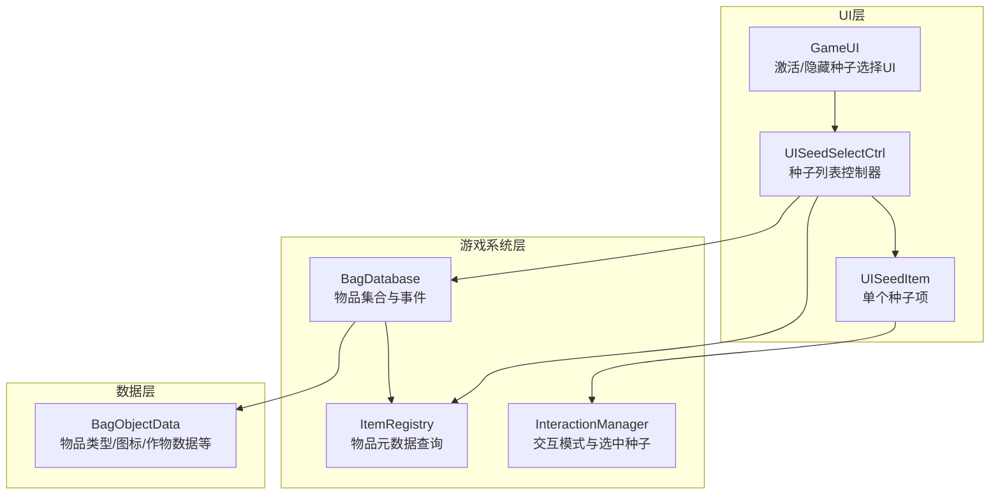
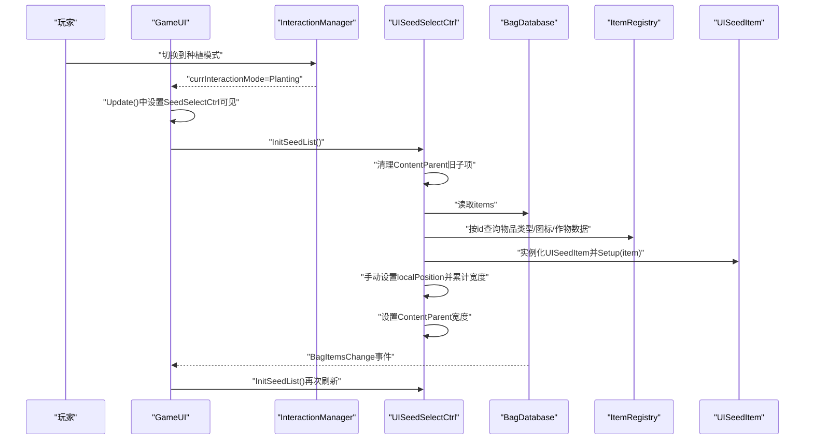
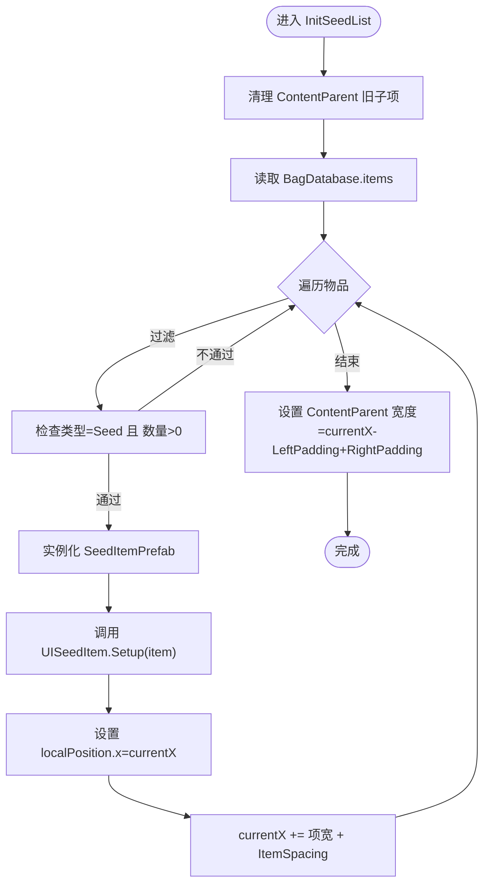
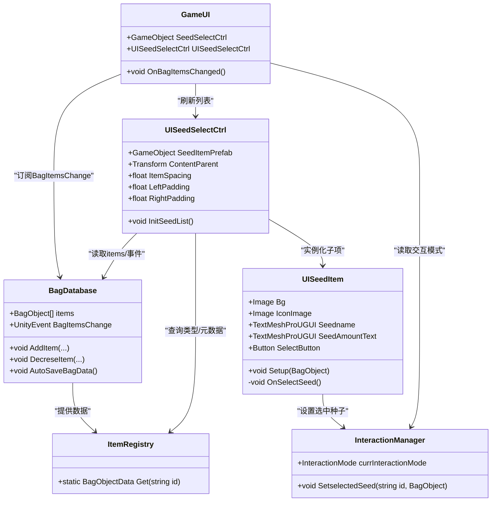

# 种子选择UI控制器

<cite>
**本文引用的文件**
- [UISeedSelectCtrl.cs](file://UI/UISeedSelectCtrl.cs)
- [GameUI.cs](file://UI/GameUI.cs)
- [UISeedItem.cs](file://UI/UISeedItem.cs)
- [BagDatabase.cs](file://GameSystem/BagDatabase.cs)
- [ItemRegistry.cs](file://GameSystem/ItemRegistry.cs)
- [InteractionManager.cs](file://GameSystem/InteractionManager.cs)
- [BagObjectData.cs](file://Data/BagObjectData.cs)
</cite>

## 目录
1. [简介](#简介)
2. [项目结构](#项目结构)
3. [核心组件](#核心组件)
4. [架构总览](#架构总览)
5. [详细组件分析](#详细组件分析)
6. [依赖关系分析](#依赖关系分析)
7. [性能考量](#性能考量)
8. [故障排查指南](#故障排查指南)
9. [结论](#结论)
10. [附录](#附录)

## 简介
本文件围绕 UISeedSelectCtrl 组件展开，系统性说明其在“交互模式为种植（Planting）”时由 GameUI 激活，并动态生成可种植的种子列表的工作机制。重点解析 InitSeedList 方法的执行流程：清理 ContentParent 下的旧种子项、遍历 BagDatabase 中的物品、筛选类型为种子且数量大于 0 的条目、实例化 UISeedItem 预制体并通过 Setup 方法注入 BagObject 数据、手动计算 localPosition 实现水平排列布局、以及 LeftPadding、RightPadding 和 ItemSpacing 参数对布局的影响。同时阐述 ContentParent 宽度如何随生成的种子项总宽度动态调整，展示数据驱动的 UI 更新方式，并给出扩展布局（垂直滚动或网格布局）的改进建议。

## 项目结构
UISeedSelectCtrl 位于 UI 目录，与 GameUI、UISeedItem 紧密协作；数据来源为 GameSystem 的 BagDatabase 与 ItemRegistry；交互模式切换由 InteractionManager 提供。

图表来源
- [UISeedSelectCtrl.cs](file://UI/UISeedSelectCtrl.cs#L1-L55)
- [GameUI.cs](file://UI/GameUI.cs#L1-L110)
- [UISeedItem.cs](file://UI/UISeedItem.cs#L1-L43)
- [BagDatabase.cs](file://GameSystem/BagDatabase.cs#L1-L118)
- [ItemRegistry.cs](file://GameSystem/ItemRegistry.cs#L1-L34)
- [InteractionManager.cs](file://GameSystem/InteractionManager.cs#L1-L206)
- [BagObjectData.cs](file://Data/BagObjectData.cs#L111-L151)

章节来源
- [UISeedSelectCtrl.cs](file://UI/UISeedSelectCtrl.cs#L1-L55)
- [GameUI.cs](file://UI/GameUI.cs#L1-L110)

## 核心组件
- UISeedSelectCtrl：负责在“种植模式”下构建种子列表，按水平排列布局，动态适配 ContentParent 宽度。
- GameUI：订阅背包物品变更事件，控制种子选择 UI 的显示/隐藏，并在物品变化时调用 UISeedSelectCtrl 的刷新方法。
- UISeedItem：单个种子项的 UI 表现与交互，负责绑定按钮事件以设置当前选中的种子。
- BagDatabase：维护玩家物品集合与变更事件，提供物品数量变化与自动存档。
- ItemRegistry：集中管理物品元数据，提供按 id 查询类型、图标、作物数据等。
- InteractionManager：管理交互模式与当前选中的种子，供 UISeedItem 回调设置。

章节来源
- [UISeedSelectCtrl.cs](file://UI/UISeedSelectCtrl.cs#L1-L55)
- [GameUI.cs](file://UI/GameUI.cs#L1-L110)
- [UISeedItem.cs](file://UI/UISeedItem.cs#L1-L43)
- [BagDatabase.cs](file://GameSystem/BagDatabase.cs#L1-L118)
- [ItemRegistry.cs](file://GameSystem/ItemRegistry.cs#L1-L34)
- [InteractionManager.cs](file://GameSystem/InteractionManager.cs#L1-L206)

## 架构总览
种子选择 UI 的激活与刷新遵循“事件驱动 + 数据驱动”的模式：
- 交互模式切换：GameUI 基于 InteractionManager.currInteractionMode 控制种子选择 UI 的显隐。
- 数据变更驱动：BagDatabase 在物品增删改后触发 BagItemsChange 事件，GameUI 收到事件后调用 UISeedSelectCtrl.InitSeedList()。
- 列表渲染：UISeedSelectCtrl 清理旧项、筛选种子、实例化 UISeedItem 并手动布局，最后设置 ContentParent 的宽度。

图表来源
- [GameUI.cs](file://UI/GameUI.cs#L51-L75)
- [UISeedSelectCtrl.cs](file://UI/UISeedSelectCtrl.cs#L18-L53)
- [BagDatabase.cs](file://GameSystem/BagDatabase.cs#L19-L21)
- [ItemRegistry.cs](file://GameSystem/ItemRegistry.cs#L31-L32)
- [UISeedItem.cs](file://UI/UISeedItem.cs#L19-L41)

## 详细组件分析

### UISeedSelectCtrl 组件
职责与关键点：
- 交互模式激活：当 InteractionManager.currInteractionMode 为 Planting 时，GameUI 将 SeedSelectCtrl 设为可见。
- 列表刷新：InitSeedList() 完成以下步骤：
  - 清理 ContentParent 下的旧子项（禁用并销毁）。
  - 遍历 BagDatabase.Instance.items，筛选类型为种子且数量大于 0 的物品。
  - 实例化 SeedItemPrefab，获取 UISeedItem 组件并调用 Setup(item) 注入数据。
  - 手动设置每个种子项的 localPosition.x，使用 currentX 累计布局。
  - 依据 ItemSpacing、LeftPadding、RightPadding 计算 ContentParent 的宽度。

布局参数说明：
- ItemSpacing：相邻种子项之间的水平间距。
- LeftPadding：列表起始 X 位置的内边距。
- RightPadding：列表右侧内边距。
- ContentParent 宽度：等于已放置项的总宽度 + LeftPadding + RightPadding。

数据驱动更新：
- BagDatabase 在 AddItem/DecreseItem/AutoSaveBagData/AutoLoadBagData 中触发 BagItemsChange 事件。
- GameUI 订阅该事件并在 OnBagItemsChanged 中调用 UISeedSelectCtrl.InitSeedList()，实现背包种子变化的实时反映。

图表来源
- [UISeedSelectCtrl.cs](file://UI/UISeedSelectCtrl.cs#L18-L53)

章节来源
- [UISeedSelectCtrl.cs](file://UI/UISeedSelectCtrl.cs#L1-L55)
- [GameUI.cs](file://UI/GameUI.cs#L51-L75)
- [BagDatabase.cs](file://GameSystem/BagDatabase.cs#L19-L21)

### GameUI 组件
职责与关键点：
- 订阅 BagDatabase.BagItemsChange 事件，收到事件后调用 UISeedSelectCtrl.InitSeedList()。
- 在 Update 中根据 InteractionManager.currInteractionMode 控制 SeedSelectCtrl 的可见性。
- 提供商店与背包 UI 的开关入口。

章节来源
- [GameUI.cs](file://UI/GameUI.cs#L34-L75)

### UISeedItem 组件
职责与关键点：
- Setup(BagObject)：设置图标、名称、数量文本，并绑定选择按钮点击事件。
- OnSelectSeed()：通过 InteractionManager.SetselectedSeed 设置当前选中的种子 id 与对应的 BagObject。

章节来源
- [UISeedItem.cs](file://UI/UISeedItem.cs#L1-L43)
- [InteractionManager.cs](file://GameSystem/InteractionManager.cs#L192-L205)

### 数据模型与注册中心
- BagObjectData：定义物品类型（含 Seed）、图标、最大堆叠数、作物数据等。
- ItemRegistry：集中加载与缓存物品元数据，提供按 id 查询。
- BagDatabase：维护物品集合与事件，提供物品增删改与自动存档。

章节来源
- [BagObjectData.cs](file://Data/BagObjectData.cs#L111-L151)
- [ItemRegistry.cs](file://GameSystem/ItemRegistry.cs#L1-L34)
- [BagDatabase.cs](file://GameSystem/BagDatabase.cs#L1-L118)

## 依赖关系分析
- UISeedSelectCtrl 依赖：
  - BagDatabase：读取物品集合与事件。
  - ItemRegistry：按 id 查询物品类型与元数据。
  - UISeedItem：作为子项预制体的脚本组件。
- GameUI 依赖：
  - InteractionManager：获取当前交互模式。
  - BagDatabase：订阅物品变更事件。
  - UISeedSelectCtrl：刷新种子列表。
- UISeedItem 依赖：
  - ItemRegistry：获取作物数据。
  - InteractionManager：设置当前选中种子。

图表来源
- [UISeedSelectCtrl.cs](file://UI/UISeedSelectCtrl.cs#L1-L55)
- [GameUI.cs](file://UI/GameUI.cs#L1-L110)
- [UISeedItem.cs](file://UI/UISeedItem.cs#L1-L43)
- [BagDatabase.cs](file://GameSystem/BagDatabase.cs#L1-L118)
- [ItemRegistry.cs](file://GameSystem/ItemRegistry.cs#L1-L34)
- [InteractionManager.cs](file://GameSystem/InteractionManager.cs#L1-L206)

## 性能考量
- 列表重建策略：每次刷新都会销毁旧子项并重新实例化，适合种子种类不多的场景。若种子种类较多，建议采用“复用 + 数据更新”的方式减少 GC 抖动。
- 布局计算：手动计算 localPosition 与 ContentParent 宽度，避免 LayoutGroup 的频繁重算，有利于提升性能。
- 事件触发频率：BagDatabase 在物品变化时触发事件，GameUI 收到后立即刷新 UI，保证一致性但可能在高频操作时造成多次刷新。可通过节流或批量更新优化。
- 图像与文本：UISeedItem 中的图标与文本更新为 O(1)，整体开销较小。

[本节为通用性能讨论，无需列出具体文件来源]

## 故障排查指南
- 种子列表不显示：
  - 检查 GameUI 是否正确订阅 BagDatabase.BagItemsChange 事件。
  - 确认 InteractionManager.currInteractionMode 是否为 Planting。
  - 检查 SeedSelectCtrl 是否在场景中启用。
- 种子列表不刷新：
  - 确认 BagDatabase.AddItem/DecreseItem 是否触发了 BagItemsChange。
  - 检查 GameUI.OnBagItemsChanged 是否调用了 UISeedSelectCtrl.InitSeedList()。
- 种子项未正确布局：
  - 检查 UISeedSelectCtrl.ItemSpacing、LeftPadding、RightPadding 是否合理。
  - 确认 UISeedItem.Bg 的 RectTransform.rect.width 是否有效。
- 选中种子无效：
  - 检查 UISeedItem.OnSelectSeed 是否调用了 InteractionManager.SetselectedSeed。
  - 确认 BagObjectData.type 是否为 Seed，且 ItemRegistry 中存在对应数据。

章节来源
- [GameUI.cs](file://UI/GameUI.cs#L34-L75)
- [BagDatabase.cs](file://GameSystem/BagDatabase.cs#L19-L21)
- [UISeedSelectCtrl.cs](file://UI/UISeedSelectCtrl.cs#L18-L53)
- [UISeedItem.cs](file://UI/UISeedItem.cs#L19-L41)
- [InteractionManager.cs](file://GameSystem/InteractionManager.cs#L192-L205)

## 结论
UISeedSelectCtrl 通过事件驱动与数据驱动相结合的方式，在“种植模式”下实现了种子列表的动态生成与实时更新。其手动布局策略简洁高效，参数化配置便于调整视觉样式。为进一步增强体验，可在保持现有事件驱动的基础上引入更灵活的布局方案（如垂直滚动或网格布局），并考虑复用与批量更新以优化性能。

[本节为总结性内容，无需列出具体文件来源]

## 附录

### 扩展建议：支持垂直滚动或网格布局
- 垂直滚动：
  - 在 ContentParent 上添加 Vertical ScrollRect，将 UISeedSelectCtrl 的布局改为纵向累加（y 或 height），并根据内容高度设置 ScrollRect 的 viewport 区域。
  - 优点：适合种子种类较多时的垂直浏览。
  - 注意：仍需在 InitSeedList 中计算 ContentParent 的高度并设置 ScrollRect 的 content 区域。
- 网格布局：
  - 使用 GridLayoutGroup 与固定列数，配合 ContentSizeFitter 自适应宽度。
  - 优点：整齐美观，适合快速定位。
  - 注意：需要统一项尺寸，或在每项完成后计算并设置尺寸，避免频繁重排。
- 复用与批处理：
  - 采用对象池复用 UISeedItem，仅更新可见区域内的项，减少 Instantiate/Destroy 的次数。
  - 在高频操作时合并多次 BagItemsChange 为一次刷新，降低 UI 抖动。

[本节为概念性建议，无需列出具体文件来源]