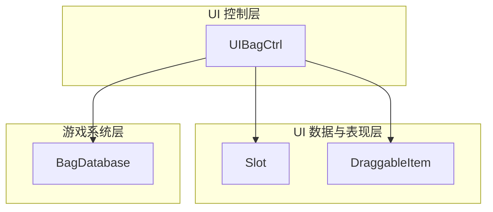
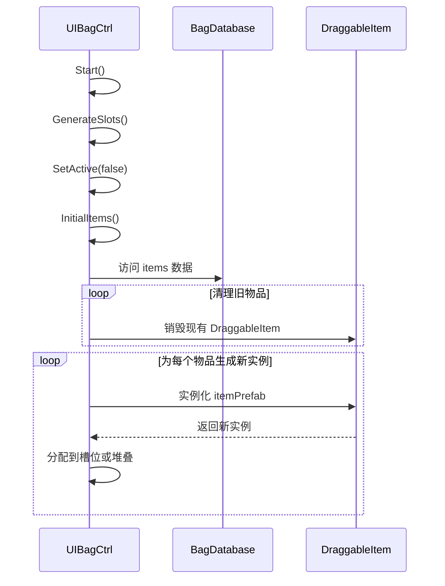
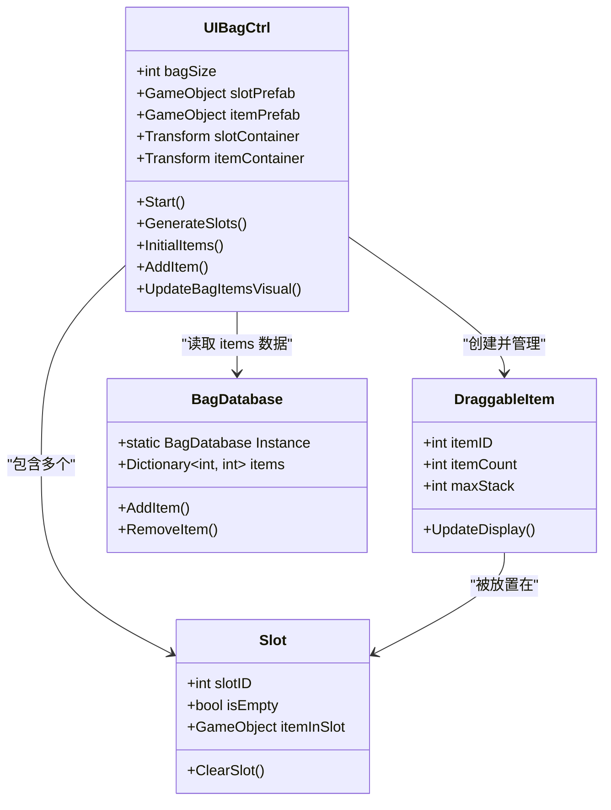

# 背包UI控制器

<cite>
**本文档中引用的文件**  
- [UIBagCtrl.cs](file://UI\UIBagCtrl.cs)
- [Slot.cs](file://Data\Slot.cs)
- [DraggableItem.cs](file://Data\DraggableItem.cs)
- [BagDatabase.cs](file://GameSystem\BagDatabase.cs)
</cite>

## 目录
1. [简介](#简介)
2. [项目结构](#项目结构)
3. [核心组件](#核心组件)
4. [架构概述](#架构概述)
5. [详细组件分析](#详细组件分析)
6. [依赖分析](#依赖分析)
7. [性能考虑](#性能考虑)
8. [故障排除指南](#故障排除指南)
9. [结论](#结论)

## 简介
`UIBagCtrl` 是负责管理游戏背包界面的核心UI控制器组件。该组件实现了背包的初始化、物品显示与视觉更新、槽位管理以及与数据模型的同步机制。它通过与 `Slot` 和 `DraggableItem` 预制体协作，构建了一个动态响应的背包系统，能够根据 `BagDatabase` 中的数据实时更新UI状态。本文档将深入分析其内部逻辑，包括 `InitialItems` 方法如何清理旧物品并重新生成可拖拽项，`AddItem` 方法的堆叠与分配策略，以及 `Start` 方法中初始化后立即隐藏的设计意图。

## 项目结构
背包系统相关代码分布在多个目录中，体现了清晰的关注点分离：
- `UI/` 目录包含 `UIBagCtrl.cs`，负责背包界面的控制逻辑。
- `Data/` 目录包含 `Slot.cs` 和 `DraggableItem.cs`，定义了UI元素的数据和行为。
- `GameSystem/` 目录包含 `BagDatabase.cs`，作为背包物品数据的全局单例存储。



**图示来源**
- [UIBagCtrl.cs](file://UI\UIBagCtrl.cs#L1-L10)
- [Slot.cs](file://Data\Slot.cs#L1-L5)
- [DraggableItem.cs](file://Data\DraggableItem.cs#L1-L5)
- [BagDatabase.cs](file://GameSystem\BagDatabase.cs#L1-L5)

**本节来源**
- [UIBagCtrl.cs](file://UI\UIBagCtrl.cs#L1-L50)
- [BagDatabase.cs](file://GameSystem\BagDatabase.cs#L1-L20)

## 核心组件
`UIBagCtrl` 组件是背包UI的中枢，其核心功能围绕 `bagSize`（背包大小）、`slotPrefab`（槽位预制体）和 `itemPrefab`（物品预制体）三个公共字段展开。它在 `Start` 方法中调用 `GenerateSlots()` 初始化指定数量的槽位，并通过 `Transform` 容器（如 `slotContainer`）来组织UI元素，确保界面布局的整洁与高效。

**本节来源**
- [UIBagCtrl.cs](file://UI\UIBagCtrl.cs#L25-L80)

## 架构概述
`UIBagCtrl` 采用 MVC（Model-View-Controller）模式的简化变体。`BagDatabase.Instance.items` 作为模型（Model），存储了所有物品的数据。`Slot` 和 `DraggableItem` 实例作为视图（View），负责呈现数据。`UIBagCtrl` 本身作为控制器（Controller），监听数据变化并驱动视图更新。



**图示来源**
- [UIBagCtrl.cs](file://UI\UIBagCtrl.cs#L50-L150)
- [BagDatabase.cs](file://GameSystem\BagDatabase.cs#L10-L20)

## 详细组件分析

### InitialItems 方法分析
`InitialItems` 方法是实现视图与模型同步的关键。其逻辑流程如下：
1.  **清理阶段**：遍历当前所有已生成的 `DraggableItem` 实例，并将其销毁，为重新生成做准备。
2.  **数据读取**：访问 `BagDatabase.Instance.items` 字典，获取所有物品及其数量。
3.  **重新生成**：对于字典中的每一项，根据物品ID和数量，实例化相应数量的 `DraggableItem` 预制体。
4.  **槽位分配**：调用 `AddItem` 方法，将新生成的物品实例分配到合适的槽位中，优先考虑堆叠。

此方法确保了每当背包数据发生变化（如游戏加载、物品增减后刷新UI），UI都能准确反映最新的数据状态。

**本节来源**
- [UIBagCtrl.cs](file://UI\UIBagCtrl.cs#L100-L180)

### AddItem 方法分析
`AddItem` 方法实现了智能的物品分配逻辑，其完整流程如下：
1.  **堆叠优先**：遍历所有已初始化的 `Slot`，检查其当前物品是否与待添加物品ID相同，且未达到 `maxStack` 限制。
2.  **计算可堆叠数量**：如果可以堆叠，计算该槽位还能容纳的数量（`maxStack - currentCount`）。
3.  **执行堆叠**：将尽可能多的物品数量添加到该槽位，并更新 `DraggableItem` 的显示数量。
4.  **寻找空槽位**：如果仍有剩余物品，则继续遍历 `Slot`，寻找空的槽位。
5.  **创建新物品**：在空槽位上实例化新的 `DraggableItem` 预制体，并设置其物品ID和剩余数量。
6.  **循环处理**：重复步骤4-5，直到所有物品都被成功添加或没有足够的空间。

此逻辑确保了物品管理的高效性，优先利用现有空间，避免了UI上出现不必要的碎片化。

#### AddItem 方法流程图
```mermaid
flowchart TD
A[开始: 添加物品] --> B{遍历所有槽位<br/>寻找可堆叠槽位?}
B --> |是| C[计算可堆叠数量<br/>= maxStack - 当前数量]
C --> D[将 min(待添加数量, 可堆叠数量)<br/>添加到该槽位]
D --> E[更新 DraggableItem 显示]
E --> F{待添加数量 > 0?<br/>(仍有剩余物品)}
F --> |是| G{遍历所有槽位<br/>寻找空槽位?}
G --> |是| H[在空槽位实例化<br/>新的 DraggableItem]
H --> I[设置物品ID和剩余数量]
I --> F
F --> |否| J[结束]
G --> |否| K[背包已满<br/>无法添加剩余物品]
K --> J
B --> |否| G
```

**图示来源**
- [UIBagCtrl.cs](file://UI\UIBagCtrl.cs#L180-L250)
- [Slot.cs](file://Data\Slot.cs#L10-L30)
- [DraggableItem.cs](file://Data\DraggableItem.cs#L15-L40)

**本节来源**
- [UIBagCtrl.cs](file://UI\UIBagCtrl.cs#L180-L250)

### 与预制体和Transform容器的协作
`UIBagCtrl` 通过引用 `slotPrefab` 和 `itemPrefab` 两个公共字段来实例化UI元素。它使用 `Transform` 类型的变量（如 `slotContainer` 和 `itemContainer`）作为父对象，将所有生成的 `Slot` 和 `DraggableItem` 的 `transform` 设置为其子对象。这种做法有两大优势：
1.  **层级管理**：所有背包UI元素都被组织在一个清晰的层级结构中，便于整体操作（如移动、隐藏整个背包）。
2.  **内存与性能**：当需要清理UI时，只需销毁或禁用这些容器，即可高效地移除所有子对象，避免了逐个销毁的性能开销。

**本节来源**
- [UIBagCtrl.cs](file://UI\UIBagCtrl.cs#L20-L40)
- [Slot.cs](file://Data\Slot.cs#L5-L15)
- [DraggableItem.cs](file://Data\DraggableItem.cs#L5-L15)

### Start方法中隐藏的设计意图
`UIBagCtrl` 的 `Start` 方法在完成 `GenerateSlots()` 初始化后，会立即调用 `SetActive(false)` 将整个背包UI对象隐藏。这一设计的主要意图是：
- **避免初始状态冲突**：游戏启动时，背包可能为空或处于未加载状态。立即显示一个空的或未初始化的UI会给玩家带来困惑或不良体验。
- **由游戏逻辑控制显示**：背包的显示/隐藏应由明确的游戏事件（如玩家按下背包键）来触发，而不是在游戏开始时自动出现。这保证了UI行为的可预测性和一致性。
- **性能优化**：隐藏的UI对象不会参与渲染和事件处理，可以节省不必要的性能开销，直到玩家真正需要使用背包时才激活。

**本节来源**
- [UIBagCtrl.cs](file://UI\UIBagCtrl.cs#L60-L70)

## 依赖分析
`UIBagCtrl` 组件依赖于多个其他组件和系统，形成了一个紧密协作的网络。



**图示来源**
- [UIBagCtrl.cs](file://UI\UIBagCtrl.cs#L1-L30)
- [Slot.cs](file://Data\Slot.cs#L1-L20)
- [DraggableItem.cs](file://Data\DraggableItem.cs#L1-L20)
- [BagDatabase.cs](file://GameSystem\BagDatabase.cs#L1-L15)

**本节来源**
- [UIBagCtrl.cs](file://UI\UIBagCtrl.cs#L1-L250)
- [BagDatabase.cs](file://GameSystem\BagDatabase.cs#L1-L30)

## 性能考虑
`UIBagCtrl` 的设计在性能方面表现良好。通过使用 `Transform` 容器进行批量操作，`InitialItems` 方法中的清理和重建过程是高效的。`AddItem` 方法的堆叠优先策略减少了UI元素的总数，从而降低了渲染和内存开销。然而，对于非常大的背包（`bagSize` 极大），`InitialItems` 在每次调用时都完全重建UI可能会成为性能瓶颈，未来可考虑实现增量更新机制。

## 故障排除指南
- **问题：背包UI无法显示**  
  **检查**：确认 `Start` 方法中的 `SetActive(false)` 是否被其他脚本正确地通过 `SetActive(true)` 调用。检查 `GameUI` 或其他管理器是否正确地引用了 `UIBagCtrl`。

- **问题：物品无法堆叠**  
  **检查**：确认 `DraggableItem` 组件上的 `itemID` 是否正确设置。检查 `maxStack` 值是否被正确初始化。在 `AddItem` 方法中，确认堆叠条件的判断逻辑（ID匹配且未达上限）。

- **问题：UI元素错位或丢失**  
  **检查**：确认 `slotContainer` 和 `itemContainer` 的 `Transform` 引用是否在Inspector中正确设置。检查预制体（`slotPrefab`, `itemPrefab`）是否具有正确的UI组件（如 `Image`, `RectTransform`）。

**本节来源**
- [UIBagCtrl.cs](file://UI\UIBagCtrl.cs#L50-L70)
- [DraggableItem.cs](file://Data\DraggableItem.cs#L20-L30)

## 结论
`UIBagCtrl` 组件是一个设计良好、功能完整的背包UI控制器。它通过清晰的初始化流程、高效的物品管理逻辑（堆叠优先）以及与数据模型的紧密同步，为玩家提供了流畅的背包使用体验。其与 `Slot`、`DraggableItem` 预制体和 `BagDatabase` 的协作关系体现了良好的模块化设计。通过正确配置 `bagSize` 和预制体引用，开发者可以轻松地将其集成到项目中，并根据需要进行扩展。