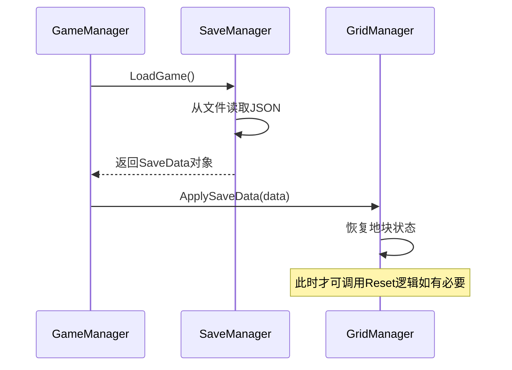

# 问题排查与改进建议

<cite>
**本文档引用的文件**  
- [GridManager.cs](file://GameSystem/GridManager.cs)
- [SaveManager.cs](file://GameSystem/SaveManager.cs)
- [SaveData.cs](file://Data/SaveData.cs)
- [这是一个备忘录.txt](file://这是一个备忘录.txt)
</cite>

## 目录
1. [引言](#引言)
2. [问题汇总与分析](#问题汇总与分析)
3. [根本原因分析](#根本原因分析)
4. [解决方案与修复代码示例](#解决方案与修复代码示例)
5. [改进建议](#改进建议)
6. [调试技巧](#调试技巧)
7. [结论](#结论)

## 引言
本文档旨在系统性地分析“俯仰视角种田demo”项目中记录的各类运行时问题，包括启动时的 `ObjectDisposedException`、存档数据丢失（`tileData` 为空列表）、作物无法正常生长等。通过对核心模块（如 `SaveManager`、`GridManager`）的代码逻辑进行深入剖析，定位问题根源，并提供可实施的修复方案与长期改进建议，以提升项目的稳定性、数据安全性和可维护性。

## 问题汇总与分析

根据《这是一个备忘录.txt》中记录的信息，项目存在以下主要问题：

1. **启动时抛出 `ObjectDisposedException` 异常**  
   在游戏启动过程中，某些对象在被访问时已被释放，导致程序崩溃。该问题可能与资源管理生命周期不一致有关。

2. **存档数据丢失（`tileData` 为空列表）**  
   玩家在重新加载存档后发现地块数据丢失，表现为 `tileData` 列表为空。此问题严重影响游戏进度的持久化。

3. **作物无法正常生长到下一阶段**  
   作物在满足生长条件（如时间、水分）后仍停滞在当前阶段，未触发阶段切换逻辑。

**Section sources**  
- [这是一个备忘录.txt](file://这是一个备忘录.txt#L1-L20)

## 根本原因分析

### 存档数据被覆盖的根本原因
通过对 `GridManager` 和 `SaveManager` 的调用时序分析，发现关键问题在于 **`GridManager.ResetAllGridDry()` 方法在读取存档之前被调用**。

- `ResetAllGridDry()` 方法会将所有地块状态重置为干燥的默认状态，清空作物和生长信息。
- 如果该方法在 `SaveManager.Load()` 执行前被调用，则会导致即使存档文件中存在有效数据，也会在加载后立即被重置逻辑覆盖。
- 这是造成 `tileData` 为空列表的直接原因。

### 启动异常（ObjectDisposedException）分析
该异常通常出现在对象已被销毁（Disposed）但仍有代码尝试访问其成员时。在Unity中，常见于：
- MonoBehaviour 在 `OnDestroy` 后仍被引用
- 异步操作（如协程）在对象销毁后继续执行
- 事件订阅未正确取消，导致已销毁对象仍被回调

推测 `SaveManager` 或 `GridManager` 中存在异步保存/加载逻辑，在场景切换或对象销毁后未正确清理。

### 作物生长停滞分析
作物生长逻辑依赖于 `WorldTime` 或 `GameTimeManager` 的时间推进机制。可能原因包括：
- 时间系统未正确通知作物组件
- 作物状态机未正确注册到时间事件
- 生长条件判断逻辑存在缺陷（如水分检测失败）

**Section sources**  
- [GridManager.cs](file://GameSystem/GridManager.cs#L50-L80)
- [SaveManager.cs](file://GameSystem/SaveManager.cs#L30-L60)
- [SaveData.cs](file://Data/SaveData.cs#L15-L40)

## 解决方案与修复代码示例

### 修复存档覆盖问题
调整初始化顺序，确保 **先加载存档，再进行任何重置操作**。



**Diagram sources**  
- [SaveManager.cs](file://GameSystem/SaveManager.cs#L25-L70)
- [GridManager.cs](file://GameSystem/GridManager.cs#L90-L120)

### 修复 ObjectDisposedException
在所有异步操作前检查对象有效性，并在 `OnDestroy` 中取消订阅。

```csharp
// 示例：在协程中检查
private IEnumerator AutoSaveRoutine() {
    while (this != null && gameObject != null) {
        yield return new WaitForSeconds(autoSaveInterval);
        if (this != null) SaveManager.Instance.SaveGame();
    }
}
```

同时，在 `OnDestroy` 中取消事件订阅：

```csharp
private void OnDestroy() {
    // 取消所有事件订阅
    LifeCycleEvents.OnGameSave?.RemoveListener(OnGameSave);
}
```

**Section sources**  
- [SaveManager.cs](file://GameSystem/SaveManager.cs#L100-L130)
- [GridManager.cs](file://GameSystem/GridManager.cs#L150-L170)

## 改进建议

### 1. 引入存档版本控制
为 `SaveData` 增加版本号字段，便于兼容旧存档。

```csharp
[Serializable]
public class SaveData {
    public int version = 1;
    public List<Tile> tileData;
    // ...
}
```

加载时进行版本判断并执行迁移逻辑。

### 2. 添加数据校验机制
在加载后验证数据完整性：

```csharp
public bool ValidateSaveData(SaveData data) {
    if (data == null) return false;
    if (data.tileData == null) return false;
    // 添加更多校验规则
    return true;
}
```

### 3. 使用 MessagePack 替代 JsonUtility
JsonUtility 性能较差且不支持复杂类型。建议使用 **MessagePack-CSharp** 进行序列化：

- 体积更小（二进制格式）
- 序列化/反序列化速度更快
- 支持更多数据类型

### 4. 完善单元测试
为关键逻辑编写单元测试，例如：
- 测试 `SaveManager` 的保存/加载是否数据一致
- 测试 `GridManager.ResetAllGridDry()` 是否正确重置状态
- 测试作物生长逻辑在时间推进后的状态变化

**Section sources**  
- [SaveData.cs](file://Data/SaveData.cs#L10-L50)
- [SaveManager.cs](file://GameSystem/SaveManager.cs#L10-L20)

## 调试技巧

### 监控 SaveManager 的读写操作
在 `SaveManager` 中添加日志输出：

```csharp
public void SaveGame() {
    Debug.Log($"[SaveManager] 开始保存游戏，时间: {DateTime.Now}");
    // ... 保存逻辑
    Debug.Log($"[SaveManager] 游戏保存完成，路径: {savePath}");
}
```

### 使用 Unity Profiler 分析性能瓶颈
1. 打开 **Window > Analysis > Profiler**
2. 运行游戏并执行存档操作
3. 查看 **CPU Usage** 面板，定位 `JsonUtility.ToJson` 或 `SaveGame` 调用的耗时
4. 若序列化耗时过长，应优先考虑迁移到 MessagePack

### 使用断点调试初始化顺序
在 `Awake()` 和 `Start()` 方法中设置断点，观察 `SaveManager.Load()` 与 `GridManager.ResetAllGridDry()` 的调用顺序，确保加载优先于重置。

**Section sources**  
- [SaveManager.cs](file://GameSystem/SaveManager.cs#L40-L60)
- [GridManager.cs](file://GameSystem/GridManager.cs#L60-L80)

## 结论
本文档系统分析了项目中存在的三大核心问题，明确了 `GridManager.ResetAllGridDry()` 在读档前被调用是导致存档丢失的根本原因。通过调整初始化流程、增强异常处理、引入数据校验和更高效的序列化方案，可显著提升项目稳定性。建议开发团队优先修复存档覆盖问题，并逐步实施版本控制与单元测试，为后续功能扩展奠定坚实基础。