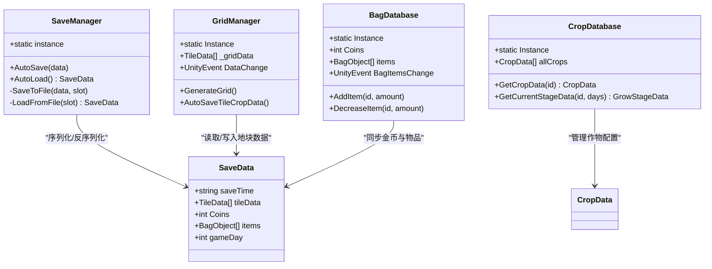
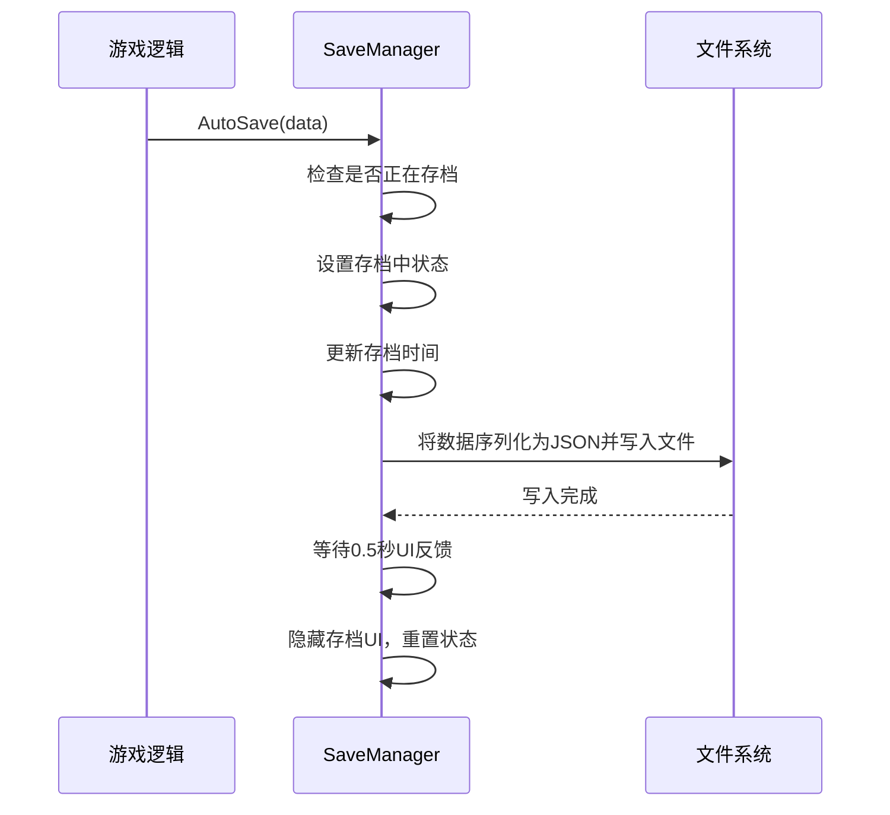
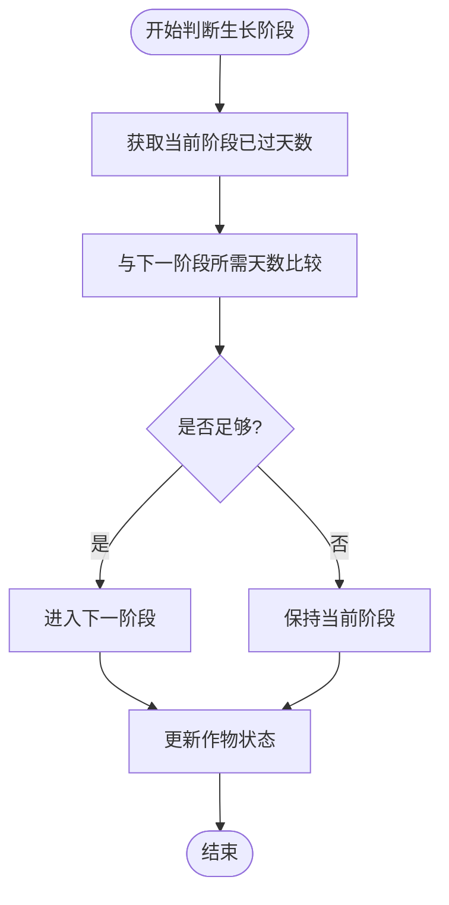
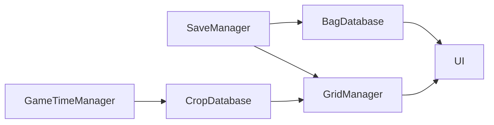

# 项目概述

<cite>
**本文档引用的文件**  
- [SaveManager.cs](file://d:\UnityProjs\俯仰视角种田demo\Assets\Scripts\GameSystem\SaveManager.cs)
- [GridManager.cs](file://d:\UnityProjs\俯仰视角种田demo\Assets\Scripts\GameSystem\GridManager.cs)
- [SaveData.cs](file://d:\UnityProjs\俯仰视角种田demo\Assets\Scripts\Data\SaveData.cs)
- [CropDatabase.cs](file://d:\UnityProjs\俯仰视角种田demo\Assets\Scripts\GameSystem\CropDatabase.cs)
- [BagDatabase.cs](file://d:\UnityProjs\俯仰视角种田demo\Assets\Scripts\GameSystem\BagDatabase.cs)
- [这是一个备忘录.txt](file://d:\UnityProjs\俯仰视角种田demo\Assets\Scripts\这是一个备忘录.txt)
</cite>

## 目录
1. [简介](#简介)
2. [项目结构](#项目结构)
3. [核心组件](#核心组件)
4. [架构概览](#架构概览)
5. [详细组件分析](#详细组件分析)
6. [依赖关系分析](#依赖关系分析)
7. [性能与调试问题](#性能与调试问题)
8. [前置知识](#前置知识)
9. [快速入门示例](#快速入门示例)
10. [结论](#结论)

## 简介
本项目是一个基于Unity引擎的俯仰视角种田模拟游戏，旨在实现完整的种田模拟系统，包括作物种植、生长、收获、背包管理、商店交易和数据持久化功能。目标用户为Unity游戏开发者与模拟经营类游戏设计者。系统采用MVC设计模式与事件驱动架构，通过单例管理器协调各模块，确保数据一致性与系统可扩展性。

## 项目结构
项目按功能模块划分为四个主要目录：`Common`（事件系统）、`Data`（数据结构）、`GameSystem`（核心逻辑）和`UI`（用户界面）。这种分层结构有助于职责分离，提升代码可维护性。

```mermaid
graph TB
    subgraph "Common"
        Events["Events (事件系统)"]
    end
    subgraph "Data"
        Data["SaveData, TileData, BagObject等"]
    end
    subgraph "GameSystem"
        Managers["SaveManager, GridManager, CropDatabase等"]
    end
    subgraph "UI_Group"
        UI_Node["GameUI, UIBagCtrl, UIShopCtrl等"]
    end
    Events --> Managers
    Data --> Managers
    Managers --> UI_Node
```

**图示来源**  
- [SaveManager.cs](file://d:\UnityProjs\俯仰视角种田demo\Assets\Scripts\GameSystem\SaveManager.cs#L6-L72)
- [GridManager.cs](file://d:\UnityProjs\俯仰视角种田demo\Assets\Scripts\GameSystem\GridManager.cs#L7-L178)
- [SaveData.cs](file://d:\UnityProjs\俯仰视角种田demo\Assets\Scripts\Data\SaveData.cs#L12-L29)

## 核心组件
项目核心功能由多个单例管理器驱动，包括`SaveManager`负责数据持久化，`GridManager`管理地块网格，`CropDatabase`存储作物生长数据，`BagDatabase`处理背包物品，以及`GameTimeManager`控制游戏时间流逝。这些组件通过UnityEvent进行松耦合通信，确保系统稳定性。

**本节来源**  
- [SaveManager.cs](file://d:\UnityProjs\俯仰视角种田demo\Assets\Scripts\GameSystem\SaveManager.cs#L6-L72)
- [CropDatabase.cs](file://d:\UnityProjs\俯仰视角种田demo\Assets\Scripts\GameSystem\CropDatabase.cs#L10-L109)
- [BagDatabase.cs](file://d:\UnityProjs\俯仰视角种田demo\Assets\Scripts\GameSystem\BagDatabase.cs#L11-L117)

## 架构概览
系统采用MVC模式与事件驱动架构。`Model`层由`SaveData`和各类数据库类构成；`View`层为UI脚本；`Controller`层由`InteractionManager`等逻辑控制类实现。单例模式确保全局状态一致性，而`UnityEvent`机制实现跨组件通信，避免硬依赖。



**图示来源**  
- [SaveManager.cs](file://d:\UnityProjs\俯仰视角种田demo\Assets\Scripts\GameSystem\SaveManager.cs#L6-L72)
- [GridManager.cs](file://d:\UnityProjs\俯仰视角种田demo\Assets\Scripts\GameSystem\GridManager.cs#L7-L178)
- [CropDatabase.cs](file://d:\UnityProjs\俯仰视角种田demo\Assets\Scripts\GameSystem\CropDatabase.cs#L10-L109)
- [BagDatabase.cs](file://d:\UnityProjs\俯仰视角种田demo\Assets\Scripts\GameSystem\BagDatabase.cs#L11-L117)
- [SaveData.cs](file://d:\UnityProjs\俯仰视角种田demo\Assets\Scripts\Data\SaveData.cs#L12-L29)

## 详细组件分析

### 数据持久化系统分析
`SaveManager`使用JSON序列化实现自动存档功能，通过`AutoSave`和`AutoLoad`方法提供统一接口。存档路径位于`Application.persistentDataPath`，确保跨会话数据保留。



**图示来源**  
- [SaveManager.cs](file://d:\UnityProjs\俯仰视角种田demo\Assets\Scripts\GameSystem\SaveManager.cs#L29-L46)

**本节来源**  
- [SaveManager.cs](file://d:\UnityProjs\俯仰视角种田demo\Assets\Scripts\GameSystem\SaveManager.cs#L6-L72)

### 作物生长系统分析
`CropDatabase`通过`GetCurrentStageData`方法根据作物生长天数确定当前阶段，实现动态生长逻辑。`GetStageIndex`方法结合游戏时间管理器判断是否进入下一阶段。



**图示来源**  
- [CropDatabase.cs](file://d:\UnityProjs\俯仰视角种田demo\Assets\Scripts\GameSystem\CropDatabase.cs#L70-L86)

**本节来源**  
- [CropDatabase.cs](file://d:\UnityProjs\俯仰视角种田demo\Assets\Scripts\GameSystem\CropDatabase.cs#L10-L109)

## 依赖关系分析
系统依赖关系清晰，`SaveManager`作为核心持久化服务被`GridManager`和`BagDatabase`调用。`GridManager`依赖`CropDatabase`获取作物阶段数据，而UI组件通过事件监听响应数据变化。



**图示来源**  
- [SaveManager.cs](file://d:\UnityProjs\俯仰视角种田demo\Assets\Scripts\GameSystem\SaveManager.cs#L6-L72)
- [GridManager.cs](file://d:\UnityProjs\俯仰视角种田demo\Assets\Scripts\GameSystem\GridManager.cs#L132-L133)
- [BagDatabase.cs](file://d:\UnityProjs\俯仰视角种田demo\Assets\Scripts\GameSystem\BagDatabase.cs#L76-L86)

## 性能与调试问题
根据备忘录记录，开发过程中遇到两个关键问题：

1. **存档读取时机错误导致数据丢失**：`BagDatabase`在`Start`阶段加载存档，但若`SaveManager`初始化晚于`BagDatabase`，会导致加载失败。解决方案是确保单例初始化顺序，或在访问前检查实例存在性。

2. **作物无法正常生长**：因`GetStageIndex`方法中时间计算逻辑错误，导致阶段判断失败。修复后通过`GameTimeManager.GetGameDaysPassed`正确计算已过天数。

**本节来源**  
- [这是一个备忘录.txt](file://d:\UnityProjs\俯仰视角种田demo\Assets\Scripts\这是一个备忘录.txt)
- [BagDatabase.cs](file://d:\UnityProjs\俯仰视角种田demo\Assets\Scripts\GameSystem\BagDatabase.cs#L32)
- [CropDatabase.cs](file://d:\UnityProjs\俯仰视角种田demo\Assets\Scripts\GameSystem\CropDatabase.cs#L79-L85)

## 前置知识
为理解本项目，建议掌握以下知识：
- **C#基础**：类、对象、集合、序列化
- **Unity引擎操作**：GameObject、Component、Prefab、Scene管理
- **面向对象编程**：封装、继承、多态
- **UnityEvent系统**：事件订阅与发布机制
- **JSON序列化**：`JsonUtility`的使用方法

## 快速入门示例
完成一次完整种植-收获-存档流程的步骤如下：

1. 启动游戏，系统自动加载存档或创建新游戏
2. 打开种子选择UI，选择作物并种植到地块
3. 等待游戏时间推进，作物自动生长至成熟阶段
4. 与成熟作物交互进行收获，物品自动加入背包
5. 背包数据变更触发自动存档
6. 退出并重新启动游戏，验证数据已持久化

此流程涉及`GridManager`生成地块、`CropDatabase`管理生长、`BagDatabase`添加物品及`SaveManager`自动存档等核心机制。

**本节来源**  
- [GridManager.cs](file://d:\UnityProjs\俯仰视角种田demo\Assets\Scripts\GameSystem\GridManager.cs#L128-L159)
- [BagDatabase.cs](file://d:\UnityProjs\俯仰视角种田demo\Assets\Scripts\GameSystem\BagDatabase.cs#L35-L48)
- [SaveManager.cs](file://d:\UnityProjs\俯仰视角种田demo\Assets\Scripts\GameSystem\SaveManager.cs#L29-L46)

## 结论
该项目成功实现了一个功能完整的种田模拟系统，具备良好的架构设计与可扩展性。通过单例模式与事件驱动机制，各模块间保持低耦合高内聚。建议未来增加更多作物类型、天气系统与多存档槽位支持，进一步提升游戏可玩性。